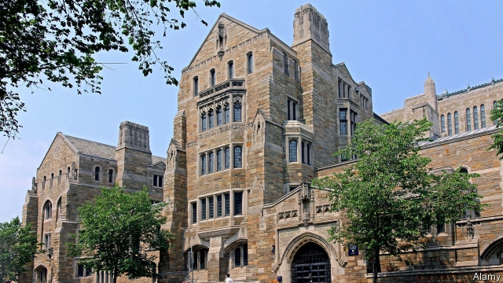

###### The millionaire track

# American prosecutors uncover a huge university-admissions scam 

##### Bribe styles of the rich and famous 

 

> Mar 14th 2019 

THE FBI called it Operation Varsity Blues. It was an investigation centred on William Singer, an enterprising college counsellor, who earned $25m from all manner of powerful people by fraudulently securing spots for their children at highly selective universities like Stanford and Yale. Among his clients charged with crimes were Felicity Huffman and Lori Loughlin, two well-known actresses; Gordon Caplan, the co-chairman of an international law firm; and William McGlashan, a Silicon Valley private-equity executive who champions ethical investing. 

To grease the lucrative scheme, Mr Singer bribed proctors of admissions exams to fake scores and bribed athletics officials to accept wealthy children with concocted sports résumés, according to court documents unveiled by federal prosecutors on March 12th. The lurid details have provoked embarrassment for universities and Schadenfreude for the public. 

There is also an entirely legal way to corrupt the elite admissions system, which for some reason generates less outrage. Mr Singer grasped this dynamic: There is a front door “which means you get in on your own” and a “back door” secured by multimillion-dollar donations to universities, he explained in a recorded call to a client. What Mr Singer did—for 761 buyers, he claimed—is create a “side door” by bribing university officials and faking test scores that would achieve the same result at one-tenth of the cost. In effect, his scheme granted mere multimillionaires access to the billionaires’ entrance. 

Getting in through the side door was a sordid undertaking. According to prosecutors, Mr Singer bribed Rudy Meredith, then a women’s soccer coach at Yale, to accept a student who did not play competitive soccer. The relatives paid $1.2m for the slot. Ms Laughlin, one of the actresses, and her husband paid $500,000 to get their daughters, both Instagram influencers and minor celebrities in their own right, designated as crew-team recruits for the University of Southern California—despite the fact that neither one rowed. Mr Caplan, the international lawyer, allegedly faked a learning-disability diagnosis for his daughter and paid $75,000 for a boosted admissions score. The prosecutors, who flipped Mr Singer, enumerate several other jaw-dropping tales, backed up with wiretaps of the various notables admitting the finer details of the schemes. 

Rich children are already unfairly advantaged in the game of elite university admissions. They start out with stabler families, better schools and helpful networks. Elite American colleges then operate a large, entirely legal affirmative-action programme for the rich. Most highly selective American universities indulge in “legacy preferences”—positive discrimination for relatives of alumni—that disproportionately benefit the already rich. Such universities also have lax standards for recruited athletes, which helps rich children. Opportunities to row, fence or play golf do not abound in the ghetto. 

Funding a new building just as a mediocre child applies to college, in the hope of boosting their admission chances, remains perfectly legal so long as there is no established quid pro quo. The strategy seems common and successful. Emails recently revealed by a lawsuit show one Harvard dean “simply thrilled” about admissions decisions because one unnamed person had “already committed to building and building” and two others “committed major money for fellowships.” 

The result is that, for all the paeans sung to racial diversity, socioeconomic diversity in the hallowed ivy quadrangles remains woeful. A survey conducted by Yale’s student newspaper found that twice as many students come from families in the top 5% of the income distribution as from the entire bottom half. 

-- 

 单词注释:

1.prosecutor['prɒsikju:tә]:n. 实行者, 告发者, 公诉人 [法] 原告, 起诉人, 检举人 

2.scam[skæm]:n. 骗局, 诡计；故事 

3.bribe[braib]:n. 贿赂 vt. 贿赂, 收买 vi. 行贿 

4.FBI[]:美国联邦调查局 [经] 美国联邦调查局 

5.varsity['vɑ:sәti]:n. 大学运动代表队；大学 

6.william['wiljәm]:n. 威廉（男子名）；[常作W-][美俚]钞票, 纸币 

7.enterprising['entәpraiziŋ]:a. 有魄力的, 有进取心的, 有事业心的 

8.counsellor['kaunsәlә]:n. 顾问, 辅导员, 律师 

9.fraudulently['frɔ:djələntlɪ]:adv. 欺骗地 

10.selective[si'lektiv]:a. 选择的, 选择性的 [经] 选择的, 选择性的 

11.stanford['stænfәd]:n. 斯坦福（姓氏, 男子名）；斯坦福大学（美国一所大学） 

12.Yale[jeil]:n. 耶鲁 

13.client['klaiәnt]:n. 客户, 顾客, 委托人 [计] 客户, 客户机, 客户机程序 

14.felicity[fә'lisiti]:n. 快乐, 幸福, 幸运 

15.Huffman[]:[计] 霍夫曼 

16.lori[]:n. 洛里, 罗莉（人名） 

17.Loughlin[]:n. (Loughlin)人名；(英)洛克林 

18.Gordon['^ɔ:dn]:[计] 哥尔丹 

19.Caplan[]:卡普兰（人名） 

20.mcglashan[]: [人名] [苏格兰人姓氏] 麦格拉申盖尔语姓氏的英语形式，来源于人名，含义是“灰，绿，蓝”(grey,green,blue) 

21.silicon['silikәn]:n. 硅 [化] 硅Si 

22.ethical['eθikәl]:a. 伦理的, 民族的, 民族特有的 [医] 伦理的, 道德的 

23.grease[gri:s]:n. 脂肪, 兽脂, 油脂, 贿赂 vt. 涂脂于, 贿赂 

24.lucrative['lu:krәtiv]:a. 有利益的, 获利的, 合算的 

25.bribe[braib]:n. 贿赂 vt. 贿赂, 收买 vi. 行贿 

26.proctor['prɒktә]:n. 代理人, 监考人, 代诉人 [法] 代理人, 代诉人, 监督人 

27.fake[feik]:n. 假货, 欺骗, 诡计 a. 假的 vt. 假造, 仿造 vi. 伪装 

28.concoct[kәn'kɒkt]:vt. 调合, 捏造, 编造 [建] 调制, 混合 

29.unveil[.ʌn'veil]:vt. 揭开, 揭幕, 除去...的面纱 vi. 显露, 除去面纱 

30.lurid['luәrid]:a. 火烧似的, 苍白的, 华丽的, 可怕的 

31.provoke[prә'vәuk]:vt. 激怒, 惹起, 诱导 [法] 刺激, 煽动, 激怒 

32.embarrassment[im'bærәsmәnt]:n. 困难, 阻碍, 困窘 [医] 窘迫 

33.schadenfreude['ʃɑ:dәnfrɔidә]:n. 幸灾乐祸 

34.entirely[in'taiәli]:adv. 完全, 全然, 一概 

35.elite[ei'li:t]:n. 精华, 精锐, 中坚分子 

36.les[lei]:abbr. 发射脱离系统（Launch Escape System） 

37.outrage['autreidʒ]:n. 暴行, 侮辱, 愤怒 vt. 凌辱, 虐待, 触犯 

38.donation[dәu'neiʃәn]:n. 捐赠物, 捐款, 捐赠 [经] 赠品, 捐款, 捐赠 

39.buyer['baiә]:n. 买主, 买方 [经] 买主, 买方, 买手 

40.multimillionaire[.mʌltimiljә'nєә]:n. 大富豪, 千万富翁 

41.sordid['sɒ:did]:a. 肮脏的, 贪婪的, 卑鄙的, 恶劣的, 暗淡的 [医] 污色的 

42.rudy['ru:di]:n. 鲁迪（男子名, Rudolf的昵称） 

43.Meredith['meridiθ]:n. 梅雷迪思(m.) , 梅瑞狄斯(Edward Robert Bulwer-Lytton 的笔名) 

44.slot[slɒt]:n. 水沟, 细长孔, 硬币投币口, 缝, 狭槽, 狭通道, 位置, 一档(广播节目等) vt. 开槽于, 把...纳入机构 [计] 槽; 存储槽 

45.Laughlin[]:n. (Laughlin)人名；(英)劳克林 

46.Instagram[]:一款图片分享应用 

47.influencer[]:n. 影响者 

48.celebrity[si'lebrti]:n. 名声, 名人 

49.designate['dezigneit]:vt. 指定, 指明, 称呼 a. 已选出而未上任的 

50.allegedly[ә'ledʒidli]:adv. 依其申述 

51.diagnosis[.daiәg'nәusis]:n. 诊断 [计] 诊断 

52.flip[flip]:vt. 掷, 弹, 轻击, 空翻 vi. 用指轻弹, 抽打, 蹦跳 n. 抛, 弹, 筋斗 a. 无礼的 [计] 翻转 

53.enumerate[i'nju:mәreit]:vt. 列举, 计算, 枚举, 数 [法] 举出, 列举, 枚举 

54.wiretap['waiәtæp]:v. 搭线窃听 n. 窃听 

55.notable['nәutәbl]:n. 著名人士, 值得注意之事物 a. 值得注意的, 显著的 

56.unfairly[]:adv. 不正当地；不公平地 

57.stabl[]:[网络] 边坡稳定分析程式；兽栏管理员 

58.elite[ei'li:t]:n. 精华, 精锐, 中坚分子 

59.indulge[in'dʌldʒ]:vt. 纵情于, 使高兴, 放任, 迁就 vi. 沉溺 

60.legacy['legәsi]:n. 祖先传下来之物, 遗赠物 [经] 遗产, 遗赠物 

61.disproportionately[]:adv. 不匀称, 不相称 

62.lax[læks]:a. 松的, 不严格的, 腹泻的, 松弛的 n. 腹泻, 松元音 

63.abound[ә'baund]:vi. 大量存在, 富于, 充满 

64.ghetto['getәu]:n. 犹太人区 

65.mediocre[.mi:di'әukә]:a. 不好不坏的, 通常, 平凡的 

66.quid[kwid]:n. 一镑金币, 一镑, 咀嚼物 

67.pro[prәu]:adv. 正面地 [计] 可编程远程操作 

68.quo[]:vt. [古]说 

69.lawsuit['lɒ:sju:t]:n. 诉讼 [法] 诉讼, 诉讼案件 

70.Harvard['hɑ:vәd]:n. 哈佛大学 

71.dean[di:n]:n. 院长, 主持牧师 [法] 外交团长, 学院院长, 教务长 

72.thril[θ'rɪl]: 联络小巷 

73.unnamed['ʌn'neimd]:a. 未命名的, 没有名字的, 未提及的 [计] 无名的 

74.fellowship['felәuʃip]:n. 伙伴关系, 共同参与, 团体, 奖学金, 友谊 [经] 合伙关系, 研究员薪金, 研究员基金 

75.paean['pi:әn]:n. 凯歌, 欢乐歌, 赞美歌 

76.diversity[dai'vә:siti]:n. 差异, 多样性 [化] 多样性 

77.socioeconomic['sәuʃiәu,i:kә'nɔmik]:a. 社会经济学的 

78.hallow['hælәu]:vt. 使...神圣, 视为神圣 n. 圣徒 

79.ivy['aivi]:n. 常春藤 a. 学院的, 抽象的 

80.quadrangle['kwɒdræŋgl]:n. 四角形, 四边形, 四方院 [医] 四角形, 四角器(牙科) 

81.woeful['wәuful]:a. 悲伤的, 悲哀的 

