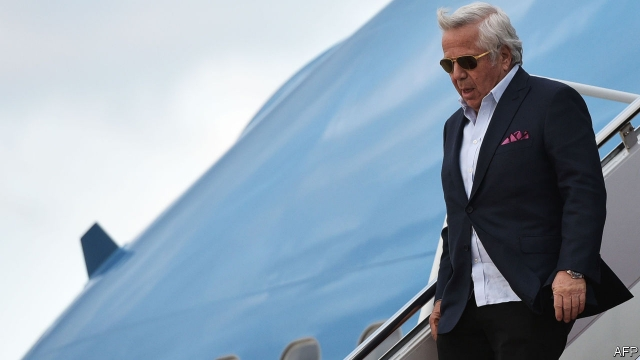

###### No happy ending

# Mar-a-Lago, massage parlours and selling access to the president 

##### The Trump administration collects chancers, influence peddlers—maybe worse 

 

> Mar 14th 2019 

EVER SINCE diners at Mar-a-Lago snapped pictures of President Donald Trump plotting America’s response to a North Korean missile test with his Japanese counterpart, there have been national-security concerns about the president’s “Winter White House”. Yet reports about a Mar-a-Lago frequenter called Li Yang, who also goes by Cindy Yang, suggest they underestimated the risks of Mr Trump’s freewheeling style. Bearing all the hallmarks of a Trump scandal, the revelations from the Miami Herald, Mother Jones and others are salacious, worrying and bizarre. 

Ms Yang, a 45-year-old entrepreneur and immigrant from China, and her family have founded massage parlours across Florida. Robert Kraft, the owner of the New England Patriots, was charged last month with soliciting oral sex in one of them, Orchids of Asia, which the Yang family no longer owned. Mr Kraft is a longtime Trump pal; coincidentally, Ms Yang recently launched a business peddling access to the president and other Republican politicians to Chinese investors. Indeed, she was snapped alongside Mr Trump at a Super Bowl party in Mar-a-Lago, at which the president was supporting Mr Kraft’s team. 

Mr Kraft’s arrest caused a media storm. It followed a months-long police operation against massage parlours in Florida, which were alleged to be involved in trafficking sex workers. Yet on the evidence gathered from hidden police cameras, over 100 customers including Mr Kraft were arrested for soliciting, and a dozen employees on charges related to prostitution. No one has been charged with trafficking—or anything more serious than involvement in turning occasional tricks at a low-end massage joint. Ms Yang’s recent business ventures, which have been much less covered, appear far more troubling. 

According to the Herald, she had no involvement in politics before the 2016 election; she had not voted for a decade. Yet she suddenly became a fixture at high-level Republican events. Her Facebook page is filled with photos of Ms Yang alongside the president, his two sons, Florida’s governor, Ron DeSantis, and other senior Republicans. She and her relatives donated $58,000 to the president’s campaign and a related political action committee. And her efforts appear to have secured some of the influence her company, GY US Investments, claims to have. Last year she was invited by the White House to take part in an event organised by Mr Trump’s Asian-American and Pacific-Islander Initiative. The Herald also reports that she arranged for Chinese businessmen to attend an exclusive Trump fund-raiser in Manhattan. It is not clear whether this amounts to an embarrassing mess or a serious security breach. Either way, it stinks. 

-- 

 单词注释:

1.massage['mæsɑ:ʒ]:n. 按摩, 揉 vt. 按摩, 揉 

2.parlour['pɑ:lә]:n. 客厅, 会客室, 雅座 a. 客厅的 

3.chancer[ˈtʃɑ:nsə(r)]:n. 投机分子 

4.diner['dainә]:n. 用餐者 

5.Korean[kә'riәn]:n. 朝鲜人, 朝鲜语 a. 朝鲜人的, 朝鲜语的 

6.counterpart['kauntәpɑ:t]:n. 副本, 复本, 配对物, 相应物 [经] 副本, 正副二份中之一 

7.frequenter[fri'kwentә]:n. 常常来访者, 常客 

8.yang[jɑ:ŋ,jæŋ]:n. 杨（姓氏） 

9.cindy['sindi]:n. 辛迪（女子名, Cynthia的昵称） 

10.underestimate[.ʌndәr'estimeit]:n. 低估 vt. 低估, 看轻 

11.freewheeling['fri:'hwi:liŋ]:n. 惯性滑行 a. 惯性滑行的, 随心所欲的 

12.hallmark['hɑ:lmɑ:k]:n. 纯度检验证明, 品质证明 vt. 加盖纯度检验证明 

13.revelation[.revi'leiʃәn]:n. 揭露, 泄露, 发觉, 默示, 启示 

14.Miami[mai'æmi]:n. 迈阿密 

15.herald['herәld]:n. 使者, 传令官, 先驱 vt. 预报, 宣布, 传达, 欢呼 

16.jones[dʒәunz]:n. 琼斯（姓氏） 

17.salacious[sә'leiʃәs]:a. 好色的, 猥亵的, 黄色的 [法] 淫秽的, 黄色的, 淫荡的 

18.bizarre[bi'zɑ:]:a. 奇异的 

19.entrepreneur[.ɒntrәprә'nә:]:n. 企业家, 主办人 [经] 承包商, 企业家 

20.Florida['flɒridә]:n. 佛罗里达州 

21.Robert['rɔbәt]:[法] 警察 

22.kraft[krɑ:ft]:n. 牛皮纸 

23.patriot['peitriәt]:n. 爱国者, 爱国主义者 

24.solicit[sә'lisit]:v. 请求, 乞求, 招揽, 征求 

25.orchid['ɒ:kid]:n. 兰花, 淡紫色 [医] 兰科植物 

26.longtime['lɔŋtaim;'lɔ:ŋ-]:a. (已持续)长时间的,为时甚久的 adv. 长久 

27.pal[pæl]:n. 朋友, 伙伴, 同志, 同谋 vi. 交友, 结伴 

28.coincidentally[]:adv. 巧合地；一致地 

29.peddle['pedl]:vi. 挑卖, 沿街叫卖, 游荡, 闲混 vt. 叫卖, 兜售, 散播 

30.investor[in'vestә]:n. 投资者 [经] 投资者 

31.allege[ә'ledʒ]:vt. 宣称, 主张, 提出, 断言 [法] 断言, 指称, 指证 

32.trafficking[ˈtræfikɪŋ]:n. 非法交易 

33.prostitution[,prɔsti'tju:ʃәn]:n. 卖淫, 糟蹋, 滥用 [法] 卖淫, 滥用 

34.involvement[in'vɔlvmәnt]:n. 卷入, 牵连, 包含, 困窘 [经] 财政困难, 经济上的困窘 

35.les[lei]:abbr. 发射脱离系统（Launch Escape System） 

36.politic['pɒlitik]:a. 精明的, 明智的, 策略的 

37.fixture['fikstʃә]:n. 固定(状态), 固定物, 设备 [计] 夹具 

38.facebook[]:n. 脸谱网 

39.ron[]:abbr. 研究法辛烷值（Research Octane Number） 

40.desantis[]: [人名] 德桑蒂斯 

41.donate['dәuneit]:v. 捐赠 

42.gy[]:abbr. 灰色（gray）；圭亚那（Guyana） 

43.Manhattan[mæn'hætәn]:n. 曼哈顿 

44.breach[bri:tʃ]:n. 裂口, 违背, 破坏, 违反, 突破, 破裂 vt. 攻破, 突破 vi. 跳出水面 

45.stink[stiŋk]:n. 臭味, 臭气 vi. 发臭味, 名声臭 vt. 用臭味赶 

