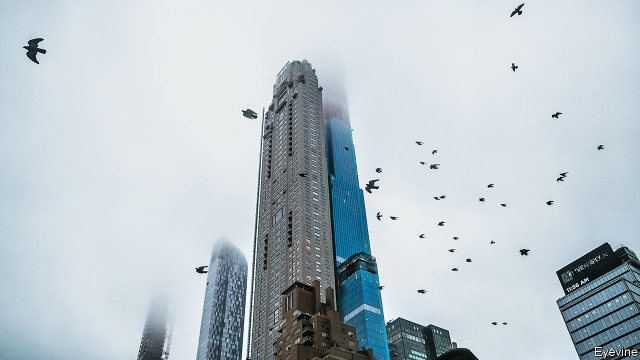

###### Islands in the sky

# Proposals to tax pieds-à-terre in New York are gaining ground 

##### London and Vancouver have both come up with ways to tax occasional residents 

 

> Mar 14th 2019 

NUMBER 220 Central Park South is one of New York City’s swankier addresses. Its amenities include a golf simulation room and a saltwater swimming pool. In January Ken Griffin, the founder of Citadel, a hedge fund, bought a penthouse in the building for $238m, setting a record for the priciest home in America. Mr Griffin, who has homes in Chicago, Florida and London, reportedly will not make this his primary residence, thus reigniting an old proposal to tax New York City’s many pieds-à-terre. 

Pieds-à-terre are part-time second homes occupied for less than half the year. Many are simply convenient places to park money and are vacant most of the time. Because their owners have their primary residences out of state, they are not subject to state or local income taxes. Nor do they generate much in local sales-tax revenues. After the Griffin deal closed, Corey Johnson, the city council’s Speaker, announced that it was “time for a pied-à-terre tax”. 

Legislation which had been languishing in Albany for five years is gathering support. It would impose a yearly tax of between 0.5% and 4% on the assessed value of apartments worth $5m or more. Scott Stringer, the city’s comptroller, estimates the tax would generate a minimum of $650m a year. Robert Mujica, the state budget director, said taxing the absentee owners of expensive non-primary residences would help pay to restore the crumbling subway (though a few hundred million would not go far in those long tunnels). Andrew Cuomo, New York’s governor, supports the idea too. 

Over the past few years New York has seen a lot of high-end property development, as new skinny towers have changed the city skyline. The most recent Housing and Vacancy Survey found that the number of non-primary residences increased from 55,000 in 2014 to 75,000 in 2017. 

Estate agents fret that the tax will hit their profits. Manhattan has 8,600 unsold newly built units. At the current rate of sale, it would take 6.4 years to sell them all. According to Grant Long, an economist with StreetEasy, a listing site, only 21% of units priced at $5m and higher found buyers. Units that sold closed below the asking price. “It’s insanity,” says Doug Russell of Brown Harris Stevens, a brokerage that primarily serves the wealthy. “It will kill New York real estate.” Mr Russell foresees prices will stay under $5m to avoid the tax. He also predicts developers will go bankrupt. 

Some buyers have been put off by a change in federal tax law which caps state and local tax deductions, including property taxes, at $10,000. Owners already pay a mansion tax, a one-time 1% sales tax. More tax, says Harry Nassar, a broker at Sotheby’s, will cause people to shun New York. Some advocates of new taxes might consider that to be a benefit. 

If New York implements the tax, it would join Vancouver, which has an empty-home tax, and London, which has a surcharge on purchases of second homes. Some blame increased “stamp duty” a tax on home purchases, for a softening in the London market. But it did not dissuade Mr Griffin from spending £95m ($122m) in January on a London town house. That purchase would have incurred a one-off tax of $18.5m. By contrast, if New York’s laws change, he could face $8.9m a year in pied-à-terre taxes for his Manhattan base. 

-- 

 单词注释:

1.york[jɔ:k]:n. 约克郡；约克王朝 

2.vancouver[væn'ku:vә]:n. 温哥华（加拿大主要港市） 

3.swanky['swæŋki]:a. 爱出风头的, 炫耀的 

4.amenity[ә'mi:niti]:n. 便利设施, 适意, 礼仪 [法] 舒适, 方便, 优雅 

5.simulation[.simju'leiʃәn]:n. 模拟, 假冒物, 模仿 [计] 模拟 

6.saltwater['sɒ:ltwɒ:tә]:a. 盐水的, 海产的, 海上的 

7.ken[ken]:n. 视野范围, 知识范围, 见地 

8.griffin['^rifin]:n. 新手, 未经世故的人 

9.founder['faundә]:n. 创立者, 建立者 vt. 使沉没, 使摔倒, 弄跛, 浸水, 破坏 vi. 沉没, 摔到, 变跛, 倒塌, 失败 

10.citadel['sitәdәl]:n. 城堡, 避难处 

11.penthouse['penthaus]:n. 屋顶房间, 顶层公寓, 电梯机器房, 耳房 

12.pricy['praisi]:a. 昂贵的, 价格高的 

13.Chicago[ʃi'kɑ:gәu]:n. 芝加哥 

14.Florida['flɒridә]:n. 佛罗里达州 

15.reportedly[ri'pɒ:tidli]:adv. 根据传说, 根据传闻, 据报道 

16.les[lei]:abbr. 发射脱离系统（Launch Escape System） 

17.corey['kәjri, 'kɔ:ri]:n. 科里（等于Cory） 

18.johnson['dʒɔnsn]:n. 约翰逊（姓氏） 

19.languish['læŋgwiʃ]:vi. 憔悴, 凋萎, 苦思 

20.Albany['ɒ:lbәni]:n. 奥尔巴尼(美国纽约州首府) 

21.scott[skɔt]:n. 斯科特（男子名） 

22.stringer['striŋә]:n. 纵梁, 楼梯基, 上弦工人, 出售弓弦的人, 制造弓弦的人 

23.comptroller[kәn'trәulә]:n. 审计官 [经] 主计, 会计师, 审计 

24.Robert['rɔbәt]:[法] 警察 

25.mujica[]:[网络] 穆西卡 

26.absentee[.æbsәn'ti:]:n. 缺席者, 不在者 [经] 缺勤者, 缺席者, 未到工者 

27.crumble['krʌmbl]:v. (使)粉碎, (使)成为碎屑, 瓦解, 崩溃, 败落 

28.andrew['ændru:]:n. 安德鲁（男子名） 

29.cuomo[]: [人名] 科莫 

30.skinny['skini]:a. 似皮的, 极瘦的, 少的, 小气的 [医] 皮的; 消瘦的 

31.skyline['skailain]:n. 天涯, 地平线, 空中轮廓线 

32.vacancy['veikәnsi]:n. 空, 空白, 空缺, 空虚, 空闲 [化] 空位 

33.fret[fret]:n. 烦躁, 磨损, 焦急, 网状饰物 vi. 烦恼, 不满, 磨损 vt. 使烦恼, 腐蚀, 使磨损, 使起波纹 

34.Manhattan[mæn'hætәn]:n. 曼哈顿 

35.unsold[.ʌn'sәuld]:a. 未售出的 [经] 未售出的 

36.economist[i:'kɒnәmist]:n. 经济学者, 经济家 [经] 经济学家 

37.buyer['baiә]:n. 买主, 买方 [经] 买主, 买方, 买手 

38.insanity[in'sæniti]:n. 疯狂, 愚顽, 精神错乱 [医] 精神病 

39.doug[]:n. 道格 

40.russell['rʌsәl]:n. 拉塞尔（英国工程师, 整流器发明人） 

41.harris['hæris]:n. 哈里斯（英国苏格兰一地区）；哈里斯（姓氏） 

42.stevens['sti:vnz]:n. 史蒂文斯（姓氏） 

43.brokerage['brәukәridʒ]:n. 经纪人, 回扣, 佣金, 中间人业务 [经] 经纪业, 佣金, 手续费 

44.developer[di'velәpә]:n. 开发者 [计] 显影器 

45.bankrupt['bæŋkrʌpt]:n. 破产者 a. 破产的 vt. 使破产 

46.deduction[di'dʌkʃәn]:n. 减除, 扣除, 减除额, 推论 [医] 演绎, 推论 

47.mansion['mænʃәn]:n. 大厦, 宅邸 

48.harry['hæri]:vt. 掠夺, 使苦恼, 强使前行, 折磨, 骚扰 

49.nassar[]:[网络] 纳赛尔湖 

50.broker['brәukә]:n. 掮客, 经纪人 [经] 经纪人, 掮客 

51.shun[ʃʌn]:vt. 避开, 规避, 避免 

52.surcharge['sә:tʃɑ:dʒ]:n. 装载过多, 超载, 追加罚款, 附加税 vt. 使装载过多, 追加罚款, 收附加税 

53.soften['sɒftn]:v. (使)变柔软, (使)变柔和 

54.dissuade[di'sweid]:vt. 劝阻 [法] 劝阻, 劝止 

55.incur[in'kә:]:vt. 招致, 蒙受, 遭遇 [经] 招致, 蒙受, 担负 

