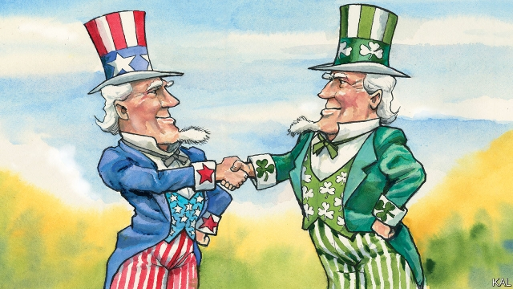

###### Lexington

# The Irish conquest of America 

##### This St Patrick’s Day, Irish-Americans can celebrate the blarneyfication of their democracy 

 

> Mar 14th 2019 

WHEN JOHN HEARNE, Ireland’s ambassador to Washington, sent Harry Truman a box of shamrocks on St Patrick’s Day in 1952, he could not have imagined he was launching the greatest exercise in soft power. Yet it is hard to think of a rival to the annual shamrock ceremony and its attendant rituals. On March 14th, Leo Varadkar, the sixth consecutive Irish Taoiseach to conduct them, will celebrate St Patrick’s Day by breakfasting with Vice-President Mike Pence. He will be feted at a lunch on Capitol Hill attended by Donald Trump. He will proceed with the president, wearing a green tie, possibly on the long side, to the White House for the plant handover. They will meanwhile hold the only annually scheduled “substantive” talks America affords any foreign leader. 

This is great for Ireland. For the inconvenience of having to buy lots of green ties (the current ambassador has around 40), its representatives enjoy unrivalled access to the superpower. The notion that America might favour Britain over Ireland in any post-Brexit wrangle—a fear Mr Varadkar is expected to raise—is untenable. Yet Ireland’s soft-power triumph is mainly testament to the continued enthusiasm of 32m Irish-Americans for their roots, and to their equally remarkable dominance of American politics. 

Besides Mr Pence—two of whose grandparents were born in Ireland—the Republican House leader, Kevin McCarthy, is Irish-American, as was his predecessor, Paul Ryan, and their Senate counterpart, Mitch McConnell. Among the many other Irish-Americans who have served Mr Trump are his sometime advisers Steve Bannon and Kellyanne Conway, and his current and former chiefs of staff, Mick Mulvaney and John Kelly. Mr Mulvaney, whose daughter is studying in Dublin, helped organise a tree-planting on Capitol Hill to commemorate the centenary of the Easter Rising. 

This is, in a sense, par for the course. Barack Obama’s administration was also full of Irish-Americans—including Joe Biden, his Yeats-quoting deputy, who is expected to announce a presidential run shortly. Mr O’Bama (geddit?) also promoted his own Irish ancestry—as did his five immediate predecessors. There are a few reasons for this Celtic pre-eminence. They include the role of the Catholic church, the English language and the relatively even gender-balance of the 2m Irish who came to America between 1820 and 1860. They helped keep Irish-American communities intact. The fact that many were, and are, in political hotspots such as Ohio and Pennsylvania also boosted their political relevance and activity. So does a propensity to talk. “We do communications, politics; Italians cook,” joshes Niall O’Dowd of Irish America magazine. Yet the most significant factor, because it says a lot about the broader state of politics, is a strong Irish-American political culture, rooted in anti-elitism, outsiderism and grievance. Generations after most Irish-Americans lost touch with the old country, it is still evident—indeed especially evident—on the right and left today. 

To understand this, consider that the 19th-century hordes were not quite the naive starvelings they are often described as. They left a country already mobilised by nationalists such as Daniel O’Connell, whose “monster meetings” drew hundreds of thousands. And the heavy use Irish nationalists made of America, as a rear-base and source of funds, through to the late 20th century, nurtured that awakening. The Easter Rising was part-organised in America; a lecture by Yeats drew 4,000 New Yorkers in 1904. The discrimination Irish-Americans faced at home, as the “last whites to become white”, it is sometimes said, politicised them further. 

Yet it is notable that Irish-American politicians harped on the feeling this inspired, of struggle and two fingers to the bloody establishment, long after Ireland was free and most Irish-Americans comfortably middle class. “Ireland’s chief export has been neither potatoes nor linen, but exiles and immigrants who have fought with sword and pen for freedom,” enthused Bobby Kennedy. And that mutinous sentiment is as effective today—for example to display the common touch of politicos such as Mr Biden—as it was in launching the Fenian movement or hiding the excesses of Tammany Hall. Mr Biden, who has spent half a century in front-line politics, expresses it by quoting his mother, Jean Finnegan. “Show me the guy that says something about you, Joey,” she reportedly said. 

Ever since John F. Kennedy drew the votes of 80% of Irish-Americans, they have been peeling off to the right: about half vote Republican now. Growing prosperity, the demise of organised labour and the union of conservative Catholics and the religious right explain this. Yet despite switching parties and objectives, their politicians retain the same old spirit and tropes. William F. Buckley, one of the founders of modern conservatism, griped about the greedy liberal elite like a dispossessed peasant-intellectual. Mr Bannon, a former investment banker who dresses like a scruffy boyo, rails against globalisation with the same resentful fury. So does the billionaire Mr Trump—whom Mr Bannon calls the “third Irish president”, despite his Scotch-German roots. 

The style and themes of Irish-American politics now dominate American politics. Rival Irish-Americans even sometimes express their political differences in a parallel row over authentic Irishness. The Catholic overseers of the St Patrick’s Day parade in New York barred gay Irish-Americans until recently. Progressive Irish-Americans hammer restrictionists like Mr Bannon for betraying their migrant history. This might be considered the final stage of the Irish triumph in America: the blarneyfication of its democracy. 

And as that phrase suggests, it should be viewed cautiously, because politicians like Mr Biden and Mr Bannon are not only resorting to a proud political tradition to describe new problems. They have also identified in Irish-American political methods a time-worn means of self-promotion. As a rule of thumb, the more Irish a multi-generation Irish-American politician sounds, the more scepticism he or she warrants. 

-- 

 单词注释:

1.lexington['leksiŋtәn]:n. 列克星敦市（位于美国肯塔基州） 

2.ST[]:[计] 段表, 状态, 系统测试, 直端连接器 [化] 磺胺噻唑 

3.john[dʒɔn]:n. 盥洗室, 厕所, 嫖客 

4.hearne[]: [人名] [英格兰人姓氏] 赫恩 Hearn的变体; [地名] [加拿大、美国] 赫恩 

5.Washington['wɒʃiŋtn]:n. 华盛顿 

6.harry['hæri]:vt. 掠夺, 使苦恼, 强使前行, 折磨, 骚扰 

7.truman['tru:mәn]:n. 杜鲁门（男子名） 

8.shamrock['ʃæmrɒk]:n. 天蓝, 三叶草 

9.attendant[ә'tendәnt]:n. 随从, 侍者, 出席者 a. 侍候的, 伴随的, 出席的, 在场的 

10.ritual['ritʃuәl]:n. 仪式, 典礼, 宗教仪式 a. 仪式的, 依仪式进行的 

11.Leo['li:ou]:n. 狮子, 狮子座 

12.consecutive[kәn'sekjutiv]:a. 连续的, 联贯的 [计] 连续的; 连接的 

13.taoiseach[ˈti:ʃəx]:n. （爱尔兰共和国）总理 

14.mike[maik]:vi. 偷懒, 游手好闲 n. 休息, 游手好闲, 扩音器, 话筒 

15.fete[feit]:n. 庆祝, 祭祀, 节日 vt. 宴请, 招待 

16.Capitol['kæpitl]:n. 国会大厦, 州议会大厦, 朱比特神庙 

17.handover['hændәuvә]:[计] 转移, 转换 

18.annually['ænjuәli]:adv. 一年一次, 每年 [经] 年度的, 每年的 

19.substantive['sʌbstәntiv]:a. 表示实在的, 有实质的, 独立存在的, 大量的, 重大的, 坚实的, 名词的 n. 名词性实词, 名词 

20.inconvenience[.inkәn'vi:njәns]:n. 不便, 困难 vt. 使感不便, 使感困难 

21.unrivalled[]:a. 无敌的, 无双的, 无可匹敌的, 无比的, 至高无上的, 极好的 

22.superpower[.sju:pә'pauә]:n. 超级强权, 超级大国 [经] 超级大国 

23.untenable[.ʌn'tenәbl]:a. 不能防守的, 不能维持的, 支持不住的, (主张等)站不住脚的 

24.testament['testәmәnt]:n. 遗嘱, <<圣约书>> [法] 遗言, 遗嘱, 确实的证明 

25.equally['i:kwәli]:adv. 相等地, 同样地, 平等地 

26.dominance['dɔminәns]:n. 优势, 显性, 统治, 控制, 支配 [计] 控制, 扰势 

27.politic['pɒlitik]:a. 精明的, 明智的, 策略的 

28.kevin['kenin]:n. 凯文（男子名） 

29.mccarthy[mә'kɑ:θi]:n. 麦卡锡（姓氏） 

30.predecessor[.predi'sesә]:n. 前任, 先辈, 前身 [医] 初牙, 前辈, 祖先 

31.paul[pɔ:l]:n. 保罗（男子名） 

32.ryan['raiәn]:n. 赖安（男子名） 

33.counterpart['kauntәpɑ:t]:n. 副本, 复本, 配对物, 相应物 [经] 副本, 正副二份中之一 

34.mitch[mitʃ]:vi. [方言]逃学 

35.McConnell[]:n. (McConnell)人名；(英)麦康奈尔 麦康内尔（美国地名） 

36.adviser[әd'vaizә]:n. 顾问, 劝告者, 指导教师 [法] 顾问, 劝告者 

37.steve[]:n. 史蒂夫（男子名） 

38.bannon[]:n. (Bannon)人名；(英)班农 

39.kellyanne[]:[网络] 解释活泼 

40.CONWAY[]:n. 康韦（姓氏）；康惠（手表品牌） 

41.Mick[mik]:n. 爱尔兰人 

42.mulvaney[]:n. (Mulvaney)人名；(英)马尔瓦尼 

43.john[dʒɔn]:n. 盥洗室, 厕所, 嫖客 

44.Kelly['keli]:n. 凯利（男子名）；[古]战士 

45.Dublin['dʌblin]:n. 都柏林 

46.commemorate[kә'memәreit]:vt. 纪念 

47.centenary[sen'ti:nәri]:n. 一百年 a. 一百年的 

48.par[pɑ:]:n. 标准, 票面价值, 平均数量, 同等水平 a. 票面的, 平常的, 标准的, 平价的 [计] 重新传输的肯定回答 

49.barack[bɑ:'ræk]:n. 巴拉克（男子名） 

50.joe[dʒәu]:n. 乔（男子名） 

51.biden[baidən]: [人名] 拜登 

52.presidential[.prezi'denʃәl]:a. 总统制的, 总统的, 首长的, 统辖的 [法] 总统的, 议长的, 总经理的 

53.Celtic['keltik; 'seltik]:a. 凯尔特族的, 凯尔特语的 n. 凯尔特语 

54.intact[in'tækt]:a. 尚未被人碰过的, 原封不动的, 完整的 [医] 完整的, 无伤的 

55.hotspot[]:n. 热区；热点 

56.Ohio[әu'haiәu]:n. 俄亥俄 

57.Pennsylvania[.pensil'veinjә]:n. 宾夕法尼亚 

58.relevance['relivәns]:n. 中肯；关联；相关性 

59.propensity[prә'pensәti]:n. 倾向, 爱好, 习性 

60.josh[dʒɒʃ]:v. 戏弄, 说笑 n. 无恶意的戏谑, 玩笑 

61.Niall[]:尼尔（人名） 

62.grievance['gri:vәns]:n. 委屈, 冤情, 苦况 [经] 不满(对雇用条件的) 

63.horde[hɒ:d]:n. (一)群, 游牧部落, 移动群 vi. 成群结队 

64.naive[nɑ:'i:v]:a. 天真的, 纯真的, 幼稚的 

65.starveling['stɑ:vliŋ]:n. 挨饿者 a. 挨饿的, 贫穷的 

66.mobilise['mәjbilɑiz]:vi.vt. 动员, 松动, 使活动, 调动, 发动 

67.nationalist['næʃәnәlist]:n. 国家主义者, 民族主义者 

68.daniel['dænjәl]:n. 丹尼尔（男子名） 

69.monster['mɒnstә]:n. 怪物, 恶人, 巨物 [医] 畸胎 

70.nurture['nә:tʃә]:n. 养育, 营养物, 培育 vt. 养育, 供给营养物, 教养 

71.awaken[ә'weikәn]:vt. 唤醒, 唤起, 使意识到 vi. 觉醒, 意识到 

72.yeats[jeits]:n. 叶芝；耶茨（姓氏, 爱尔兰诗人及剧作家） 

73.yorker['jɒ:kә]:n. 贴板球 

74.politicise[pɒ'lɪtɪsaɪs]:vt. 使政治化, 使具有政治性; 使对政治有兴趣 

75.notable['nәutәbl]:n. 著名人士, 值得注意之事物 a. 值得注意的, 显著的 

76.harp[hɑ:p]:n. 竖琴 vi. 弹奏竖琴, 不停地说 

77.bloody['blʌdi]:a. 血腥的, 嗜杀的, 有血的 

78.comfortably['kʌmfәtәbli]:adv. 安乐地, 舒服地, 宽裕地 

79.exile['eksail]:n. 放逐, 流放, 被放逐者 vt. 放逐, 流放, 使背井离乡 

80.enthuse[in'θju:z]:vt. 使充满热情, 使感兴趣, 使热心 vi. 热心 

81.bobby['bɒbi]:n. 警察 

82.kennedy['kenidi]:n. 肯尼迪（姓氏, 美国第35任总统） 

83.mutinous['mju:tinәs]:a. 暴动的, 反抗的 

84.sentiment['sentimәnt]:n. 感情, 感伤, 情操, 情绪, 感想, 意见 [医] 情感, 情操 

85.politico[pә'litikәu]:n. 政客 

86.Fenian['fi:njәn]:n. (爱尔兰传说中的)芬尼亚勇士团团员, 芬尼亚会会员 a. 芬尼亚会的, 芬尼亚主义的 

87.Tammany['tæmәni]:n. 坦慕尼派 a. 坦慕尼协会的 

88.Finnegan[]:n. (Finnegan)人名；(英)芬尼根 

89.joey[dʒәui]:n. 幼兽 

90.reportedly[ri'pɒ:tidli]:adv. 根据传说, 根据传闻, 据报道 

91.demise[di'maiz]:n. 崩, 薨, 死亡 vt. 让渡, 遗赠, 转让 

92.trope[trәup]:n. 转义, 比喻 

93.william['wiljәm]:n. 威廉（男子名）；[常作W-][美俚]钞票, 纸币 

94.Buckley[]:巴克利（姓氏） 

95.founder['faundә]:n. 创立者, 建立者 vt. 使沉没, 使摔倒, 弄跛, 浸水, 破坏 vi. 沉没, 摔到, 变跛, 倒塌, 失败 

96.conservatism[kәn'sә:vәtizәm]:n. 保守, 守旧性, 保守主义, [the]保守党的主张和政策, 保守党 [医] 保守性 

97.gripe[graip]:n. 紧握, 柄, 把手, 控制 vt. 抓紧, 抱住, 使肠痛, 激怒 vi. 肠绞痛, 抱怨 

98.elite[ei'li:t]:n. 精华, 精锐, 中坚分子 

99.dispossess[.dispә'zes]:vt. 剥夺, 使失去, 逐出 [法] 抢夺, 霸占, 剥夺 

100.banker['bæŋkә]:n. 银行家, 庄家 [经] 银行业者, 银行家 

101.scruffy['skrʌfi]:a. 不整齐的, 肮脏的, 破旧的, 褴褛的 

102.boyo[ˈbɔɪəʊ]:n. 男孩, 小伙子 

103.globalisation[,gləubəlai'zeiʃən]:n. 全球化, =globalization 

104.resentful[ri'zentful]:a. 岔恨的, 易怨恨的, 不满的, 显然不满的 

105.fury['fjuri]:n. 愤怒, 狂暴, 狂怒的人 [医] 狂乱, 狂暴, 狂怒 

106.billionaire[.biljә'nєә]:n. 亿万富翁 

107.Irishness[]:[网络] 爱尔兰性；爱尔兰的图片；爱尔兰本质 

108.overseer[.әuvә'si:ә]:n. 监督, 工头 [经] 管理人, 监督, 盘工 

109.york[jɔ:k]:n. 约克郡；约克王朝 

110.restrictionist[ri'strikʃənist]:a. 限制主义的 

111.migrant['maigrәnt]:n. 候鸟, 移居者 [法] 移居者 

112.cautiously['kɒ:ʃәsli]:adv. 慎重地 

113.scepticism['skeptisizm]:n. 怀疑论, 怀疑主义 [医] 多疑癖 

114.warrant['wɒ:rәnt]:n. 授权, 正当理由, 根据, 证明, 批准, 凭证, 令状, 委任状 vt. 授权给, 保证, 担保, 批准, 使有正当理由 

