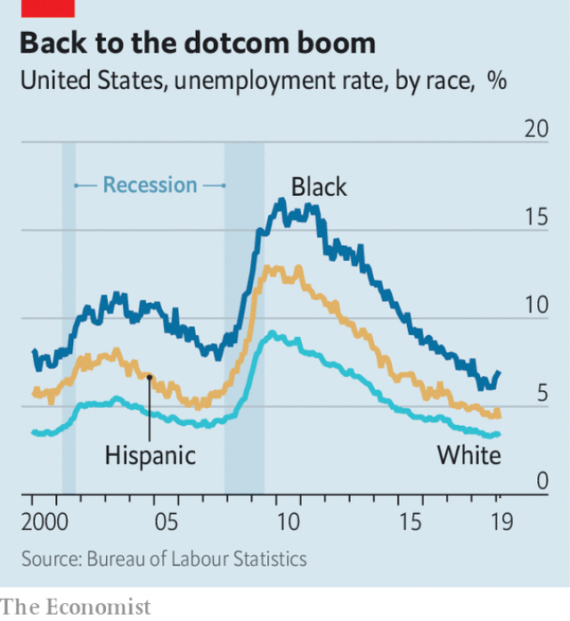

###### Okun’s razor

# The benefits of America’s hot economy have been unevenly spread 

##### Unemployment rates for African-Americans have fallen farthest and fastest 

 

> Mar 14th 2019 

“OUR ECONOMY’S on fire,” says Tamara Atkinson, head of Austin’s workforce development board. Workers there are being fought over with signing bonuses, paid internships and help with tuition fees. Ms Atkinson sees formerly incarcerated workers being given second chances, with employers asking how severe their crime really was. She even worries that wages for flipping burgers are now so high that they are pulling people away from education. 

As Ms Atkinson heard the economy humming, unemployment statistics revealed a blip. January’s figures, published by the Texas Workforce Commission on March 8th, revealed that Austin’s unemployment rate had ticked up, from 2.7% in December to 3.1% in January. On the same day, the Bureau of Labour Statistics generated some sharp intakes of breath when it revealed that in February the whole economy generated just 20,000 new jobs, far below January’s bumper haul of 311,000. 

Both figures are probably statistical anomalies. Austin’s figure was not seasonally adjusted, and average jobs growth for the country as a whole over the past three months has been a healthy 186,000. “I wouldn’t interpret this as the labour market softening,” says Betsey Stevenson of the University of Michigan, the former chief economist at the Department of Labour. Rather than causing panic, these new numbers should be a reminder of both the extraordinary benefits of the recovery so far and the human cost if it falters. 

The particular benefits provided by a hot economy were laid out by an economist called Arthur Okun in 1973. He argued that lowering unemployment would generate benefits far beyond just creating jobs, reckoning that it would raise a submerged iceberg, pulling people off the sidelines and into work, pushing part-timers into full-time engagements and boosting productivity. Such would be the power of a vibrant economy that it would draw people and resources towards where they could be most useful. 

The experience of the past decade has confirmed much of Mr Okun’s thesis. The nature of employment has shifted towards full-time jobs, and fewer people are working fewer hours than they would like. Young women have rejoined the workforce with much more enthusiasm than men. After America’s disability rolls swelled during the recession, many feared that those leaving the labour force would never return. “Those fears were clearly misguided,” says Ernie Tedeschi, an economist at Evercore ISI, an investment bank. The share of people aged 26-55 saying that they are out of work because of illness or disability was lower in 2018 than it was back in 2008. The change has accounted for almost half of the increase in labour-force participation over the past year. 

A new study, presented at the Brookings Institution almost 50 years later, tests Mr Okun’s thesis with data from the most recent recovery. It finds that the higher the unemployment rate is for any particular group, the more sensitive that group will be to the ups and downs of the economy. African-Americans, for example, tend to have higher unemployment rates than whites, and they suffered a disproportionate share of the job losses during the recession (see chart). Notwithstanding a recent wobble, they have since enjoyed a disproportionate share of the gains. 

 

Groups with lower levels of education find themselves in a similar situation, as they too suffered a harder blow than most during the recession, and more recently have enjoyed a faster fall in their unemployment rate. For the likes of Ms Atkinson, who worries about the people flipping burgers to pay their rent, these basic measures of success are not good enough. If a hot economy pulls people into dead-end jobs, then they will fall right back out of them when the next recession strikes. 

The evidence on this from Austin is mixed. According to Indeed.com, an online jobs platform, local searches for jobs such as shop assistant, warehouse worker and waitress rose by more than 300% between the end of 2017 and the end of 2018. But searches for “learning and development” opportunities rose even more quickly. Nationwide, Mr Tedeschi is not worried, pointing out that the share of people who say that they are out of work because they are in education is higher than it was in 2008, and has persistently been so. 

It is possible that, as wage growth puts pressure on companies’ profit margins, they will respond by investing in productivity-boosting measures, in line with Mr Okun’s third prediction. Nicole Trimble of Talent Rewire, a consultant for companies trying to expand employment among disadvantaged groups, is doing a roaring trade for companies including Tyson Foods, a meat processor, and McDonald’s, a fast-food chain. Companies are finding they have to offer help that they used to think of as the preserve of government, such as helping workers claim tax credits or with financial literacy. Some firms are retraining existing workers when they automate, rather than firing them and hiring a new batch. Ms Trimble doubts they would be doing all this in a cooler labour market. 

For all this good news, growth in Americans’ labour productivity is still slow. And past experience delivers a gloomy message about the economy’s capacity to redress structural inequalities. Another study, by Julie Hotchkiss of the Federal Reserve Bank of Atlanta and Robert Moore of Georgia State University, found that the benefits to disadvantaged groups from hot economies have tended to be smaller than their penalties in colder times. “It’s not a matter of if there’s going to be another recession,” warns Ms Atkinson; “it’s a matter of when.” If February’s jobs numbers turn out to be more than a hiccup, then those who have risen farthest will have farthest to fall. 

-- 

 单词注释:

1.unevenly[]:adv. 不平坦地；不均衡地；不平行地 

2.farthest['fɑ:ðist]:a. 最远的, 最久的 adv. 最远, far的最高级 

3.Tamara[tә'mærә]:n. 塔玛拉(f.) 

4.Atkinson[]:n. 阿特金森（姓氏） 

5.internship['intә:nʃip]:n. 实习医师的职务 [医] 实习医师职位, 实习医师期 

6.formerly['fɒ:mәli]:adv. 从前, 以前 

7.incarcerate[in'kɑ:sәreit]:vt. 下狱, 监禁, 禁闭 [法] 监禁, 使下狱, 禁闭 

8.flip[flip]:vt. 掷, 弹, 轻击, 空翻 vi. 用指轻弹, 抽打, 蹦跳 n. 抛, 弹, 筋斗 a. 无礼的 [计] 翻转 

9.burger['bә:ɡә]:n. 汉堡包（等于hamburger） 

10.hum[hʌm]:n. 嗡嗡声, 哼声, 杂声 vi. 发低哼声 vt. 哼, 用哼声表示 interj. 哼, 嗯 

11.statistic[stә'tistik]:n. 统计量 a. 统计的, 统计学的 

12.blip[blip]:n. 光点, 清脆的短音 [电] 小粒 

13.Texas['teksәs]:n. 德克萨斯 

14.intake['inteik]:n. 入口, 吸入, 吸入量 [医] 摄取量 

15.bumper['bʌmpә]:n. 缓冲器, 满杯 a. 大胜利的 

16.haul[hɒ:l]:n. 用力拖拉, 拖运, 强拉, 捕获量, 拖运距离 vi. 拖, 拉, 改变方向, 改变主意 vt. 拖拉, 拖运 

17.anomaly[ә'nɒmәli]:n. 不规则, 反常事物, 畸形 [医] 异常, 反常 

18.seasonally[]:adv. 季节性地；周期性地 

19.soften['sɒftn]:v. (使)变柔软, (使)变柔和 

20.betsey[]:n. 贝齐（人名） 

21.stevenson['sti:vnsn]:n. 史蒂文森（姓氏） 

22.Michigan['miʃigәn]:n. 密歇根州 

23.economist[i:'kɒnәmist]:n. 经济学者, 经济家 [经] 经济学家 

24.reminder[ri'maindә]:n. 提醒的人, 暗示 [经] 催单 

25.falter['fɒ:ltә]:vt. 支吾地说 vi. 支吾, 蹒跚地走 n. 颤抖, 支吾, 踌躇 

26.arthur['ɑ:θә]:n. 亚瑟（男子名）；亚瑟王（传说中六世纪前后英国的国王, 圆桌骑士团的首领） 

27.okun[]: [人名] 奥肯 

28.reckon['rekәn]:vt. 计算, 总计, 估计, 认为, 猜想 vi. 数, 计算, 估计, 依赖, 料想 

29.iceberg['aisbә:g]:n. 冰山, 冷冰冰的人 

30.sideline['saidlain]:n. 副业, 旁线, 界线, 兼职, 旁观者看法 vt. 使退出比赛场地 

31.engagement[in'geidʒdmәnt]:n. 诺言, 约会, 婚约, 交战 [医] 衔接 

32.productivity[.prәudʌk'tiviti]:n. 生产力 [经] 生产率, 生产能力 

33.vibrant['vaibrәnt]:a. 振动的, 战栗的, 响亮的, 活跃的 

34.thesis['θi:sis]:n. 论题, 论文 

35.rejoin[ri'dʒɒin]:vt. 使再结合, 再加入, 回答 vi. 重新聚合, 回答, 第二次答辩 

36.recession[ri'seʃәn]:n. 后退, 凹处, 衰退, 归还 [医] 退缩 

37.misguide[mis'gaid]:vt. 误导 

38.Ernie['ә:ni:]:n. 摇奖机 

39.tedeschi[]:[网络] 泰得奇酒庄；特德斯基；特戴斯基 

40.evercore[]:[网络] 艾维克；艾菲科 

41.isi[]:abbr. 工业标准项目（Industry Standard Item）；钢铁学会（Iron and Steel Institute）；印度标准学会（Indian Standards Institution） 

42.participation[.pɑ:tisi'peiʃәn]:n. 参与, 分享 [经] 参与, 参股 

43.Brooking[]:n. (Brooking)人名；(英、西)布鲁金 忍受（brook的现在分词形式） 容忍 

44.datum['deitәm]:n. 论据, 材料, 资料, 已知数 [医] 材料, 资料, 论据 

45.disproportionate[.disprә'pɒ:ʃәnit]:a. 不成比例的 

46.notwithstanding[.nɒtwiθ'stændiŋ]:adv. 虽然, 尽管 prep. 尽管 conj. 虽然 

47.wobble['wɒbl]:n. 摆动, 摇晃, 不稳定, 抖动 vi. 摇晃, 摇摆, 游移不定 vt. 使摇摆, 使颤动 

48.austin['ɔ:stin]:n. 奥斯丁（人名）；英国制汽车牌名 

49.online[]:[计] 联机 

50.quickly['kwikli]:adv. 很快地 

51.persistently[pə'sɪstəntlɪ]:adv. 坚持地; 固执地; 一个劲儿 

52.prediction[pri'dikʃәn]:n. 预言, 预报 [化] 预测 

53.nicole[ni'kәjl]:n. 尼科尔（女子名, 等于Nichole） 

54.Trimble[]:n. 特林布（姓氏）；美国天宝（公司名） 

55.rewire[ri:'waiә]:vt. 换电线, 再打电报 

56.Tyson[]:n. 泰森（姓氏） 

57.processor[prә'sesә]:n. 信息处理机, 加工者, 处理者 [计] 处理器 

58.literacy['litәrәsi]:n. 读写能力, 识字, 精通文学 

59.retrain[ri:'trein]:vt. 重新训练, 再训练 

60.automate['ɔ:tәmeit]:vt.vi. (使)自动化 [计] 自动化 

61.batch[bætʃ]:n. 一次所烘的面包, 一次所制之量, 一组, 批, 成批, 分批 v. 成批, 分批处理 [计] 一批 

62.redress[ri'dres]:n. 赔偿, 补救, 矫正 vt. 纠正, 赔偿, 救济 

63.inequality[.ini'kwɒliti]:n. 不平等, 不同, 不平坦, 不平均 n. 不平等, 不等式 [计] 不等式 

64.julie[]:n. 朱莉（女子名） 

65.Hotchkiss['hɔtʃ,kis]:n. 一种机关枪 

66.atlanta[әt'læntә]:n. 亚特兰大（美国城市） 

67.Robert['rɔbәt]:[法] 警察 

68.moore['muә]:n. 摩尔（男子名） 

69.Georgia['dʒɒ:dʒjә]:n. 乔治亚州 

70.penalty['penәlti]:n. 处罚, 刑罚, 罚款, 罚球, 报应, 不利结果, 妨碍 [经] 罚金(款), 违约金 

71.hiccup['hikʌp]:n. 打嗝 v. 打嗝 

