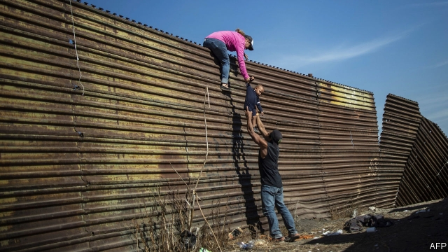
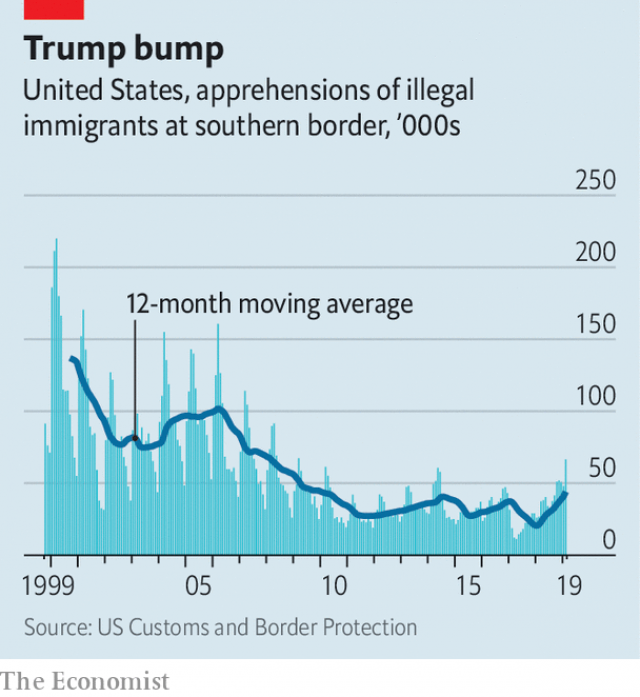

###### A tale of two borders

# Why more undocumented migrants are reaching America 

##### Donald Trump’s habit of insulting Mexicans appears to have backfired 

 

> Mar 14th 2019 

DONALD TRUMP promised to resort to untested measures to keep Mexican migrants from crossing America’s southern border. The promise contained at least two nagging flaws. The first is an outdated view. Migration of Mexicans is down by 90% from its peak in 2000; now most border-hoppers come from the “Northern Triangle” of Guatemala, Honduras and El Salvador. The second error was to rile Mexico with insults and threats when America relies on its goodwill to police its own southern border, which migrants must first cross before continuing on to America. 

In February the number of migrants stopped while trying to enter America from Mexico—a proxy for overall illegal migration levels—rose to 76,000. That is the highest number for any month in a decade. The increase consisted almost entirely of Central Americans, not Mexicans. Meanwhile, Mexican authorities have been deporting less than half as many Central Americans as usual since Andrés Manuel López Obrador, a left-winger, took office in December. Mexico deported one migrant for every four that were apprehended in America in the year before he took office. Now the ratio closer to one to ten. 

That is no coincidence. Mr López Obrador’s team vows to depart from the “mass deportations” of migrants that Mexico has carried out since 2014 at America’s behest. In January, confronted with a “caravan” of migrants from Honduras, Mexico handed out 13,000 wristbands, which doubled as a humanitarian visa, allowing migrants to stroll across into Mexico from Guatemala without fuss. Mexico plans to roll out a plan later this year allowing Central Americans to obtain humanitarian visas from Mexican consulates in their home countries. That will allow safer journeys. 

Mexico is not doing this purely to upset Mr Trump. It wants to reduce the $2.5bn that Mexican organised crime reaps from trafficking migrants each year. Olga Sánchez Cordero, Mexico’s secretary of the interior, recently told diplomats that “by history, tradition and conviction, Mexicans are a people in solidarity with those who arrive in our country.” Mr López Obrador believes that money is better spent tackling the causes of migration than on border security, and wants America to spend more to create jobs and strengthen the rule of law. 

 

For a while, Mr Trump’s harsh rhetoric seemed to deter migrants. Border apprehensions dropped after his victory in November 2016, before any policies were implemented. For 18 months, many chose to delay the journey north. But that has not lasted. Mr Trump has little to show for his efforts to build a wall (let alone make Mexico pay for it), or to cut aid to Central American countries that fail to stop their citizens emigrating. Even his most hard-hearted policies, like caging children or removing gang and domestic violence as grounds for asylum, have not worked. 

For a sense of why this is so, look at Tapachula, a tropical town near Mexico’s border with Guatemala. Tales of gang threats and dead relatives abound. A farmer from Honduras complains of plunging coffee prices, reduced rainfall and insect plagues destroying his crops. Many migrants wait in the hot sun to apply for asylum. Mexico received nearly 8,000 requests in January and February, more than all the requests in 2013, 2014 and 2015 combined. 

Many migrants first enter Mexico via the nearby town of Ciudad Hidalgo. Just 200m away from a Mexican immigration office is a bustling river border. Guatemalans come and go on small rafts, for 7 quetzals ($0.90) a trip. Others use them to ferry loo paper and Coca-Cola across. Children bathe in the stream. Migrants tend to cross to Mexico at dawn, but they do not need to: law-enforcement officers are a rare sight. 

Even as Mexico applies a softer touch on its southern border, it is co-operating with America in its north. It is abiding by a new programme that requires migrants seeking asylum in America to wait in Mexico while their court date approaches. But diplomatic goodwill may fade if Central Americans keep streaming through Mexico “like water”, as Mr Trump tweeted last year. That seems likely, especially now that regular caravans offer migrants the chance to travel in the safety of a large group. 

Oddly, though, that may not drive Mr Trump to despair. Failing to reduce Central American migration may ultimately be more useful to him politically than succeeding ever could. 

-- 

 单词注释:

1.undocumented[,ʌn'dɔkjjmentid]:a. 无正式文件的, 无事实证明的 

2.migrant['maigrәnt]:n. 候鸟, 移居者 [法] 移居者 

3.backfire[.bæk'faiә]:n. 逆火, 回火, 放火 vi. 放逆火, 预先放火, 发生意外 

4.untested[ʌn'testid]:a. 未经试验的, 未经考验的 

5.nag[næg]:n. 老马, 驽马, 劣等竞赛马, 唠叨 v. 不断地唠叨, 恼人 

6.flaw[flɒ:]:n. 缺点, 裂纹, 瑕疵, 一阵狂风 [化] 划痕; 裂缝; 裂纹 

7.outdate[.aut'deit]:vt. 使过时 

8.migration[mai'greiʃәn]:n. 移民, 移往, 移动 [计] 迁移 

9.Guatemala[.gwɑ:tә'mɑ:lә]:n. 危地马拉 

10.Honduras[hɒn'djurәs]:n. 洪都拉斯 

11.el[el]:abbr. 预期损失（Expected Loss） 

12.Salvador['sælvәdɔ:]:[经] 萨尔瓦多 

13.rile[rail]:vt. 搅浑, 惹怒, 使焦急 

14.goodwill[^jd'wil]:n. 友好, 好意, 善意, 亲善, (企业享有的)信誉, 声誉 [经] (企业的)商誉, 信誉 

15.proxy['prɒksi]:n. 代理, 代理人, 委托书 [经] 代理人, 代表权, 授权书 

16.migration[mai'greiʃәn]:n. 移民, 移往, 移动 [计] 迁移 

17.entirely[in'taiәli]:adv. 完全, 全然, 一概 

18.deport[di'pɒ:t]:vt. 举止, 驱逐出境 [法] 放逐, 驱逐, 递解 

19.les[lei]:abbr. 发射脱离系统（Launch Escape System） 

20.manuel['mænjuel]:n. 曼纽尔（男子名）；曼努埃尔二世（拜占庭皇帝约翰五世的次子） 

21.López[]:[地名] 洛佩斯 ( 阿根、厄 ) 

22.obrador[]:[网络] 布拉多 

23.apprehend[.æpri'hend]:vt. 理解, 忧虑, 逮捕 vi. 担心, 理解 

24.vow[vau]:n. 誓约, 誓言, 许愿 vi. 起誓, 发誓, 郑重宣言 vt. 立誓, 起誓要, 郑重地宣布 

25.deportation[.di:pɒ:'teiʃәn]:n. 驱逐出境, 放逐 [法] 递解出境, 放逐, 驱逐 

26.behest[bi'hest]:n. 命令 

27.confront[kәn'frʌnt]:vt. 使面对, 对抗, 遭遇, 使对质, 比较 [法] 对证, 使对质, 比较 

28.caravan['kærәvæn]:n. 旅行队, 有篷顶的大车 [经] 商队, 结队商贩 

29.wristband['ristbænd]:n. 袖口 

30.humanitarian[hju:.mæni'tєәriәn]:n. 人道主义者, 博爱者, 基督凡人论者 a. 人道主义的, 博爱的, 凡人论的 

31.stroll[strәul]:n. 闲逛, 漫步 v. 闲逛, 漫步 

32.fuss[fʌs]:n. 大惊小怪, 小题大作, 忙乱 vi. 无事自扰, 焦急, 焦燥, 忙乱 vt. 使激动, 使烦燥 

33.consulate['kɒnsjulit]:n. 领事, 领事任期, 领事馆 [经] 领事馆 

34.trafficking[ˈtræfikɪŋ]:n. 非法交易 

35.olga['ɔl^ә]:n. 奥尔加（女子名） 

36.cordero[]: [人名] 科德罗 

37.diplomat['diplәmæt]:n. 外交官, 有外交手腕的人 [法] 外交家, 外交官, 有权谋的人 

38.conviction[kәn'vikʃәn]:n. 定罪, 信服, 坚信 [法] 定罪, 证明有罪, 判罪 

39.solidarity[.sɒli'dæriti]:n. 团结, 团结一致, 共同一致 [法] 团结, 共同责任 

40.tackle['tækl]:n. 工具, 复滑车, 滑车, 装备, 扭倒 vt. 固定, 处理, 抓住 vi. 扭倒 

41.rhetoric['retәrik]:n. 修辞, 修辞学, 雄辩(术) 

42.deter[di'tә:]:vt. 制止, 吓住, 威慑 

43.apprehension[.æpri'henʃәn]:n. 理解, 忧惧, 逮捕 [医] 领会 

44.emigrate['emigreit]:v. (使)移居, (使)移民 

45.caging['keidʒiŋ]:n. 制动；闭锁；罩盖；吸持 

46.asylum[ә'sailәm]:n. 庇护, 收容所 [医] 养育院 

47.tapachula[]: [地名] [墨西哥] 塔帕丘拉 

48.abound[ә'baund]:vi. 大量存在, 富于, 充满 

49.plague[pleig]:n. 瘟疫, 天罚, 麻烦, 灾祸 vt. 折磨, 使苦恼, 使得灾祸 

50.Ciudad[]:n. （西）城市 n. (Ciudad)人名；(西)休达 

51.hidalgo[hi'dælgәu]:n. 西班牙贵族, (西班牙语国家的)绅士 

52.bustle['bʌsl]:n. 喧闹, 裙撑 vi. 奔忙, 喧闹 vt. 使忙碌, 催促 

53.Guatemalan[,ɡwæti'mɑ:lən]:n. 危地马拉人 a. 危地马拉的（中美洲的一个国家） 

54.raft[ræft]:n. 筏, 救生筏, 大量 vi. 乘筏 vt. 筏运, 制成筏 

55.quetzal[ket'sɑ:l, 'ketsәl]:n. 绿咬鹃, 格查尔(危地马拉货币) 

56.loo[lu:]:n. 卢牌戏 

57.abide[ә'baid]:vi. 停留, 遵守, 居留, 继续下去 vt. 忍受, 经受, 屈从于 

58.diplomatic[.diplә'mætik]:a. 外交的, 老练的 [法] 外交的, 外交上的, 文献上的 

59.tweet[twi:t]:vi. 啁啾 n. 小鸟叫声 

60.oddly['ɒdli]:adv. 奇怪地 

61.politically[]:adv. 政治上 

