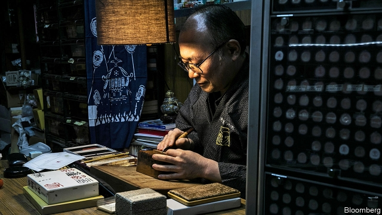

###### For the chop

# Are Japan’s ubiquitous personal seals endangered? 

##### The government is trying to do away with the paperwork they adorn 

 

> Mar 21st 2019 

DUST SETTLES over the shelves in Fujio Kawasaki’s shop. Customers once sought out this corner of Tokyo for quality hanko, the personal seals Japanese use as signatures. Among the goods on display is a seal carved from elephant tusk, a relic from a bygone era. Nobody will fork out ¥80,000 ($720) for such items these days, says Mr Kawasaki. Now he fears the government will force him out of business altogether. 

Hanko are a feature of life in Japan. Every adult—even the emperor—has one. They are required to buy a car, rent an apartment or get married. Managers use them to sign off on the endless faxes, memos and other antiquated documents that continue to circulate in offices. 

All this paperwork makes Japanese offices among the least efficient in the rich world. Dogged by low productivity and hence poor profitability, Japan’s three biggest banks have begun allowing customers to open accounts without hanko. Most Japanese will soon be pressing fingers to screens instead of wood to paper, predicts Noriaki Maruyama, president of an online bank. Local governments are starting to process transactions electronically, too. The Digital First Bill, currently zipping through parliament, seeks to do away with yet more forms and stamps. 

The rationale for the legislation is simple and sound, argues Takuya Hirai, minister of science and technology. Japanese people waste far too much time filling in forms, he says; the shrinking population can no longer afford to maintain this bloated paper-based bureaucracy. Mr Hirai has little sympathy for the sentimental national attachment to personal seals. 

The hanko industry has reacted with an emotional letter, pleading with Mr Hirai to scrap his plans. The bill threatens the livelihood of over 10,000 seal shops like Mr Kawasaki’s, it argues. Hanko are far superior to “Western-style signatures”, the letter says, because bosses can save time by entrusting their seals to proxies, who can then approve documents on their behalf. “We are proud of how this system contributed to Japan’s post-war economic growth,” it concludes. Mr Kawasaki thinks the government’s effort to diminish paperwork is a plot to do away with the sort of paper-trails that have been used to hold it to account in several recent scandals. 

Many Japanese seem ready to let go, however. The use of signatures had been spreading even before the government got involved. Mr Kawasaki’s shop is more than 80 years old. His father founded it. But it will not survive to the next generation, Mr Kawasaki laments. 

-- 

 单词注释:

1.ubiquitous[ju:'bikwitәs]:a. 无所不在的, 到处存在的, 普遍存在的 

2.adorn[ә'dɒ:n]:vt. 装饰, 使生色 

3.fujio[]:[网络] 藤子；不二雄；不二夫 

4.Hanko['hæŋkәu]:汉科[芬兰西南部港市] 

5.tusk[tʌsk]:n. 长牙, 獠牙, 尖物 vt. 以长牙刺戳, 以长牙掘 

6.relic['relik]:n. 遗物, 遗迹, 纪念物, 遗风, 残留物 

7.bygone['baigɒn]:n. 过去的事, 往事 a. 过去的 

8.Kawasaki[,kɑ:wɑ:'sɑ:ki:]:川崎[日本本州岛东南岸港市] 

9.Hanko['hæŋkәu]:汉科[芬兰西南部港市] 

10.memo['memәu]:n. 备忘录 [经] 备忘录 

11.antiquate['æntikweit]:vt. 使古旧, 废弃 

12.productivity[.prәudʌk'tiviti]:n. 生产力 [经] 生产率, 生产能力 

13.profitability[.prɒfitә'biliti]:n. 收益性, 利益率 [经] 可获利润率 

14.maruyama[]: [地名] [日本] 丸山 

15.online[]:[计] 联机 

16.transaction[træn'sækʃәn]:n. 交易, 办理, 学报, 和解协议 [计] 事务处理 

17.electronically[]:adv. 电子地 

18.currently['kʌrәntli]:adv. 现在, 当前, 一般, 普通 [计] 当前 

19.rationale[.ræʃә'nɑ:li]:n. 基本原理 [医] 原理, 理论 

20.takuya[]:[网络] 拓也；寺田拓哉；卓也 

21.hirai[]:[网络] 日平井康三郎；平井减速机制作所 

22.bloat[blәut]:vt. 使膨胀, 腌制, 使自大 vi. 膨胀, 肿起 n. 肿胀病人 

23.bureaucracy[bjuә'rɒkrәsi]:n. 官僚, 官吏 [法] 官僚主义, 官僚政治, 官僚机构 

24.sentimental[.senti'mentl]:a. 感伤的, 感情用事的 

25.attachment[ә'tʃætʃmәnt]:n. 连接, 附属物, 连接物, 爱慕 [计] 附加, 附件 

26.plead[pli:d]:vi. 辩护, 恳求 vt. 为...辩护, 提出...借口, 托称, 恳求 

27.scrap[skræp]:n. 碎片, 残余物, 些微, 片断, 铁屑, 吵架 vt. 扔弃, 敲碎, 拆毁 vi. 互相殴打 a. 零碎拼凑成的, 废弃的 

28.livelihood['laivlihud]:n. 生计, 营生, 生活 

29.entrust[in'trʌst]:vt. 信托, 交托, 委托 [经] 委托 

30.proxy['prɒksi]:n. 代理, 代理人, 委托书 [经] 代理人, 代表权, 授权书 

31.diminish[di'miniʃ]:v. (使)减少, (使)变小 

32.lament[lә'ment]:n. 悲叹, 悔恨, 恸哭, 挽歌, 悼词 vt. 哀悼 vi. 悔恨, 悲叹 

