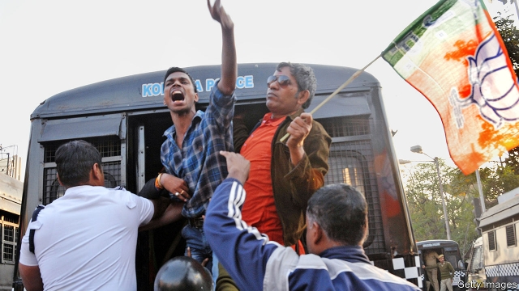

###### No tactic is too underhand

# India’s election campaign is racked by dirty tricks 

##### Intimidating voters, bullying rivals, buying defections—you name it 

 

> Mar 21st 2019 

WHEN YOU are on the run from a murder rap, what better place to take refuge than with the ruling party? Or so reckon Amit and Debu. Since February the two friends from the rice- and mango-growing district of Nadia have camped in the rickety building near the University of Calcutta that serves as the bustling West Bengal state headquarters for prime minister Narendra Modi’s Bharatiya Janata Party (BJP). 

The fugitives are party workers. They say they have been framed for the brutal murder in Nadia on February 28th of Sudhin Som, a youth leader from the All India Trinamool Congress (AITC), a rival party that runs West Bengal like a fiefdom. They also say Mr Som had been on the verge of defecting to the BJP, and that the men who killed him at an election rally were most likely AITC goondas (thugs). Since the killing, they note, the BJP has been unable to work in Nadia. “All of our houses got shot at and ransacked,” says Amit, a computer programmer who claims that AITC thugs have beaten him up 20 times in the past three years. “They say that if you fly a BJP flag, we will cut off your hand.” 

In the topsy-turvy of West Bengal politics, this could all be true. The state’s long-held reputation for political thuggery has deepened since Mamata Banerjee, the AITC’s founder and guiding force, captured power in 2011, ending 34 years of communist rule. But with heightened stakes come heightened measures. As India races towards a general election in April that many regard as the most consequential in decades, the level of political abuses of all sorts is rising. 

Ms Banerjee’s party may wield fearsome street muscle, for instance, yet as a regional rather than national party it lacks other cards. Take money. With membership of more than 100m and with tycoons queuing for Mr Modi’s favour, the BJP last year sucked in four times more donations than the next five parties put together. In an election whose total cost has been estimated at $7bn-10bn, this makes a big difference. Even sticking to the official maximum expenditure for each party of $100,000 for every seat it contests in the Lok Sabha, the 545-seat lower house of parliament, no other party could afford to run as many candidates as the 500 or so that the BJP is fielding. And despite the best efforts of the hallowed Election Commission to monitor spending, few believe that any big party observes the limits. 

Money is instrumental in other ways, too. On March 7th the BJP bought no fewer than ten full-page ads in the Indian Express, a national newspaper. It bought none in the Hindu, a rival, a paucity some linked to the newspaper’s dogged investigation of a costly defence deal inked by Mr Modi. In February a recording surfaced in Karnataka which purportedly caught a BJP leader talking about offering cash to members of the state assembly to switch parties. Few were surprised by the ploy, a time-tested one which could have toppled the state government and put the BJP in charge. What raised eyebrows were the sums allegedly proffered: $3m to “flip” a state legislator and $7m to buy off the speaker of the house. 

Being in government is useful, too. Opponents of Ms Banerjee say that it has become common for police in West Bengal to file charges against political opponents, which are dropped when they pledge allegiance to the AITC. Of the party’s candidates for West Bengal’s 42 seats, nine are recent defectors from other parties. Some rivals allege worse misdemeanours. Last year’s local council elections in the state were especially violent, eliciting widespread protests of voter intimidation. With the state police tamed, it is said that potential meddling by the Central Reserve Police Force, a national body, was forestalled by flooding their barracks with busloads of girls from Sonagachi, Kolkata’s red-light district. Small wonder that a senior party member jokes that if Mamata endorsed a banana tree, it would get elected. 

The AITC claims it is actually the victim of such tactics. After some of its leaders joined the BJP, it says, the Central Bureau of Investigation, a national police agency, suddenly stopped investigating their role in a $4bn pyramid scheme that rocked West Bengal six years ago. As the election approaches, investigators have been oddly keen to revive other cold legal cases. Hoary corruption scandals allegedly involving the Gandhi family, five generations of whom have run the Indian National Congress, the only national rival to the BJP, have suddenly been reopened. Robert Vadra, a former property developer whose wife is Priyanka Gandhi, sister of Rahul Gandhi, the Congress president, has in recent weeks been repeatedly summoned for all-day interrogations regarding a series of past transactions. Half a dozen other Congress leaders have seen cases against them suddenly spring to life again after lying dormant for years. 

Then there are the smears and insinuations. Mr Gandhi incessantly labels Mr Modi, who fashions himself a chowkidar or watchman, as a thief. Some BJP leaders, meanwhile, say that Mr Gandhi, whose mother is Italian, is a liar: he cannot be a high-caste Hindu as he claims. As for Ms Banerjee, whisperers dismiss her as Mumtaz Begum, the Muslim-sounding name being a swipe against the AITC’s popularity with West Bengal’s many Muslims. 

The indefatigable Election Commission, whose motto is “no voter left behind”, plans to dispatch a full team on a day-long hike to reach the single voter in India’s smallest electoral district. High up in the mountains of Arunachal Pradesh, on the borders of Myanmar and China, Sokela Tayang may be the only one of India’s 900m voters completely insulated from underhand tactics. 

-- 

 单词注释:

1.tactic['tæktik]:n. 一项战术, 一条策略 a. 战术的, 顺序的, 排列的 

2.underhand['ʌndәhænd]:a. 秘密的, 低手的, 偷偷摸摸的 [法] 卑鄙的, 秘密的, 欺诈的 

3.voter['vәutә]:n. 选民, 投票人 [法] 选民, 选举人, 投票人 

4.bully['buli]:n. 欺凌弱小者, 土霸 vt. 威胁, 恐吓, 欺负 vi. 欺负 a. 特好的, 第一流的 adv. 十分 

5.rap[ræp]:n. 轻敲, 拍击, 责骂, 无价值的东西 vt. 轻敲, 厉声说出, 叱责, 抢走, 使着迷 vi. 敲击, 发敲击声, 交谈, 同情 [计] 随机存取程序, 资源分配处理器, 常驻汇编程序 

6.reckon['rekәn]:vt. 计算, 总计, 估计, 认为, 猜想 vi. 数, 计算, 估计, 依赖, 料想 

7.amit[]:n. 阿米特（男子名） 

8.nadia[]:n. 纳迪亚（人名, 特指香港女明星陈松龄） 

9.rickety['rikәti]:a. 患佝偻病的, 虚弱的, 摇摆的 [医] 佝偻病的 

10.Calcutta[kæl'kʌtә]:n. 加尔各答 

11.bustle['bʌsl]:n. 喧闹, 裙撑 vi. 奔忙, 喧闹 vt. 使忙碌, 催促 

12.bengal[beŋ'^ɔ:l]:n. 孟加拉（位于亚洲） 

13.headquarter[,hed'kwɔ:tә]:vt. 将...的总部设在 

14.narendra[]:[网络] 纳伦德拉；纳兰德；纳然陀 

15.Bharatiya[]:[网络] 巴拉蒂亚 

16.Janata['dʒʌnətɑ:]:n. （印度）人民团体；人民党（印度联合政党） 

17.bjp[]: [医][=Bence Jones protein]本周（氏）蛋白，凝溶蛋白 

18.fugitive['fju:dʒitiv]:a. 逃亡的, 短暂的, 难捉摸的 n. 逃亡者, 亡命者, 难捕捉之物 

19.brutal['bru:tәl]:a. 残忍的, 野蛮的, 不讲理的 

20.SOM[]:[计] 报文开始符 

21.Trinamool[]:[网络] 崔纳姆国大党；纳木国大党；崔纳姆地区 

22.AITC[]:[=allyl-isothiocyanate]异硫氰酸烯丙酯 

23.fiefdom['fi:fdәm]:n. 封地, 采邑（等于fief） 

24.verge[vә:dʒ]:n. 边缘, 边界, 起始点 vi. 处在边缘, 接近, 下沉, 趋向 

25.rally['ræli]:n. 重振旗鼓, 集合, 群众集会, 跌停回升 v. 重整旗鼓, 集合, 恢复精神, 团结, 挖苦, 嘲笑 

26.goondas['ɡuːndə]:[网络] 深深植根于当地的犯罪帮派 

27.thug[θʌg]:n. 恶棍, 刺客, 凶手 [法] 凶手, 刺客, 暴徒 

28.ransack['rænsæk]:vt. 到处搜索, 遍寻, 掠夺, 洗劫 [法] 洗劫, 抢劫, 掠夺 

29.programmer['prәugræmә]:n. 程序员 [计] 程序设计员; 程序员 

30.politic['pɒlitik]:a. 精明的, 明智的, 策略的 

31.thuggery['θʌ^әri]:n. 谋财害命 

32.Mamata[]:[网络] 熟客仔 

33.banerjee[]:n. (Banerjee)人名；(印)班纳吉 

34.founder['faundә]:n. 创立者, 建立者 vt. 使沉没, 使摔倒, 弄跛, 浸水, 破坏 vi. 沉没, 摔到, 变跛, 倒塌, 失败 

35.heighten['haitn]:vt. 增高, 提高, 加强 vi. 升高, 变大 

36.consequential[,kɔnsi'kwenʃәl]:a. 作为结果的, 随之发生的, 推论的, 间接的, 重大的, 自大的, 傲慢的, 自傲的 [法] 结果的, 相应而生的, 接着发生的 

37.wield[wi:ld]:vt. 挥舞, 运用 

38.fearsome['fiәsәm]:a. 吓人的, 可怕的, 害怕的 

39.regional['ri:dʒәnәl]:a. 地方的, 地域性的 [医] 区的, 部位的 

40.membership['membәʃip]:n. 会员的资格, 全体会员, 会员数目 [法] 会员资格, 成员资格, 会籍 

41.tycoon[tai'ku:n]:n. 企业界大亨, 将军 [经] 企业界巨头, 企业家 

42.donation[dәu'neiʃәn]:n. 捐赠物, 捐款, 捐赠 [经] 赠品, 捐款, 捐赠 

43.lok[]:abbr. 洛卡米尔·伊洛曼希斯（游戏魔兽世界中的武器, Lok'amir il Romathis） 

44.sabha[]:[网络] 塞卜哈；萨巴；沙漠城市萨巴 

45.hallow['hælәu]:vt. 使...神圣, 视为神圣 n. 圣徒 

46.instrumental[.instru'mentәl]:a. 仪器的, 器具的, 可作为手段的 [医] 器械的 

47.Hindu['hindu:]:a. 印度教教徒的 n. 印度教教徒 

48.paucity['pɒ:sәti]:n. 少数, 少量, 缺乏 

49.MODI['mәudai]:[计] 模块化光学数字接口 

50.Karnataka[kɑ:'nɑ:tәkә]:卡纳塔克邦[印度邦名](旧称迈索尔邦) 

51.purportedly[p\\:'pɔ:tidli,'p\\:p-,'p\\:pәt-]:adv. 据称 

52.ploy[plɒi]:n. 手段, 活动, 玩乐 

53.topple['tɒpl]:vt. 推翻, 颠覆 vi. 倒塌, 摇摇欲坠 

54.eyebrow['aibrau]:n. 眉毛 [医] 眉 

55.allegedly[ә'ledʒidli]:adv. 依其申述 

56.flip[flip]:vt. 掷, 弹, 轻击, 空翻 vi. 用指轻弹, 抽打, 蹦跳 n. 抛, 弹, 筋斗 a. 无礼的 [计] 翻转 

57.legislator['ledʒisleitә]:n. 立法者, 立法官, 立法委员 [法] 立法者, 立法机关成员, 立法委员 

58.pledge[pledʒ]:n. 诺言, 保证, 誓言, 抵押, 信物, 保人, 祝愿 vt. 许诺, 保证, 使发誓, 抵押, 典当, 举杯祝...健康 

59.allegiance[ә'li:dʒәns]:n. 忠贞, 效忠 

60.defector[di'fektә]:n. 背叛者, 叛离者 [法] 变节分子, 背叛者, 开小差者 

61.allege[ә'ledʒ]:vt. 宣称, 主张, 提出, 断言 [法] 断言, 指称, 指证 

62.misdemeanour[.misdi'mi:nә]:n. 行为不端 [法] 不轨行为, 轻罪, 行为失检 

63.elicit[i'lisit]:vt. 引出, 推导出, 引起 

64.intimidation[in,timi'deiʃәn]:n. 恐吓, 威胁 [法] 恐吓, 威胁 

65.meddle['medl]:vi. 干涉, 干预, 擅自摸弄 [法] 干预, 插手, 弄乱 

66.forestal[]:a. forest（森林）的变形 

67.barrack['bærәk]:n. 兵舍, 军营 vt. 使驻兵营内 

68.busload['bʌslәjd]:n. 公共汽车运载量 

69.endorse[in'dɒ:s]:vt. 支持, 赞同, 背书于, 签署 [经] 赞成, 背书 

70.investigator[in'vestigeitә]:n. 调查者, 审查者 [法] 审查员, 侦查员, 调查员 

71.oddly['ɒdli]:adv. 奇怪地 

72.revive[ri'vaiv]:vt. 使苏醒, 使复兴, 使振奋, 回想起, 重播 vi. 苏醒, 复活, 复兴, 恢复精神 

73.hoary['hɒ:ri]:a. 灰白的, 陈旧的 [医] 灰发的, 白发的 

74.corruption[kә'rʌpʃәn]:n. 腐败, 堕落, 贪污 [计] 论误 

75.Gandhi['gændi:]:n. 甘地 

76.reopen[.ri:'әupәn]:v. 重开, 再开始, 再开 

77.Robert['rɔbәt]:[法] 警察 

78.developer[di'velәpә]:n. 开发者 [计] 显影器 

79.priyanka[]:[网络] 普里扬卡；普瑞安卡；朴雅卡 

80.rahul[]:n. 拉胡尔（人名） 

81.summon['sʌmәn]:vt. 召唤, 召集, 号召, 振奋, 唤起, 鼓起 [经] 传唤, 传讯 

82.interrogation[in.terәu'geiʃәn]:n. 审问, 疑问句, 问号 [电] 询问 

83.sery[]:n. (Sery)人名；(俄)谢雷；(科特)塞里 

84.transaction[træn'sækʃәn]:n. 交易, 办理, 学报, 和解协议 [计] 事务处理 

85.dormant['dɒ:mәnt]:a. 睡眠状态的, 静止的 [医] 休眠的, 不活动的, 休止的 

86.smear[smiә]:vt. 涂, 擦上, 玷污, 把...擦模糊 vi. 被弄脏 n. 污点, 污迹, 污蔑 

87.insinuation[in.sinju'eiʃәn]:n. 暗示, 暗讽 [法] 暗指, 暗示, 暗讽 

88.incessantly[ɪn'sesntlɪ]:adv. 不断地, 不停地; 接连不断; 连绵不断; 不已 

89.chowkidar[]: 

90.watchman['wɒtʃmәn]:n. 巡夜者, 看守人 [法] 看守人, 门警, 哨兵 

91.cannot['kænɒt]:aux. 无法, 不能 

92.whisperer[]:n. 低语者, 窃窃私语的人, 传播谣言的人 

93.mumtaz[]:n. (Mumtaz)人名；(阿拉伯、巴基、印、孟)蒙塔兹 

94.begum['beigәm]:n. 穆斯林国家的王后(或公主) 

95.swipe[swaip]:n. 强打, 用力挥击, 尖刻的话, 碰擦, 起重杆 vt. 强打, 用力挥击, 偷 

96.popularity[.pɒpju'læriti]:n. 名声, 受大众欢迎, 流行 

97.Muslim['mjzlim; (?@) 'mʌzlem]:n. 伊斯兰教, 伊斯兰教教徒 

98.indefatigable[.indi'fætigәbl]:a. 不知疲倦的, 有耐性的, 不屈不挠的 

99.dispatch[dis'pætʃ]:vt. 派遣 n. 派遣, 急件 [计] 调度 

100.hike[haik]:n. 徒步旅行, 远足, 涨价, 提高 vi. 步行, 徒步旅行, 上升 vt. 使高涨, 拉起 

101.electoral[i'lektәrәl]:a. 选举人的, 选举的, (有关)选举的 [法] 选举的, 选举人的, 由选举人组成的 

102.arunachal[]:[网络] 阿鲁纳恰尔；印度阿鲁纳恰尔邦；则有印度阿鲁纳尔邦 

103.Pradesh[]:邦 

104.Myanmar['mjænmɑ:(r)]:缅甸[东南亚国家](即Burma) 

105.insulate['insjuleit]:vt. 使绝缘, 隔离 [医] 绝缘 

