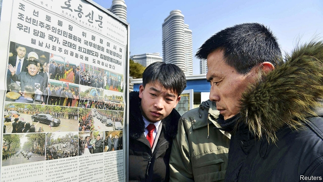

###### Deity in a T-shirt

# North Korea’s propaganda outlets are changing their style 

##### But the message remains the same 

 

> Mar 21st 2019 

NORTH KOREANS did not hear about Kim Jong Un’s first known visit to China, only a year ago, until their dictator was safely back home. Even then, Rodong Sinmun, a government mouthpiece, tersely informed readers that the “supreme leader” had “unofficially” called on his Chinese counterpart. Yet last month, when Mr Kim travelled to Vietnam for his second meeting with Donald Trump, America’s president, the coverage was breathless. State television broadcast daily updates about Mr Kim’s journey. Rodong splashed on the red-carpet welcome Mr Kim received, interspersed with stories about how much he was missed at home. It was the closest the North’s slow-moving propaganda outlets come to rolling coverage. 

Just as remarkable is how the North’s media have begun talking about America. Histrionic tirades about “evil imperialists” used to be their bread and butter. Just over a year ago Rodong Sinmun called Mr Trump a “crazy old bastard”. Over the past few months such abuse has all but disappeared. Apart from a rebuke of “gangster-like” Mike Pompeo, America’s secretary of state, the portrayal of America has softened beyond recognition. Even after Mr Trump walked out of the summit in Vietnam, the North’s media were emollient. 

The propaganda machine’s new tone is not a sign that the North is changing its policies in any profound sense, alas. But in a place where precious little has changed for decades, the shift in public-relations strategy is nonetheless remarkable. At the very least, it shows that Mr Kim is willing to modernise. And it suggests a modest degree of commitment to talks, even as North Korean officials send contrary signals. 

The role of North Korean state media is to glorify Mr Kim. The message—that he works tirelessly and brilliantly for the betterment of his people—does not vary much, regardless of whether Mr Kim is meeting a foreign leader or giving “on-the-spot guidance” at state-owned firms, where he opines on everything from desirable shoe colours to potato-farming. 

But the media are beginning to depict Mr Kim in a less formal and archaic way, says Jieun Baek of Oxford University. “It’s less stiff, less patriarchal—you occasionally see him with his wife, or wearing a T-shirt.” During his New Year address, Mr Kim sported a Western-style suit and tie and delivered his speech from a room that bore a certain likeness to a Victorian college library, complete with armchairs and imposing bookshelves. 

The change in the North’s PR tactics has been most visible in the portrayal of Mr Kim’s trips abroad. Both of his big summits with Moon Jae-in, South Korea’s president, were heavily covered by state media. Rodong Sinmun carried lots of pictures of the two leaders’ handshake across the dividing line separating their two countries in the heavily fortified “demilitarised zone” in April and their ascent of Mount Paektu in northern North Korea in September. Mr Kim’s first meeting with Mr Trump in Singapore in June received similarly prominent treatment. One Rodong spread emphasised Mr Kim’s playfulness, showing him smiling and laughing against Singapore’s skyline and waving to bystanders taking snaps with their mobiles. Others focused on foreign leaders’ reverence for Mr Kim: Mr Trump looks almost servile in some pictures the paper has printed.  

Kim Il-gi, an expert on North Korea at INSS, a think-tank funded by the South Korean government, says the displays are supposed to showcase confidence, marking a departure from the North’s customary paranoia about assassination attempts abroad or revolt at home. He says Mr Kim’s sister, Kim Yo Jong, who heads the North’s propaganda department, has played a key role in the change. “She controls his schedule—and decides how best to idolise him,” says the INSS’s Mr Kim. The saturation coverage of the dictator’s nuclear negotiations, he argues, “suggests they really need the sanctions relief from America and are keen to continue the diplomatic process”. 

But Ms Baek cautions against over-interpreting the changes. “Kim and his advisers are more attuned to Western media aesthetics than their predecessors, but the message they peddle is very similar.” The aim is still to inspire adulation. As more and more North Koreans gain illicit access to foreign media, the overhaul of Mr Kim’s image may merely be an attempt to sell the same ideology to a more worldly audience. 

Both the extent and the limits of the new approach were on display in mid-March, when Choe Son Hui, one of the North’s nuclear negotiators, gave a briefing to foreign diplomats and journalists about the talks with America. That she would bother to brief them was surprising. But she used the occasion to resort to the sort of threats and brinkmanship that North Korea has deployed for years, floating the possibility that it may soon resume testing missiles and nuclear weapons if America does not make more concessions. 

-- 

 单词注释:

1.deity['di:iti]:n. 神, 神性 

2.propaganda[.prɒpә'gændә]:n. 宣传, 宣传活动 [医] 宣传 

3.Korean[kә'riәn]:n. 朝鲜人, 朝鲜语 a. 朝鲜人的, 朝鲜语的 

4.kim[]:n. 金姆（人名） 

5.jong[jɔŋ]:n. 小伙子；（旧时的）青年男奴 

6.dictator['dikteitә]:n. 命令者, 独裁者 

7.rodong[]:[网络] 劳动；芦洞；芦洞飞弹 

8.sinmun[]:[网络] 倩敏 

9.mouthpiece['mauθpi:s]:n. 发话筒, 代言人, (电话)送话口 [机] 钳口垫片 

10.tersely[tɜ:slɪ]:adv. 简洁地, 精练地 

11.unofficially[]:adv. 非公认地；非正式地 

12.counterpart['kauntәpɑ:t]:n. 副本, 复本, 配对物, 相应物 [经] 副本, 正副二份中之一 

13.Vietnam[.vjet'næm]:n. 越南 

14.coverage['kʌvәridʒ]:n. 覆盖的范围, 保险总额, 新闻报导 [化] 可达范围; 覆盖度 

15.update[ʌp'deit]:vt. 更新, 使现代化 n. 更新 [计] 更新 

16.intersperse[.intә'spә:s]:vt. 散布, 点缀 

17.histrionic[.histri'ɒnik]:a. 演员的, 演剧的, 矫揉造作的 n. 演员, 演剧, 戏剧性 

18.tirade['taireid]:n. 激烈的长篇演说 

19.imperialist[im'piәriәlist]:n. 帝国主义者, 皇帝统治的拥护者, 皇帝派的人 a. 帝国主义的 

20.bastard['bæstәd]:n. 私生子, 劣货 a. 私生的, 杂种的, 不合标准的 

21.rebuke[ri'bju:k]:n. 指责, 谴责, 非难 vt. 斥责, 指责, 制止 

22.mike[maik]:vi. 偷懒, 游手好闲 n. 休息, 游手好闲, 扩音器, 话筒 

23.pompeo[]:n. (Pompeo)人名；(意)蓬佩奥 

24.portrayal[pɔ:'treiәl]:n. 描绘, 描写, 画像, 肖像 [计] 描绘 

25.soften['sɒftn]:v. (使)变柔软, (使)变柔和 

26.emollient[i'mɒliәnt]:a. 使柔软的 n. 软化剂, 润肤剂 

27.profound[prә'faund]:a. 极深的, 深厚的, 深刻的, 渊博的 

28.ala['eilә]:n. 翼, 翅 [化] 丙氨酸 

29.nonetheless[,nʌnðә'les]:conj. 然而, 尽管, 不过 adv. 不过, 仍然, 尽管如此, 然而 

30.modernise['mɔdәnaiz]:vt.vi. (使)现代化, (使)适应现代需要 vi. 用现代方法 

31.Korean[kә'riәn]:n. 朝鲜人, 朝鲜语 a. 朝鲜人的, 朝鲜语的 

32.glorify['glɒ:rifai]:vt. 赞美, 美化, 赞扬, 使辉煌 

33.tirelessly[]:adv. 不知疲倦地；不屈不挠地 

34.brilliantly['brijәntli]:adv. 辉煌地, 光亮地, 灿烂地 

35.betterment['betәmәnt]:n. 改进, 改善, (不动产)增值 [法] 改良, 改善, 地产增值 

36.opine[әu'pain]:v. 想, 以为 

37.depict[di'pikt]:vt. 描述, 描写 

38.les[lei]:abbr. 发射脱离系统（Launch Escape System） 

39.archaic[ɑ:'keiik]:a. 古体的, 过时的, 古老的, 古代的 [医] 原始的, 古代的 

40.baek[]: [地名] 白（韩国语） 

41.Oxford['ɒksfәd]:n. 牛津, 牛津大学 

42.likeness['laiknis]:n. 相象, 相似物, 样子 

43.Victorian[vik'tɔ:riәn]:a. 英国维多利亚女王时代的, 笃信宗教的, 讲究体面的 n. 维多利亚女王时代的英国人 

44.PR[]:与公众的关系, 公关 [计] 模式识别, 实际记录, 前缀, 程序寄存器 

45.tactic['tæktik]:n. 一项战术, 一条策略 a. 战术的, 顺序的, 排列的 

46.handshake['hændʃeik]:n. 握手 

47.fortify['fɒ:tifai]:vt. 设要塞于, 加强, 使坚强, 增加 vi. 筑防御工事 

48.demilitarise[,di: 'militәraiz]:vt. 解除对...军事管制, 使非军事化 

49.ascent[ә'sent]:n. 上升, 提高, 攀登, 上坡路 

50.Korea[kә'riә]:n. 朝鲜, 韩国 

51.Singapore[.siŋgә'pɒ:]:n. 新加坡 

52.emphasise[]:vt. 强调, 重读, 加强...的语气, 着重 

53.playfulness[]:n. 活泼快乐, 戏谑; 童心 

54.skyline['skailain]:n. 天涯, 地平线, 空中轮廓线 

55.bystander['baistændә(r)]:n. 旁观者, 目击者 [法] 候补陪审员, 旁观者 

56.reverence['revәrәns]:n. 尊敬, 敬重, 敬礼, 尊严, 威望 vt. 崇敬, 敬畏, 尊敬 

57.servile['sә:vail]:a. 奴隶的, 奴性的, 卑屈的 

58.ins[]:abbr. 惯性导航系统（Inertial Navigation System）；国际新闻社（International News Service）；信息网络系统（Information Network System） 

59.showcase['ʃәukeis]:n. 陈列橱 [经] 商品陈列所, 货物陈列架 

60.customary['kʌstәmәri]:a. 习惯的, 惯常的 [经] 通常的, 习惯的 

61.paranoia[.pærә'nɒiә]:n. 偏执狂, 多疑症 [法] 妄想狂, 偏执狂 

62.assassination[ә.sæsi'neiʃәn]:n. 暗杀 [法] 暗杀, 行刺 

63.yo[jәu]:int. 唷（表示鼓励, 警告）；嗨（表示应答） 

64.idolise[]:vt.vi. 把...当偶像崇拜, 崇拜偶像, 过度崇拜, 偶像化 

65.saturation[.sætʃә'reiʃәn]:n. 饱和, 渗透, 浸透, 色饱和度 [计] 饱和度 

66.negotiation[ni.gәuʃi'eiʃәn]:n. 谈判, 磋商, 交涉 [经] 谈判, 协商 

67.sanction['sæŋkʃәn]:n. 核准, 制裁, 处罚, 约束力 vt. 制定制裁规则, 认可, 核准, 同意 

68.diplomatic[.diplә'mætik]:a. 外交的, 老练的 [法] 外交的, 外交上的, 文献上的 

69.adviser[әd'vaizә]:n. 顾问, 劝告者, 指导教师 [法] 顾问, 劝告者 

70.attune[ә'tju:n]:vt. 为乐器调音, 使协调, 使合拍 

71.aesthetic[i:s'θetik]:a. 美学的, 审美的, 有美感的 

72.predecessor[.predi'sesә]:n. 前任, 先辈, 前身 [医] 初牙, 前辈, 祖先 

73.peddle['pedl]:vi. 挑卖, 沿街叫卖, 游荡, 闲混 vt. 叫卖, 兜售, 散播 

74.adulation[.ædju'leiʃәn]:n. 谄媚, 过分的称赞 

75.illicit[i'lisit]:a. 不法的, 不正当的, 禁止的 [法] 违法的, 违禁的, 被禁止的 

76.overhaul[.әuvә'hɒ:l]:vt. 分解检查, 翻修, 精细检查, 彻底革新 n. 分解检查, 精细检查, 大检修 

77.ideology[.aidi'ɒlәdʒi]:n. 思想体系, 意识形态, 观念学, 空论 [医] 观念学, 观念形态 

78.worldly['wә:ldli]:a. 世间的, 世俗的, 世上的 

79.choe[]:[网络] 崔；最催；克咯伊 

80.hui[]:abbr. 拟人化用户界面（Human User Interface） 

81.negotiator[ni'gәuʃieitә]:n. 磋商者, 交涉者, 议定者 [经] 谈判者, 交易者, 协商者 

82.diplomat['diplәmæt]:n. 外交官, 有外交手腕的人 [法] 外交家, 外交官, 有权谋的人 

83.bother['bɒðә]:vt. 烦扰, 迷惑 vi. 烦恼, 操心 n. 麻烦, 纠纷, 讨厌的人 

84.brinkmanship['briŋkmәnʃip]:n. 边缘政策 [法] 外交冒险政策, 紧急政策 

85.deploy[di'plɒi]:v. 展开, 配置 

86.concession[kәn'seʃәn]:n. 特许, 让步, 认可 [经] 核准, 许可, 特殊(权) 

