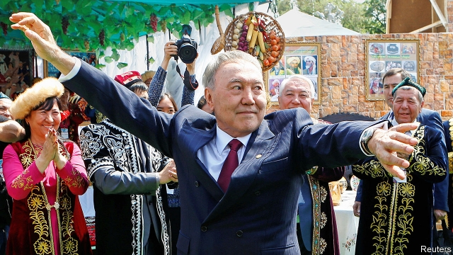

###### Long-service leave

# Nursultan Nazarbayev, Kazakhstan’s strongman, resigns 

##### But he clearly plans to keep pulling strings from behind the scenes 

 

> Mar 21st 2019 

ONCE A STRONGMAN has been in power for 30 years, it is reasonable to assume he will leave office only in a coup or a coffin. But Nursultan Nazarbayev, the 78-year-old who has run Kazakhstan since 1989, is trying to find a third way. On March 19th he took to the airwaves to announce his retirement as president of the oil-rich Central Asian country. The announcement marks the end of an era, not just for Kazakhstan but for the region: Mr Nazarbayev was its last Soviet-era leader left in power. When the former steelworker ascended to the leadership, Kazakhstan was still part of the Soviet Union. He presided over independence in 1991 and had governed ever since. 

A showman to the last, Mr Nazarbayev signed his resignation decree on live television. On March 20th Kassym-Zhomart Tokayev, the 65-year-old chairman of the Senate, was sworn in for the rest of Mr Nazarbayev’s term, as the constitution stipulates. Mr Tokayev immediately ordered Astana, the vainglorious capital Mr Nazarbayev founded, rechristened “Nursultan” in his honour. Shymkent, Kazakhstan’s third-largest city, rushed to rename its main street “Nazarbayev”. 

Rumours had long swirled that Mr Nazarbayev was preparing to step down. Yet his physical and mental health seem robust; there had been no inkling the announcement was coming this week. Fully half of Kazakhstan’s 18m citizens have never known any other leader. Mr Nazarbayev said that it was time to hand power to a younger generation. But his retirement is less a graceful bowing-out than a manoeuvre designed to allow him to micromanage the transition to a new leader, just as he has micromanaged every other aspect of Kazakh politics for so many years. 

Mr Nazarbayev has a special legal status that grants him considerable post-retirement powers. The Leader of the Nation (his official title) will still chair the Security Council, which gives him direct sway over the armed forces. He also enjoys the right to intervene in policymaking for the rest of his life. He is immune from prosecution for actions committed in office. His and his family’s assets cannot be seized. His eldest daughter, Dariga Nazarbayeva, replaced Mr Tokayev as chairman of the Senate, placing her next in line to the presidency. 

By securing Kazakhstan’s independence, Mr Nazarbayev literally put it on the map, as he pointed out in his resignation speech. He has kept it there by maintaining cordial ties with his giant neighbours, Russia and China, as well as with America. Mr Nazarbayev also expressed pride at the relative harmony among the more-than-100 ethnic groups in Kazakhstan. He took credit, too, for dragging the country out of the economic stagnation of the post-Soviet period into petrodollar-fuelled prosperity, although he failed to mention that his cronies have benefited more than his people. Mr Nazarbayev’s most brazen claim was that he had built a democracy, despite presiding over three decades of rigged elections, jailed critics and muzzled media. 

Elections are due to be held at the end of next year, although an early vote is not ruled out. Mr Nazarbayev did not name a preferred candidate, but it seems inconceivable that he does not have one in mind. That could be Mr Tokayev or another, younger lieutenant, such as Askar Mamin, 53, who was promoted to prime minister in a recent cabinet reshuffle. If he intends his daughter to become president, he has been careful not to signal it openly. 

The new president will certainly not emerge from the ranks of the opposition, since Mr Nazarbayev has hounded it out of existence. His preferred successor will almost certainly saunter into office after a rubberstamp election—although perhaps not with the 98% of the vote that Mr Nazarbayev is supposed to have won last time. Presumably, Mr Nazarbayev does not intend a big political opening, or he would have started one while still in office himself. As he reassured his people when announcing his momentous decision: “I will be staying with you.” 

-- 

 单词注释:

1.nursultan[]:[网络] 努苏坦 

2.nazarbayev[]:[网络] 纳扎尔巴耶夫；总统纳扎尔巴耶夫；哈萨克的纳扎尔巴耶夫 

3.strongman[ˈstrɒŋmæn]:n. 大力士 

4.strongman[ˈstrɒŋmæn]:n. 大力士 

5.coup['ku:]:n. 砰然的一击, 妙计, 出乎意料的行动, 政变 [医] 发作, 中, 击 

6.coffin['kɒfin]:n. 棺材, 灵柩 vt. 把...装进棺材 

7.Kazakhstan[ˌkæzək'stæn]:n. 哈萨克斯坦（原苏联加盟共和国之一, 已于1991年宣布独立） 

8.airwave['єәweiv]:n. 电波, 波道 

9.retirement[ri'taiәmәnt]:n. 退休, 隐居, 撤退 [经] 退休, 退股, (固定资产)报废 

10.steelworker['sti:lwә:kә]:n. 炼钢工人 

11.ascend[ә'send]:vi. 上升, 追溯, 登高 vt. 攀登 

12.preside[pri'zaid]:vi. 统辖, 当主人, 主持 [法] 主持, 负责, 指挥 

13.showman['ʃәumәn]:n. 演出主持人, 玩杂耍的人 

14.decree[di'kri:]:n. 法令, 判决, 天意 vt. 颁布, 判决 vi. 发布命令 

15.stipulate['stipjuleit]:v. 规定, 保证 

16.Astana['ɑ:stənə]:n. 阿斯塔纳（哈萨克斯坦共和国首都） 

17.vainglorious[.vein'glɒ:riәs]:a. 自以为了不起的, 自负的, 虚荣心强的 

18.rechristen[ri:'krisn]:vt. 再度命名, 重新命名, 改名 

19.Shymkent[]:希姆肯特（哈萨克斯坦一城市名） 

20.rename[.ri:'neim]:vt. 重新命名, 再命名, 给...改名 [计] 重命名; DOS内部命令:更改文件名 

21.swirl[swә:l]:n. 漩涡, 涡动 vt. 使成漩涡 vi. 打漩, 盘绕, 眩晕 

22.robust[rәu'bʌst]:a. 健康的, 强健的, 要用力气的, 坚定的, 粗野的 [计] 健壮性 

23.inkling['iŋkliŋ]:n. 暗示, 微微觉得 

24.fully['fuli]:adv. 十分地, 完全地, 充分地 

25.les[lei]:abbr. 发射脱离系统（Launch Escape System） 

26.manoeuvre[mә'nu:vә]:n. 调遣, 演习, 策略 vi. 调动, 演习, 用策略 vt. 调动, 操纵 

27.micromanage['maɪkrəʊmænɪdʒ]:vt. 微观管理[处理] 

28.transition[træn'ziʃәn]:n. 转变, 转换, 变迁, 过渡时期, 临时转调 [化] 跃迁 

29.micromanaged['maɪkrəʊ.mænɪdʒ]:v. 微观管理 [网络] 微管理 

30.kazakh[kɑ:'zɑ:k]:n. 哈萨克人[族] 

31.politic['pɒlitik]:a. 精明的, 明智的, 策略的 

32.statu[]:[网络] 状态查看；雕像；特级雪花白 

33.intervene[.intә'vi:n]:vi. 插入, 调停, 干涉 [经] 进场干预 

34.policymaking['pɔlәsi,meikiŋ]:[法] 政策制定者, 决策人 

35.immune[i'mju:n]:a. 免疫的, 免除的, 不受影响的 n. 免疫者 

36.prosecution[.prɒsi'kju:ʃәn]:n. 执行, 经营, 起诉 

37.asset['æset]:n. 资产, 有益的东西 

38.cannot['kænɒt]:aux. 无法, 不能 

39.eldest['eldist]:a. 最年长的, 排行中第一的 n. 最年长者, 排行中第一者 

40.Dariga[]:[地名] 达里加 ( 巴基 ) 

41.Nazarbayeva[]:纳扎尔巴耶娃 

42.presidency['prezidәnsi]:n. 总统职权, 总裁职位 

43.literally['litәrәli]:adv. 逐字地, 按照字面上地, 不夸张地 

44.ethnic['eθnik]:a. 人种的, 种族的 [医] 人种的 

45.stagnation[stæg'neiʃәn]:n. 淤塞, 停滞 [医] 停滞, 滞留, 郁积 

46.crony['krәuni]:n. 密友, 亲密伙伴, 好朋友 

47.brazen['breizn]:a. 黄铜制的, 厚颜无耻的 vt. 厚脸皮地对待 

48.rig[rig]:n. 装备, 帆装 vt. 装配, 装扮, 给船装帆, 垄断, 操纵 

49.muzzle['mʌzl]:n. 动物之鼻口, 口套, 枪口 vt. 戴口套于, 使缄默 

50.inconceivable[.inkәn'si:vәbl]:a. 不能想象的, 想不到的, 难信的 

51.askar[]:n. (Askar)人名；(阿拉伯、俄、法、吉尔)阿斯卡尔 

52.mamin[]:[网络] 卖命；曝光量 

53.reshuffle[ri:'ʃʌfl]:vt. 重新洗牌, 改组, 撤换 n. 重新洗牌, 改组, 撤换 

54.openly['әjpәnli]:adv. 公开地, 坦率地, 直率地, 公然地 

55.opposition[.ɒpә'ziʃәn]:n. 反对, 敌对, 相反, 在野党 [医] 对生, 对向, 反抗, 反对症 

56.hound[haund]:n. 猎犬 vt. 带猎犬狩猎, 追捕, 激励, 使追逐 

57.successor[sәk'sesә]:n. 继承者, 接任者 [计] 后继 

58.saunter['sɒ:ntә]:n. 闲逛, 漫步 vi. 闲逛, 漫步 

59.rubberstamp[]:n. 橡皮图章；〈比喻〉瞎盖图章(的人)；机器一样传达命令的人；陈腔滥调 [网络] 官样文章式地通过；印章工具 

60.reassure[.ri:ә'ʃuә]:vt. 使...安心, 向...再保证 [法] 重新保证, 再保险, 使清除疑虑 

61.momentous[mәu'mentәs]:a. 重大的, 重要的 

