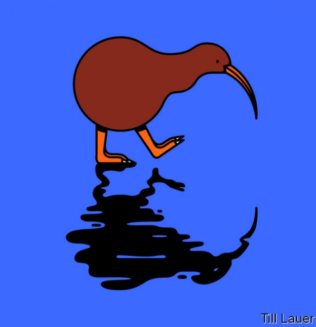

###### Banyan

# The Christchurch massacre has challenged New Zealanders’ self-image 

##### Is their country as tolerant as they thought? 

 

> Mar 23rd 2019 

“THIS ISN’T New Zealand” has become a national refrain. After a white supremacist’s attack on mosques in Christchurch, a shocked country is mourning the 50 worshippers he killed. Condolences are scrawled in chalk on pavements. White New Zealanders pull Muslim immigrants aside to apologise and Maoris dance hakas for the dead. Thousands have gathered for vigils. Florists have run out of stock. As for the prime minister, Jacinda Ardern, she has displayed leadership and compassion. Wearing a Muslim headscarf, she stresses that the whole country is on the side of the victims (many immigrants, some refugees) and their families. “They,” she says, “are us.” The perpetrator of the violence most assuredly is not. 

For under attack too was New Zealand’s own image as a uniquely open and tolerant place. To many Kiwis it came as a relief that the alleged assailant grew up in that raw-edged place across the Tasman Sea, Australia. Ms Ardern has suggested that New Zealand was a target precisely because of its inclusiveness. 

This image matters hugely to New Zealanders, and many newcomers quickly adopt it. One of the survivors in Christchurch was Yasif Hussein, who immigrated from Fiji four years ago. He describes lying on the ground, looking straight up into the assailant’s face and thinking his end had come. Yet, having somehow survived, Mr Hussein says New Zealand has always “felt like my own country”. 

Like all national narratives, New Zealand’s liberal one has a founding myth: the Treaty of Waitangi. Signed in 1840 with over 500 Maori chiefs, it established British sovereignty over New Zealand. Crucially, Britain acknowledged the landholdings of New Zealand’s original, Polynesian settlers and guaranteed them rights as British subjects. Since the 1970s a tribunal has served to provide compensation for the many subsequent breaches of the treaty. 

The treatment of Maoris stands in contrast to Australia’s towards Aboriginals, who were once hunted like vermin. As recently as the 1970s children deemed to be mixed-race were forcibly removed into care. The first official apology to Australia’s indigenous peoples came only in 2008. There has yet to be much compensation for historic wrongs beyond the return of some traditional Aboriginal land. 

The treatment of Maoris, some say, gives a leg-up to other minorities too. Yet since the massacre, New Zealand’s self-image has come in for scrutiny. There are plenty of blemishes. After all, racial ideology long served as the basis of immigration policy, keeping non-whites out. As for the Maoris, ravaged by discrimination and imported disease, the task of the white settlers was, as one of them put it, to “smooth the pillow of the dying race”. 

These days you only have to visit run-down neighbourhoods inhabited by Maoris and other Pacific islanders to know that race relations are far from perfect. They are hotspots of unemployment, alcoholism and domestic violence. Many white New Zealanders blithely pass their lives in a parallel world. 

Taika Waititi, a filmmaker and comedian, claimed last year that New Zealand remains “racist as fuck”. Resentment over sharp increases in immigration, and even of Maori progress where it has taken place, has caused some among the white majority to think of themselves as victims. Not long ago Christchurch was notorious for its race-baiting skinheads. Today the radio waves are full of American-style shock jocks stoking resentment. Ms Ardern herself campaigned on curbing the immigration that was widely believed to be fuelling sharp rises in property prices. Michael Grimshaw of the University of Canterbury worries that if Brenton Tarrant, the man accused of the massacre, gets to air his grievances in court, “that is how you get your ‘Uncle Barry’ listening.” And Uncle Barry may not agree with all of his complaints, but he might agree with some of them. 

No country is all sweetness and light. What matters is the direction of travel. In America demagogues portray any trifling curb on gun ownership as a plot against whites. In New Zealand Ms Ardern has swung even the political right behind tighter gun control. In Australia a hard-right senator implied that the Christchurch massacre was the fault of Muslims, who should not have migrated to New Zealand in the first place. In New Zealand’s political discourse, such a comment is nearly inconceivable. If the massacre has put New Zealanders at a crossroads, they still look to be walking towards their image of themselves. 

-- 

 单词注释:

1.banyan['bænjәn]:n. 印度榕树 [医] 榕树, 孟加拉榕 

2.Christchurch['kraist-tʃә:tʃ]:n. 克赖斯特彻奇 

3.massacre['mæsәkә]:n. 大屠杀 vt. 大屠杀, 残杀 

4.tolerant['tɒlәrәnt]:a. 宽容的, 容忍的, (对冷、热)能耐的 [医] 能耐受的 

5.zealand['zi:lәnd]:n. 西兰岛（丹麦最大的岛） 

6.refrain[ri'frein]:n. 重复的话, 叠句, 副歌 vi. 节制, 避免, 克制 

7.mosque[mɒsk]:n. 清真寺 

8.worshipper[]:n. 礼拜者, 崇拜者, 爱慕者 

9.condolence[kәn'dәulәns]:n. 哀悼, 吊唁 

10.scrawl[skrɒ:l]:vt. 潦草地写 vi. 乱写 n. 潦草的笔迹 

11.zealander[]:n. 西兰岛（丹麦最大的岛） (Zealand的变形) 

12.Muslim['mjzlim; (?@) 'mʌzlem]:n. 伊斯兰教, 伊斯兰教教徒 

13.apologise[ә'pɔlәdʒaiz]:vi. 道歉（等于apologize） 

14.Maori['mauri]:n. 毛利人, 毛利语 a. 毛利人的, 毛利语的 

15.haka['hɒkɒ]:n. 哈卡舞 

16.vigil['vidʒil]:n. 警戒, 监视, 守夜 [医] 不眠, 警醒 

17.florist['flɒrist]:n. 花匠, 花商, 花卉研究者 

18.jacinda[]:n. 【女名】女子名 [网络] 杰辛达；美丽的；嘉辛达 

19.compassion[kәm'pæʃәn]:n. 同情, 怜悯 

20.headscarf[ˈhedskɑ:f]:n. 女人的头巾 

21.refugee[.refju'dʒi:]:n. 难民, 流亡者 [法] 避难者, 流亡者, 难民 

22.perpetrator[]:n. 作恶者, 犯罪者, 行凶者 [法] 作恶者, 行凶者, 犯罪者 

23.assuredly[ә'ʃuәridli]:adv. 确实地, 无疑地, 确信地 

24.uniquely[]:adv. 独特地；珍奇地 

25.kiwi['ki:wi:]:n. 鹬鸵, 地勤人员, 新西兰人 

26.allege[ә'ledʒ]:vt. 宣称, 主张, 提出, 断言 [法] 断言, 指称, 指证 

27.assailant[ә'seilәnt]:n. 攻击者 [法] 攻击者, 行凶者 

28.Tasman['tæzmәn]:Sea 塔斯曼海(在澳大利亚和新西兰之间) 

29.precisely[pri'saisli]:adv. 精确地, 明确地, 刻板地, 拘泥地, 正好, 恰恰, 对, 正是如此, 确实如此, 不错 

30.inclusiveness[]:n. 包容性 

31.hugely['hju:dʒli]:adv. 巨大地, 非常地 

32.newcomer[nju:'kʌmә]:n. 新来者 

33.quickly['kwikli]:adv. 很快地 

34.survivor[sә'vaivә]:n. 生还者, 幸存者 [法] 生还者, 生存者, 辛存者 

35.Hussein[]:n. 侯赛因（姓氏） 

36.Fiji[fi:'dʒi:, 'fi:dʒi:]:n. 斐济(西太平洋), 斐济语, 斐济人 

37.alway['ɔ:lwei]:adv. 永远；总是（等于always） 

38.narrative['nærәtiv]:n. 叙述, 故事 a. 叙述的, 叙事的, 故事体的 

39.waitangi[]: [地名] [新西兰] 怀唐伊 

40.Maori['mauri]:n. 毛利人, 毛利语 a. 毛利人的, 毛利语的 

41.sovereignty['sɒvrәnti]:n. 主权, 独立国 [法] 主权, 主权国家, 统治权 

42.crucially[ˈkru:ʃɪəlɪ]:adv. 至关重要地, 关键地 

43.landholding['lændhәuldiŋ]:a. 土地所有的 

44.Polynesian[.pɒli'ni:ʒiәn]:a. 波利尼西亚人的, 波利尼西亚的 n. 波利尼西亚人 

45.tribunal[trai'bju:nl]:n. 法庭, 法官席, 裁决 [法] 法庭, 裁判所, 裁判 

46.compensation[.kɒmpen'seiʃәn]:n. 补偿, 赔偿金, 工资 [医] 代偿(机能), 补偿 

47.breach[bri:tʃ]:n. 裂口, 违背, 破坏, 违反, 突破, 破裂 vt. 攻破, 突破 vi. 跳出水面 

48.aboriginal[.æbә'ridʒәnәl]:a. 原始的, 土著的 n. 土著居民, 土生生物 

49.vermin['vә:min]:n. 害虫, 歹徒 [医] 虫, 体外寄生虫(如蚤、臭虫、蚤等) 

50.deem[di:m]:v. 认为, 相信 

51.forcibly['fɒ:sәbli]:adv. 强制地, 用力地 

52.indigenous[in'didʒinәs]:a. 本土的, 国产的, 固有的 [医] 原产的, 本土的 

53.historic[hi'stɒrik]:a. 历史上著名的, 有历史性的 

54.aboriginal[.æbә'ridʒәnәl]:a. 原始的, 土著的 n. 土著居民, 土生生物 

55.scrutiny['skru:tini]:n. 细看, 仔细检查, 监视, 选票检查 [经] 复查, 评核, 仔细检查 

56.blemish['blemiʃ]:n. 污点, 缺点 vt. 弄脏, 玷污, 损害 

57.ideology[.aidi'ɒlәdʒi]:n. 思想体系, 意识形态, 观念学, 空论 [医] 观念学, 观念形态 

58.ravage['rævidʒ]:n. 破坏, 蹂躏 v. 毁坏, 破坏, 掠夺 

59.islander['ailәndә]:n. 岛民 

60.hotspot[]:n. 热区；热点 

61.alcoholism['ælkәhɒlizәm]:n. 酗酒, 酒精中毒 [化] 酒中毒 

62.blithely[]:adv. 欢乐的, 轻率的, 无忧无虑的, 愉快的 

63.filmmaker['film,meikә(r)]:n. 电影制作人 

64.comedian[kә'mi:djәn]:n. 喜剧演员 

65.racist['reisist]:n. 种族主义者 [法] 种族主义的, 种族歧视 

66.fuck[fʌk]:vt. 与...性交, 欺骗, 诅咒 vi. 性交 n. 性交, 些微, 杂种 interj. 他妈的, 混帐 

67.resentment[ri'zentmәnt]:n. 怨恨, 愤恨 

68.notorious[nәu'tɒ:riәs]:a. 声名狼藉的, 臭名昭著的, 众人皆知的 

69.skinhead['skinhed]:n. 理光头的男人 

70.jock[dʒɔk]:n. 苏格兰高原地方的士兵；[美俚]（大学）运动员；乔克（男子名） 

71.stoke[stәuk]:v. 司炉, (使)大吃 

72.resentment[ri'zentmәnt]:n. 怨恨, 愤恨 

73.curb[kә:b]:n. 抑制, 勒马绳, 边石 vt. 抑制, 束缚, 勒住 

74.michael['maikl]:n. 迈克尔（男子名） 

75.grimshaw[]: [人名] 格里姆肖; [地名] [加拿大] 格里姆肖 

76.canterbury['kæntәbәri]:n. 坎特伯雷(中世纪时宗教朝圣地) 

77.Brenton[]:布伦顿（人名） 

78.Tarrant[]:n. (Tarrant)人名；(英)塔兰特 

79.grievance['gri:vәns]:n. 委屈, 冤情, 苦况 [经] 不满(对雇用条件的) 

80.Barry['bæri]:n. 巴里（男子名） 

81.sweetness['swi:tnis]:n. 甜蜜, 芳香, 美妙 

82.demagogue['demәgɒg]:n. 煽动者 

83.portray[pɒ:'trei]:vt. 描绘, 描写, 描绘...的肖像 

84.senator['senәtә]:n. 参议员, (某些大学的)理事 [法] 参议员, 上议员 

85.Muslim['mjzlim; (?@) 'mʌzlem]:n. 伊斯兰教, 伊斯兰教教徒 

86.migrate['maigreit]:vi. 移动, 移往, 随季节而移居 [计] 迁移程序 

87.discourse['diskɒ:s]:n. 谈话, 演讲 vi. 谈话, 讲述 

88.inconceivable[.inkәn'si:vәbl]:a. 不能想象的, 想不到的, 难信的 

89.crossroad['krɒsrәud]:n. 交叉路, 岔道, 十字路口 

