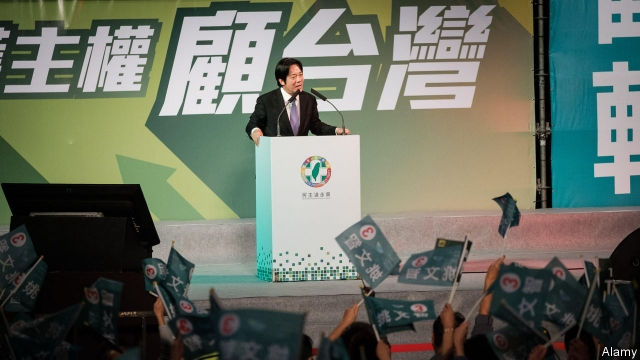

###### Splittists

# Tsai Ing-wen, Taiwan’s president, is challenged by a former underling 

##### No incumbent seeking re-election has had to fight a primary before 

 

> Mar 21st 2019 

AS TAIWAN’S FIRST female president, Tsai Ing-wen is a trailblazer. She is well-liked abroad for her reluctance to pick fights with China. But she is not popular at home. Recent polls put her approval rating below 30%. Her bid for re-election next year, already iffy, just got iffier. Lai Ching-te, her former prime minister, has declared that he will challenge Ms Tsai for the presidential nomination of the Democratic Progressive Party (DPP). It is the first time an incumbent president in Taiwan has been subjected to a primary. And the contest may anger China, since Mr Lai is a more vocal supporter than Ms Tsai of the idea that Taiwan should formally declare itself to be a distinct country from China—a move China says would be grounds for war.   

“Taiwan doesn’t want to be a second Hong Kong or Tibet,” declared Mr Lai as he registered for the primary this week, insinuating that Ms Tsai is not doing enough to ensure Taiwan’s independence. The DPP was thrashed in municipal elections in November by the Kuomintang (KMT), the main opposition party, which advocates warmer relations with China. Voters seemed disappointed that Ms Tsai’s efforts to stimulate the economy have had scant success. Growth is slowing. Wages have been stagnant for decades. 

Following the defeat in November, Ms Tsai stepped down as leader of the DPP. A month later Mr Lai, a former mayor of the southern city of Tainan, resigned as prime minister, spurning Ms Tsai’s entreaties for him to stay. The primary will involve the two candidates giving televised presentations of their platforms, after which the party conducts an opinion poll of a sample of the whole electorate. The more popular candidate wins the nomination. The results will be announced on April 17th. 

DPP activists had been panicking, as Ms Tsai has been trailing badly in the polls. They feared not only a further electoral setback, but one that would have put the government into the hands of a China-friendly leader just as China is pressing Taiwan to begin talks on unification. Some advocates of independence, fed up with Ms Tsai’s caution, are jubilant at Mr Lai’s announcement, both because they think Mr Lai has a better chance of winning and because they think he might be more assertive. 

Ms Tsai’s supporters, meanwhile, are arguing that the primary could split the party and are making agonised calls for unity, by which they seem to mean Mr Lai’s withdrawal. Chen Chi-mai, the deputy prime minister and a supporter of Ms Tsai, argued in a Facebook post that China’s growing assertiveness makes divisions within the party especially dangerous. “The 2020 election will determine whether Taiwan survives or is extinguished,” he said.  

Luckily for the DPP, the KMT also has no anointed candidate and its primary is still some months away. A former mayor of New Taipei City, Eric Chu, and a former speaker of parliament, Wang Jin-pyng, have both said they will run. The election will probably also feature an independent candidate, Ko Wen-je, the popular mayor of Taipei.   

 Inevitably, China will be front and centre in the campaign. The authorities across the Taiwan Strait probably revile Mr Lai even more than they do Ms Tsai. That might encourage them to ease the pressure on Taiwan a bit over the next few months. The Chinese government knows from experience that attempts to intimidate Taiwanese voters tend to backfire, prompting them to back the candidate most hostile to its cherished goal of reunification. 

-- 

 单词注释:

1.splittist[sp'lɪtɪst]: 分裂主义分子 

2.tsai[]:n. 蔡（姓氏） 

3.underling['ʌndәliŋ]:n. 部下, 下手, 下属 

4.incumbent[in'kʌmbәnt]:a. 现任的, 依靠的, 负有义务的 n. 领圣俸者, 在职者 

5.trailblazer['treil.bleizә]:n. 开路的人, 开拓者 

6.reluctance[ri'lʌktәns]:n. 不情愿, 勉强 [电] 磁阻 

7.iffy['ifi]:a. 富于偶然性的, 可怀疑的, 未确定的 

8.iffier[]:adj. 不确定的；有问题的 [网络] 可疑的；犹豫不决；精神强大的猪 

9.lai[lai]:abbr. 意大利航空公司（Linee Aeree Italiane） 

10.presidential[.prezi'denʃәl]:a. 总统制的, 总统的, 首长的, 统辖的 [法] 总统的, 议长的, 总经理的 

11.nomination[.nɒmi'neiʃәn]:n. 提名, 任命, 提名权 

12.DPP[]:[计] 数字并行处理机 [化] 微分脉冲极谱法 

13.taiwan['tai'wɑ:n]:n. 台湾 

14.vocal['vәukl]:a. 嗓音的, 声音的, 有声的, 歌唱的 n. 元音, 声乐作品 

15.supporter[sә'pɒ:tә]:n. 支持者, 后盾, 迫随者, 护身织物 [法] 支持者, 赡养者, 抚养者 

16.formally['fɒ:mәli]:adv. 正式地, 形式上 

17.hong[hɔŋ]:n. （中国、日本的）行, 商行 

18.kong[kɔŋ]:n. 含锡砾石下的无矿基岩；钢 

19.insinuate[in'sinjueit]:vt. 巴结, 暗示, 使滋长 vi. 旁敲侧击 

20.thrash[θræʃ]:vt. 打, 使逆行, 胜过, 推敲, 鞭打 vi. 打谷, 痛打, 剧烈扭动, 逆行 n. 打谷, (划水)鞭状动作 

21.municipal[mju:'nisipl]:a. 市政的, 自治区的, 内政的 [经] 市政的, 市的 

22.kuomintang['kwәumin'tæŋ]:n. (中国)国民党 

23.kmt[]:abbr. 中国国民党（Kuo Min Tang） 

24.opposition[.ɒpә'ziʃәn]:n. 反对, 敌对, 相反, 在野党 [医] 对生, 对向, 反抗, 反对症 

25.voter['vәutә]:n. 选民, 投票人 [法] 选民, 选举人, 投票人 

26.scant[skænt]:a. 不充分的, 不足的 vt. 减少, 吝啬, 限制, 藐视, 忽略 

27.stagnant['stægnәnt]:a. 不流动的, 停滞的, 不景气的, 萧条的, 污浊的, 迟钝的 [经] 萧条的 

28.Tainan['tai'næn,-'nɑ:n]:台南[台湾省] 

29.spurn[spә:n]:n. 踢开, 拒斥 vt. 踢开, 冷落, 践踏, 唾弃 vi. 藐视, 摒弃 

30.entreaty[in'tri:ti]:n. 恳求, 乞求 

31.electorate[i'lektәrit]:n. 选民, 有选举权者, 选区 [法] 选民, 选举团, 选区 

32.activist['æktivist]:n. 激进主义分子 

33.electoral[i'lektәrәl]:a. 选举人的, 选举的, (有关)选举的 [法] 选举的, 选举人的, 由选举人组成的 

34.setback['setbæk]:n. 挫折, 退步, 逆流 

35.jubilant['dʒu:bilәnt]:a. 欢呼的, 喜洋洋的 

36.assertive[ә'sә:tiv]:a. 武断的, 过分自信的 [法] 断言的 

37.agonise['æ^әnaiz]:v. 烦恼, 挣扎 

38.withdrawal[wið'drɒ:l]:n. 提款, 撤退, 退回, 撤消, 退隐, 戒毒过程 [医] 戒除, 脱瘾 

39.chen[]:n. 陈 

40.facebook[]:n. 脸谱网 

41.assertiveness[ə'sə:tivnis]:n. 魄力, 自信 

42.extinguish[ik'stiŋgwiʃ]:vt. 熄灭, 使消亡, 压制, 使减色 [医] 消灭 

43.luckily['lʌkili]:adv. 幸运地, 幸亏, 侥幸 

44.anoint[ә'nɒint]:vt. 涂油, 施以涂油礼 [医] 涂油膏 

45.taipei['tai'pei, -'bei]:n. 台北 

46.eric['erik]:abbr. 科教资源信息中心（Educational Resources Information Center）；电子遥控与独立控制（Electronic Remote and Independent Control） 

47.chu[]:abbr. 摄氏热单位（Centigrade Heat Unit） 

48.wang[]:n. 王（姓氏）；王安电脑公司 

49.KO['kei'әu]:vt. 击倒, 打倒 n. 击倒, 打倒 

50.revile[ri'vail]:v. 辱骂, 斥责 

51.taiwanese[,taiwɑ:'ni:z, -'ni:s]:a. 台湾人的；台湾的 

52.backfire[.bæk'faiә]:n. 逆火, 回火, 放火 vi. 放逆火, 预先放火, 发生意外 

53.cherish['tʃeriʃ]:vt. 珍爱, 怀有, 爱护 

54.reunification[,ri:ju:nifi'keiʃәn,ri:,ju:-]:n. 使重新统一, 使重新团结 

