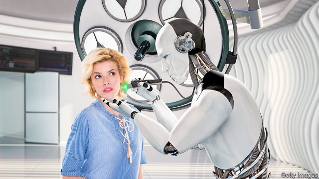

###### The AI will see you now

# A doctor’s hopes for digital medicine 

##### Artificial intelligence can never replace human doctors. Can it? 

 

> Mar 23rd 2019 

Deep Medicine: How Artificial Intelligence Can Make Healthcare Human Again. By Eric Topol.Basic Books; 400 pages; $17.99. 

FOR ALL the technological wonders of modern medicine, from gene-editing to fetal surgery, health care—with its fax machines and clipboards—is often stubbornly antiquated. This outdated era is slowly drawing to a close as, belatedly, the industry catches up with the artificial-intelligence (AI) revolution. And none too soon, argues Eric Topol, a cardiologist and enthusiast for digital medicine. 

Dr Topol’s vision of medicine’s future is optimistic. He thinks AI will be particularly useful for repetitive, error-prone tasks, such as sifting images, scrutinising heart traces for abnormalities or transcribing doctors’ words into patient records. It will be able to harness masses of data to work out optimal treatments (for both conditions and individuals), and improve workflows in hospitals. In short, AI is set to save time, lives and money. 

Much of this is hypothetical—but AI is already outperforming people in a variety of narrow jobs for which it has been trained. Eventually it may be able to diagnose and treat a wider range of diseases. Even then, Dr Topol thinks, humans would oversee the algorithms, rather than being replaced by them. 

The fear the author harbours is that AI will be used to deepen the assembly-line culture of modern medicine. If it confers a “gift of time” on doctors, he argues that this bonus should be used to prolong consultations, rather than simply speeding through them more efficiently. 

That is a fine idea, but as health swallows an ever-bigger share of national wealth, greater efficiency is exactly what is needed, at least so far as governments and insurers are concerned. Otherwise, rich societies may fail to cope with the needs of ageing and growing populations. An extra five minutes spent chatting with a patient is costly as well as valuable. The AI revolution will also empower managerial bean-counters, who will increasingly be able to calibrate and appraise every aspect of treatment. The autonomy of the doctor will inevitably be undermined, especially, perhaps, in public-health systems which are duty-bound to trim inessential costs. 

The Hippocratic Oath holds that there is an art to medicine as well as a science, and that “warmth, sympathy and understanding may outweigh the surgeon’s knife or the chemist’s drug”. That is not just a platitude: the patients of sympathetic physicians have been shown to fare better. As Dr Topol says, it is hard to imagine that a robot could really replace a human doctor. Yet as demand for health care outstrips the supply of human carers, the future may involve consultations on smartphones and measurements monitored by chatbots. The considerately warmed stethoscope, placed gently on a patient’s back, may become a relic of the past. 

In the end technology may even be able to solve the empathy deficit. Japanese engineers are working on robots that simulate human presence, or sonzai-kan. A machine could never truly develop the shared humanity that helps patients heal. That doesn’t mean it cannot be faked. 

-- 

 单词注释:

1.AI[ai]:[计] 附加信息, 人工智能 [化] 人工智能 

2.healthcare['helθkεә]:n. 医疗保健；卫生保健；健康护理, 健康服务 

3.eric['erik]:abbr. 科教资源信息中心（Educational Resources Information Center）；电子遥控与独立控制（Electronic Remote and Independent Control） 

4.technological[.teknә'lɒdʒikl]:a. 技术的 [经] 工艺的, 技术的 

5.fetal['fi:tәl]:a. 胎儿的, 胎的 [医] 胎的, 胎儿的 

6.stubbornly[]:adv. 倔强地；顽固地 

7.antiquate['æntikweit]:vt. 使古旧, 废弃 

8.outdate[.aut'deit]:vt. 使过时 

9.belatedly[bi'leitidli]:adv. 延迟地；延续地 

10.topol[]:abbr. topology 拓扑; 布局; 拓扑学; 局部解剖学 

11.cardiologist[]:n. 心脏病学家 [医] 心[脏]病学家 

12.enthusiast[in'θju:ziæst]:n. 热心家, 狂热者, 爱好者 

13.repetitive[ri'petitiv]:a. 重复的, 反复性的 

14.sift[sift]:vt. 筛, 过滤, 撒, 详查 vi. 筛, 被筛下, 精选 

15.scrutinise[]:vt.vi. 细看, 仔细检查, 审查, 细阅 [经] 详细检查, 细细地看 

16.abnormality[.æbnɒ:'mæliti]:n. 反常, 畸形, 变态 [化] 反常; 非正态性 

17.transcribe[træn'skraib]:vt. 抄写, 译, 意译, 录制, 改编 [计] 转录 

18.datum['deitәm]:n. 论据, 材料, 资料, 已知数 [医] 材料, 资料, 论据 

19.optimal['ɒptimәl]:a. 最佳的, 最理想的 [化] 最优的 

20.workflow['wɜ:kfləʊ]: 工作流程 

21.outperform[.autpә'fɔ:m]:vt. 胜过；做得比……好 

22.diagnose['daiәgnәuz]:v. 诊断 

23.oversee[.әuvә'si:]:vt. 向下看, 了望, 监督, 偷看到 [法] 监察, 监督, 俯瞰 

24.algorithm['ælgәriðm]:n. 算法 [计] 算法 

25.confer[kәn'fә:]:vt. 授予, 带来 vi. 协商 

26.prolong[prәu'lɒŋ]:vt. 延长, 拖延, 拖长 [化] 冷凝管 

27.consultation[.kɒnsәl'teiʃәn]:n. 请教, 咨询, 磋商会 [医] 会诊 

28.efficiently[i'fiʃәntli]:adv. 生效, 能胜任, 有能力, 效率高, 有效 

29.insurer[in'ʃuәrә]:n. 保险公司 [法] 保险人, 承保人, 保险公司 

30.empower[im'pauә]:vt. 授予权力, 允许, 使能够 [法] 授权, 准许, 转委 

31.managerial[.mænә'dʒiәriәl]:a. 管理的 [经] 管理上的, 经营上的 

32.calibrate['kælibreit]:vt. 测定口径, 校准, 使标准化, 调整 [化] 校准 

33.appraise[ә'preiz]:vt. 评价, 估价 [经] 评价, 鉴定 

34.autonomy[ɒ:'tɒnәmi]:n. 自治, 自治权 [医] 自主性 

35.inevitably[in'evitәbli]:adv. 不可避免地 

36.undermine[.ʌndә'main]:vt. 在...下面挖, 渐渐破坏, 暗地里破坏 [法] 暗中破坏, 以阴谋中伤伤害 

37.inessential[.ini'senʃәl]:a. 无关紧要的 n. 无关紧要的东西 

38.hippocratic[,hipəu'krætik]:a. （古希腊医师）希波克拉底的；希波克拉底医学派的 

39.oath[әuθ]:n. 誓约, 誓言, 咒骂 [法] 誓言, 誓约, 宣誓 

40.outweigh[.aut'wei]:vt. 比...重, 比...重要, 比...有价值 

41.outstrip[.aut'strip]:vt. 追过, 胜过, 凌驾 

42.carer['kεәrә]:n. 负责照顾（老人, 病人, 小孩）的人 

43.smartphones[]: 智能手机（smartphone的复数） 

44.chatbots[]:[网络] 自动化语音聊天程式 

45.considerately[kən'sɪdərətlɪ]:adv. 体贴地, 体谅地 

46.stethoscope['steθәskәup]:n. 听诊器 vt. 用听诊器诊断 

47.relic['relik]:n. 遗物, 遗迹, 纪念物, 遗风, 残留物 

48.empathy['empæθik]:n. 移情作用, 共鸣 [医] 移情, 神入 

49.deficit['defisit]:n. 赤字, 不足额 [医] 短缺 

50.simulate['simjuleit]:vt. 模拟, 假装, 模仿 [法] 伪装的, 模拟的; 假装的, 伪装的, 冒充 

51.humanity[hju:'mæniti]:n. 人性, 人类, 博爱 

52.cannot['kænɒt]:aux. 无法, 不能 

53.fake[feik]:n. 假货, 欺骗, 诡计 a. 假的 vt. 假造, 仿造 vi. 伪装 

