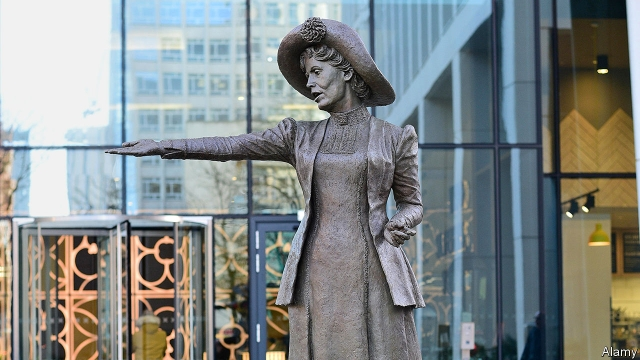

###### They could be heroes

# Britain is in the midst of a Victorian-style statue mania 

##### The sculptures look similar, but the faces and techniques have changed 

 

> Mar 21st 2019 

SHE ARRIVED by road, in pieces, on two low-loaders. She was welded together on a dock at Devonport naval base—the only nearby place that could accommodate her bulk. Then she was lifted onto a barge and pulled across Plymouth Sound. On March 22nd she was to be unveiled at her permanent home, in front of the Theatre Royal. She is a statue of an actress in a hooded top, rehearsing a part in “Othello”. At seven metres high, she is among the largest bronze sculptures in Britain. 

Later this year Plymouth will get another bronze statue. It will be smaller in size, although the woman it commemorates was a towering historical figure—Nancy Astor, the first female MP to sit in the House of Commons. She will stand on a plinth in the Hoe, a spectacular lump of rock overlooking the harbour. The Hoe already has a Victorian statue of the explorer Francis Drake and several memorials to the men and women who died in Britain’s wars. But Astor’s effigy will be the first to be placed in that glorious location for three decades. 

As American cities pull down statues, usually of Confederate leaders, British cities are quickly putting them up. The past seven months have seen new statues of Emily Wilding Davison, Emmeline Pankhurst (pictured) and Annie Kenney (all suffragettes); Rudyard Kipling, a poet and novelist; and a boy standing on a tree, representing the trauma of war. Two statues of Wilfred Owen, the war poet, have been erected in north-west England. Bronzes of the politician Margaret Thatcher and the comedian Victoria Wood will go up soon. “In the past two or three years we’ve been very busy,” says Chris Jones of Castle Fine Arts Foundry, which cast Plymouth’s giant actress and both of the Wilfred Owens. 

The Victorians suffered from statue mania. They filled central London with them: “London’s Immortals”, a book published in 1989, estimated that a dozen were unveiled per decade in the second half of the 19th century, up from one per decade in the 18th century. Many memorials were built after the first world war. Then came a long slump. Although lots of sculptures went up in British towns after the second world war, they were often abstract (the artists Barbara Hepworth and Henry Moore were especially popular) or depicted animals. Many second-world-war memorials are simply first-world-war memorials with added names. 

Although nobody is keeping a precise tally, the contemporary craze for bronze statues seems to at least equal the Victorian one numerically. It is also close to an artistic match. Today, as in the late 19th century, many of the new sculptures are detailed and realistic, depicting people in the clothes they actually wore. Hayley Gibbs, the artist chosen to create the statue of Astor, will portray the MP in her “Parliamentary uniform” of long skirt, jacket, wide-collared shirt and fabulous hat. A statue of the suffragist leader Millicent Fawcett, unveiled in London last year, faithfully reproduces one of her brooches and the crow’s feet around her eyes. 

Why is this old art form so in demand? One answer is that the British are rushing to redress an imbalance. “There’s an appetite for rectifying the lack of women,” observes Hazel Reeves, who created the statue of Pankhurst in Manchester. Ms Reeves has also been commissioned to make one of Mary Anning, a palaeontologist denied her due by Victorian men, to go near her home in Dorset. Last year was the centenary of the 1918 Parliament Act, which gave some women the right to vote—hence all the statues of suffragettes and suffragists. 

Yet neither the sex imbalance nor the anniversary of women’s suffrage quite explains the bronze mania. The lack of statues of women has been obvious for years: “London’s Immortals” complains bitterly about it. Julie Gottlieb, a historian at Sheffield University, notes that the 21st and 50th anniversaries of women’s suffrage were widely commemorated in speeches, academic seminars and postage stamps. No statues arose, however. 

One reason for the rash of statues is that technology has made it easier to petition and raise money for them. The campaign for a statue of Astor in Plymouth was run largely by Alexis Bowater, a media consultant. She lobbied on Facebook, Instagram and Twitter and collected donations on Crowdfunder, an online platform. Caroline Criado-Perez, a feminist campaigner, created an online petition for a suffragette statue on her phone, while out running with her dog. 

Technology can help the sculptors, too. The process of creating bronzes begins with a life-size model. Some artists, including Ms Gibbs and Ms Reeves, make those the traditional way, by creating a kind of metal stick figure which they wrap in wire and modelling clay. (This clay model is then turned into a wax image, from which a ceramic mould is made for the bronze.) But parts of the model for the statue of Fawcett were 3D printed. The sculptor of Plymouth’s giant actress sent digital files of the shape to a workshop hundreds of miles away. The workshop, Bakers Patterns, then instructed a machine to carve the model out of foam. 

Another explanation for the boom has to do with where the statues are going up. Erecting one near the Houses of Parliament or Buckingham Palace—the most prestigious locations in England—has become almost impossible. Westminster council has declared those places to be “monument saturation zones” in which proposed statues are rejected by default. Last year it decided that there was not even room for a likeness of Thatcher. 

With space scarce in central London, statues are being pushed out to smaller cities and towns. Local politicians and officials, whose budgets have not recovered from the financial crisis, seize on them as an economical way of (they hope) attracting attention and tourists. “It sends a powerful message for not a lot of money,” reckons Mr Jones. Thatcher’s statue, rejected by Westminster, will go up in Grantham, the town where she was born. Victorian Britons built monuments to national heroes. Today all heroes are local. 

-- 

 单词注释:

1.mania['meiniә]:n. 狂躁, 热衷, 狂热 [医] 躁狂, 狂 

2.Devonport['devən,pɔ:t]:n. 德文波特（港口城市, 位于奥克兰市北岸） 

3.barge[bɑ:dʒ]:n. 驳船 vt. 用船运输 vi. 蹒跚, 闯入 

4.plymouth['plimәθ]:n. 普利茅斯（英国一座城市） 

5.unveil[.ʌn'veil]:vt. 揭开, 揭幕, 除去...的面纱 vi. 显露, 除去面纱 

6.hood[hud]:n. 头巾, 兜帽, 覆盖, 强盗 vt. 罩上, 覆盖 

7.rehearse[ri'hә:s]:vt. 预演, 排演, 使熟练掌握, 练习, 复述 vi. 排练, 练习, 演习 

8.Othello[әu'θelәu]:n. 奥赛罗 

9.commemorate[kә'memәreit]:vt. 纪念 

10.Astor['æstə]:n. 阿斯特（男子名） abbr. 反潜鱼雷（antisubmarine torpedo） 

11.MP[]:国会议员, 下院议员 [计] 宏处理程序, 维护程序, 线性规划, 微程序, 多处理器 

12.plinth[plinθ]:n. 底座, 基脚, 柱基, 勒脚 

13.hoe[hәu]:n. 锄头 v. 用锄耕地, 锄 

14.spectacular[spek'tækjulә]:a. 公开展示的, 惊人的, 壮观的 n. 奇观, 惊人之举, 展览物 

15.Victorian[vik'tɔ:riәn]:a. 英国维多利亚女王时代的, 笃信宗教的, 讲究体面的 n. 维多利亚女王时代的英国人 

16.franci[]:[网络] 弗朗西；法赛纳；法奇 

17.drake[dreik]:n. 公鸭, 蜉蝣类 

18.effigy['efidʒi]:n. 肖像, 雕像 

19.confederate[kәn'fedәrit]:n. 同盟者, 同盟国 a. 同盟的, 联合的 v. (使)联盟, (使)联合 

20.quickly['kwikli]:adv. 很快地 

21.emily['emәli]:n. 埃米莉（女子名） 

22.wilding['waildiŋ]:n. 野生植物, 野生苹果树, 野生苹果 

23.Davison[]:n. 戴维森（姓）；戴维森（美国地名） 

24.Emmeline['emili:n, -lain]:n. 埃米琳(Amelia的昵称)(f.) 

25.Pankhurst['pæŋkhә:st]:潘克赫斯特(姓氏) 

26.annie['æni]:n. 安妮（女子名） 

27.kenney[]: [人名] [苏格兰人、爱尔兰人姓氏] 肯尼 Kenny的变体; [地名] [美国] 肯尼 

28.suffragette[.sʌfrә'dʒet]:n. 妇女参政权论者 

29.Rudyard[]:拉迪亚德 

30.kipling['kipliŋ]:n. 吉卜林（姓氏）；吉卜林（英国作家, 1865-1936, 1907年获诺贝尔文学奖） 

31.trauma['trɒ:mә]:n. 外伤, 损伤 [医] 创伤, 外伤 

32.wilfred['wilfrid]:n. 威尔弗雷德（男子名） 

33.owen['әuin]:n. 欧文（男子名） 

34.margaret['mɑ:^әrit]:n. 玛格利特（女子名） 

35.thatcher[]:n. 盖屋顶者 

36.comedian[kә'mi:djәn]:n. 喜剧演员 

37.victoria[vik'tɔ:riә]:n. 维多利亚（女子名） 

38.chris[kris]:n. 克里斯（男子名）；克莉丝（女子名） 

39.jones[dʒәunz]:n. 琼斯（姓氏） 

40.foundry['faundri]:n. 铸造, 铸造厂, 铸造类 [机] 铸造厂, 铸造 

41.owen['әuin]:n. 欧文（男子名） 

42.Victorian[vik'tɔ:riәn]:a. 英国维多利亚女王时代的, 笃信宗教的, 讲究体面的 n. 维多利亚女王时代的英国人 

43.immortal[i'mɒ:tәl]:n. 不朽人物, 神仙 a. 永远的, 不死的, 长久的 

44.slump[slʌmp]:n. 暴跌, 垂头弯腰的姿态 vi. 猛然掉落, 陷入, 衰落(经济等) 

45.barbara['bɑ:bәrә]:n. 芭芭拉（女子名） 

46.Hepworth[]:n. (Hepworth)人名；(英)赫普沃思 

47.henry['henri]:n. 亨利 [医] 亨[利](电感应单位) 

48.moore['muә]:n. 摩尔（男子名） 

49.depict[di'pikt]:vt. 描述, 描写 

50.tally['tæli]:n. 符木, 记账, 得分, 比分, 计数器, 标签, 符合, 对应物 vt. 记录, 点数, 计算, 加标签于, 使符合 vi. 记帐, 符合, 吻合, 记分 [计] 计数 

51.craze[kreiz]:n. 狂热, 大流行 v. (使)发狂, (使)开裂 

52.numerically[]:adv. 数字, 数值, 用数字表示 

53.realistic[riә'listik]:a. 现实的, 逼真的, 现实主义的, 实在论的 

54.Hayley['heili]:n. 海莉(f.) 

55.gibbs[^ibz]:n. 吉布斯（姓氏） 

56.portray[pɒ:'trei]:vt. 描绘, 描写, 描绘...的肖像 

57.parliamentary[.pɑ:lә'mentәri]:a. 国会的, 议会的, 议会制度的 

58.fabulous['fæbjulәs]:a. 传说的, 寓言般的, 难以置信的 

59.suffragist['sʌfrәdʒist]:n. 参政权扩大论者, 妇女参政权论者 

60.Millicent['milisnt]:n. 米利森特（女子名） 

61.Fawcett[]:n. 福西特（男子名） 

62.faithfully['feiθfuli]:adv. 忠实地, 诚心诚意地, 深信着地 

63.brooch[brәutʃ]:n. 胸针, 领针 

64.redress[ri'dres]:n. 赔偿, 补救, 矫正 vt. 纠正, 赔偿, 救济 

65.imbalance[im'bælәns]:n. 不平衡, 不均衡 [医] 不平衡, 失调 

66.rectify['rektifai]:vt. 订正, 矫正, 改正, 调正, 校正, 精馏, 整流 [化] 精馏 

67.hazel['heizl]:n. 榛子, 榛树, 淡褐色 a. 榛树的, 淡褐色的 

68.reeve[ri:v]:n. 地方长官 v. 穿(绳索), 穿过 

69.Manchester['mæntʃestә]:n. 曼彻斯特 

70.mary['meәri]:n. 玛丽（女子名） 

71.anning[]:n. 安宁 

72.palaeontologist[]: 古生物学家；化石学家 

73.dorset['dɔ:sit]:n. 多塞特（人名）；多尔塞特棉粗平布 

74.centenary[sen'ti:nәri]:n. 一百年 a. 一百年的 

75.suffrage['sʌfridʒ]:n. 投票, 选举权, 参政权, 代祷 [法] 选举权, 投票权, 参政权 

76.julie[]:n. 朱莉（女子名） 

77.Gottlieb[]:戈特利布（人名） 

78.historian[hi'stɒ:riәn]:n. 历史学家, 记事者 

79.sheffield['ʃefi:ld]:n. 谢菲尔德（英国城市） 

80.rash[ræʃ]:a. 轻率的, 匆忙的, 鲁莽的 n. 皮疹 

81.petition[pi'tiʃәn]:n. 请愿, 诉状, 陈情书, 申请, 祈求, 祷文 v. 正式请求, 恳求, 请愿 

82.alexi[]:亚历克西（男子名） 

83.Bowater[]:n. 宝华特（美国一家公司名） 

84.lobby['lɒbi]:n. 大厅, 休息室, 游说议员者 vi. 游说议员, 游说 vt. 游说 

85.facebook[]:n. 脸谱网 

86.Instagram[]:一款图片分享应用 

87.twitter['twitә]:n. 啁啾, 唧唧喳喳声 vi. 啭, 啁啾, 颤抖 vt. 嘁嘁喳喳地讲, 抖动 

88.donation[dәu'neiʃәn]:n. 捐赠物, 捐款, 捐赠 [经] 赠品, 捐款, 捐赠 

89.crowdfunder[]:众筹者 

90.online[]:[计] 联机 

91.caroline['kærәlaiŋ]:n. 凯若琳（女子名） 

92.feminist['feminist]:n. 男女平等主义者 

93.campaigner[kæm'peinә]:n. 从军者, 老兵, 竞选者 

94.sculptor['skʌlptә]:n. 雕刻家 

95.ceramic[si'ræmik]:a. 陶瓷的 n. 陶瓷制品 

96.baker['beikә]:n. 面包师 [医] 烤箱(骨科用) 

97.foam[fәum]:n. 泡沫, 水沫, 泡沫材料 vi. 起泡沫, 吐白沫 vt. 使起泡沫 

98.Buckingham['bʌkiŋәm]:白金汉郡[英国英格兰郡名] 

99.prestigious[pre'stidʒiәs]:a. 享有声望的 

100.Westminster['westminstә]:n. 威斯敏斯特 

101.saturation[.sætʃә'reiʃәn]:n. 饱和, 渗透, 浸透, 色饱和度 [计] 饱和度 

102.default[di'fɒ:lt]:n. 违约, 不履行责任, 缺席, 默认值 v. 疏怠职责, 缺席, 拖欠, 默认 [计] 默认; 默认值; 缺省值 

103.likeness['laiknis]:n. 相象, 相似物, 样子 

104.reckon['rekәn]:vt. 计算, 总计, 估计, 认为, 猜想 vi. 数, 计算, 估计, 依赖, 料想 

105.Grantham['^rænθәm]:格兰瑟姆(姓氏) 

106.Briton['britәn]:n. 大不列颠人, 英国人 

