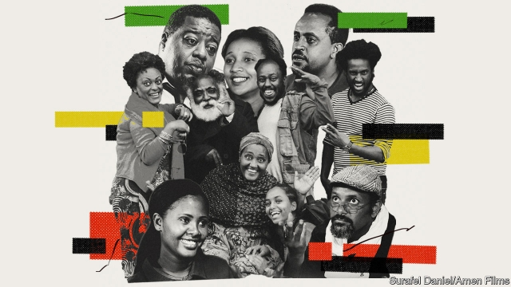

###### Wax and gold

# Satire is flourishing in Ethiopia 

##### The political climate has become more permissive—up to a point 

 

> Mar 21st 2019 

AYALKIBET, A PORTLY man in a garish white suit, is taking an oath. Hand raised, expression sombre, he reads a pledge to administer his café wisely. Four colleagues nod in approval. “But only for a month,” prompts one, following the text as he recites it. Ayalkibet skips over that proviso; his colleagues look up in alarm. So begins a recent episode of “Min Litazez?” (“How can I help you?”), a hit Ethiopian sitcom, in which the temporary manager schemes to extend his time in office. 

Who might this represent? Not, surely, Ethiopia’s new prime minister, Abiy Ahmed, who has convulsed the country’s politics by promising free elections next year and to step down if he loses. And, indeed, “Min Litazez?” is too clever for such clunky comparisons. But the audience is invited to draw their own, and many viewers have seen a reflection of Abiy in the protagonist. In previous seasons there was no doubt that Ayalkibet—then a petty tyrant of the workplace—stood in for the ruling party’s authoritarian old guard, whom Abiy shoved aside last March. Now, as Ethiopians acclimatise to a more gentle leadership, the character has been transformed. No longer a dictator, he is a well-meaning but pompous honcho with a weakness for the limelight. 

“Min Litazez?” is revolutionary, in an understated way. Not only does it lampoon Ethiopia’s leaders; it does so on a national channel owned by the ruling party. “We’ve never had anything like this,” says Elias Wondimu, an intellectual who made a guest appearance last year. The show’s popularity, and the imitations it has spawned, illustrate how subversive comedy is tiptoeing into the Ethiopian mainstream, upturning decades, even centuries, of cultural norms. Amid the laughs, the high-jinks offer a glimpse into the psyche of a conservative society loosening up fast. 

Until 1974 Ethiopia was an imperial monarchy. Next came a Marxist junta known as the Derg, and then, after 1991, the iron-fisted rule of the Ethiopian People’s Revolutionary Democratic Front. Each regime upheld an absolutist conception of power that left little room for public dissent, least of all satire. Under the Derg this meant a total ban on the free press. The constitution of 1994 theoretically prohibited censorship, but it continued in practice. Until last year the government would insist on cuts to films, TV shows and plays—or ban them altogether. 

The flipside of this draconian approach was a sophisticated culture of concealment, in which resistance was disguised as obedience. “You bow in front and fart behind”, as a local proverb has it. In Amharic, the most widespread language, this is known as samna—warq, or “wax and gold”: the studied use of words for ambiguous purposes. For centuries poets and azmaris, the bards and original satirists of highland Ethiopia, celebrated the glory of feudal overlords in songs that shrewdly hid their true meaning. “The more repressive the government was, the more vocal the oral satirists became,” says Tigab Bezie of Bahir Dar University. In diluted form, the technique still persists in everyday humour. “We’ve developed a keen sense of self-censorship,” says Elias. “You use wax-and-gold strategies to save yourself.” 

But the subterfuge has gradually become less necessary. After disputed elections triggered mass protests and a fierce crackdown in 2005, a CD of jokes making fun of the then-prime minister, Meles Zenawi, became an underground sensation. The government quickly pulled “Repressed Jokes”, as the recording was known, from the market. Since then dissident humour has migrated—and flourished—online. There is a booming industry of political memes and what Engdawork Endrias, an Ethiopian literary scholar, calls “informal essays”: writings, often posted on Facebook, which can be savagely satirical. YouTube offers a platform for risqué sketch shows such as “Fugera News” (though that programme, now discontinued, was made abroad and its presenter hid his identity). 

Now such material is making the leap to television. “Yaz Leqeq” (“Temperamental”), a sketch show that aired on a satellite channel last autumn, offered impersonations of prominent politicians (including the prime minister). New sitcoms tackle current affairs with increased daring, while some older ones, such as “Betoch” (“Families”), are tentatively following suit. In January Eshetu Melese, a stand-up comedian, performed his hour-long show about torture under Abiy’s predecessors on television. He says he has since been approached by several producers keen to bring a version of “The Daily Show” to Ethiopian audiences. 

These innovations share some common themes. The programmes tend to be self-consciously didactic. In “Yeemama Bet” (“Mama’s House”), a sitcom set in a traditional drinking den, the six characters, who represent various ethnic backgrounds, come together at the end of each episode and resolve their differences. So do those in “Aleme” (“My World”), which is set in a guesthouse. Eshetu says that during his stand-up he explains the political messages at the end of each joke, pointing out, for example, that Ethiopia needs a proper human-rights commission. 

In their open political boldness, all these innovations follow in the footsteps of Bereket Belayneh, a playwright whose sensationally popular one-man show, “Eyayu Fungus”—first staged three years ago and soon to air on television—made fun of low-level officials as well as Ethiopians themselves. His protagonist, a madman, excoriates the audience for their failures, moral and otherwise. The new trend is “not about entertainment”, says Behailu Wassie, the director of “Min Litazez?” “The intention is to get a better country.” 

The hope is that humour can act as a tonic for long-standing ethnic tensions that have persisted, even worsened, since Abiy’s arrival in office. Surafel Daniel, director of “Yeemama Bet”, says its angriest critics are those who wrongly perceive a gag to be made at the expense of a particular ethnicity. With time, he hopes, audiences may become less sensitive. Abel Asrat, a humorist and commentator, is more upbeat. “I see different ethnicities laughing at the same joke,” he says. 

Leaders, too, may learn to take a joke, though this may take a while. At any rate, most people remain wary of mocking Abiy directly. Last year “Min Litazez?” was briefly suspended, reputedly for going too far. “Yeemama Bet” has begun to identify political leaders by name, though not too critically. “Back in the day it would be a suicide mission,” says Surafel, the director. Caustic Western-style satire, in which even a leader’s appearance is gag fodder, is still unthinkable. One day, perhaps. “I want to make jokes about Abiy and I want it to be aired on government TV,” says Eshetu. “That’s political comedy, right?” 

-- 

 单词注释:

1.satire['sætaiә]:n. 讽刺文学, 讽刺 

2.Ethiopia[.i:θi'әupiә]:n. 埃塞俄比亚 

3.portly['pɒ:tli]:a. 肥胖的, 魁伟的, 庄重的 

4.garish['gєәriʃ]:a. 穿着花哨的, 炫耀的, 过分装饰的 

5.oath[әuθ]:n. 誓约, 誓言, 咒骂 [法] 誓言, 誓约, 宣誓 

6.sombre['sɔmbә(r)]:a. 昏暗的, 阴沉的, 阴暗的, 忧郁的, 暗淡的, 浅黑的 

7.pledge[pledʒ]:n. 诺言, 保证, 誓言, 抵押, 信物, 保人, 祝愿 vt. 许诺, 保证, 使发誓, 抵押, 典当, 举杯祝...健康 

8.administer[әd'ministә]:vt. 管理, 料理, 执行 vi. 执行遗产管理人的职责, 给予帮助 

9.wisely['waizli]:adv. 聪明地, 精明地 

10.proviso[prә'vaizәu]:n. 附文, 附带条件, 限制性条款 [经] 合同中的限制条款, 条件 

11.min[]:abbr. 部长（Minister）；部（Ministry） 

12.Ethiopian[.i:θi'әupiәn]:a. 埃塞俄比亚的 n. 埃塞俄比亚人 

13.sitcom['sitkɔm]:abbr. 情景喜剧（situation comedy） 

14.ahmed[]:n. 艾哈迈德（男子名） 

15.convulse[kәn'vʌls]:vt. 使震动, 使震撼, 使抽搐 

16.politic['pɒlitik]:a. 精明的, 明智的, 策略的 

17.clunky[ˈklʌŋki]:a. 粗笨的；笨重的 

18.protagonist[prәu'tægәnist]:n. 主人公, 主角, 领导者 

19.petty['peti]:a. 琐碎的, 小规模的, 小气的, 委琐的 [经] 小额的, 微小的, 小规模的 

20.tyrant['taiәrәnt]:n. 暴君 [法] 专制君主, 暴君, 压制他人者 

21.authoritarian[ɒ:.θɒri'tєәriәn]:a. 独裁的, 独裁主义的 

22.shove[ʃʌv]:n. 推, 挤 vt. 推挤, 猛推, 强使 vi. 推 

23.Ethiopian[.i:θi'әupiәn]:a. 埃塞俄比亚的 n. 埃塞俄比亚人 

24.acclimatise[ә'klaimәtaiz]:v. <主英>=acclimatize 

25.dictator['dikteitә]:n. 命令者, 独裁者 

26.pompous['pɒmpәs]:a. 爱炫耀的, 虚夸的, 盛大的 

27.honcho['hɒntʃәu]:n. 老板 

28.limelight['laimlait]:n. 石灰光, 石灰光灯, 以石灰光灯照射的舞台 vt. 使受到注目, 使显露头角 

29.understate[.ʌndә'steit]:v. 不完全地陈述, 保守地说, 有意轻描淡写 

30.lampoon[læm'pu:n]:n. 讽刺文 vt. 讽刺 

31.Elia['i:liә]:伊利亚(Charles Lamb的笔名) 

32.wondimu[]:[网络] 奇迹 

33.popularity[.pɒpju'læriti]:n. 名声, 受大众欢迎, 流行 

34.imitation[.imi'teiʃәn]:n. 模仿, 效法, 冒充, 赝品 [医] 模仿, 仿制, 仿制品 

35.spawn[spɒ:n]:n. (鱼)卵, 产物 vt. 产卵, 酿成, 大量生产 vi. 产卵, 大量生产 

36.subversive[sәb'vә:siv]:a. 从事颠覆的, 破坏性的 n. 破坏分子, 颠覆分子 

37.tiptoe['tiptәu]:n. 脚尖 vi. 用脚尖走 adv. 踮着脚 a. 踮着脚走的, 偷偷摸摸的 

38.mainstream['meinstri:m]:n. 主流 

39.upturn[ʌp'tә:n]:n. 情况好转, 向上趋势 v. (使)向上, 转朝上, 翻转 

40.cultural['kʌltʃәrәl]:a. 文化的, 教养的, 修养的 [医] 培养的 

41.norm[nɒ:m]:n. 基准, 模范, 标准, 准则, 平均数 [化] 定额 

42.amid[ә'mid]:prep. 在其间, 在其中 [经] 在...中 

43.psyche['psaiki]:n. 灵魂, 精神, 普赛克(希腊神话中人类灵魂的化身) [医] 精神, 心灵 

44.imperial[im'piәriәl]:a. 帝王的, 宗主国的, 至尊的, 壮丽的 n. 特等品 

45.monarchy['mɒnәki]:n. 君主政体, 君主国, 君主政治 [法] 君主政体, 君主制度, 君主国 

46.junta['dʒʌntә]:n. 以武力政变上台的(军)政府, 私党, 阴谋小集团, 政务会 

47.derg[]:abbr. decreasing 减少，削减，递减 

48.regime[rei'ʒi:m]:n. 政权, 当权期间, 政体, 社会制度, 体制, 情态 [医] 制度, 生活制度 

49.uphold[ʌp'hәuld]:vt. 支撑, 赞成, 鼓励, 举起, 坚持 [法] 确认, 赞成, 支持 

50.absolutist['æbsәlu:tist]:n. 专制主义者, 专制政体者, 绝对主义者 

51.conception[kɒn'sepʃәn]:n. 观念, 概念 [医] 妊娠, 受孕; 概念 

52.dissent[di'sent]:n. 异议 vi. 持异议, 不同意 

53.satire['sætaiә]:n. 讽刺文学, 讽刺 

54.theoretically[.θi:ә'retikli]:adv. 理论上, 理论地 

55.censorship['sensәʃip]:n. 检查制度 [医] 督察, 监察 

56.flipside[]:n. 另一面；反面 

57.draconian[drә'kәjniәn]:a. 严厉的, 残酷的 

58.sophisticate[sә'fistikeit]:n. 久经世故的人, 精于...之道的人 vt. 篡改, 曲解, 使变得世故, 掺合, 弄复杂 vi. 诡辩 

59.concealment[kәn'si:lmәnt]:n. 隐匿, 隐蔽, 躲藏 [经] 隐瞒, 匿报 

60.obedience[ә'bi:djәns]:n. 服从, 顺从, 忠实 [法] 服从, 顺从, 遵从 

61.fart[fɑ:t]:n. 屁 vi. 放屁 

62.proverb['prɒvә:b]:n. 谚语, 格言, 箴言 vt. 使众所周知, 用谚语表达 

63.Amharic[æm'hærik]:n. 阿姆哈拉语 

64.bard[bɑ:d]:n. 吟游诗人, 诗人 

65.satirist['sætәrist]:n. 讽刺作者, 爱挖苦的人 

66.highland['hailәnd]:n. 高地, 苏格兰高地 

67.feudal['fju:dәl]:a. 封建制度的, 封地的, 领地的 

68.overlord['әuvәlɒ:d]:n. 大君主, 最高君主, 霸主 [法] 霸权, 霸主地位, 封建君主 

69.shrewdly[]:adv. 精明干练地；机灵地；刁钻地 

70.repressive[ri'presiv]:a. 压抑的, 抑制的, 镇压的 

71.vocal['vәukl]:a. 嗓音的, 声音的, 有声的, 歌唱的 n. 元音, 声乐作品 

72.bahir[]:n. (Bahir)人名；(土)巴希尔 

73.dar[]:abbr. 美国革命女儿会（Daughters of the American Revolution） 

74.dilute[dai'lju:t]:vt. 冲淡, 稀释 a. 淡的, 稀释的 

75.subterfuge['sʌbtәfju:dʒ]:n. 遁辞, 借口, 托辞 [法] 遁词, 托词, 藉口 

76.les[lei]:abbr. 发射脱离系统（Launch Escape System） 

77.trigger['trigә]:n. 触发器, 扳机 vt. 触发, 发射, 引起 vi. 松开扳柄 [计] 切换开关 

78.crackdown['krækdaun]:n. 制裁, 镇压, 痛击 

79.mele['mele]:n. 夏威夷歌曲(或旋律) 

80.zenawi[]:[网络] 泽纳维 

81.sensation[sen'seiʃәn]:n. 感觉, 轰动 [医] 感觉 

82.quickly['kwikli]:adv. 很快地 

83.repress[ri'pres]:vt. 镇压, 抑制, 压制 vi. 压制 

84.dissident['disidәnt]:a. 意见不同的, 持不同政见的 n. 意见不同的人, 持不同政见者 

85.meme[mi:m]:n. 大脑模仿病毒；文化基因；弥母 

86.informal[in'fɒ:mәl]:a. 非正式的, 不拘礼的, 通俗的 [经] 非正式的, 日常使用的 

87.facebook[]:n. 脸谱网 

88.savagely[]:adv. 野蛮地；残忍地 

89.satirical[sә'tirik(ә)l]:a. 讽刺的, 讥讽的, 好挖苦的, 写讽刺作品的 

90.youtube[]:n. 视频网站（可以让用户免费上传、观赏、分享视频短片的热门视频共享网站） 

91.discontinue[.diskәn'tinju:]:vi. 中断, 终止, 停止 vt. 使中止 

92.presenter[pri'zentә]:n. 节目主持人, 奉献者, 提出者 [法] 告发者, 提出者, 推荐者 

93.yaz[]:abbr. Tofino;  British Columbia;  Canada 加拿大; 不列颠哥伦比亚省 

94.temperamental[.temprә'mentl]:a. 气质的, 性格的, 易兴奋的 

95.impersonation[im.pә:sә'neiʃәn]:n. 扮演, 装扮, 模仿 [计] 模仿 

96.tackle['tækl]:n. 工具, 复滑车, 滑车, 装备, 扭倒 vt. 固定, 处理, 抓住 vi. 扭倒 

97.tentatively['tentətɪvlɪ]:adv. 试验性地, 暂时地; 权; 聊且 

98.comedian[kә'mi:djәn]:n. 喜剧演员 

99.predecessor[.predi'sesә]:n. 前任, 先辈, 前身 [医] 初牙, 前辈, 祖先 

100.producer[prә'dju:sә]:n. 生产者, 制作者, 制作人 [化] 发生器; (炉煤气)发生炉; 制气炉; 生产者 

101.innovation[.inәu'veiʃәn]:n. 改革, 创新 [法] 创新, 改革, 刷新 

102.didactic[di'dæktik(әl), dai-]:a. 教训的, 说教的, 教导的, 教诲的 [医] 教导的 

103.den[den]:n. 兽穴, 洞穴 [法] 匪巢, 贼窝 

104.ethnic['eθnik]:a. 人种的, 种族的 [医] 人种的 

105.guesthouse['^esthajs]:n. 宾馆, 高级寄宿舍, 招待所 

106.boldness['boәldlinis]:n. 大胆, 勇敢, 冒失 [计] 醒目程度; 鲜明度 

107.playwright['pleirait]:n. 剧作家 

108.sensationally[]:耸人听闻地 

109.madman['mædmәn]:n. 疯子, 精神病患者 [法] 疯子, 狂人 

110.excoriate[ek'skɒ:rieit]:vt. 剥皮, 擦破皮肤, 严厉的责难 

111.tonic['tɒnik]:n. 补药, (音乐)主调音或基音 a. 滋补的, 声调的, 使精神振作的 

112.worsen['wә:sn]:vt. 使更坏, 使恶化 vi. 变得更坏, 恶化 

113.daniel['dænjәl]:n. 丹尼尔（男子名） 

114.wrongly[]:adv. 错误地, 不恰当地, 不正确地, 不正直地, 不公正地 

115.gag[gæg]:n. 箝口物, 箝制言论, 讨论终结 vt. 阻塞, 压制言论自由, 使窒息, 使呕吐, 插科打浑, 欺骗 vi. 窒息, 作呕, 欺骗, 插科打浑 

116.ethnicity[eθ'nisәti]:n. 种族划分 

117.abel['eibәl]:n. 亚伯（亚当和夏娃的次子）；艾贝尔（男子名） 

118.humorist['hju:mәrist]:n. 幽默家, 幽默作家 

119.commentator['kɔmenteitә]:n. 评论员, 实况广播员, 注释者, 时事评论员 

120.upbeat['ʌpbi:t]:n. 弱拍, 上升, 兴旺 a. 上升的, 乐观的 

121.wary['wєәri]:a. 谨慎的, 小心的, 机警的, 周到的, 唯恐的 

122.mock[mɒk]:n. 嘲笑, 戏弄, 模仿 a. 假的, 伪造的, 模拟的 adv. 虚伪地 vt. 嘲弄, 模仿, 使失望, 欺骗, 挫败 vi. 嘲弄 

123.briefly['brifli]:adv. 简短地, 扼要地, 简明地, 简单地 

124.reputedly[ri'pju:tidli]:adv. 据说, 根据风评 

125.critically['kritikәli]:adv. 批评性地, 审慎地, 精密地 

126.suicide['sjuisaid]:n. 自杀, 自杀者 v. 自杀 a. 自杀的 

127.caustic['kɒ:stik]:n. 腐蚀剂 a. 腐蚀性的 

128.fodder['fɒdә]:n. 饲料, 草料, 素材, 弹药 vt. 喂 

129.unthinkable[.ʌn'θiŋkәbl]:a. 不能考虑的, 不能想像的, 想像不到的, 不合理的 

