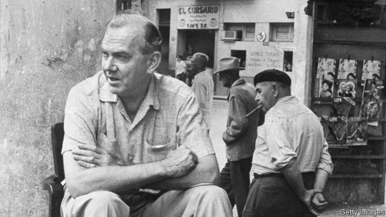

###### Spies like us

# The comical, true-life story behind “Our Man in Havana” 

##### Graham Greene was well acquainted with both spooks and Havana’s fleshpots 

 

> Mar 21st 2019 

Our Man Down in Havana: The Story Behind Graham Greene’s Cold War Spy Novel. By Christopher Hull. Pegasus Books; 324 pages; $25.95. W.W. Norton; £19.99. 

GRAHAM GREENE’S life was a gift to biographers. They—and the author himself—have amply chronicled his adventurous stints in exotic locations, his work as a secret agent, his love affairs and his Catholicism. Christopher Hull touches on all of these themes in his focused and entertaining account of the making of Greene’s novel of espionage, “Our Man in Havana”. 

That book is set in Cuba, which Greene (pictured) first visited by accident in 1954, after he was deported from Puerto Rico. (He had unwisely revealed that, as a student prank, he was once a member of the Communist Party.) Greene disliked the authoritarian regime of Fulgencio Batista but enjoyed the climate and the seedy nightlife, returning frequently over the next dozen years. 

Ever anti-American, Greene approved when Fidel Castro overthrew Batista, Washington’s client, in 1959; he admired Castro’s social reforms but rued the puritanical clampdown on Havana’s fleshpots. Rather than merely witnessing the communist takeover, he tried to assist it, using his clandestine contacts to lobby against the supply of weapons to Batista and help furnish Castro with British buses. 

These half-baked efforts were worthy of his own comic novels, of which “Our Man in Havana”—published just months before the revolution—may be the best loved. The protagonist is James Wormold, a vacuum-cleaner salesman recruited by the British secret service. Learning that the more information he provides the greater his remuneration, he invents a network of agents and increasingly farcical intelligence, to the delight of his minders in London. His masterstroke is a report of strange goings-on in the mountains, which he backs up with what are supposedly aerial photographs of sinister constructions. In reality they have been adapted from diagrams of vacuum cleaners. 

In “Our Man Down in Havana” Mr Hull argues that, as well as drawing on his secret-service experience to describe the bumbling nature of much intelligence work, Greene was eerily prophetic about the Cuban missile crisis of 1962, which arose when reconnaissance flights proved that the Soviet Union was constructing missile sites on the island. He makes a game case, but some readers might conclude that coincidence is a more apt judgment than prescience. Mr Hull even sees Greene’s “clairvoyance” at work in the faulty evidence of weapons of mass destruction on which the invasion of Iraq was based in 2003. 

It would be interesting to know what the novelist would make of that reverent appraisal. Still, Mr Hull’s book is a delicious companion to the tale Greene confected from the incompetence of spooks and an island in turmoil. 

-- 

 单词注释:

1.comical['kɒmikәl]:a. 好笑的, 滑稽的 

2.Havana[hә'vænә]:n. 哈瓦那, 哈瓦那雪茄烟 

3.graham['ɡreiәm]:a. 全麦的；粗面粉的；全麦粉制成的 

4.greene[]:n. 格林（姓氏） 

5.acquaint[ә'kweint]:vt. 使认识, 介绍 

6.spook[spu:k]:n. 幽灵, 鬼 vt. 惊吓, 鬼怪般地出没 vi. 惊吓而逃窜, 受惊 

7.fleshpot['fleʃpɒt]:n. 煮肉锅 

8.christopher['kristәfә]:n. 克里斯多夫（男子名） 

9.hull[hʌl]:n. 壳, 皮, 船体 vt. 去壳 

10.pegasus['pe^әsәs]:n. 诗兴, 诗才 

11.ww[]:abbr. 栈单（Warehouse Warrant） 

12.norton['nɔ:tәn]:n. 诺顿（男子名）；诺顿公司（美国一软件公司） 

13.graham['ɡreiәm]:a. 全麦的；粗面粉的；全麦粉制成的 

14.biographer[bai'ɒgrәfә]:n. 传记作者 

15.amply['æmpli]:adv. 充足地, 充裕地 

16.chronicle['krɒnikl]:n. 年代记, 记录, 编年史 vt. 把...载入编年史 

17.adventurous[әd'ventʃәrәs]:a. 喜欢冒险的, 有进取心的, 危险的 

18.stint[stint]:vt. 节省, 限制, 停止 vi. 节约 n. 吝惜, 节约, 限额 

19.exotic[ig'zɒtik]:a. 异国的, 外来的 n. 外来人, 外来物, 舶来品 

20.Catholicism[kә'θɒlisizm]:n. 天主教的信仰 

21.espionage[.espiә'nɑ:ʒ]:n. 间谍活动 [法] 间谍活动, 刺探, 间谍 

22.Cuba['kju:bә]:n. 古巴 

23.deport[di'pɒ:t]:vt. 举止, 驱逐出境 [法] 放逐, 驱逐, 递解 

24.Puerto[]:n. 垭口, 港口, 山口 n. (Puerto)人名；(西)普埃尔托 

25.rico[]:abbr. 反诈骗腐败组织集团犯罪法（Racketeer Influenced and Corrupt Organizations Act） 

26.unwisely[]:adv. 不明智地；愚笨地 

27.prank[præŋk]:n. 开玩笑, 恶作剧, 戏谑 vt. 盛装, 装饰, 打扮 vi. 炫耀自己 

28.authoritarian[ɒ:.θɒri'tєәriәn]:a. 独裁的, 独裁主义的 

29.regime[rei'ʒi:m]:n. 政权, 当权期间, 政体, 社会制度, 体制, 情态 [医] 制度, 生活制度 

30.fulgencio[]:n. (Fulgencio)人名；(西)富尔亨西奥 

31.batista[]:n. 巴蒂斯塔（姓氏） 

32.seedy['si:di]:a. 多种子的, 结籽的, 破烂的, 肮脏的 

33.nightlife[]:n. 夜生活 

34.fidel[fi'del]:n. 卡斯特罗（男子名） 

35.Castro['kæstrəu]:n. 卡斯特罗（古巴领导人, 1976-2006年在任） 

36.overthrow[.әuvә'θrәu]:n. 推翻, 瓦解, 倾覆 vt. 打倒, 推翻, 倾覆 

37.client['klaiәnt]:n. 客户, 顾客, 委托人 [计] 客户, 客户机, 客户机程序 

38.rue[ru:]:n. 懊悔, 后悔, 芸香 v. 后悔, 悲伤, 懊悔 

39.puritanical[,pjuәri'tænikәl]:a. 清教徒的, 清教主义的, 宗教上极端拘谨的, 道德上极端拘谨的 

40.clampdown['klæmdaun]:n. 压制, 取缔 

41.takeover[]:n. 接管, 接收 [经] 接收 

42.clandestine[klæn'destin]:a. 偷偷摸摸的 [法] 秘密的, 暗中的 

43.lobby['lɒbi]:n. 大厅, 休息室, 游说议员者 vi. 游说议员, 游说 vt. 游说 

44.comic['kɒmik]:n. 连环漫画, 喜剧演员, 滑稽的人 a. 滑稽的, 有趣的, 喜剧的 

45.protagonist[prәu'tægәnist]:n. 主人公, 主角, 领导者 

46.jame[]: 灰岩井 

47.remuneration[ri.mju:nә'reiʃәn]:n. 报酬 [经] 报酬, 酬劳 

48.farcical['fɑ:sikәl]:a. 笑剧的, 滑稽的, 笑剧性的 

49.minder['maindә]:n. 看守者, 照顾者 

50.masterstroke['mɑ:stәstrәuk]:n. 巧妙动作, 神技, 卓越成就 

51.supposedly[sә'pәuzidli]:adv. 想象上, 看上去像, 被认为是, 恐怕, 按照推测 

52.aerial['єәriәl]:a. 空中的, 航空的, 空气的, 空想的 n. 天线 

53.sinister['sinistә]:a. 不吉利的, 凶恶的, 左边的 [医] 左的 

54.bumble['bʌmbl]:vi. 结结巴巴地说, 犯大错, 踉跄, 跌倒 

55.eerily[]:a. 怪诞的；奇异的；可怕的 

56.prophetic[prә'fetik]:a. 预言的, 先知的, 预示的 

57.Cuban['kju:bәn]:a. 古巴的, 古巴人的 n. 古巴人 

58.reconnaissance[ri'kɒnisәns]:n. 侦察, 勘察队 [电] 勘查 

59.apt[æpt]:a. 有...倾向的, 易于的, 恰当的, 聪明的 [计] 自动数控语言, 自动图象传输, 自动程序控制, 自动程序设计工具 

60.judgment['dʒʌdʒmәnt]:n. 裁判, 宣告, 判决书 [医] 判断 

61.prescience['presiәns]:n. 预知, 先见 

62.clairvoyance[klєә'vɒiәns]:n. 神视, 超人的视力, 洞察力 [医] 千里眼, 神视 

63.Iraq[i'rɑ:k]:n. 伊拉克 

64.reverent['revәrәnt]:a. 尊敬的, 虔诚的 

65.appraisal[ә'preizәl]:n. 评价, 估价 [经] 评价, 评估 

66.confect[kәn'fekt]:n. 蜜饯, 糖果 vt. 调制, 混合 

67.incompetence[in'kɔmpitәns]:n. 不胜任, 不够格, 不合格, 不适合, 无能力, 不熟练, 无资格 [医] 机能不全, 闭锁不全, 关闭不全 

68.turmoil['tә:mɒil]:n. 骚动, 混乱 

