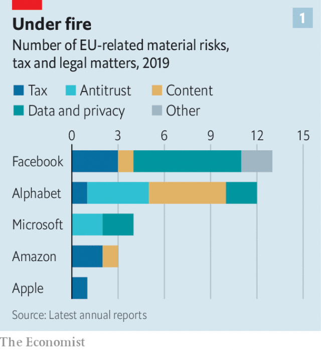
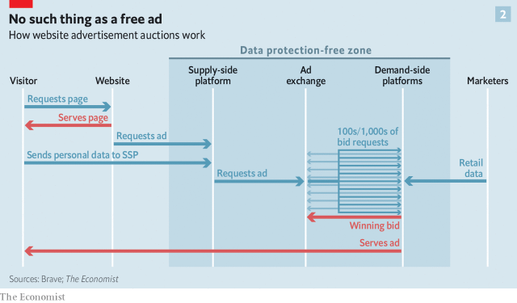

###### Europe’s beef with GAFA

# Big tech faces competition and privacy concerns in Brussels 

##### And the sector may be the better for it 

 

> Mar 23rd 2019 

AROUND 19 IN every 20 European internet searches are carried out on Google. Not those done by Margrethe Vestager. The European Union’s competition chief says she mostly looks stuff up on Qwant, which prides itself on not tracking users in the manner its larger rival does. Forget also Google Maps, or Gmail, or any other product from the Alphabet stable: “I have better alternatives that provide me with more privacy,” the Danish politician recently told a crowd at SXSW, an annual festival of tech, music and thought in Austin, Texas. 

Ms Vestager is hardly at the vanguard of a movement: even in its domestic French market, Qwant has less than 1% market share. Nor, at first, might her focus on privacy seem linked to her trustbusting brief. But, as she has explained, popular services like Facebook use their customers as part of the “production machinery”. You may not pay in cash to like a friend’s pictures, or every time you ask Alexa what a “cup” of butter is in grams—but you might as well do, given how much personal data you have to fork over. Rather melodramatically, Ms Vestager says what seem to be free services are ones for which you “pay with your life”. 

Those appointed, by governments or themselves, to worry about competition have a strong interest in big tech firms such as Google and its parent Alphabet, Apple, Amazon and Facebook. How could they not, given how quickly those firms have come to dominate the business landscape. On both sides of the Atlantic, the reputation that big-tech companies other than Apple have for making free with people’s data has led to rules being tightened, and there is talk of tightening them more. There are other concerns, too. Europeans have a fairly strong feeling that the firms do not pay enough tax. Everywhere there are worries about the content which they spread—such as, for a while, video of the massacre in Christchurch—and that which they are thought to suppress. 

Tech groups have hordes of lobbyists experienced in weathering these various issues. Occasional losses—such as the €1.5bn ($1.7bn) that Google was fined on March 20th for abusing its clout in the online-advertising market—can to some extent just be treated as a cost of doing business. What they are not so well prepared for is the crossing of some of these streams of complaint. European regulators are bringing together concerns about privacy and rules about competition to create constraints that could up-end the way companies do business online. 

Campaigners have long lamented that, although the users of online platforms tell pollsters that they care about privacy, they do not act as if they do. If privacy becomes tied to antitrust concerns, though, users do not need to care. They merely need to be content that regulators armed with big sticks—European regulators are empowered to levy fines on companies operating in Europe that are a significant fraction of their global revenue—should care on their behalf. Ms Vestager and her colleagues seem happy to do the honours. 

The premise for bringing together concerns about privacy and competition is that the tight grip which big tech companies have over user data is what has turned them into entrenched, and perhaps abusive, incumbents. As Andreas Mundt, head of Germany’s competition watchdog, the Bundeskartellamt, puts it, “Europe says…that data can provide market power.” In February, his agency startled technology companies and those who analyse them with a ruling against Facebook built on such an analysis. In a 300-page finding it argued that Facebook was only able to gather so much data because of its dominant position amid social networks. 

The measure of market power usually used to justify action on competition grounds is, roughly speaking, that a company is able to raise prices without losing customers. Such an ability suggests that the level of competition in the market needs at least looking into, and perhaps redressing. Facebook, being free to its public users (though not to the advertisers who buy the users’ attention), cannot have its market power analysed in this way. But Mr Mundt says that the company’s ability to encroach ever more on its users’ privacy without seeing them leave—for example, by starting to track them while they browse sites not connected to Facebook—is also a measure of market power. 

This analysis is leading to strict new rules on the amount of data Facebook can collect from German users. It can no longer mesh together the data it gathers from its various services, including WhatsApp and Instagram, as it has said it wants to do. There are also restrictions on how much it can track its users when they browse the internet beyond Facebook. Mr Mundt compares these new constraints on the flow of information inside the company to Facebook being “internally broken up”. 

The logical step beyond limiting the accrual of data is demanding their disbursement. If tech companies are dominant by virtue of their data troves, competition authorities working with privacy regulators may feel justified in demanding they share those data, either with the people who generate them or with other companies in the market. That could whittle away a big chunk of what makes big tech so valuable, both because Europe is a large market, and because regulators elsewhere may see Europe’s actions as a model to copy. It could also open up new paths to innovation. 

Europe is not an impressive performer when it comes to creating tech behemoths. It is as well represented among big global tech companies as companies other than Google are in search-engine statistics: there is just one (SAP, a business software company) in the top 20. Look at the top 200 internet companies and things are, if anything, a touch worse; just eight. But in regulatory heft the EU punches far above its members’ business weight. 

There are various ways of explaining this. One is that Europe’s keenness to regulate stops its tech firms from growing in the way that hands-off America encourages. Another is that the rigours of its zealous regulation are experienced, in the main, only by foreigners—which makes them more palatable to, or even popular with, politicians and the public. “Would Brussels be so tough on big tech companies if they were French or German?” asks one American executive, rhetorically. 

There is also the consideration that the companies potentially “disrupted” by internet innovators include European carmakers, telecoms companies and media groups, about whom European politicians care a lot. New copyright regulations being voted on by the European Parliament next week have been widely criticised for putting the interests of copyright holders, which largely means media companies, far ahead of the interests of online companies and, indeed, the free expression of users. 

 

Regardless of motive, though, this is now the way of the world. A look at the annual reports of big tech companies clearly shows that they have a lot of European issues to face, including taxes (see chart 1). And this means that differences between the ways in which Europeans and Americans think about competition and privacy matter a lot. 

Take competition first. Much of the underlying law governing cartels, mergers and competition is quite similar on both sides of the Atlantic. But the continents’ approaches to handling big companies are leagues apart. 

In recent decades, American antitrust policy has been dominated by free-marketeers of the so-called Chicago School, deeply sceptical of the government’s role in any but the most egregious cases. Dominant firms are frequently left unmolested in the belief they will soon lose their perch anyway: remember MySpace? The lure of fat profits is, after all, what motivates firms to innovate in the first place. While there is healthy academic debate over whether online businesses naturally, or even inevitably, have a tendency towards monopoly, it has yet to have much effect on regulation. American courts view dominant firms as a problem only if their position does clear harm to consumers. 

 

By contrast, “Europe is philosophically more sceptical of firms that have market power,” says Cristina Caffarra at Charles River Associates, an economics consultancy. Its regulators want to see competitors that have been less successful continue to exist, and even thrive. Competition is seen as valuable in and of itself, to ensure innovation happens beyond one firm that has conquered the market. 

“The debate on whether there has been underenforcement of antitrust is far more dynamic in Europe—there is a sense of urgency,” says Isabelle de Silva, head of France’s competition authority. Germany and Austria have changed laws to allow them to scrutinise takeovers of startups, in the belief tech incumbents are taking out future rivals before they have time to hatch into real competitors. Alphabet, Amazon, Apple, Facebook and Microsoft have together taken over a company per week for the past five years. 

There is not just more interest in regulating big tech in Europe; there is also more power to do so. William Kovacic, a former boss of the Federal Trade Commission in America, said recently that Brussels is “the capital of the world” for antitrust, leaving its American counterparts “in the shade”. American antitrust typically involves prosecuting the case in front of a judge. The European Commission can decide and impose fines by itself, without the approval of national governments, though the decisions are subject to appeal in the courts. And whereas, in America, only federal agencies can apply federal law, European antitrust law can be applied both by national authorities and the commission. 

Every major tech group has had run-ins with European antitrust rules. Since 2017, Google has been sanctioned three times, running up €8.2bn in fines for promoting its own shopping-comparison service in search results and edging out rivals with its Android phone software, as well as for abusing its strength in advertising. It is appealing the decisions. In 2017 Facebook was fined €110m for misinforming the EU about its plans for integrating WhatsApp with its flagship social network. 

In the same year Amazon was rebuked for the way it sold e-books, agreeing to change its practices. It is now under an early-stage investigation both in Germany and Europe-wide for the way it uses sales data from its “Marketplace” platform to compete with the independent retailers who sell through it. On March 13th Spotify, a Swedish music-streaming service, demanded that the commission step in to stop Apple levying hefty fees from those who sell services through its App Store. 

Then there is privacy. In the past century almost all European countries have experienced dictatorship, either home-grown or imposed through occupation, which has raised sensitivities. “Privacy is a fundamental right at EU level, in a way that it is not in America,” says Andrea Renda of the Centre for European Policy Studies, a think-tank. That right is enshrined in the EU Charter of Fundamental Rights in the same way that free speech is protected by America’s constitution. Polls show Europeans, and particularly Germans, to be more concerned about the use of their personal data by private companies than Americans are. 

When American tech companies first encountered these concerns they were relatively trifling. In 2010 German authorities demanded Google blur the homes of anyone who objected to appearing in its Street View service. (Rural Germany remains one of the last places where well-off people live beyond the service’s coverage.) Four years later, an EU-wide “right to be forgotten” provided some circumstances in which citizens could expunge stories about them from search results. 

The General Data Protection Regulation (GDPR), which came into force last May, raised the issue to a new level. Beyond harmonising data protection across Europe, it also established a principle that individuals should be able to choose how the information about them is used. This is an issue not just for the companies which currently dominate the online world—the provisions of the GDPR were central to the German ruling on Facebook—but also for that world’s basic business model. 

The data about their users collected by apps and browsers is the bedrock of online advertising—a business which in 2018 was worth $108bn in America according to eMarketer, a consultancy. The most valuable part of the industry works by selling the user’s attention to the highest bidder, a simple-sounding proposition which requires a labyrinthine and potentially leaky “adtech” infrastructure. 

Enterprises called “supply-side platforms” use data from apps and from cookies in browsers to pass a profile of every person who visits an advertising-supported page to an advertising exchange. There the rights to show adverts are auctioned off user by user. Bidders use the data from the supply-side, along with further data procured from brokers, to decide how likely the user is to act on their ad, and thus how much it is worth to show it to him. The highest bidder gets to put its ad on the user’s screen (see chart 2). Meanwhile, data associated with the transaction are used to update the brokers’ records. 

 

The more pertinent data the bidders get, the more the winning advertiser is likely to bid. This builds in incentives to get as much data to as many bidders as feasible. And that is not particularly conducive to the protection of privacy. 

The introduction of the GDPR spurred legal challenges to this system across Europe (see article). Some decisions are already headed to appeal, and it seems sure that eventually at least a few will make it all the way up the tree to the European Court of Justice. 

Those cases will help determine the long-term impact of the GDPR. So will the degree to which other countries take up ideas like those of Mr Mundt, the German regulator. European regulators do not all see eye to eye on mingling privacy and antitrust, according to Alec Burnside of Dechert, a law firm. But he notes that there is something much closer to consensus on it than there would be in America. The way Ms Vestager talks about privacy seems quite in line with her German counterpart. 

Tech lobbyists in Brussels worry that Ms Vestager agrees with those who believe that their data empires make Google and its like natural monopolies, in that no one else can replicate Google’s knowledge of what users have searched for, or Amazon’s of what they have bought. She sent shivers through the business in January when she compared such companies to water and electricity utilities, which because of their irreproducible networks of pipes and power lines are stringently regulated. 

Sometimes the power of such networks gets them broken up: witness AT&T. Elizabeth Warren, a senator who wants to be the Democratic Party’s presidential candidate in 2020, has suggested Facebook and Google could also be split up. Ms Vestager pours cold water on the idea. But Europe’s privacy-plus-antitrust approach offers a halfway house: force the companies to share their data, thus weakening their market power and empowering the citizenry. 

In mid-March a panel appointed by the British government and led by Jason Furman, a Harvard economist who was an adviser in Barack Obama’s White House, advocated such an approach, suggesting a regulator empowered to liberate data from firms to which it provided “strategic market status”. An EU panel with a similar remit is expected to issue recommendations along the same lines soon. 

The idea is for consumers to be able to move data about their Google searches, Amazon purchasing history or Uber rides to a rival service. So, for example, social-media users could post messages to Facebook from other platforms with approaches to privacy that they prefer. The innovative engineers of the tech incumbents would still have vast troves of data to work with. They could just no longer count on privileged access to them. The same principle might also lead to firms being able to demand anonymised bulk data from Google to strengthen rival search engines. Viktor Mayer-Schönberger of Oxford University points to precedent: large German insurers have to share data with smaller rivals to help them gauge risk. 

This may not be as fine a solution as it might sound. Getting lots of personal data to move freely while also keeping it safe is not straightforward. Users would be required to give serious thought to the question of with whom they wanted to share their information, as opposed to blindly clicking “Accept” buttons to get rid of pop-ups, as mostly happens today. Anonymising a large dataset—such as a compendium of Google searches which might then be used to train a rival’s algorithms—is harder than it might seem. Identifiable data about individuals can seep regardless. 

And there may not be much appetite for it. Following Britain’s lead, the EU has forced banks to allow their clients to move their data to third parties. But demand for services that let personal-finance apps look at your bank statements has yet to take off. Google and Facebook offer their users the possibility of downloading a portion of the data those users have provided to the firms (though those taking the offer up are best advised to have a large hard drive). But few rivals have invested in complementary systems that allow you to upload those data, suggesting that a lack of user data is not the factor limiting their ability to take on today’s incumbents. 

Still, the assumption remains that a combined focus on antitrust and privacy could, over time, both reduce the incumbents’ market power and open up new routes to competition. Enthusiasts point to IBM, faced with antitrust action, divorcing its software and hardware businesses in 1969. That created a new industry for software writers to explore. A world of social networks empowered to share aspects of Facebook’s map of who knows whom and likes what, while being free to explore business models other than advertising could produce all sorts of profitable, socially useful innovation by firms in Europe and around the world. And though Facebook might not do as well in such a future as it would if given free rein, it could still prosper. The past half-century has not been an irredeemably shabby one for IBM. 

Europe alone might not be able to bring all this about. But a mixture of the accommodations companies make to it and the example it sets to others could have a catalysing effect. The appearance of a European commissioner at SXSW is a rarity. Progressive American politicians were this year rarely a thumbdrive-throw away. They could have done worse than stop by and listen. Demanding that tech giants be broken up may get the odd rally chanting, but it would be hard to bring about. Calling on them to give power back to the people, though, has a certain ring to it. 

-- 

 单词注释:

1.gafa[]:[网络] 广州美术学院(Guangzhou Academy of Fine Arts)；国际园艺博览会；牛奶咖啡 

2.tech[tek]:n. 技术学院或学校 

3.privacy['praivәsi]:n. 隐私, 隐居, 秘密 [计] 个人保密权 

4.Brussel[]:n. 布鲁塞尔（比利时首都） 

5.sector['sektә]:n. 扇形, 部门, 部分, 函数尺, 象限仪, 段, 区段 vt. 把...分成扇形 [计] 扇面; 扇区; 段; 区段 

6.google[]:谷歌；搜索引擎技术；谷歌公司 

7.margrethe[]:[网络] 丹麦女王玛格丽特；丹麦玛格丽特；丹麦女王玛格丽特二世 

8.gmail[]:n. 谷歌邮箱 

9.Danish['deiniʃ]:n. 丹麦文 a. 丹麦的, 丹麦人的, 丹麦文的 

10.sxsw[]:[网络] 西南偏南大会；音乐节；西南偏南音乐节 

11.austin['ɔ:stin]:n. 奥斯丁（人名）；英国制汽车牌名 

12.Texas['teksәs]:n. 德克萨斯 

13.vanguard['vængɑ:d]:n. 前锋, 先锋, 先驱 

14.les[lei]:abbr. 发射脱离系统（Launch Escape System） 

15.trustbusting[]:[网络] 摧毁托拉斯 

16.facebook[]:n. 脸谱网 

17.machinery[mә'ʃi:nәri]:n. 机器, 机械装置, 机构 [化] 机械 

18.alexa[]:n. 亚莉克莎（女子名） 

19.datum['deitәm]:n. 论据, 材料, 资料, 已知数 [医] 材料, 资料, 论据 

20.melodramatically[]:感情夸张地 戏剧性地 

21.amazon['æmәzɒn]:n. 亚马孙河 [医] 无乳腺者 

22.quickly['kwikli]:adv. 很快地 

23.landscape['lændskeip]:n. 风景, 山水, 风景画 vi. 从事景观美化 vt. 美化...景观 [计] 横向 

24.tighten['taitn]:vt. 勒紧, 使变紧 vi. 变紧, 绷紧 

25.massacre['mæsәkә]:n. 大屠杀 vt. 大屠杀, 残杀 

26.suppress[sә'pres]:vt. 镇压, 使止住, 禁止, 抑制, 查禁 [法] 镇压, 平定, 禁止出版 

27.tech[tek]:n. 技术学院或学校 

28.horde[hɒ:d]:n. (一)群, 游牧部落, 移动群 vi. 成群结队 

29.lobbyist['lɔbiist]:n. 说客 [法] 院外活动集团成员 

30.clout[klaut]:n. 敲击, 破布 vt. 打补钉 

31.regulator['regjuleitә]:n. 调整者, 校准者, 校准器, 调整器, 标准钟 [化] 调节剂; 调节器 

32.constraint[kәn'streint]:n. 强制, 约束 [计] 约束 

33.online[]:[计] 联机 

34.campaigner[kæm'peinә]:n. 从军者, 老兵, 竞选者 

35.lament[lә'ment]:n. 悲叹, 悔恨, 恸哭, 挽歌, 悼词 vt. 哀悼 vi. 悔恨, 悲叹 

36.pollster['pәulstә]:n. 民意调查人, 民意测验经办人 

37.antitrust[.ænti'trʌst]:a. 反托拉斯的 [法] 反托拉斯的 

38.empower[im'pauә]:vt. 授予权力, 允许, 使能够 [法] 授权, 准许, 转委 

39.levy['levi]:n. 税款, 所征的人数, 征收 vi. 征税, 课税 vt. 征收, 强求, 召集 

40.premise['premis]:n. 前提, 房屋连地基, 上述各项 vt. 预先提出, 引出, 作为...的前提 vi. 作出前提 

41.entrench[in'trentʃ]:vt. 围以壕沟, 防护, 保卫, 使处于牢固地位 vi. 掘壕, 侵犯 

42.abusive[ә'bju:siv]:a. 恶言谩骂的, 被滥用的, 腐败的, 虐待的 

43.incumbent[in'kʌmbәnt]:a. 现任的, 依靠的, 负有义务的 n. 领圣俸者, 在职者 

44.andrea['ændriә,ɑ:n'dreiә]:n. 安德里亚（男子名） 

45.mundt[]:n. (Mundt)人名；(德、英、俄、西)蒙特 

46.watchdog['wɒtʃdɒg]:n. 看门狗, 监察人 [化] 监控设备; 监视器 

47.Bundeskartellamt[]:[网络] 德国联邦卡特尔署；联邦反垄断局；联邦卡特尔局 

48.dominant['dɒminәnt]:a. 占优势的, 支配的 [医] 优性的, 显性的 

49.amid[ә'mid]:prep. 在其间, 在其中 [经] 在...中 

50.redress[ri'dres]:n. 赔偿, 补救, 矫正 vt. 纠正, 赔偿, 救济 

51.advertiser['ædvәtaizә]:n. 做广告者, 广告客户 [经] 广告商, 广告者 

52.cannot['kænɒt]:aux. 无法, 不能 

53.encroach[in'krәutʃ]:vi. 侵犯, 侵蚀, 蚕食 [法] 侵犯, 侵入, 侵占 

54.browse[brauz]:v. 浏览, 吃草 n. 浏览, 吃草 [计] 浏览 

55.mesh[meʃ]:n. 网孔, 网丝, 网眼, 网状物, 圈套, 陷阱, 啮合 vt. 以网捕捉, 啮合, 使缠住 vi. 落网, 相啮合 

56.WhatsApp[]:[网络] 智能手机；联络电话；每月活跃用 

57.Instagram[]:一款图片分享应用 

58.internally[in'tәnәli]:[计] 内部的 

59.accrual[ә'kru:әl]:n. 自然增长, 自然增长额 [经] 应计额, 发生额 

60.disbursement[dis'bә:smәnt]:n. 支付, 支出 [经] 支付 

61.trove[trәuv]:n. 发现物, 收藏品 [法] 发现物, 收藏物 

62.whittle['hwitl]:vt. 逐渐削薄, 削整, 削弱, 削减 vi. 削木头 n. 大刀, 屠刀 

63.chunk[tʃʌŋk]:n. 大块, 矮胖的人(或物) [经] 定样 

64.innovation[.inәu'veiʃәn]:n. 改革, 创新 [法] 创新, 改革, 刷新 

65.behemoth[bi'hi:mɔθ]:n. 庞然大物 

66.sap[sæp]:n. 树液, 体液, 活力, 坑道, 消弱, 警棍 vt. 使排出体液, 使伤元气, 使衰竭, 挖坑道逼近, 逐渐侵蚀 vi. 挖坑道, 消弱 [计] 共享汇编程序, 结构分析程序, 符号汇编程序, 服务器广告协议 

67.regulatory['regjulәtәri]:a. 受控制的, 统制的, 调整的 [经] 规则的 

68.heft[heft]:n. 重量, 影响, 重要性 vt. 举起试重量, 举起 vi. 称重量 

69.EU[]:[化] 富集铀; 浓缩铀 [医] 铕(63号元素) 

70.keenness['ki:nnis]:n. 锐利, 尖锐, 敏感 

71.rigour['rigә]:n. 严格, 严厉, 苛刻, 严酷, 严密, 精确 

72.palatable['pælәtәbl]:a. 美味的, 好吃的, 可口的 [医] 适口的, 味美的 

73.rhetorically[rɪ'tɒrɪklɪ]:adv. 在修辞学上, 讲究修辞地 

74.potentially[pә'tenʃәli]:adv. 可能地, 潜在地 

75.disrupt[dis'rʌpt]:a. 分裂的, 中断的 vt. 使分裂, 使瓦解 

76.innovator['inәuveitә]:n. 改革者, 创新者 

77.carmaker['kɑ:,meikә(r)]:n. 汽车制造商 

78.telecom['telәkɔm]:telecommunication 电信 

79.copyright['kɒpirait]:n. 版权, 著作权 [法] 著作权 

80.criticise['kritisaiz]:v. 批评, 吹毛求疵, 非难 

81.holder['hәuldә]:n. 持有人, 所有人, 支持物 [化] 夹持器; 夹具; 贮罐 

82.underlie[.ʌndә'lai]:vt. 位于...之下, 成为...的基础 

83.cartel[kɑ:'tel]:n. 卡特尔, 企业联合, 俘虏交换条约, 决斗挑战书 [经] 同业联合, 联合贩卖, 卡特尔 

84.merger['mә:dʒә]:n. 合并, 归并 [经] 购并 

85.Chicago[ʃi'kɑ:gәu]:n. 芝加哥 

86.egregious[i'gri:dʒiәs]:a. 异乎寻常的, 过分的, 惊人的 

87.dominant['dɒminәnt]:a. 占优势的, 支配的 [医] 优性的, 显性的 

88.unmolested['ʌnmәu'lestid]:a. 不受烦扰的, 不受干涉的, 平平安安的 

89.perch[pә:tʃ]:n. 栖木, 高位, 杆, 河鲈 v. (使)栖息, 就位, 位于, (使)暂歇 

90.lure[luә]:n. 饵, 诱惑 vt. 引诱, 诱惑 

91.innovate['inәuveit]:vi. 改革, 创新 

92.inevitably[in'evitәbli]:adv. 不可避免地 

93.monopoly[mә'nɒpәli]:n. 垄断, 专卖权, 独占事业 [经] 垄断, 专利品, 垄断(权)独占 

94.philosophically[]:adv. 哲学上；贤明地 

95.Cristina[]:n. 克里斯蒂娜（电视剧中的人物） 

96.charle[]:n. 查理（男子名）；查理（姓氏） 

97.consultancy[]:n. 商量, 协商, 磋商, 会诊, 与...商量, 咨询, 请教, 找(医生)看病, 查阅, 考虑 [经] 咨询业务, 咨询服务 

98.underenforcement[]:[网络] 未执行 

99.urgency['ә:dʒәnsi]:n. 紧急, 催促 [法] 紧急, 迫切, 紧急之事 

100.Isabelle[]:n. 伊莎贝尔（女子名） 

101.de[di:]:[化] 非对映体过量 [医] 铥(69号元素铥的别名,1916年Eder离得的假想元素) 

102.silva['silvә]:n. 森林, 森林志 

103.Austria['ɒstriә]:n. 奥地利 

104.scrutinise[]:vt.vi. 细看, 仔细检查, 审查, 细阅 [经] 详细检查, 细细地看 

105.takeover[]:n. 接管, 接收 [经] 接收 

106.startup[]:[计] 启动 

107.Microsoft[]:n. (美国)微软公司 [电] 微软公司 

108.william['wiljәm]:n. 威廉（男子名）；[常作W-][美俚]钞票, 纸币 

109.kovacic[]: [人名] 科瓦契奇 

110.counterpart['kauntәpɑ:t]:n. 副本, 复本, 配对物, 相应物 [经] 副本, 正副二份中之一 

111.typically['tipikәli]:adv. 代表性地；作为特色地 

112.prosecute['prɒsikju:t]:vt. 告发, 起诉, 彻底进行, 执行, 从事 vi. 告发, 起诉, 作检察官 

113.sanction['sæŋkʃәn]:n. 核准, 制裁, 处罚, 约束力 vt. 制定制裁规则, 认可, 核准, 同意 

114.android['ændrɒid]:n. 机器人 [医] 男性样的 [计] Google 公司设计的开源移动端操作系统 

115.advertising['ædvәtaiziŋ]:n. 广告业, 广告 a. 广告的 [计] 发广告 

116.misinform[.misin'fɒ:m]:vt. 提供错误消息 

117.flagship['flægʃip]:n. 旗舰 

118.rebuke[ri'bju:k]:n. 指责, 谴责, 非难 vt. 斥责, 指责, 制止 

119.marketplace['mɑ:kit'pleis]:n. 市场 

120.retailer['ri:teilә]:n. 零售商人, 传播的人 [经] 零售商 

121.spotify[]:[网络] 音乐播放器；音乐服务网站；网络音乐电台网站 

122.Swedish['swi:diʃ]:n. 瑞典人, 瑞典语 a. 瑞典的, 瑞典人的, 瑞典语的 

123.hefty['hefti]:a. 重的, 肌肉发达的 

124.APP[]:[计] 应用, 应用程序; 相联并行处理器 

125.dictatorship[dik'teitәʃip]:n. 独裁者之职位, 独裁, 独裁政权 [法] 专攻, 独裁权 

126.sensitivity[.sensә'tiviti]:n. 敏感, 灵敏度 [计] 灵敏度 

127.privacy['praivәsi]:n. 隐私, 隐居, 秘密 [计] 个人保密权 

128.andrea['ændriә,ɑ:n'dreiә]:n. 安德里亚（男子名） 

129.renda[]:n. (Renda)人名；(西、法、意、葡、土)伦达 

130.enshrine[in'ʃrain]:vt. 入庙祀奉, 铭记 

131.charter['tʃɑ:tә]:n. 特许状, 执照, 宪章 vt. 特许, 发给特许执照 

132.blur[blә:]:vt. 使模糊, 弄脏 vi. 弄脏, 模糊 

133.coverage['kʌvәridʒ]:n. 覆盖的范围, 保险总额, 新闻报导 [化] 可达范围; 覆盖度 

134.expunge[ik'spʌndʒ]:vt. 擦掉, 删掉, 除去 

135.harmonise['hɑ:mәnaiz]:vi.vt. 以和声歌唱/演奏, (使)协调, (使)一致, (使)相称, (使)调和 

136.currently['kʌrәntli]:adv. 现在, 当前, 一般, 普通 [计] 当前 

137.APP[]:[计] 应用, 应用程序; 相联并行处理器 

138.browser['brauzә]:n. 吃嫩叶的动物, 浏览书本的人 [计] 浏览程序 

139.bedrock[bed'rɒk]:n. 基岩, 基本原理, 基础 

140.emarketer[]:[网络] 电子营销家；电子营销者公司；电子营销者市场研究公司 

141.bidder['bidә]:n. 出价人, 投标人 [经] 投标人, 出价人, 投标商 

142.proposition[.prɒpә'ziʃәn]:n. 建议, 命题, 主张 vt. 向...提议, 向...提出猥亵的要求 

143.labyrinthine[,læbә'rinθain, -θin]:[医] 迷路的 

144.leaky['li:ki]:a. 有漏洞的, 易泄漏秘密的, 爱哭的 [电] 漏的 

145.infrastructure['infrәstrʌktʃә]:n. 基础结构, 基础设施 [经] 基础设施 

146.cooky['kjki]:n. 家常小甜饼, 饼干, 普通小饼, 巨型炸弹, (非正式)(女)厨师, 厨师助手 

147.profile['prәufail]:n. 侧面, 轮廓, 传略 vt. 描绘...轮廓, 写...的传略 [计] 提问档; 剖面图法; 剖面法 

148.advert[әd'vә:t]:vi. 提出看法, 引起注意, 留意 n. 广告 

149.auction['ɒ:kʃәn]:n. 拍卖 vt. 拍卖 

150.procure[prәu'kjuә]:vt. 获得, 取得, 导致 vi. 拉皮条 

151.broker['brәukә]:n. 掮客, 经纪人 [经] 经纪人, 掮客 

152.transaction[træn'sækʃәn]:n. 交易, 办理, 学报, 和解协议 [计] 事务处理 

153.update[ʌp'deit]:vt. 更新, 使现代化 n. 更新 [计] 更新 

154.pertinent['pә:tinәnt]:a. 相关的, 中肯的, 切题的 [法] 恰当的, 有关的 

155.incentive[in'sentiv]:n. 动机 a. 激励的 

156.conducive[kәn'dju:siv]:a. 有益于...的, 有助于...的, 助长的 

157.mingle['miŋgl]:v. (使)混合 

158.alec['ælik]:n. 亚历克（男子名） 

159.Burnside['bә:nsaid]:[计] 伯恩赛德 

160.dechert[]: [人名] 德克特 

161.replicate['replikeit]:vt. 折叠, 折转, 复制 n. 复现试验, 复制品, 高八度音 a. 复现的, 复制的, 折转的, 弯回的 

162.irreproducible[i,ri:prә'dju:sәbl]:a. 不能繁殖的, 不能复制的, 不能再现的 

163.stringently[ˈstrɪndʒəntlɪ]:adv. 严格地, 严厉地 

164.elizabeth[i'lizәbәθ]:n. 伊丽莎白（女子名） 

165.warren['wɒrәn]:n. 养兔场, 拥挤的地区 

166.senator['senәtә]:n. 参议员, (某些大学的)理事 [法] 参议员, 上议员 

167.presidential[.prezi'denʃәl]:a. 总统制的, 总统的, 首长的, 统辖的 [法] 总统的, 议长的, 总经理的 

168.halfway['hɑ:f'wei]:a. 中途的, 不彻底的, 部分的 adv. 半路地, 在中途, 在半途 

169.citizenry['sitizәnri]:n. 市民 [法] 市民 

170.jason[]:n. 詹森（男子名） 

171.furman[]: [人名] [英格兰人姓氏] 弗曼 Firmin的变体 

172.Harvard['hɑ:vәd]:n. 哈佛大学 

173.economist[i:'kɒnәmist]:n. 经济学者, 经济家 [经] 经济学家 

174.adviser[әd'vaizә]:n. 顾问, 劝告者, 指导教师 [法] 顾问, 劝告者 

175.barack[bɑ:'ræk]:n. 巴拉克（男子名） 

176.statu[]:[网络] 状态查看；雕像；特级雪花白 

177.remit[ri'mit]:vt. 宽恕, 赦免, 免除, 汇出, 缓解, 减轻, 把...提交, 使恢复原状, 推迟 vi. 缓解, 汇款 n. 移交的事物 

178.uber['ju:bә]:[医] 乳房 

179.innovative['inәjveitiv]:a. 革新的, 创新的, 富有革新精神的 

180.anonymised[]:使匿名（anonymise 过去式及过去分词形式） 匿名的 

181.Viktor[]:维克托（人名） 

182.Oxford['ɒksfәd]:n. 牛津, 牛津大学 

183.insurer[in'ʃuәrә]:n. 保险公司 [法] 保险人, 承保人, 保险公司 

184.blindly['blaindli]:adv. 轻率地, 盲目地 

185.anonymising[]:使……匿名（anonymising是anonymise的现在分词） 

186.compendium[kәm'pendiәm]:n. 纲要, 概略 [电] 简述 

187.identifiable[ai'dentifaiәbl]:a. 可辨认的 [法] 可证明为同一的, 可以办清的 

188.seep[si:p]:vi. 渗出, 渗流, 漏 n. 小泉, 水陆两用吉普车 

189.client['klaiәnt]:n. 客户, 顾客, 委托人 [计] 客户, 客户机, 客户机程序 

190.complementary[.kɒmpli'mentәri]:a. 补充的, 补足的 [经] 补足的, 补充的 

191.upload['ʌp,lәud]:[计] 上装, 加载, 储入 

192.enthusiast[in'θju:ziæst]:n. 热心家, 狂热者, 爱好者 

193.IBM[]:美国国际商用机器公司 [计] 国际商用机器公司 

194.socially['sәuʃәli]:adv. 在社会上, 在社交上, 以社会生活方式 

195.prosper['prɒspә]:vi. 繁荣, 兴隆, 成功 vt. 使成功, 使昌盛 

196.irredeemably[ˌiri'diːməbl]:a. 不能赎回的；不能兑现的；不可救药的 

197.catalyse[ˈkætəlaɪz]:v. 催化, 促成 

198.commissioner[kә'miʃәnә]:n. 委员, 理事, 行政长官 [法] 委员, 政府的特派员, 地方地官 

199.rarity['rєәrәti]:n. 稀罕, 罕有, 珍奇, 稀薄 

200.rally['ræli]:n. 重振旗鼓, 集合, 群众集会, 跌停回升 v. 重整旗鼓, 集合, 恢复精神, 团结, 挖苦, 嘲笑 

