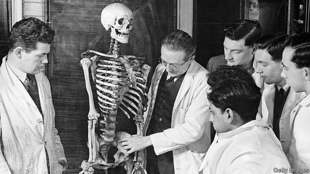

###### Doctors, ordered

# A shortage of staff is the biggest problem facing the NHS 

##### Health experts reckon it will take sweeping reforms and more money to plug the gap 

 

> Mar 23rd 2019 

IN A BRIGHTLY lit, immaculately clean room, 16 cadavers await the next batch of students at Anglia Ruskin medical school. Not all universities still use them, but “we like to get young hands working,” says Stephen Hughes, the course leader. The focus on practical skills goes beyond the anatomy room. Students start placements in the practices of GPs (family doctors) in their first year, the idea being to inoculate them against medical snobbery about such work. The school opened last year after the government agreed to fund 100 places for students there, to tackle a shortage of doctors in the area. 

The shortage is particularly acute in Essex, but it is a problem across the country. The National Health Service is the biggest employer in Europe, with 1.2m workers. Another 1.1m toil in social care. Yet experts agree that many more recruits are needed. Recent work by three think-tanks—the Health Foundation, King’s Fund and Nuffield Trust—found that NHS hospitals, mental-health providers and community services have 100,000 vacancies and that there are another 110,000 gaps in adult social care. If things stay on their current trajectory, the think-tanks predict that there will be 250,000 NHS vacancies in a decade. 

Signs of strain are becoming apparent, as waiting times continue to rise. Problems are hard to contain. Shortages of staff in social care means more work for GPs, which makes it harder to get an appointment, which means more people turn up in accident and emergency departments. By most measures, more staff are leaving each year, and the most cited reason for doing so is dissatisfaction with their work-life balance. The Care Quality Commission, a regulator, has warned that “workforce problems have a direct impact on people’s care.” Little surprise, then, that Matt Hancock, the health secretary, has said solving the workforce problem is his priority. 

Although the number of medics has risen in recent years, it has not been fast enough to match growing demand. In 2007 there were 8.7m people over the age of 65; today there are 10m. But it not just an ageing population that calls for more staff. Official guidelines published after care failures in the late 2000s warn that patients are at greater risk of harm if a nurse often has to care for more than eight patients on a ward during the day. 

Planning a health workforce is difficult, partly because of the time frames involved (a hospital consultant takes 14 years to train, for example). Last year the government announced 1,500 new places in medical schools, as well as five new institutions, in Chelmsford, Sunderland, Lancashire, Lincoln and Canterbury—all areas where shortages are biting. In Chelmsford, such is the enthusiasm for the school, a couple of locals have even popped in to offer their bodies for research. 

But it is hard to direct students to the specialisms where shortages are most severe. Although they can be encouraged to become GPs or psychiatrists, a lot still like “the idea of putting on wellies” as a surgeon, says Dr Hughes. And the government has a big shortfall to make up because of deep cuts to spending on training. In the past five years funding for health education has fallen by 17%, compared with a 13% rise in the budget of NHS England. 

The government’s job would be easier if planning were not so fragmented. According to one estimate, the system involves 40 statutory bodies, 15 royal colleges, 18 trade unions and more than 100 professional bodies. Things have improved recently, but “there has been a tendency for [the organisations] to point their fingers at one another” over problems, says Finn O’Dwyer-Cunliffe of NHS Providers, a trade association. 

There has also been a tendency for government departments to work at cross-purposes. The NHS used to rely on international recruitment as “a get-out-of-jail-free card” to make up for poor planning, says Anita Charlesworth of the Health Foundation. That has got harder recently, as the Home Office has tightened immigration rules. Since 2011 it has limited the number of visas for skilled workers from outside Europe to 20,700 a year. Last year it exempted doctors and nurses from this cap, but restrictions on other health workers remain. All are stung by pricier visas. And although the NHS escaped the worst of austerity, pay was frozen or capped from 2010-11 to 2017-18, meaning the starting salary for a nurse fell by almost 10% in real terms. Many social-care workers are paid the minimum wage. 

Even with laxer immigration rules, foreigners could not fill all the shortages. GPs, for instance, are hard to hire from abroad, partly because the same job does not exist in many other countries. The NHS will thus have to find different ways of working. New roles such as the “physician associate” (who provides support to doctors) could help. But their roll-out has been slowed by the fact that regulators are yet to set out exactly what the jobs should involve. 

Things are not about to get easier. International competition for doctors and nurses is increasing as emerging economies invest in health. Brexit is already making it harder to recruit from the EU. And parts of the NHS face a retirement bulge: one in three nurses, midwives and health visitors is over 50. The three think-tanks conclude that it will take extra investment of £900m ($1.2bn) a year by 2023-24, in things like grants for student nurses and training for existing staff, to stop even more vacancies going unfilled. A new workforce plan is due later this year. The officials drawing it up have an unenviable job. 

-- 

 单词注释:

1.nh[]:abbr. 不吸湿的（nonhygroscopic）；全日空航空公司；美国地名, 新罕布什尔（New Hampshire） 

2.reckon['rekәn]:vt. 计算, 总计, 估计, 认为, 猜想 vi. 数, 计算, 估计, 依赖, 料想 

3.brightly['braitli]:adv. 生辉地, 明亮地, 鲜明地 

4.immaculately[]:adv. 纯洁, 无斑点, 无瑕疵, 无缺点, 无过失, 清白无辜, 非常干净 

5.cadaver[kә'deivә]:n. 死尸, 尸体 [医] 尸体 

6.batch[bætʃ]:n. 一次所烘的面包, 一次所制之量, 一组, 批, 成批, 分批 v. 成批, 分批处理 [计] 一批 

7.Anglia['æŋgliә]:n. 英格兰的拉丁名称 

8.Ruskin[]:n. 罗斯金（姓氏） 

9.stephen['sti:vn]:n. 斯蒂芬（男子名） 

10.hughe[]:[网络] 休斯 

11.anatomy[ә'nætәmi]:n. 剖析, 解剖学, 骨骼, 结构 [医] 解剖学, 解剖 

12.placement['pleismәnt]:n. 放置, 布置, 工作安排, 编班, 定位球 [计] 放置 

13.GP[]:普通医师, 普通医生开业医生 [计] 通用程序设计, 图形处理器 

14.inoculate[i'nɒkjuleit]:vt. 接种, 嫁接 [医] 接种 

15.snobbery['snɒbәri]:n. 谄上欺下, 势利 

16.tackle['tækl]:n. 工具, 复滑车, 滑车, 装备, 扭倒 vt. 固定, 处理, 抓住 vi. 扭倒 

17.Essex['esiks]:n. 艾塞克斯郡(英格兰郡名) 

18.toil[tɒil]:n. 辛苦, 苦工, 网, 罗网, 圈套 vi. 苦干, 跋涉 

19.Nuffield[]:n. (Nuffield)人名；(英)纳菲尔德 

20.provider[prә'vaidә]:n. 供应者, 供养人, 伙食承办人 [计] 提供器 

21.vacancy['veikәnsi]:n. 空, 空白, 空缺, 空虚, 空闲 [化] 空位 

22.trajectory[trә'dʒektri]:n. 轨道, 弹道, 轨线 [化] 轨道 

23.cite[sait]:vt. 引用, 引证, 表彰 [建] 引证, 指引 

24.dissatisfaction['dis.sætis'fækʃәn]:n. 不满, 不平 

25.regulator['regjuleitә]:n. 调整者, 校准者, 校准器, 调整器, 标准钟 [化] 调节剂; 调节器 

26.matt[mæt]:a. 表面暗淡的, 无光泽的, 表面粗糙的, 不光滑的 [医] 无光泽 

27.hancock['hænkɔk]:n. 全民超人（电影名）；汉考克 

28.medic['medik]:n. 苜蓿属植物, 医师, 医科学生 

29.guideline['gaidlain]:n. 指导路线, 方针, 指标 [经] 指导路线, 方针, 准则 

30.Chelmsford['tʃelmsfəd]:n. 切姆斯福德（英国英格兰东南部一座城市） 

31.Sunderland['sʌndәlәnd]:森德兰[英国英格兰东北部港市](或译散德兰) 

32.Lancashire['læŋkәʃiә]:n. 兰开夏郡(英格兰郡名) 

33.Lincoln['liŋkәn]:n. 林肯 

34.specialism['speʃәlizm]:n. 专长, 专业 

35.psychiatrist[sai'kaiәtrist]:n. 精神病医生, 精神病学家 [医] 精神病学家 

36.welly[ˈweli]:n. 长筒雨靴；长筒胶靴 

37.shortfall['ʃɒ:tfɒ:l]:n. 不足, 不足量 [经] 缺少, 不足, 亏舱运费 

38.statutory['stætjutәri]:a. 法令的, 法定的, 可依法惩处的 [经] 法定的 

39.Finn[fin]:n. 芬兰人 

40.recruitment[ri'kru:tmәnt]:n. 新兵征召 [医] 募集[反应], 募集[现象](生理), 复聪(耳科) 

41.anita[ә'ni:tә]:n. 安尼塔（女子名） 

42.Charlesworth[]:n. (Charlesworth)人名；(英)查尔斯沃思 

43.tighten['taitn]:vt. 勒紧, 使变紧 vi. 变紧, 绷紧 

44.exempt[ig'zempt]:n. 免税者, 被免除义务者 a. 免除的 vt. 使免除, 豁免 

45.pricy['praisi]:a. 昂贵的, 价格高的 

46.austerity[ɒ'sterәti]:n. 朴素, 苦行, 严格, 严峻 

47.laxe[]:[网络] 长；莱加内斯；林子豪 

48.Brexit[]:[网络] 英国退出欧盟 

49.EU[]:[化] 富集铀; 浓缩铀 [医] 铕(63号元素) 

50.retirement[ri'taiәmәnt]:n. 退休, 隐居, 撤退 [经] 退休, 退股, (固定资产)报废 

51.midwive[]:[网络] 助产士 

52.unfilled['ʌn'fild]:a. 未填充的, 空的 

53.unenviable[.ʌn'enviәbl]:a. 不值得羡慕的, 尴尬的, 不会引起嫉妒的 

