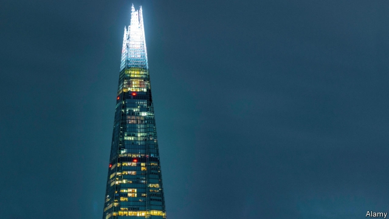
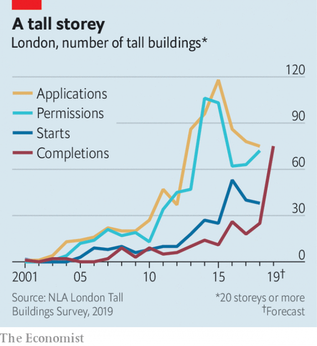

###### Of plonkers and planners

# Britain’s tower blocks, once symbols of poverty, are now for the rich 

##### London has only 360 buildings of 20 storeys or more. But 540 more are in the pipeline, with a spike in completions due this year 

 

> Mar 23rd 2019 

TO THEIR FIRST residents, the tower blocks British councils built in the 1950s and 1960s were symbols of post-war aspiration, homes that seemed to offer in all senses the chance to go up in the world. But by the 1980s they were so stigmatised that the Trotter family, of the television comedy “Only Fools and Horses”, dreamed of moving from their high-rise flat in Nelson Mandela House to a proper home with a garden. “What chance do we stand?” asked Del Boy, a trader whose empire supposedly sprawled from New York to Paris via Peckham. “You need to have nine kids and speak with a foreign accent.” 

Residents are finally moving out of Nelson Mandela House—or rather Harlech Tower, the 13-storey block in Acton, west London, where the series was partly shot. It is one of seven towers in the borough of Ealing that are earmarked for demolition. Yet even as the wrecking ball nears, cranes are at work across the road. London has only 360 buildings of 20 storeys or more. But another 540 or so are in the pipeline, with a spike in completions due this year (see chart). And whereas Britain’s first generation of towers became synonymous with poverty, many of the new ones are totems of wealth. 

Cathedral spires and town halls dominated British skylines until the 1950s. In many cities they still do. According to the Council on Tall Buildings and Urban Habitat (CTBUH), an industry association, Britain has 20 skyscrapers taller than 150m, only five more than North Korea (and 761 fewer than America). But between the 1950s and the early 1970s, councils threw up a few thousand shorter tower blocks, encouraged by government subsidies. They were proud of their modernist creations: Acton council issued tickets for the opening of its first tower. Those moving from slums were thrilled by relatively spacious rooms and indoor bathrooms. “We thought we was moving into Buckingham Palace,” one early resident later told the Evening Standard. 

Problems soon cropped up. Architects’ grandiose vision of “streets in the sky” became dark passages prone to crime and anti-social behaviour. As in America, “problem” estates became known for “concentrating poverty rather than alleviating it”, says Daniel Safarik of the CTBUH. Councils that could not foot the bill to maintain blocks in good condition left residents with broken lifts or vandalised communal spaces. By 2002, when a pollster asked Britons to pick out an image of their favourite home, none chose a tower. 

 

At Harlech Tower, paint peels off the walls in a chilly stairwell, adorned in places with mould. The lift doors have developed a habit of reopening as soon as they close. “They’ve been like that a couple of days,” explains Abdullah Ali, a bus driver who lives on the fourth floor. “You just need to push the doors together.” The block is no good for children, he says. His four kids share a bedroom and he worries they might fall out of a window. 

Residents will be offered new social-housing lets by 2023, before the tower and its two neighbours are torn down. David Colley of Ealing council says the blocks were built “with a limited life”, as the council borrowed against predicted rental income for 60 years. “They are basically knackered. We are better off starting again,” he says. The first wave of demolitions in the 1980s was sometimes purely for aesthetic reasons, but councils now often claim the cost of refurbishing towers outweighs the initial outlay to build anew. In 2017 North Lanarkshire council announced plans to demolish all 48 of its blocks. About 80 estates in London face the bulldozer, at least in part. 

Yet Ealing is also in the vanguard of London’s high-rise renaissance. The borough has only two buildings higher than 20 storeys, but 24 more are in the works, the highest percentage rise in London. After a fire at Grenfell Tower in Kensington killed 71 residents in 2017, some pundits predicted the end of the high-rise. Yet building has since gathered pace. The capital’s population is projected to grow by 9% between 2016 and 2026, but the city is encircled by green-belt land, where development is prohibited. New towers could help to tackle the shortage of homes. Architecture buffs searching for brutalist chic are rehabilitating some older blocks. 

This time, though, most of the high-rises are being built by private developers for private buyers. The first of these new flats were “seen as a luxury item” for rich people, says Peter Murray of New London Architecture, which puts on pow-wows for planners and developers. But, he says, “that’s beginning to shift now”, with more affordable housing being included in towers, and more blocks being built by housing associations. 

Architects are keen to avoid the mistakes of their forebears. Some think the answer is to build “vertical communities”, with flats nestled between restaurants and concert halls, to stop estates growing isolated. All agree maintenance is crucial. Wealthier tenants will stump up for concierges and engineers to fix the lifts. “The lights aren’t going to go out in the stairwell,” says Lynsey Hanley, author of “Estates: An Intimate History”. “The bin chutes aren’t going to catch fire.” They might even tempt Del Boy from Peckham. 

-- 

 单词注释:

1.plonker[ˈplɒŋkə(r)]:n. 傻瓜, 笨蛋, <俗>鸡巴 

2.planner['plænә]:n. 计划者, 设计者, 安排者 [机] 刨床机 

3.spike[spaik]:n. 长钉, 鞋钉, 钉状物, 尖峰状物, 穗 vt. 以大钉钉牢, 用尖物刺穿, 阻止, 弃置不用 [计] 尖峰信号 

4.completion[kәm'pli:ʃәn]:n. 完成 [经] 完井, 结束, 完工 

5.aspiration[.æspә'reiʃәn]:n. 热望, 志向, 渴望 [医] 吸入; 吸[引], 吸引术 

6.stigmatise['stɪgmətaɪz]:vt. 使受耻辱, 指责, 污辱 

7.trotter['trɔtә]:n. 小跑步的马, 快步走的人, 猪脚, (谑)脚 

8.nelson['nelsn]:n. (摔跤用语)肩下握颈 

9.Mandela[mæn'delә]:纳尔逊曼德拉 Nelson, [1918, 南非黑人反种族隔离活动家] 

10.DEL[del]:[计] 数据输入语言, 作废; DOS内部命令:从磁盘上删除一个或多个文件 

11.trader['treidә]:n. 商人, 商船 [经] 交易者, 商船 

12.supposedly[sә'pәuzidli]:adv. 想象上, 看上去像, 被认为是, 恐怕, 按照推测 

13.sprawl[sprɒ:l]:vi. 伸开手足躺, 爬行, 蔓生, 蔓延 vt. 懒散地伸开, 使蔓生, 使不规则地伸展 n. 伸开手足躺卧姿势 

14.york[jɔ:k]:n. 约克郡；约克王朝 

15.Peckham[]:n. (Peckham)人名；(英)佩卡姆 

16.Harlech[]:n. (Harlech)人名；(英)哈莱克 

17.acton['æktәn]:n. 铠衣 

18.sery[]:n. (Sery)人名；(俄)谢雷；(科特)塞里 

19.borough['bә:rәu]:n. 自治的市镇, 区 

20.Ealing['i:liŋ]:伊令(英格兰东南部一城市) 

21.earmark['iәmɑ:k]:n. 耳上记号, 特征, 记号, 标记 vt. 在耳朵上做记号, 标记, 指定...作特定用途 

22.demolition[.demә'liʃәn]:n. 破坏, 毁坏, 撤销 [经] 拆毁(除,破坏) 

23.synonymous[si'nɒnimәs]:a. 同义词的, 同义的 

24.totem['tәutәm]:n. 图腾, 标志物, 崇拜物 

25.spire[spaiә]:n. 尖塔, 尖顶, 锥形体, 螺旋 vi. 突出, 耸立, 螺旋形上升 vt. 给...加塔尖 

26.skyline['skailain]:n. 天涯, 地平线, 空中轮廓线 

27.habitat['hæbitæt]:n. 栖息地, 居留地, 自生地, 聚集处 [医] 习生地, 产地, 生境, 栖所 

28.Korea[kә'riә]:n. 朝鲜, 韩国 

29.modernist['mɒdәnist]:n. 现代主义者, 现代人, 现代主义作家 

30.thril[θ'rɪl]: 联络小巷 

31.spacious['speiʃәs]:a. 广大的, 宽广的 

32.Buckingham['bʌkiŋәm]:白金汉郡[英国英格兰郡名] 

33.grandiose['grændiәus]:a. 宏伟的, 壮丽的, 夸张的 [医] 夸大的 

34.prone[prәun]:a. 俯伏的, 面向下的, 有...倾向的 [医] 旋前的, 伏的, 俯的 

35.alleviate[ә'li:vieit]:vt. 减轻, 使缓和 

36.daniel['dænjәl]:n. 丹尼尔（男子名） 

37.vandalise['vændәlaiz]:vt. 摧残(文化), 破坏(公共财产), 故意破坏 

38.communal['kɒmjunәl]:a. 公有的, 公社的 [法] 公共的, 自治体的, 巴黎公社的 

39.pollster['pәulstә]:n. 民意调查人, 民意测验经办人 

40.Briton['britәn]:n. 大不列颠人, 英国人 

41.chilly['tʃili]:a. 寒冷的, 冷淡的, 不友好的 [建] 番椒, 冷 

42.stairwell[]:n. 楼梯井 

43.adorn[ә'dɒ:n]:vt. 装饰, 使生色 

44.reopen[.ri:'әupәn]:v. 重开, 再开始, 再开 

45.Abdullah[,æb'dʌlə]:n. 阿布杜拉（人名） 

46.ALI[]:[计] 异步线路接口 

47.david['deivid]:n. 大卫；戴维（男子名） 

48.Colley[]:n. (Colley)人名；(法)科莱；(英)科利(教名Nicholas、Nicolas的昵称) 

49.rental['rentl]:n. 租费, 租金收入 a. 租赁的, 收取租金的 

50.knacker['nækә]:n. 屠马业者, 收买废屋船业者 v. 杀死, 使筋疲力尽 

51.aesthetic[i:s'θetik]:a. 美学的, 审美的, 有美感的 

52.refurbish[.ri:'fә:biʃ]:vt. 再磨光, 刷新 

53.outweigh[.aut'wei]:vt. 比...重, 比...重要, 比...有价值 

54.outlay['autlei]:n. 费用, 经费, 支出 vt. 花费 

55.anew[ә'nju:]:adv. 重新, 再 

56.Lanarkshire['lænәkʃә(r)]:拉纳克郡[英国苏格兰原郡名] 

57.demolish[di'mɒliʃ]:vt. 毁坏, 破坏, 粉碎 

58.bulldozer['buldәuzә]:n. 推土机 [化] 推土机 

59.vanguard['vængɑ:d]:n. 前锋, 先锋, 先驱 

60.renaissance[ri'neisәns]:n. 复活, 复兴, 文艺复兴 a. 文艺复兴的 

61.Grenfell[]:n. (Grenfell)人名；(英)格伦费尔 

62.Kensington[]:n. 肯辛通（美国著名电脑外设厂商）；肯辛顿（英格兰伦敦肯辛顿和切尔西区的一个地名） 

63.pundit['pʌndit]:n. 学者, 梵文学者, 博学的印度人, 权威 

64.encircle[in'sә:kl]:vt. 环绕, 围绕, 包围 

65.tackle['tækl]:n. 工具, 复滑车, 滑车, 装备, 扭倒 vt. 固定, 处理, 抓住 vi. 扭倒 

66.buff[bʌf]:n. 暗黄色, 暗黄色皮革, 人的皮肤 vt. 擦亮, 使柔软 a. 暗黄色的 

67.brutalist['bru:tәlist]:n. 野兽派(信奉美术、建筑或文学上野兽主义的人) 

68.chic[ʃi:k]:n. 漂亮, 别致的款式 a. 漂亮的, 别致的 

69.rehabilitate[.ri:hә'biliteit]:vt. 恢复原状, 修复, 使康复 [法] 恢复, 使恢复心理健康, 修复 

70.developer[di'velәpә]:n. 开发者 [计] 显影器 

71.buyer['baiә]:n. 买主, 买方 [经] 买主, 买方, 买手 

72.peter['pi:tә]:vi. 逐渐消失, 逐渐减少 

73.murray['mʌri, 'm\\:-]:n. 默里（男子名）；墨累河（澳大利亚东南部一条河流） 

74.affordable[]:[计] 普及型 

75.forebear['fɒ:bєә]:n. 祖先, 祖宗 

76.nestle['nesl]:vi. 舒适地坐定, 挨靠, 偎依 vt. 抱, 安置 

77.stump[stʌmp]:n. 残株, 树桩, 烟蒂, 讲演台 vt. 砍断, 挑战, 难住 vi. 蹒跚而走 

78.concierge[,kɔ:nsi'eәʒ]:n. 看门人, 门房 

79.lynsey[]:n. 【女名】女子名 [网络] 琳茜；林西；琳赛 

80.Hanley[]:n. (Hanley)人名；(德)汉莱；(英)汉利 

81.bin[bin]:n. (贮存谷物等的)容器, 箱子 [计] 二进制, 商业信息网 

82.chute[ʃu:t]:n. 瀑布, 斜槽 [化] 斜槽; 滑槽; 滑运道 

