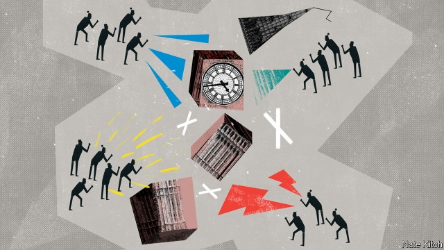

###### Bagehot

# Marching has returned as a force in British politics 

##### From Leavers and Remainers to the far left and far right, crowds are throwing their weight around again 

 

> Mar 21st 2019 

THE GREAT achievement of parliamentary democracy is to take politics off the streets. In the 18th and early 19th centuries Britain was a land of people on the march. Mobs rioted against papists and gin taxes. Protesters marched in favour of repealing the Corn Laws and extending the voting franchise. The arrival of full democracy in 1928 changed the tone of politics. Big demonstrations were few and far between. Industrial conflicts alienated the public. Professional protesters, carrying their bedraggled banners from one tiny meeting to another, became figures of fun. 

Today the crowd is re-emerging as a force in politics. Parliament Square is permanently occupied by rival armies of pro- and anti-Brexit protesters. The Labour Party’s leaders have spent most of their lives on “demos”. A gaggle of Brexit supporters has begun a “March to Leave”, from Sunderland to London. The People’s Vote campaign expects that on March 23rd hundreds of thousands of people will march in favour of “putting it to the people”, its second giant demonstration in five months. 

Things began to change in Tony Blair’s second term. In 2002 over 400,000 people, many of them country squires, protested against a ban on fox hunting. A year later 750,000 marched against the Iraq war. These demonstrations were driven in part by strong feelings about polarising issues, but also by a sense that politics had been taken over by a professional political class. The return of marching came at a time when formal participation in the political process had reached its nadir. In 2001 voter turnout reached its lowest level since the beginning of universal suffrage, at 59.4%. Party membership was a fraction of what it had been in the 1950s and 1960s. 

More recently the return of protests has been supercharged by three things. Brexit is the gift that keeps on giving when it comes to getting people riled up and on the streets. The decision to hold a referendum unleashed a volatile force: the “will of the people” (based on a single vote), which supposedly trumps the considered judgment of elected MPs. The vote was sufficiently close for Remainers to dream of reversing it if they shouted loud enough, and sufficiently decisive for Leavers to feel affronted at the thought of a re-vote. Theresa May’s serial bungling has heightened every possible contradiction between representative and direct democracy. 

The second is the rise of Jeremy Corbyn. The far left has always been contemptuous of “bourgeois democracy”. For them the great debate is whether simply to ignore Parliament (“If voting changed anything, they’d make it illegal”), or whether to treat it as just one front in the broader struggle. The Corbynites have taken the second route. They want to shift the locus of power from Parliament to broader society. In 2013 John McDonnell, now the shadow chancellor, proclaimed that “Parliamentary democracy doesn’t work for us, elections aren’t working for us” and advocated co-ordinated action with trade unions and community organisations to bring the government down. Corbynites also want to reduce MPs from representatives to mere delegates, who have to implement the will of the people (ie, the will of activists). If he ever wins power, Mr Corbyn will lead something new in British politics: a government committed to advancing its agenda not primarily in Parliament but in society at large, through co-ordinated strikes, agitation and general botheration. 

The third is the rise of social media. In “The Crowd: A Study of the Popular Mind” (1895), Gustave Le Bon accused crowds of “impulsiveness, irritability, incapacity to reason, the absence of judgment of the critical spirit, the exaggeration of sentiments” and, above all, debasing the normally civilised citizen: “isolated, he may be a cultivated individual; in a crowd, he is a barbarian.” This might sound a little overwrought when applied, say, to the People’s Vote, where the biggest post-march agitation is about whether to decamp to Itsu or Wagamama. But it applies perfectly to the virtual crowds online. The internet not only allows the likes of Tommy Robinson to reach millions of people, it also persuades otherwise civilised folk to adopt mob behaviour, bombarding their enemies with vituperative messages and embracing ever more extreme views. It would be unwise to bet that such vituperation, once normalised, will remain confined to the virtual world. 

That is why the return of crowds is bringing with it something that had long been banished from British politics: the fear of crowds. When Brexiteers like Iain Duncan Smith warn that “there will be repercussions if we don’t deliver on the Brexit vote,” it is unclear whether they are offering analysis or making threats. Mr McDonnell has repeatedly used the 18th-century device of threatening to raise a mob. In 2011 he told a rally that no Tory MP should be able to “travel anywhere in the country or show their face in public without being challenged by direct action.” After the election in 2017 he urged 1m people to “get out on the streets” to force another vote. Far-right activists wear yellow jackets not just as a gesture of solidarity, but as a threat that they will start acting like the French—smashing things up and disrupting traffic—if they don’t get what they want. This week supporters of James Goddard, a yellow-jacket wearer who stands accused of harassing Anna Soubry, an anti-Brexit MP, forced a judge to halt court proceedings and then joined other activists in storming the attorney-general’s office. 

Parliament has not acquitted itself well in the past few weeks. Ministers have accused the Speaker of bias, MPs have engaged in shouting matches and secretaries of state have voted against their own government. Yet at this low moment in Westminster’s history, it is worth remembering what a glorious role Parliament has played in replacing the politics of agitation with the politics of discussion and deliberation. A few protests every now and again can enhance democracy. But for the most part politics belongs in the debating chamber, not on the streets. 

-- 

 单词注释:

1.Bagehot[ˈbædʒət]:白芝浩；巴杰特（人名） 

2.politic['pɒlitik]:a. 精明的, 明智的, 策略的 

3.leaver['li:vә]:n. 离开者（常指学校毕业生） 

4.remainers[]:[网络] 剩余物 

5.parliamentary[.pɑ:lә'mentәri]:a. 国会的, 议会的, 议会制度的 

6.mob[mɒb]:n. 暴民, 民众, 暴徒 vt. 大举包围, 蜂拥进入, 围攻 vi. 聚众生事 

7.riot['raiәt]:n. 暴动, 喧闹, 放纵 vi. 发动, 暴动, 纵情, 放荡 vt. 浪费, 挥霍 

8.papist['peipist]:n. 教皇制信奉者, 天主教徒 

9.gin[dʒin]:n. 杜松子酒, 轧棉机, 陷阱 vt. 轧棉, 用陷阱捕 

10.protester[]:n. 抗议者, 持异议者, 拒付者 [经] 反对者 

11.repeal[ri'pi:l]:n. 废止, 撤消 vt. 废止, 撤消, 放弃 

12.franchise['fræntʃaiz]:n. 公民权, 特权, 特许经营权, 免赔额 vt. 给以特权, 给以...公民权 

13.demonstration[.demәn'streiʃәn]:n. 示范, 实证 [医] 示教, 实物教授 

14.alienate['eiljәneit]:vt. 使疏远, 离间, 转让 [法] 转让, 让与, 疏远 

15.bedraggle[bi'drægl]:vt. 弄湿 

16.Demo['demәu]:n. 演示, 样本唱片 [计] 演示 

17.gaggle['gægl]:n. 鹅群, 一群, 嘎嘎叫声 vi. 嘎嘎地叫 

18.Brexit[]:[网络] 英国退出欧盟 

19.supporter[sә'pɒ:tә]:n. 支持者, 后盾, 迫随者, 护身织物 [法] 支持者, 赡养者, 抚养者 

20.Sunderland['sʌndәlәnd]:森德兰[英国英格兰东北部港市](或译散德兰) 

21.tony['tәuni]:a. 高贵的, 时髦的 

22.squire[skwaiә]:n. 乡绅, 大地主, 治安官 vt. 随侍, 护卫 vi. 当乡绅 

23.Iraq[i'rɑ:k]:n. 伊拉克 

24.polarise['pәjlәraiz]:vi.vt. (使)极化, (使)偏振, (使)两极分化 

25.participation[.pɑ:tisi'peiʃәn]:n. 参与, 分享 [经] 参与, 参股 

26.nadir['nei.diә]:n. 天底, 最低点 

27.voter['vәutә]:n. 选民, 投票人 [法] 选民, 选举人, 投票人 

28.turnout['tә:naut]:n. 聚集的人群, 出席者, 产量 [化] 输出; 产额 

29.suffrage['sʌfridʒ]:n. 投票, 选举权, 参政权, 代祷 [法] 选举权, 投票权, 参政权 

30.membership['membәʃip]:n. 会员的资格, 全体会员, 会员数目 [法] 会员资格, 成员资格, 会籍 

31.supercharge['sju:pәtʃɑ:dʒ]:vt. 对...增压, 使超负荷, 使过度, 使过分 [化] 增压器 

32.rile[rail]:vt. 搅浑, 惹怒, 使焦急 

33.referendum[.refә'rendәm]:n. （就重大政治或社会问题进行的）全民公决，全民投票 

34.unleash[.ʌn'li:ʃ]:vt. 解开...的皮带, 发出, 发动 

35.volatile['vɒlәtail]:a. 挥发性的, 可变的, 不稳定的, 飞行的, 轻快的, 爆炸性的 n. 有翅动物, 挥发物 [计] 易失的 

36.supposedly[sә'pәuzidli]:adv. 想象上, 看上去像, 被认为是, 恐怕, 按照推测 

37.trump[trʌmp]:n. 王牌, 法宝, 喇叭 vt. 打出王牌赢, 胜过 vi. 出王牌, 吹喇叭 

38.judgment['dʒʌdʒmәnt]:n. 裁判, 宣告, 判决书 [医] 判断 

39.MP[]:国会议员, 下院议员 [计] 宏处理程序, 维护程序, 线性规划, 微程序, 多处理器 

40.decisive[di'saisiv]:a. 决定性的, 坚定的, 果断的 

41.affront[ә'frʌnt]:n. 公开侮辱, 轻蔑 vt. 公开侮辱, 冒犯, 面对 

42.theresa[ti'ri:zә]:n. 特丽萨（女子名） 

43.serial['siәriәl]:n. 分期连载作品, 连载小说 a. 连续的, 一连串的, 连载的, 分期偿还的 [计] 连续的; 串行的 

44.bungle['bʌŋgl]:v. 拙劣地工作, 粗制滥造, 把...搞糟 n. 粗劣, 失误, 笨拙 

45.heighten['haitn]:vt. 增高, 提高, 加强 vi. 升高, 变大 

46.jeremy['dʒerimi]:n. 杰里米（男子名） 

47.Corbyn[]:科尔宾（人名） 

48.alway['ɔ:lwei]:adv. 永远；总是（等于always） 

49.contemptuous[kәn'temptʃuәs]:a. 轻蔑的, 鄙视的, 瞧不起人的 

50.bourgeois[buә'ʒwɑ:]:n. 中产阶级分子, 商人, 资产阶级 a. 中产阶级的, 平庸的 n. 九点活字 

51.locus['lәukәs]:n. 轨迹；地点, 所在地 

52.john[dʒɔn]:n. 盥洗室, 厕所, 嫖客 

53.McDonnell[]:麦克唐奈（人名） 

54.chancellor['tʃɑ:nsәlә]:n. 大臣, 总理, 首相, 大使馆/领事馆的一等秘书, 司法官, 大学校长 

55.parliamentary[.pɑ:lә'mentәri]:a. 国会的, 议会的, 议会制度的 

56.organisation[,ɔ: ^әnaizeiʃən; - ni'z-]:n. 组织, 团体, 体制, 编制 

57.activist['æktivist]:n. 激进主义分子 

58.agitation[.ædʒi'teiʃәn]:n. 激动, 焦虑, 煽动, 搅动, 摇动 [化] 搅拌; 搅拌作用 

59.botheration[,bɔðә'reiʃәn]:n. 麻烦, 该死, 讨厌, 打扰, 烦恼 

60.Gustave[]:n. 古斯塔夫（男子名） 

61.LE[]:[计] 小于或等于 

62.bon[bɔ:n]:a. （法）好的 

63.impulsiveness[ɪm'pʌlsɪvnəs]:n. 易冲动 

64.irritability[.iritә'biliti]:n. 易怒, 刺激物, 兴奋性 [医] 应激性, 兴奋性, 刺激感受性, 兴奋增盛, 过敏 

65.incapacity[.inkә'pæsәti]:n. 无能力, 不适当 [医] 无能力, 机能不全 

66.exaggeration[ig.zædʒә'reiʃәn]:n. 夸张, 夸大的事物, 夸大之词 

67.sentiment['sentimәnt]:n. 感情, 感伤, 情操, 情绪, 感想, 意见 [医] 情感, 情操 

68.debase[di'beis]:vt. 贬低, 降低 

69.civilise['sivilaiz]:vt. 开化, 使文明, (非正式)教化, 使文雅, 教育, 教导 vi. 变成文明社会 

70.barbarian[bɑ:'bєәriәn]:n. 野蛮人 a. 野蛮的 

71.overwrought['әuvә'rɔ:t]:a. 过分劳累的, 过度紧张的, 神经质的, 过度兴奋的, 过分推敲的, 不自然的 

72.decamp[di'kæmp]:vi. 撤营, 逃走, 逃亡 [法] 撤退, 逃走, 逃亡 

73.ITSU[5]:一 

74.wagamama[]:[网络] 拉面道；我家妈妈；我侭 

75.online[]:[计] 联机 

76.tommy['tɒmi]:n. 配给面包, 实物工资制 [经] 实物工资制 

77.robinson['rɔbinsn]:n. 罗宾逊（男子名） 

78.bombard[bɒm'bɑ:d]:vt. 炮击, 攻击, 轰击 n. 射石炮 

79.vituperative[vi'tju:pәreitiv]:a. 责骂的, 叱责的 

80.unwise['ʌn'waiz]:a. 愚蠢的, 欠考虑的, 不明智的, 轻率的 

81.vituperation[vitju:pә'reiʃәn]:n. 谩骂, 辱骂 [法] 辱骂, 责骂, 诽谤 

82.normalise['nɔ:mәlaiz]:vt.vi. 使正常化, 恢复友好状态, 使标准化 

83.banish['bæniʃ]:vt. 驱逐, 消除 [法] 驱逐, 流放 

84.Brexiteers[]:支持英国退欧的人（Brexiteer的复数） 

85.iain[]: [男子名] [苏格兰人姓氏] 伊恩 John的盖尔语变体 

86.duncan['dʌŋkәn]:n. 邓肯（姓氏） 

87.smith[smiθ]:n. 铁匠, 金属品工匠 [机] 锻造工, 上手 

88.repercussion[.ri:pә'kʌʃәn]:n. 弹回, 反响, 反射 [医] 消退[法], 消肿[法], 浮动诊胎法 

89.unclear[.ʌn'kliә]:a. 不易了解的, 不清楚的, 含混的 

90.rally['ræli]:n. 重振旗鼓, 集合, 群众集会, 跌停回升 v. 重整旗鼓, 集合, 恢复精神, 团结, 挖苦, 嘲笑 

91.Tory['tɒ:ri]:n. 托利党党员, 保守党员, 亲英分子 a. 保守分子的 

92.MP[]:国会议员, 下院议员 [计] 宏处理程序, 维护程序, 线性规划, 微程序, 多处理器 

93.solidarity[.sɒli'dæriti]:n. 团结, 团结一致, 共同一致 [法] 团结, 共同责任 

94.disrupt[dis'rʌpt]:a. 分裂的, 中断的 vt. 使分裂, 使瓦解 

95.jame[]: 灰岩井 

96.Goddard['^ɔdә:d]:[计] 戈达德 

97.wearer['wєәrә]:n. 穿用者 

98.harass['hærәs]:vt. 使困扰, 使烦恼, 折磨 

99.anna['ænә]:n. 安娜（女子名） 

100.Soubry[]:n. 苏布赖 

101.proceeding[prәu'si:diŋ]:n. 进行, 程序, 行动, 诉讼程序, 事项 [化] 会议论文集 

102.acquit[ә'kwit]:vt. 无罪释放, 表现, 使履行 [法] 开释, 释放, 免 

103.bias['baiәs]:n. 偏见, 斜纹 a. 偏斜的 adv. 偏斜 vt. 使有偏见 [计] 偏流; 偏压; 偏磁; 偏离 

104.deliberation[di.libә'reiʃәn]:n. 熟虑, 熟思, 审议 [法] 慎重考虑, 商讨, 审议 

