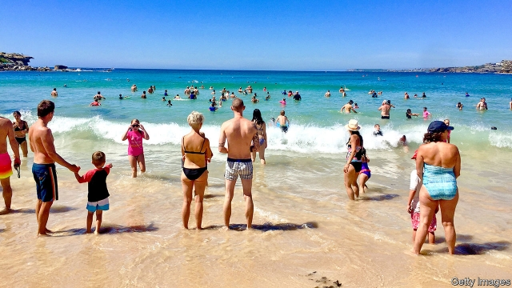

###### G’daytime television

# Relocation shows reflect poms’ enduring fascination with the antipodes 

##### A life down under remains a dream for many Britons. Yet fewer are making the move 

 

> Mar 21st 2019 

IN THE CUT-THROAT realm of reality TV, “Wanted Down Under” is a survivor. A daytime fixture that has just finished its 13th season, the BBC documentary follows Britons contemplating relocating to Australia or New Zealand. Equal parts travel, property and life-makeover programme, it has a rival, “A New Life in Oz”, on Channel 5. If a country’s TV schedules reflect its preoccupations, Britain’s must be bake-offs, island love and migration to the southern hemisphere. 

Although stories about immigration make the front pages, Britain has a long-standing emigration habit. It was a net exporter of people until 1979. And when Britons migrate, they most often go down under. No country has received more poms than Australia in the past three decades, in which an average of 30,000 a year have moved there for the long term (this excludes tourists, who also go south in droves). The second-favourite destination in the latest year, Spain, got little more than half as many. 

Despite its reputation as a destination for prisoners, Australia attracted flocks of free settlers from the 1790s. It soon entered the British imagination as a worker’s paradise, with plenty of land, jobs and meat. Charles Dickens had such great expectations of Australia that he sent several of his fictional characters—and two of his real sons—there for better lives. This fantasy continues. “I think the Australian dream is definitely mine and it has been since Kylie and Jason walked down the aisle in ‘Neighbours’ [an Australian soap opera],” said a Manchester mum recently on “Wanted Down Under”. 

Yet fewer Britons now have that dream. In 2017 only 19,000 made the hemispheric swap, down from a recent peak of 49,000 in 2006. These official figures have a high margin of error. But the decline has been fairly steady. It partly mirrors a slowdown in the total rate of emigration among Britons, which fell by 38% in the same period, as weak global economic growth provided fewer temptations to move. Australia’s economy has fared well, but its stronger currency has made moving pricier. In 2006 £1 was worth around A$2.50. Now it buys A$1.85, making it harder to swap a London flat for a Melbourne mansion. 

Paul Arthur, head of the Emigration Group, a company which helps Britons move to Australia and New Zealand, adds that until there is greater clarity regarding Britain’s position after Brexit, some of his clients will put off their moves. At least they will still have “Wanted Down Under”. The show’s producer says she is already busy at work on series 14. 

-- 

 单词注释:

1.relocation[.ri:lәu'keiʃәn]:n. 再布置, 变换布置 [经] 重新安置 

2.fascination[.fæsi'neiʃәn]:n. 令人着迷的事物, 入迷, 魅力 

3.antipode['æntipәud]:n. 正相反的事物 [化] 对映体 

4.Briton['britәn]:n. 大不列颠人, 英国人 

5.survivor[sә'vaivә]:n. 生还者, 幸存者 [法] 生还者, 生存者, 辛存者 

6.daytime['deitaim]:n. 白天, 日间 

7.fixture['fikstʃә]:n. 固定(状态), 固定物, 设备 [计] 夹具 

8.BBC[]:英国广播公司 

9.documentary[.dɒkju'mentәri]:n. 记录片 a. 文件的 

10.contemplate['kɒntempleit]:vt. 注视, 沉思, 盘算 vi. 冥思苦想 

11.relocate[ri:'lәukeit]:vt. 重新安置, 再配置, 放在新地方 [计] 再定位; 浮动 

12.zealand['zi:lәnd]:n. 西兰岛（丹麦最大的岛） 

13.oz[]:abbr. 盎司（ounce） 

14.preoccupation[pri:.ɒkju'peiʃәn]:n. 抢先占据, 先人之见, 入神 [医] 成见, 注意散漫, 心不在焉 

15.migration[mai'greiʃәn]:n. 移民, 移往, 移动 [计] 迁移 

16.hemisphere['hemisfiә]:n. 半球, 地球的半面, 大脑半球 [医] 半球 

17.emigration[.emi'greiʃәn]:n. 移民, 移居外国(或外地) [医] 血细胞渗出 

18.exporter[ik'spɒ:tә]:n. 出口商, 输出者, 出口公司 [经] 出口商, 输出者 

19.migrate['maigreit]:vi. 移动, 移往, 随季节而移居 [计] 迁移程序 

20.pom[pɒm]:n. 波美拉尼亚种小狗, 砰的一声 vi. 发砰砰声 

21.drove[drәuv]:n. 畜群 drive的过去式 

22.Spain[spein]:n. 西班牙 

23.charle[]:n. 查理（男子名）；查理（姓氏） 

24.dicken[]: [男子名] [英格兰人姓氏] 迪肯 Dick的昵称 

25.fictional['fikʃәnl]:a. 虚构的, 编造的, 小说式的 [法] 拟制的, 假定的, 虚构的 

26.kylie['kaili]:n. 回飞棒的一种 

27.jason[]:n. 詹森（男子名） 

28.aisle[ail]:n. 走廊, 侧廊, 过道 [机] 走道 

29.Manchester['mæntʃestә]:n. 曼彻斯特 

30.mum[mʌm]:n. 菊花, 沉默 a. 沉默的 vi. 演哑剧 interj. 别说话 

31.hemispheric['hemɪˌsfɪrɪk]: 半球形的 

32.slowdown['slәudaun]:n. 降低速度, 减速 

33.pricy['praisi]:a. 昂贵的, 价格高的 

34.Melbourne['melbәn]:n. 墨尔本 

35.mansion['mænʃәn]:n. 大厦, 宅邸 

36.paul[pɔ:l]:n. 保罗（男子名） 

37.arthur['ɑ:θә]:n. 亚瑟（男子名）；亚瑟王（传说中六世纪前后英国的国王, 圆桌骑士团的首领） 

38.emigration[.emi'greiʃәn]:n. 移民, 移居外国(或外地) [医] 血细胞渗出 

39.clarity['klærәti]:n. 清楚, 明晰 [化] 透明度; 透明性; 清晰性 

40.Brexit[]:[网络] 英国退出欧盟 

41.client['klaiәnt]:n. 客户, 顾客, 委托人 [计] 客户, 客户机, 客户机程序 

42.producer[prә'dju:sә]:n. 生产者, 制作者, 制作人 [化] 发生器; (炉煤气)发生炉; 制气炉; 生产者 

43.sery[]:n. (Sery)人名；(俄)谢雷；(科特)塞里 

