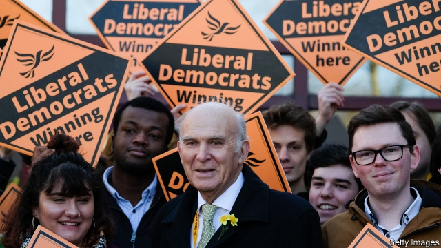

###### Hope for the hopeless

# What next for the Liberal Democrats? 

##### The party’s next leader must decide how to deal with new rival centrist parties 

 

> Mar 21st 2019 

SIR VINCE CABLE revealed his plans to quit as leader of the Liberal Democrats in the same way as he led the party: without attracting much attention. A YouTube stream of his valedictory speech at the party’s spring conference on March 17th has so far received fewer than 1,000 views. By the time he had finished, an orderly queue to replace the 75-year-old had formed. Jo Swinson, the deputy leader, and Layla Moran, the party’s education spokeswoman, who was elected only in 2017, are the bookmakers’ favourites. Sir Ed Davey, who served in the coalition government of 2010-15 and has the knighthood to prove it, is also mulling a run. 

Whoever takes over faces a tricky task. The Lib Dems, who were in government with the Tories only four years ago, putter along at barely 10% in the polls. They struggle to make the headlines—an unfortunate exception being this week, when they suspended a former leader, Lord Steel, after he said he had failed to report his “assumption” that Cyril Smith, a late Lib Dem MP, had sexually abused children. The party’s finances are shaky, with staff cuts at its headquarters before Christmas. Its opposition to Brexit has failed to return a political dividend. And new outfits such as the Independent Group (TIG) of former Labour and Tory MPs offer an alternative without the baggage that the Lib Dems picked up during their time in coalition. 

Yet pathological optimism is a prerequisite for any Lib Dem. And there exist the outlines of a path to recovery. Local elections, in which the party has a justified reputation for viciously effective campaigning and an army of volunteers that belies its polling position, are due on May 2nd. An even bigger prize is on offer later that month if Britain ends up having to hold elections to the European Parliament, which uses proportional representation. Freed from the iniquities of first-past-the-post, the Lib Dems may scoop up Remainers wanting to cast a protest vote against Brexit. If the party can start posting decent election results, donors may return. 

Some Lib Dems think the best way to achieve those results would be through an alliance with TIG. This would scoop up 38 seats in a general election, based on current polling, according to Ceri Fowler and Chris Butler of Manchester University. That would see the Lib Dems overtake the Scottish nationalists to become the third-biggest party again. At the Lib Dems’ conference, Ms Swinson argued for a close relationship, and shared a chummy panel with Anna Soubry, an ex-Tory TIGger. 

Others, including Sir Ed, want to know more about TIG’s policies first. And persuading members to approve a tie-up may be hard. Lib Dem activists are just as tribal as any other party’s footsoldiers, as anyone who has witnessed their glee club singing “Tony Blair can fuck off and die” to the tune of “American Pie” can attest. At the conference, they voted down a plan to allow non-members to vote for their leader and even balked at letting non-MPs stand for the job. 

TIGgers also have doubts. Chris Leslie, a Labour defector, has pooh-poohed the idea of jumping into bed with the Lib Dems, saying they are still tainted by their time in coalition. Privately, some of the group say the Lib Dems are done for and want nothing to do with them. Nonsense, retorts Tim Farron, an irrepressibly bouncy former leader. “You always get people who are awkward. Most people think it is a real opportunity.” 

A decent showing in May’s elections and a new leader could yet reinvigorate Britain’s exhausted fourth party. The danger is that a newer centrist option may eclipse it at the last minute. Even if things go in their favour, the Lib Dems still risk being overlooked. 

-- 

 单词注释:

1.centrist['sentrist]:n. 中间党派的成员, 温和主义者 [法] 中间派议员, 中立派议员 

2.vince[vins]:n. 文斯（男子名, Vincent的昵称） 

3.democrat['demәkræt]:n. 民主人士, 民主主义者, 民主党党员 [经] 民主党 

4.youtube[]:n. 视频网站（可以让用户免费上传、观赏、分享视频短片的热门视频共享网站） 

5.valedictory[.væli'diktәri]:a. 告别的 n. 告别辞 

6.jo[dʒәu]:abbr. 乔（女子名, 等于Joseph, Josephine） 

7.swinson[]:[网络] 胡才 

8.layla[]:n. 蕾拉（女子名） 

9.Moran[]:n. 莫兰（人名） 

10.spokeswoman['spәuks,wumәn]:n. 女发言人, 女代言人 

11.ED[]:[计] 电子设备, 密码设备, 数据结束, 工程设计, 错误检测, 外部设备 

12.Davey['deivi]:n. 戴维(David 的昵称)(m.) 

13.coalition[.kәuә'liʃәn]:n. 结合体, 结合, 联合 [经] 联合, 联盟 

14.knighthood['naithud]:n. 骑士身分, 骑士气质, 骑士 

15.mull[mʌl]:n. 软薄布, 混乱 vt. 研磨, 细想 vi. 深思熟虑 

16.tricky['triki]:a. 狡猾的, 机敏的 

17.lib[lib]:a. [口]解放的（等于liberal）；解放论者的 

18.DEM[dem]:[计] 解调器 

19.Tory['tɒ:ri]:n. 托利党党员, 保守党员, 亲英分子 a. 保守分子的 

20.putter['putә. 'pʌtә]:n. 置放者, 推车工, 轻击棒 vi. 慢条斯理地工作, 漫步, 闲荡 vt. 浪费 

21.cyril['siril]:n. 西里尔（男子名） 

22.smith[smiθ]:n. 铁匠, 金属品工匠 [机] 锻造工, 上手 

23.DEM[dem]:[计] 解调器 

24.MP[]:国会议员, 下院议员 [计] 宏处理程序, 维护程序, 线性规划, 微程序, 多处理器 

25.sexually[]:adv. 性别地；两性之间地 

26.shaky['ʃeiki]:a. 震动的, 摇晃的, 动摇的 

27.headquarter[,hed'kwɔ:tә]:vt. 将...的总部设在 

28.opposition[.ɒpә'ziʃәn]:n. 反对, 敌对, 相反, 在野党 [医] 对生, 对向, 反抗, 反对症 

29.Brexit[]:[网络] 英国退出欧盟 

30.dividend['dividend]:n. 被除数, 股利 [计] 被除数 

31.outfit['autfit]:n. 用具, 配备, 机构 vt. 配备, 供应 vi. 得到装备 

32.tig[tiɡ]:vi. 轻碰；戏弄 

33.Tory['tɒ:ri]:n. 托利党党员, 保守党员, 亲英分子 a. 保守分子的 

34.MP[]:国会议员, 下院议员 [计] 宏处理程序, 维护程序, 线性规划, 微程序, 多处理器 

35.pathological[,pæθә'lɔdʒikәl]:a. 病理学的, 由疾病引起的, (非正式)不合理的, 仅由想象引起的, 不理智的 [计] 错误的 

36.optimism['ɒptimizm]:n. 乐观主义, 乐观, 乐天 [医] 乐观主义, 乐观 

37.prerequisite[pri:'rekwizit]:a. 先决条件的, 必要的 n. 先决条件, 必备条件 

38.viciously[]:adv. 邪恶地；敌意地 

39.belie[bi'lai]:vt. 掩饰, 与...不符, 使失望 

40.representation[.reprizen'teiʃәn]:n. 表示法, 表现, 陈述, 代表 [计] 表示法指定 

41.iniquity[i'nikwiti]:n. 不公正, 不公正行为 

42.scoop[sku:p]:n. 铲子, 勺子, 穴, 口, 独家新闻 vt. 汲取, 舀取, 挖空, 抢先报道 

43.remainers[]:[网络] 剩余物 

44.donor['dәunә]:n. 捐赠人 [化] 给体; 供体 

45.alliance[ә'laiәns]:n. 联盟, 联合 [法] 同盟, 联盟, 联姻 

46.ceri[]:abbr. 教育研究与革新中心（Center for Educational Research and Innovation）；静化能源研究所（Clean Energy Research Institute）；中央电化学研究所（Central Electrochemical Research Institute） 

47.fowler['faulә]:n. 捕鸟者 

48.chris[kris]:n. 克里斯（男子名）；克莉丝（女子名） 

49.butler['bʌtlә]:n. 男管家, 司膳总管 

50.Manchester['mæntʃestә]:n. 曼彻斯特 

51.nationalist['næʃәnәlist]:n. 国家主义者, 民族主义者 

52.chummy['tʃʌmi]:a. 亲密的, 很友好的 

53.anna['ænә]:n. 安娜（女子名） 

54.Soubry[]:n. 苏布赖 

55.tigger[]:n. 跳跳虎（动画片中的一个角色） 

56.activist['æktivist]:n. 激进主义分子 

57.tribal[traibl]:a. 部落的, 宗族的 

58.footsoldier[]:na. 步兵 [网络] 足球勇士 

59.glee[gli:]:n. 欢乐, 高兴 

60.tony['tәuni]:a. 高贵的, 时髦的 

61.blair[bleә(r)]:n. 布莱尔（男子名） 

62.fuck[fʌk]:vt. 与...性交, 欺骗, 诅咒 vi. 性交 n. 性交, 些微, 杂种 interj. 他妈的, 混帐 

63.attest[ә'test]:vi. 证明, 表明, 作证 vt. 为...作证 

64.balk[bɒ:k]:n. 障碍, 错误, 失败 vt. 阻止, 错过, 推诿 vi. 逡巡不前 

65.tigger[]:n. 跳跳虎（动画片中的一个角色） 

66.leslie['lezli, 'lisli]:n. 莱斯利（男子名） 

67.defector[di'fektә]:n. 背叛者, 叛离者 [法] 变节分子, 背叛者, 开小差者 

68.taint[teint]:n. 污点, 耻辱, 感染 vt. 污染, 使腐败, 沾染, 腐蚀 

69.privately[]:adv. 秘密地；私下地 

70.retort[ri'tɒ:t]:n. 反驳, 顶嘴, 蒸馏器, 曲颈甑 vi. 反驳, 回嘴, 反击 vt. 反击, 反驳, 蒸馏 

71.tim[tim]:n. 蒂姆（男子名） 

72.farron[]:[网络] 古龙 

73.irrepressibly[ˌɪrɪ'presəblɪ]:adv. 镇压不住地, 无法抑制地 

74.bouncy['baunsi]:a. 快活的, 精神饱满的, 有弹性的, 自大的 

75.alway['ɔ:lwei]:adv. 永远；总是（等于always） 

76.reinvigorate[.ri:in'vigәreit]:vt. 使再振作, 使复兴 

77.eclipse[i'klips]:n. 日食, 月食, (地位名誉等的)消失 vt. 引起日食, 引起月食, 使黯然失色 

