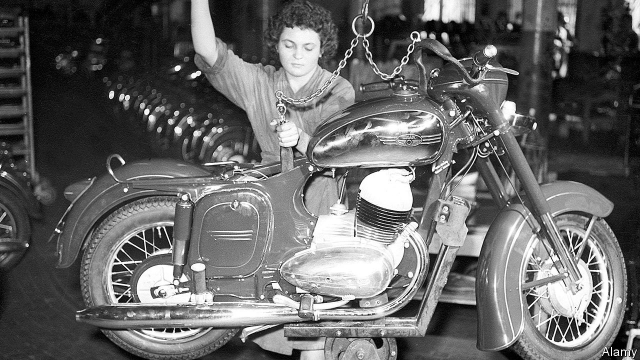

###### From Czechoslovakia, with love

# A two-wheeler reflects the stops and starts of Indian capitalism 

##### The Jawa brand makes a triumphant return to India after a half-century absence 

 

> Mar 21st 2019 

WHEN THE new Jawa motorcycle was unveiled last November, two years after the once-popular two-wheeler’s return to India was first revealed, its website crashed. Millions of Indian motorheads wanted to catch a glimpse of the original Czechoslovak design reimagined for the 21st century. An undisclosed (but modest) number of online orders were later filled in an instant. 

This triumphant return is the latest in a series of Jawa’s stops and starts, which mirror India’s post-independence economic development. In the 1950s then-high-tech motorcycles were imported from Czechoslovakia. A decade later steep tariffs forced production to move to India, and then, in 1971, further restrictions on foreign products prompted it to be renamed Yezdi. The 1980s ushered in efficient Japanese-led joint ventures, boosted from 1991 by liberalisation. These, together with Royal Enfield, a colonial-era brand with a cult following which has been in Indian hands since the 1950s, outcompeted Jawa, which was also under pressure at home in Europe from a botched nationalisation (and the fission of Czechoslovakia in 1993). The last Yezdi left the firm’s factory in Mysore in 1996. 

Jawa’s swift resurrection reflects how Indian business has changed since the Licence Raj. In 2015 Anupam Thareja, a former director of Royal Enfield, forged a joint venture with Anand Mahindra, who heads a family-controlled conglomerate. Mahindra & Mahindra makes tractors, cars and scooters but has lagged behind in motorcycles. Jawa, whose brand rights in India the petrolhead investors had purchased, offered an inroad to the premium segment. Fancier models—with bigger engines and a price tag of 200,000 rupees ($2,900) or so—account for most of the profits in India’s two-wheeler market, which is approaching 20m units a year. A recent slide in the fortunes of Royal Enfield’s parent, Eicher Motors, left an opening. 

Jawa’s long-term prospects depend on harnessing nostalgia while eradicating performance flaws. Fiat 500 and MiniCooper prove that rebooting iconic vehicles is possible; Volkswagen’s unloved new Beetle shows how it can misfire. Overwhelming demand suggests Jawa ticks the sentimental box. Mr Thareja promises that the new model goes faster and burns greener than the original. Mahindra’s nationwide network should help with parts and servicing. 

Yet the reboot also shows that India’s ride to a free-market paradise is incomplete. After enterprising types created an independent auction site for the coveted online purchase rights, Jawa made them non-transferable. Jawa lovers must instead deposit 5,000 rupees with one of 100 dealers—and hope for a call. 

-- 

 单词注释:

1.Czechoslovakia[.tʃekәuslәu'vækiә]:n. (前)捷克斯洛伐克 

2.capitalism['kæpitәlizәm]:n. 资本主义 [经] 资本主义 

3.jawa[]: [地名] [印度尼西亚] 爪哇岛 

4.triumphant[trai'ʌmfәnt]:a. 得胜的, 得意洋洋的 

5.unveil[.ʌn'veil]:vt. 揭开, 揭幕, 除去...的面纱 vi. 显露, 除去面纱 

6.motorhead[]:un. 发动机前端 [网络] 摩托头；摩托头乐队；摩托党 

7.Czechoslovak['tʃekәu'slәuvæk]:n. 捷克斯洛伐克人 a. 捷克斯洛伐克的, 捷克斯洛伐克人的 

8.reimagine[]:[网络] 再定义 

9.undisclosed['ʌndis'klәuzd]:a. 未泄露的, 保持秘密的, 不露真名的, 身分不明的 [法] 身份不明的, 隐名的, 未透露的 

10.online[]:[计] 联机 

11.sery[]:n. (Sery)人名；(俄)谢雷；(科特)塞里 

12.tariff['tærif]:n. 关税, 关税表, 价格表, 收费表 vt. 课以关税 [计] 价目表 

13.rename[.ri:'neim]:vt. 重新命名, 再命名, 给...改名 [计] 重命名; DOS内部命令:更改文件名 

14.Yezdi[]:[网络] 叶兹迪 

15.usher['ʌʃә]:n. 引座员, 招待员 vt. 引导, 招待 vi. 作招待员 

16.liberalisation[,libərəlai'zeiʃən, -li'z-]:n. 自由化；开放 

17.enfield['enfi:ld]:n. 埃菲尔德式步枪；恩菲尔德 

18.cult[kʌlt]:n. 膜拜, 礼拜式, 祭仪, 一群信徒 [医] 迷信, 巫术 

19.outcompete[]:vt. 超过；胜出 

20.botch[bɒtʃ]:v. 拙笨地修补, 糟蹋 n. 拙笨的修补, 难看的补缀 

21.nationalisation[,næʃәnәlai'zeiʃәn; -li'z-]:n. 国有化, 国营 

22.fission['fiʃәn]:n. 裂开, 分裂, 分体 [化] 裂变 

23.mysore[]:n. 迈索尔染色棉布；迈索尔（印度南部卡纳塔克邦的旧称） 

24.resurrection[.rezә'rekʃәn]:n. 复活, 复兴, 恢复, 掘墓盗尸 [法] 复活, 恢复, 修复 

25.raj[rɑ:dʒ]:n. 主权, 统治 [法] 统治, 支配, 主权 

26.forge[fɒ:dʒ]:n. 熔炉, 铁工厂 vt. 打制, 锻造, 伪造 vi. 锻造, 伪造 

27.Anand[]:n. 安纳德（印度古吉拉特邦的一个小镇, 印度代孕行为的发源地）；阿南德（男子名, 著名作家） 

28.mahindra[]: 汽车品牌名称 -（马辛德拉） - 印度 

29.conglomerate[kәn'glɒmәrit]:a. 聚成球形的, 砾岩性的 n. 集成物, 混合体, 砾岩 v. (使)凝聚成团 

30.scooter['sku:tә]:n. 小型摩托车, 踏板车 [机] 机车 

31.petrolhead['petrəl.hed]:[网络] 如一日的汽车狂热者 

32.investor[in'vestә]:n. 投资者 [经] 投资者 

33.inroad['inrәud]:n. 侵入, 得手, 侵害 [法] 袭击, 侵犯, 损害 

34.premium['pri:miәm]:n. 额外补贴, 奖金, 奖赏, 保险费 [医] 保险费 

35.rupee[ru:'pi:]:n. 卢比(印、巴等国货币单位) 

36.eicher[]: [人名] 艾彻 

37.nostalgia[nɒs'tældʒiә]:n. 乡愁, 向往过去, 怀旧之情 [医] 怀乡病 

38.eradicate[i'rædikeit]:vt. 根除, 扑灭, 根绝, 消灭 

39.flaw[flɒ:]:n. 缺点, 裂纹, 瑕疵, 一阵狂风 [化] 划痕; 裂缝; 裂纹 

40.fiat['faiæt]:n. 命令, 严命, 许可 [医] 制成, 作成 

41.reboot[ri:'bu:t]:[计] 重新启动 

42.iconic[ai'kɔnik]:[计] 图标的 

43.unloved[ʌn'lʌvd]:a. 不为人所爱的 

44.beetle['bi:tl]:n. 甲虫, 大槌 vi. 快速移动 vt. 捶 

45.misfire[.mis'faiә]:vi. 不发火, 失败 n. 不发火, 失败 

46.overwhelm[.әuvә'hwelm]:vt. 淹没, 受打击, 制服, 压倒, 使不知所措 [法] 打翻, 倾覆, 覆盖 

47.sentimental[.senti'mentl]:a. 感伤的, 感情用事的 

48.incomplete[.inkәm'pli:t]:a. 不完全的, 未完成的, 不完善的 [机] 不完全的 

49.enterprising['entәpraiziŋ]:a. 有魄力的, 有进取心的, 有事业心的 

50.auction['ɒ:kʃәn]:n. 拍卖 vt. 拍卖 

51.covet['kʌvit]:v. 妄想, 垂涎 

