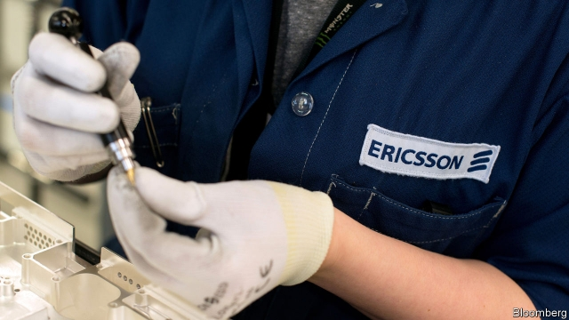

###### Ericsson and Nokia

# Are security concerns over Huawei a boon for its European rivals? 

##### The geopolitical technology saga is complicating business for the industry 

 

> Mar 21st 2019 

IN THE DAYS of pre-internet capitalism the troubles of one dominant company in an industry tended to be good news for its rivals. In today’s hyperconnected world a threatened ban by Western governments of Huawei, the Chinese market leader in telecoms gear, is also a worry for its competitors. Both Ericsson, a Swedish company, and Nokia, a Finnish one, would prefer the geopolitical saga to end, the better to focus on competing for contracts related to the launch of super-speedy “fifth generation” (5G) mobile-phone networks. 

The American government is not letting up its campaign to persuade allies to freeze Huawei out of 5G tenders. It worries that Huawei’s kit may contain “back doors”—deliberate security flaws inserted to allow Chinese spooks eavesdrop on, or attack, phone networks. Earlier this month, in a letter to Germany’s economics minister, America’s envoy to Berlin, Richard Grenell, threatened to cut back American co-operation with German security agencies if the country allowed Huawei or other Chinese firms to participate in the roll-out of 5G. Mike Pompeo, America’s secretary of state, suggested in Hungary recently that doing business with Huawei could tip decisions on where America stations troops. 

So far Britain and Germany, among others, have not yielded to American demands. Angela Merkel, the German chancellor, said on March 19th that she does not believe in excluding a company from the German market “simply because it’s from a certain country”, though a final decision is pending. Even if America prevailed in Europe, as it has in Australia and Japan, Ericsson and Nokia are unlikely to win back much of the market they have lost in recent years. Between 2015 and 2018 Huawei’s share rose from 24% to 28%; Nokia’s dipped from 20% to 17% and Ericsson’s from 15% to 13%. An escalation in the war on Huawei might prompt Beijing to retaliate by kicking Western firms out of China. 

That would be a blow to the Nordic duo. China accounted for 10% of Ericsson’s 211bn krona ($24.2bn) in global sales last year. The company runs two research and development sites in China. Nokia derives a similar share of revenues from the Chinese mainland, Hong Kong and Taiwan. Extra sales in Europe in the event of a Huawei ban would not offset losses in China, argues Pierre Ferragu of New Street Research, not least because the Chinese will launch 5G a year or two earlier. 

More important, worries Börje Ekholm, chief executive of Ericsson, a ban on Huawei would slow down the launch of 5G in Europe. The continent is already lagging three to four years behind America in 4G, the current generation of wireless technology, he says. Uncertainty over regulation, pricing and, most of all, how to deal with Huawei, is likely to slow Europe down further. European operators are lobbying hard to maintain the choice between three purveyors; many prefer Huawei wares, which are often cheaper (and some say better). 

The spectre of a Huawei ban is putting a damper on Germany’s auction for 5G mobile spectrum that kicked off on March 18th in Mainz. The auction, which drew four big operators, is expected to last several weeks. All four bidders already make extensive use of Huawei hardware, such as antennae or routers. Upgrading to 5G will require splurging on new kit. Huawei wants to be one of their principal suppliers (though it may first need to meet more stringent security requirements which the German government is mulling). In November the Chinese company opened a lab in Bonn, the base of Germany’s cyber-security regulator, where its equipment can be tested. 

Though it is possible to ban Huawei completely from Europe, its biggest market outside of China, industry insiders warn that it would be hugely complex and costly. It would be especially disruptive in countries where Huawei is deeply embedded, such as Italy, Poland and Britain, says Stéphane Téral of IHS Markit, a research firm. With only a hint of hyperbole Bengt Nordstrom of Northstream, a consultancy, likens the resulting shock to the collapse of Lehman Brothers in 2008. Most of Europe’s roughly 200 operators of mobile networks use Huawei’s 4G gear. 

Asked whether talk of a Huawei ban had any effect on the order books of Ericsson, Mr Ekholm responds that “the candid answer is no”. On March 18th TDC, Denmark’s biggest telecoms firm, confirmed that it was plumping for Ericsson over Huawei, its current equipment-maker, to build its 5G network. That deal, though, was struck before any concerns over Huawei were ever aired. So far, the entire controversy has been a headache for Mr Ekholm and his counterpart at Nokia, not a gift. 

-- 

 单词注释:

1.ericsson[]:n. 爱立信公司 

2.nokia[]:n. 诺基亚（财富500强公司之一） 

3.huawei[]: 华为 

4.boon[bu:n]:n. 恩惠 

5.geopolitical[,dʒi(:)әupә'litikәl]:[计] 地理的 

6.saga['sɑ:gә]:n. 传说, 英雄传奇, 冒险故事 

7.capitalism['kæpitәlizәm]:n. 资本主义 [经] 资本主义 

8.dominant['dɒminәnt]:a. 占优势的, 支配的 [医] 优性的, 显性的 

9.hyperconnected[,haipәkә'nektid]:超连通的 

10.telecom['telәkɔm]:telecommunication 电信 

11.Swedish['swi:diʃ]:n. 瑞典人, 瑞典语 a. 瑞典的, 瑞典人的, 瑞典语的 

12.Finnish['finiʃ]:n. 芬兰语 a. 芬兰的, 芬兰人的, 芬兰语的 

13.ally['ælai. ә'lai]:n. 同盟者, 同盟国, 助手 vt. 使联盟, 使联合, 使有关系 vi. 结盟 

14.kit[kit]:n. 装备, 工具箱, 成套工具 [计] 成套部件; 成套零件 

15.flaw[flɒ:]:n. 缺点, 裂纹, 瑕疵, 一阵狂风 [化] 划痕; 裂缝; 裂纹 

16.spook[spu:k]:n. 幽灵, 鬼 vt. 惊吓, 鬼怪般地出没 vi. 惊吓而逃窜, 受惊 

17.eavesdrop['i:vzdrɒp]:v. 偷听 n. 屋檐水, 偷听 

18.envoy['envɒi]:n. 外交使节, 特使 [法] 使者, 代表, 使节 

19.Berlin[bә:'lin]:n. 柏林, (软质)柏林毛线 

20.richard['ritʃәd]:n. 理查德（男子名） 

21.mike[maik]:vi. 偷懒, 游手好闲 n. 休息, 游手好闲, 扩音器, 话筒 

22.pompeo[]:n. (Pompeo)人名；(意)蓬佩奥 

23.Hungary['hʌŋgәri]:n. 匈牙利 

24.angela['ændʒilә]:n. 安吉拉（女子名） 

25.merkel[]: [人名] 默克尔; [地名] [美国] 默克尔 

26.chancellor['tʃɑ:nsәlә]:n. 大臣, 总理, 首相, 大使馆/领事馆的一等秘书, 司法官, 大学校长 

27.pending['pendiŋ]:a. 未决定的, 待决的, 行将发生的, 向外伸出的 prep. 在等待...之际, 直到...时为止, 在...期间, 在...过程中 

28.escalation[.eskә'leiʃәn]:n. 扩大, 增加 [经] 调查, 价格调整 

29.retaliate[ri'tælieit]:vt. 报复, 回敬 vi. 报复, 以牙还牙 

30.Nordic['nɒ:dik]:n. 北欧人, 日耳曼民族, 北欧两项滑雪 a. 北欧人的, 日耳曼民族的, 北欧两项滑雪的 

31.duo['dju:әu]:n. 二重唱 

32.krona['krәunә]:n. 克朗(瑞典及冰岛的货币单位) 

33.hong[hɔŋ]:n. （中国、日本的）行, 商行 

34.kong[kɔŋ]:n. 含锡砾石下的无矿基岩；钢 

35.taiwan['tai'wɑ:n]:n. 台湾 

36.offset['ɒ:fset]:n. 抵消, 把...并列, 旁系, 支管, 用胶印法印 vt. 弥补, 抵消, 胶印 vi. 装支管 n. 偏移量 [计] 偏移量 

37.pierre[pi(:)'eә, peә]:n. 皮埃尔（男子名） 

38.ekholm[]:[网络] 埃克霍尔姆 

39.uncertainty[.ʌn'sә:tnti]:n. 不确定, 不可靠, 不确定的事物 [化] 不确定度 

40.lobby['lɒbi]:n. 大厅, 休息室, 游说议员者 vi. 游说议员, 游说 vt. 游说 

41.purveyor[pә'veiә]:n. 承办伙食者, 承办商人, 征发官员 

42.ware[wєә]:n. 物品, 器具, 货物, 商品, 陶器 vt. 留心, 小心 a. 知道的, 意识到的, 留神的 

43.spectre['spektә]:n. 幽灵, 妖怪, 凶兆 

44.auction['ɒ:kʃәn]:n. 拍卖 vt. 拍卖 

45.spectrum['spektrәm]:n. 光谱, 范围, 系列 [化] 光谱 

46.Mainz[maints]:美因兹[德意志联邦共和国西部城市](或译美因茨, 莱茵兰-法耳次州首府) 

47.bidder['bidә]:n. 出价人, 投标人 [经] 投标人, 出价人, 投标商 

48.antennae[æn'teni:]:pl. 天线, 触须, 触角 

49.router['ru:tә(r), 'raj-]:[计] 路由器 

50.upgrade['ʌpgreid]:n. 上坡, 升级, 上升 adv. 往上 vt. 使升级, 提升, 改良品种 vi. 升级 [计] 升级 

51.splurge[splә:dʒ]:n. 炫耀, 夸示 vi. 炫耀, 卖弄, 挥霍 vt. 挥霍 

52.supplier[sә'plaiә]:n. 供应者, 供给国, 供应商 [化] 承制厂; 供应厂商 

53.stringent['strindʒәnt]:a. 迫切的, 严厉的, 银根紧的 [医] 约束的, 紧迫的 

54.mull[mʌl]:n. 软薄布, 混乱 vt. 研磨, 细想 vi. 深思熟虑 

55.Bonn[bɒn]:n. 波恩 

56.regulator['regjuleitә]:n. 调整者, 校准者, 校准器, 调整器, 标准钟 [化] 调节剂; 调节器 

57.insider['in'saidә]:n. 内部的人, 权威人士, 知道内情的人 [经] 熟悉内情者 

58.hugely['hju:dʒli]:adv. 巨大地, 非常地 

59.disruptive[dis'rʌptiv]:a. 分裂的, 破坏(性)的 [计] 击穿的, 中断的 

60.embed[im'bed]:vt. 使插入, 使嵌入, 使深留脑中 [计] 嵌入 

61.Poland['pәulәnd]:n. 波兰 

62.ih[]:abbr. 测量端（Instrument Head）；间接加热（Indirect Heating）；反时针（Inverted Hour） 

63.Markit[]:un. 拍号 [网络] 麦盖提；马基特经济研究公司；编撰机构 

64.hyperbole[hai'pә:bәli]:n. 夸张法 

65.bengt[]:n. (Bengt)人名；(瑞典、丹)本特 

66.nordstrom[]:[网络] 诺德斯特龙；诺德斯特姆；诺德斯特姆公司 

67.Northstream[]:[网络] 北溪管道 

68.consultancy[]:n. 商量, 协商, 磋商, 会诊, 与...商量, 咨询, 请教, 找(医生)看病, 查阅, 考虑 [经] 咨询业务, 咨询服务 

69.liken['laikәn]:vt. 比喻, 比拟 

70.lehman[]:n. 雷曼（姓氏） 

71.candid['kændid]:a. 坦白的, 率直的, 公正的 

72.tdc[]:abbr. 上死点（Top Dead Center）；技术资料中心（Technical Data Centre） 

73.plump[plʌmp]:a. 圆胖的, 丰满的, 直接下落的, 直率的 vt. 突然放下, 支持, 使丰满, 使鼓起 vi. 扑通落下, 投票赞成, 变丰满, 鼓起 adv. 沉重地, 突然地, 直截了当地 

74.controversy['kɒntrәvә:si]:n. 论争, 辩论, 论战, 争论 [法] 论战, 争论, 争吵 

75.counterpart['kauntәpɑ:t]:n. 副本, 复本, 配对物, 相应物 [经] 副本, 正副二份中之一 

