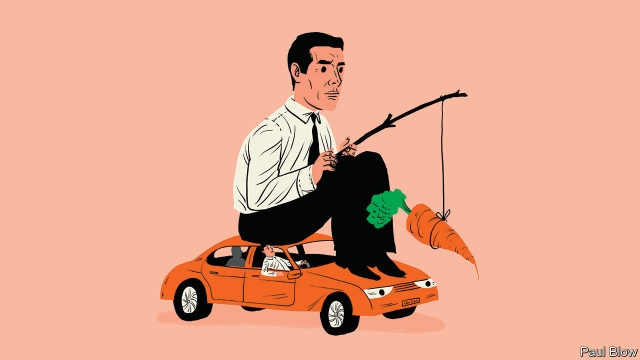

###### Bartleby

# Drivers wanted 

##### Ride-hailing apps try to burnish their image 

 

> Mar 21st 2019 

IS THERE AN app for cognitive dissonance? Most consumers who have tried ride-hailing services find them cheap and convenient. But many worry that, because drivers are classified as independent contractors, they have fewer rights than normal employees. That treatment helps create the flexibility and low cost that consumers crave. However, it has also given the gig economy a slightly dubious reputation. 

Now the ride-hailing companies are falling over themselves to proclaim that they treat their drivers well. Lyft, which launched the roadshow for its initial public offering (IPO) on March 18th, claimed in its prospectus that “we focus on providing drivers with a best-in-class experience”. It offers career coaches and “education resources” and is also paying a cash bonus to drivers who have undertaken more than 10,000 rides. Shares in the IPO have been put aside just for the drivers to invest in. 

Uber’s rapid expansion has been dogged for years by legal battles over the employment status of its drivers. As The Economist went to press, the firm was expected to face yet another challenge in the British courts. A group of drivers argue that they have been denied access to data (despite a request under the EU’s General Data Protection Regulation) on issues such as their working time and performance ratings. 

Travis Kalanick, Uber’s founder, had an aggressive management style. But he was ousted in 2017. Dara Khosrowshahi, the cuddlier chief executive who replaced him, has been trying to show that the company’s culture has changed for the better. This seems timely given that Uber is also expected to launch an IPO this year. 

Last year, in partnership with AXA, Uber created insurance policies for drivers across the EU, covering sickness, injury and payments for maternity and paternity benefits. Uber bore the cost. Similar programmes are available in Egypt, Pakistan, Saudi Arabia and South Africa. Medical insurance in America is available, too, although this does require the drivers to pay a per-mile levy. 

Also in America, Uber drivers who have notched up more than 3,000 trips can take up the offer of an online degree at Arizona State University on the company’s dime. This benefit, which is dependent on their customer rating, can be transferred to a loved one or a dependant. 

Being nice to the drivers makes sense for three reasons. First, there is competition in the ride-hailing market, not just between Lyft and Uber but from services like Ola and Gett. Drivers may use more than one platform and can switch to the service that treats them best. Second, brand reputation matters. At the height of Uber’s troubles in 2017, the hashtag “#deleteUber” was trending on Twitter. 

Third, companies that list on the market have to convince institutional investors to buy their shares. Many asset managers nowadays pay more attention to social and governance issues, which might restrict their willingness to buy shares in companies that are perceived to have a rancorous relationship with their contractors. 

All this makes Uber an interesting test case in brand management. Attempts to woo drivers carry long-term risks. The more benefits the ride-hailing apps offer, the more their drivers may start to resemble employees, rather than contractors, in the eyes of the courts. 

Whatever the courts decide, it is hard to see Uber’s ride-hailing model disappearing for good. Many drivers prefer it to paying upfront (often a lot) for a traditional taxi licence. 

A study* of drivers in London finds that they earn around £11 ($14.50) an hour (after costs), more than the living wage, and more than a third of them vary their working hours by more than 50% from week to week. These drivers report higher levels of life satisfaction than workers in general, probably reflecting their independence. But as with other freelancers, this independence leads to irregular incomes that make Uber drivers more anxious than those in regular work. 

Ride-hailing apps present a classic version of a policy trade-off. Society can choose from three options—cheap services, employees’ flexibility and full workers’ rights—but it cannot have all three. Consumers and lawmakers will have to work out which to sacrifice. 

* “Uber happy? Work and well-being in the gig economy”, by Thor Berger, Carl Benedikt Frey, Guy Levin and Santosh Rao Danda 

-- 

 单词注释:

1.bartleby[]:[网络] 巴特比；巴特白；老板是空气 

2.APP[]:[计] 应用, 应用程序; 相联并行处理器 

3.burnish['bә:niʃ]:vt. 擦亮, 打磨, 磨光 vi. 磨光发亮 n. 光辉, 光泽 

4.cognitive['kɒgnitiv]:a. 认知的, 认识的 

5.contractor['kɒntræktә]:n. 立契约的人, 承包商 [化] 承包者; 承包工厂 

6.flexibility[.fleksi'biliti]:n. 弹性, 适应性 [计] 灵活性; 适应性 

7.crave[kreiv]:v. 渴望, 热望, 恳求 

8.gig[gig]:n. 旋转物, 轻便双轮马车, 赛艇, 鱼叉, 记过, 爵士乐演奏会 vi. 乘轻便双轮马车, 乘快艇, (用鱼叉)叉鱼 vt. (用鱼叉)叉, 刺激, 记过 

9.dubious['dju:biәs]:a. 可疑的, 不确定的 

10.lyft[]:[网络] 散落 

11.roadshow[ˈrəʊdʃəʊ]:n. （由广播电台、杂志或公司组织的）路演, 巡回演出; 巡回演出; 巡回宣传（或竞选）团队 

12.ipo[]:abbr. 首次公开募股（Initial Public Offerings）；初次公开发行（Initial Public Offering） 

13.prospectus[prәs'pektәs]:n. 创办计划书, (内容)说明书, 内容简介 [经] (募债)说明书 

14.statu[]:[网络] 状态查看；雕像；特级雪花白 

15.economist[i:'kɒnәmist]:n. 经济学者, 经济家 [经] 经济学家 

16.datum['deitәm]:n. 论据, 材料, 资料, 已知数 [医] 材料, 资料, 论据 

17.rating['reitiŋ]:n. 等级, 额定功率, 责骂 [经] 等级评定 

18.travis['trævis]:n. 崔维斯合唱团；特拉维斯（男子名） 

19.founder['faundә]:n. 创立者, 建立者 vt. 使沉没, 使摔倒, 弄跛, 浸水, 破坏 vi. 沉没, 摔到, 变跛, 倒塌, 失败 

20.oust[aust]:vt. 逐出, 罢黜, 剥夺, 驱逐 [法] 驱逐, 剥夺, 免职 

21.dara[]:n. 达拉（女子名） 

22.cuddly['kʌdli]:a. 可爱的, 适于搂抱的, 喜欢拥抱的, 可拥抱的 

23.timely['taili]:a. 及时的, 适时的 adv. 及时地 

24.uber['ju:bә]:[医] 乳房 

25.partnership['pɑ:tnәʃip]:n. 合伙, 合股, 合作关系 [经] 合伙(合作)关系, 全体合伙人 

26.Axa['æksə]:abbr. 法国安盛（AXA Financial , Inc） 

27.EU[]:[化] 富集铀; 浓缩铀 [医] 铕(63号元素) 

28.maternity[mә'tә:niti]:n. 母性, 怀孕, 妇产科医院 a. 产妇的 

29.paternity[pә'tә:niti]:n. 父亲身份, 父系血统, 创始人(身份), 来源, 出处 [医] 父权, 亲权; 父系 

30.Egypt['i:dʒipt]:n. 埃及 

31.Pakistan[.pɑ:ki'stɑ:n]:n. 巴基斯坦 

32.saudi['sajdi]:a. 沙乌地阿拉伯（人或语）的 

33.Arabia[ә'reibiә]:n. 阿拉伯半岛 

34.levy['levi]:n. 税款, 所征的人数, 征收 vi. 征税, 课税 vt. 征收, 强求, 召集 

35.notch[nɒtʃ]:n. 刻痕, 等级, 峡谷 vt. 刻凹痕, 用刻痕计算, 赢得 

36.online[]:[计] 联机 

37.Arizona[æri'zәunә]:n. 亚利桑那州 

38.dime[daim]:n. 10分硬币(美、加) 

39.dependant[di'pendәnt]:n. 家眷, 侍从, 食客 [法] 受赡养人, 家庭负担 

40.ola[]:abbr. occipito-laeva anterior 左前枕骨 

41.gett[]:abbr. Group of European manufactures for the advancement of Turbine Technology 欧洲轮机技术制造商集团 

42.hashtag['hæʃtæg]:n. 井号(#)标签（微博twitter中用来标注线索主题的标签） 

43.twitter['twitә]:n. 啁啾, 唧唧喳喳声 vi. 啭, 啁啾, 颤抖 vt. 嘁嘁喳喳地讲, 抖动 

44.institutional[.insti'tju:ʃәnәl]:a. 制度的, 公共机构的, 学会的 [法] 组织机构的, 制度的, 公共机构的 

45.investor[in'vestә]:n. 投资者 [经] 投资者 

46.asset['æset]:n. 资产, 有益的东西 

47.governance['gʌvәnәns]:n. 统治, 统辖, 管理 [法] 统治, 管理, 支配 

48.rancorous['ræŋkәrәs]:a. 深恨的, 怀恶意的 

49.upfront[ˌʌpˈfrʌnt]:a. 正直的, 坦率的; 最前面的, 首要的; 在前面的; 预先的 adv. 在最前面; 提前支付（工资） 

50.freelancer[]:n. 自由记者；自由作家 

51.cannot['kænɒt]:aux. 无法, 不能 

52.lawmaker[lɒ:'meikә]:n. 立法者 

53.Thor[θɒ:]:n. 托尔(雷神) 

54.Berger['bә:dʒә]:伯杰(姓氏) 

55.Carl[kɑ:l]:n. 卡尔（男名） 

56.benedikt[]:贝内迪克特（人名） 

57.Frey[frei]:n. 弗雷(兴旺、爱情、和平之神) 

58.levin['levin]:n. 闪电 

59.santosh['sæntɒʃ]: [体]知足 

60.rao[]:abbr. 右前斜位（right anterior oblique） 

61.danda[]:[网络] 竹杖；台十六线；棍号 

