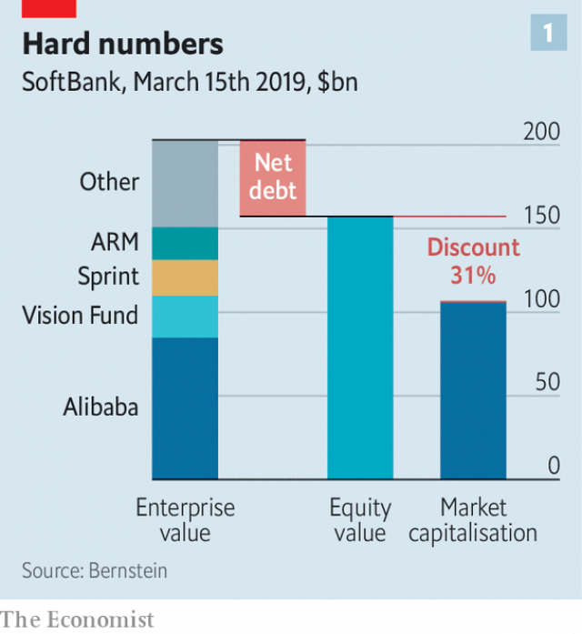
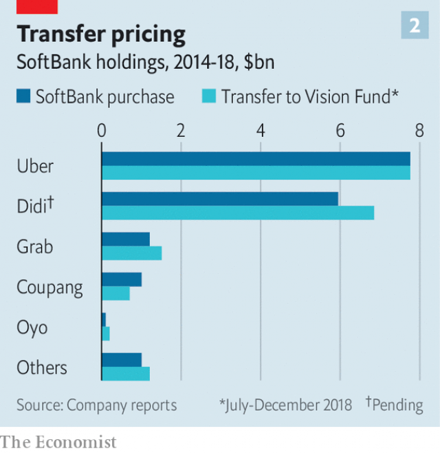

###### Clouded vision

# Masayoshi Son prepares to unleash his second $100bn tech fund 

##### Volatility in tech stocks, the Khashoggi scandal and frictions over governance have changed the mood around the Vision Fund 

 

> Mar 21st 2019 

IT BEGAN WITH one of the most lucrative investment pitches in history. In September 2016 Masayoshi Son, boss of SoftBank, a Japanese internet and telecoms firm, painted a picture for Muhammad bin Salman, then Saudi Arabia’s deputy crown prince, of how his country might be transformed by technology. The prince was wooed. “45 minutes. 45 billion dollars. So $1bn per minute,” exulted Mr Son. 

Nearly two and a half years on, Mr Son has disbursed or pledged $70bn of the $100bn vehicle that Prince Muhammad’s billions seeded. The Vision Fund, as it is known, owns stakes in around 70 young tech companies, including household names like WeWork, a property startup, and Slack, a workplace-messaging app. A big bet on ride-hailing—with stakes in Uber, Grab, a Singaporean firm that operates across South-East Asia, Ola, an Indian outfit, and China’s champion, Didi—collectively covers most of the world. A fresh injection of $1.46bn into Grab on March 5th lifted its ride-hailing holdings to $23bn. 

The scale of Mr Son’s project upended the cosy world of Silicon Valley venture-capital (VC) firms. Its unspent $30bn alone is four times the size of the next-biggest pot of VC cash. So when Mr Son recently said that he wants to raise a new $100bn fund every two or three years, investors struggling to comprehend how the first one operates did not take him all that seriously. 

Now SoftBank has begun the process of raising Vision Fund 2. No terms or structure for a second giant fund have been finalised, meaning it cannot yet be officially marketed. But options are being explored. The plan is to raise up to $100bn. The sum could also be lower, say people familiar with the situation. 

The fundraising will follow a difficult five months for Vision Fund 1. By the end of February its assets had increased in value by 25-30%, producing returns for all its limited partners: Saudi Arabia’s Public Investment Fund (PIF), the country’s sovereign-wealth fund, which is contributing the $45bn; SoftBank, which put in $28bn; Mubadala, an arm of Abu Dhabi’s government, which added a further $15bn; and a handful of firms, including Apple and Japan’s Sharp, which invested $1bn each. But a rout in listed internet firms’ share prices late last year exacerbated worries that the fund might have invested at the peak of the tech boom. Meanwhile, Mr Son’s pact with Prince Muhammad entangles it in a geopolitical scandal: the murder last October in Turkey of a Saudi journalist, Jamal Khashoggi, by a team of Saudi operatives, on what Western spooks believe were the prince’s orders. And there are reports of friction between the Vision Fund and the PIF. 

The fund’s daily task is still to hand out cash to entrepreneurs. Four big wagers in the past six months are archetypal: all were on online businesses with aspirations to dominate regional or global markets. In November it put $2bn into Coupang, South Korea’s largest online retailer. A month later it led a $1.1bn round in Tokopedia, an Indonesian online retailer. In February it led another, totalling $1bn, for Flexport, an American logistics firm with the modest goal of creating the “operating system for global trade” by letting retailers and manufacturers arrange ocean and air freight as easily as travel websites let consumers book flights. Chehaoduo, a Chinese firm which aims to improve the experience of buying second-hand cars online, recently received a Vision Fund injection of $1.5bn. 

Assessing the fund’s performance will take years; it runs until 2029. But 2019 will be crucial. The initial public offering of Lyft, Uber’s rival in North America, is the starting gun in what promises to be a busy year for tech listings. Uber, Didi and Slack all look poised to enter the race soon. Their performance will be essential to SoftBank, which Mr Son is transforming into a tech-investing firm. The Vision Fund and its little sister, the Delta Fund (where the Didi stake is parked), make up 44% of SoftBank’s operating income. Small wonder Mr Son is keen on a sequel. 

Raising the money for the second fund will take more than a 45-minute sales pitch. Even if Prince Muhammad were ready to sign over another $45bn, SoftBank might not want it because of reputational risk. SoftBank’s December sale of part of its Japanese mobile unit, plus other resources, means it can contribute around $24bn to the next fund. The rest would need to come from outside investors such as big sovereign-wealth funds. They would shy away from anything that took most of its money from Saudi Arabia, says a person close to one such vehicle. One American politician has called for startups to reject Saudi cash. 

In the kingdom, fallout from the Khashoggi murder appears to have emboldened bureaucratic resistance to the crown prince. The PIF’s professional investing staff had always looked askance at his pledge of $45bn, which bypassed their processes for allocating money. 

Matters came to a head in an act of defiance late last year, when the PIF and Mubadala reportedly used their clout to deprive WeWork of billions of dollars it was about to receive from the Vision Fund and SoftBank. According to reports, Mr Son’s plan had been to put another $16bn into the co-working firm, which many analysts and investors think is overvalued. On January 8th WeWork announced that it was getting only $2bn. That investment was reportedly done at a $42bn valuation. To justify that you must believe that American businesses will stampede en masse towards co-working or “managed space”, observes Chris Lane of Bernstein, a research firm. Co-working as a proportion of all office space would need to rise from 5% in 2017 to nearly a third by 2030. 

In recent weeks people familiar with the PIF’s views have briefed the Wall Street Journal on concerns about the Vision Fund’s governance. In public the PIF supports the fund, and its $45bn is committed. “There is no misunderstanding or conflict with the PIF,” says Rajeev Misra, chief executive of SoftBank Investment Advisors (SBIA) which oversees the Vision Fund. According to people who know the PIF, the fund is one of its best-performing assets. 

Yet reports of the PIF’s discontent have drawn attention to three interrelated problems that perplex other investors, too. First is Mr Son’s control over the Vision Fund’s investment decisions. He and Mr Misra are its only top decision-makers. Usually VC firms have several such “key men”. By early 2017 the fund had secured billions of dollars but relatively few people or processes. Usually the team comes first, then the money. Now it has the staff, and legally mandated procedures for vetting firms, signing off on investments, preventing conflicts of interest and so on. But interviews with entrepreneurs suggest that things may not have changed all that much. “His team did loads of due diligence on us but it’s Masa’s whim at the end of the day,” says the founder of a firm which the fund backed this year, referring to Mr Son by his sobriquet. People familiar with the fund say they know of cases where Mr Son was overridden, but cannot cite examples because it could damage young firms. 

Then there are Mr Son’s deeply held convictions about technology, which make some SoftBank shareholders worry that he may be overvaluing unicorns (unlisted startups valued at $1bn or more). The Vision Fund is often the sole investor in a financing round. It therefore sets its own prices. It injects far more capital than most VC firms can marshal, so Vision Fund startups had no need to test the market late last year. The share price of Nvidia, a rare listed firm in the Vision Fund, has fallen by 39% since early October, and the fund disposed of its stake. But the tech sell-off provoked no big write-downs of unlisted investments (or none that has been individually disclosed). There must have been cases where, if a new funding round had been required, it would have been a “down-round”, where a new injection of capital values a firm lower than an earlier one, says Mr Lane of Bernstein. 

The stockmarket, for its part, values SoftBank itself at a steep discount to the sum of its listed constituents (see chart 1), despite a $5.5bn share buy-back in February. Worries that Mr Son is paying over the odds are thought to be a big factor. Take WeWork: when Mr Son slashed his investment to $2bn, SoftBank’s shares leapt by 6%. 

 

A third concern is SoftBank’s habit of buying stakes in startups, “warehousing” them on its balance-sheet and transferring them to the Vision Fund, usually at a higher price, occasionally at a lower one. In the six months to the end of 2018 SoftBank transferred 11 investments, including stakes in Uber and Grab, into the Vision Fund, netting $300m (see chart 2). A stake in Didi bought by SoftBank in 2017 for $5.9bn will soon go to the fund for $6.8bn. 

 

There are two reasons for such transfers: the PIF’s other investments, and Mr Son’s need for speed. His $7.7bn stake in Uber, for example, moved from SoftBank to the Vision Fund late last year after around eight months of sitting on SoftBank’s balance-sheet (in that case SoftBank made no gain). The PIF had a $3.5bn investment in the ride-hailing firm from 2016 and was wary of increasing its exposure, according to people familiar with the situation. The PIF’s Uber stake also meant it worried about Mr Son’s investments in Uber’s competitors—Didi, Grab and Ola. They all took time to go into the fund. 

The Vision Fund’s investing processes take time. If Mr Son wants approval faster than limited partners can mobilise capital—for instance to fend off a rival VC fund ready to pounce on a choice asset—he gets it done through SoftBank, says a person who knows him, adding admiringly, “you gotta love him.” 

Transfers of assets are disclosed to SoftBank’s board and approved by the Vision Fund’s three-person investment committee. But Mr Son has clout on both sides of the transaction. He sits on SoftBank’s board as chief executive. Vision Fund’s triumvirate consists of him, Mr Misra and another SoftBank employee. People from the PIF, Mubadala and other limited partners attend investment-committee meetings but only as observers. The PIF wields a veto, but solely over investments exceeding $3bn. 

People close to the Vision Fund and SoftBank say that warehousing is likely to diminish. The ride-hailing portfolio has now mostly moved to the fund and a $3bn lending facility has been set up to let Mr Son move quickly without calling on SoftBank’s balance-sheet. Governance is being tightened; the fund is interviewing potential independent non-executive directors to sit on the board of SBIA, according to a person familiar with the situation. Messrs Son and Misra have every reason to ensure that the Vision Fund’s procedures are pristine; potential investors in Vision Fund 2 will scrutinise how disciplined the first fund has been in allocating capital. 

The new fund is also likely to avoid the original’s overdependence on two big outside investors. SoftBank would prefer a diverse pool of backers; ideally, none would carry outsized clout, says an investor. The firm also wants its arrangements to become more “normal”, in the mould of Blackstone or KKR, two veteran asset managers. The relationship between Vision Fund 2 and SoftBank would be more “arms-length”; transfers between them would occur infrequently, if ever. People close to the first fund insist that the operation is growing up. That claim will be put to the test. 

-- 

 单词注释:

1.masayoshi[]:[网络] 正义；正义大师；正义作 

2.unleash[.ʌn'li:ʃ]:vt. 解开...的皮带, 发出, 发动 

3.tech[tek]:n. 技术学院或学校 

4.volatility[.vɒlә'tiliti]:n. 挥发性, 挥发度, 轻快, 易变, 短暂 [计] 变更率 

5.khashoggi[]:卡舒吉 

6.governance['gʌvәnәns]:n. 统治, 统辖, 管理 [法] 统治, 管理, 支配 

7.lucrative['lu:krәtiv]:a. 有利益的, 获利的, 合算的 

8.softbank['sɒftbæŋk]: 日本最大的软件销售商 

9.telecom['telәkɔm]:telecommunication 电信 

10.muhammad[]:n. 穆罕默德 

11.bin[bin]:n. (贮存谷物等的)容器, 箱子 [计] 二进制, 商业信息网 

12.Salman[]:n. 萨尔曼（男子名） 

13.saudi['sajdi]:a. 沙乌地阿拉伯（人或语）的 

14.exult[ig'zʌlt]:vi. 非常高兴, 欢欣 

15.disburse[dis'bә:s]:vt. 支付, 支出, 分配 [经] 支付, 支出, 偿付 

16.pledge[pledʒ]:n. 诺言, 保证, 誓言, 抵押, 信物, 保人, 祝愿 vt. 许诺, 保证, 使发誓, 抵押, 典当, 举杯祝...健康 

17.startup[]:[计] 启动 

18.slack[slæk]:n. 松弛, 松懈, 淡季, 闲散, 家常裤 a. 松弛的, 不流畅的, 疏忽的, 无力的, 呆滞的, 软弱的, 漏水的 adv. 马虎地, 缓慢地 vt. 放松, 使缓慢 vi. 松懈, 减弱, 松弛 

19.APP[]:[计] 应用, 应用程序; 相联并行处理器 

20.uber['ju:bә]:[医] 乳房 

21.grab[græb]:n. 抓握, 掠夺, 强占, 东方沿岸帆船 vi. 抓取, 抢去 vt. 攫取, 捕获, 霸占 

22.singaporean[,siŋ^ә'pɔ:riәn]:n. 新加坡人 

23.ola[]:abbr. occipito-laeva anterior 左前枕骨 

24.outfit['autfit]:n. 用具, 配备, 机构 vt. 配备, 供应 vi. 得到装备 

25.holding['hәuldiŋ]:n. 把持, 支持, 保持 [法] 租借地, 占有物, 拥有的财产 

26.upend[ʌp'end]:v. 颠倒, 倒放 

27.silicon['silikәn]:n. 硅 [化] 硅Si 

28.VC[]:[计] 虚拟计算机 

29.unspent['ʌn'spent]:a. 没有用完的, 未耗尽的 

30.investor[in'vestә]:n. 投资者 [经] 投资者 

31.comprehend[.kɒmpri'hend]:vt. 理解, 包括 

32.finalise[]:vt. 把(计划)最后定下来, 定稿 [经] 使...结束 

33.cannot['kænɒt]:aux. 无法, 不能 

34.officially[ә'fiʃәli]:adv. 作为公务员, 职务上, 官方地 

35.fundraising['fʌndˌreɪzɪŋ]:n. 筹款, 募款 a. 筹款的 

36.asset['æset]:n. 资产, 有益的东西 

37.PIF[]:程序信息文件 [计] 程序信息文件 

38.Mubadala[]:[网络] 穆巴达拉发展公司；莱发展公司；阿布扎比国家投资基金 

39.abu[]:abbr. 亚洲广播联盟（Asian Broadcast Union） 

40.rout[raut]:n. 溃败, 大败, 乌合之众, 盛大晚会 vt. 使溃败, 使败逃, 打垮, 用鼻拱, 挖起, 搜, 唤起 vi. 用鼻拱地, 搜 

41.exacerbate[ek'sæsәbeit]:vt. 使恶化, 使增剧, 激怒, 使加剧 

42.pact[pækt]:n. 契约, 协定, 条约 [化] 合同 

43.entangle[in'tæŋgl]:vt. 使纠缠, 卷入, 使混乱 

44.geopolitical[,dʒi(:)әupә'litikәl]:[计] 地理的 

45.Jamal[]:n. 贾马尔（男子名） 

46.operative['ɒpәrәtiv]:a. 动作的, 运转的, 有效的, 关键的, 手术的 n. 技工, 侦探 

47.spook[spu:k]:n. 幽灵, 鬼 vt. 惊吓, 鬼怪般地出没 vi. 惊吓而逃窜, 受惊 

48.entrepreneur[.ɒntrәprә'nә:]:n. 企业家, 主办人 [经] 承包商, 企业家 

49.wager['weidʒә]:n. 赌注, 赌博, 赌物 vt. 下赌注, 向...保证 vi. 打赌 

50.online[]:[计] 联机 

51.aspiration[.æspә'reiʃәn]:n. 热望, 志向, 渴望 [医] 吸入; 吸[引], 吸引术 

52.regional['ri:dʒәnәl]:a. 地方的, 地域性的 [医] 区的, 部位的 

53.retailer['ri:teilә]:n. 零售商人, 传播的人 [经] 零售商 

54.Indonesian[.indәu'ni:ʒәn]:a. 印尼的 n. 印尼人, 印尼语群 

55.logistic[lәu'dʒistik]:a. 逻辑的, 后勤学的 

56.lyft[]:[网络] 散落 

57.listing['listiŋ]:[计] 列表, 清单, 编目 [经] 挂牌, 上市, 编表 

58.Didi[]:n. 迪迪（足球运动员名） 

59.poise[pɒiz]:n. 平衡, 均衡, 姿势, 镇静, 安静, 砝码 vt. 使平衡, 使悬着, 保持...姿势 vi. 平衡, 悬着, 准备好 

60.delta['deltә]:n. 三角洲, 希腊字母的第四个字 [医] δ(希腊文的第四个字母), 丁种, 三角, 三角形区 

61.sequel['si:kwәl]:n. 继续, 续集, 后果 [计] 结构的英语查询语言 

62.reputational[,repju'teiʃən]:a. reputation（名声, 声誉）的变形 

63.Arabia[ә'reibiә]:n. 阿拉伯半岛 

64.fallout['fɒ:laut]:n. 原子尘的降下, 辐射性微尘, 原子尘, 附带结果 [医] [放射尘]回降 

65.embolden[im'bәuldn]:vt. 使大胆, 使有胆量 

66.alway['ɔ:lwei]:adv. 永远；总是（等于always） 

67.askance[ә'skæns]:adv. 怀疑地, 斜眼看 

68.bypass['baipɑ:s]:n. 旁路 vt. 省略, 绕过, 忽视, 回避 

69.defiance[di'faiәns]:n. 蔑视, 挑战 [法] 挑战, 藐视, 违抗 

70.reportedly[ri'pɒ:tidli]:adv. 根据传说, 根据传闻, 据报道 

71.clout[klaut]:n. 敲击, 破布 vt. 打补钉 

72.deprive[di'praiv]:vt. 剥夺, 使丧失 [法] 剥夺, 剥夺, 夺去 

73.analyst['ænәlist]:n. 分析者, 精神分析学家 [化] 分析员; 化验员 

74.overvalue[.әuvә'vælju:]:vt. 估价过高, 过分尊重, 估计过高 

75.valuation[.vælju'eiʃәn]:n. 评价, 估价, 价值判断 [经] 估价, 计价, 评价 

76.stampede[stæm'pi:d]:v. (使)惊跑, (使)蜂拥 n. 惊跑, 蜂拥 

77.en[en]:n. 字母N, (铅字)半方 prep. 在...中, 作为 

78.masse[mæ'sei]: [体]竖直挫球 

79.chris[kris]:n. 克里斯（男子名）；克莉丝（女子名） 

80.Bernstein[bә:n'stein]:[德]琥珀, 伯恩斯坦(姓氏) 

81.misunderstanding[.misʌndә'stændiŋ]:n. 误会, 误解 [法] 误解, 误会, 不和 

82.rajeev[]:[网络] 拉杰夫 

83.misra[]: [人名] 米斯拉 

84.advisor[әd'vaizә]:n. 顾问, 劝告者, 指导教师 

85.oversee[.әuvә'si:]:vt. 向下看, 了望, 监督, 偷看到 [法] 监察, 监督, 俯瞰 

86.discontent[.diskәn'tent]:n. 不满 

87.interrelate[.intәri'leit]:v. (使)相互关联 

88.perplex[pә'pleks]:vt. 使困惑, 使复杂化, 使为难 [法] 困惑, 使复杂化, 使纠缠不清 

89.legally['li:gәli]:adv. 法律上, 合法地 [法] 法律上, 合法地, 法定地 

90.mandate['mændeit]:n. 命令, 指令, 要求 vt. 委任统治 

91.vet[vet]:n. 兽医 vi. 当兽医 vt. 诊断, 检审 

92.diligence['dilidʒәns]:n. 勤奋 

93.whim[hwim]:n. 一时的兴致, 冲动, 怪念头, 绞盘 

94.founder['faundә]:n. 创立者, 建立者 vt. 使沉没, 使摔倒, 弄跛, 浸水, 破坏 vi. 沉没, 摔到, 变跛, 倒塌, 失败 

95.sobriquet['sәubrikei]:n. 绰号 

96.override[.әuvә'raid]:vt. 推翻, 无视, 对...有最后发言权, 制服, 践踏, 奔越过 [经] 代理佣金, 代销佣金 

97.cite[sait]:vt. 引用, 引证, 表彰 [建] 引证, 指引 

98.conviction[kәn'vikʃәn]:n. 定罪, 信服, 坚信 [法] 定罪, 证明有罪, 判罪 

99.shareholder['ʃєә.hәuldә]:n. 股东 [法] 股东, 股票持有人 

100.unicorn['ju:nikɔ:n]:n. 似马的独角兽 [医] 单角的 

101.unlisted[.ʌn'listid]:a. 未编入册的, (证券等)未上市的 

102.inject[in'dʒekt]:vt. 注射, 注入, 使入轨 [医] 注射 

103.marshal['mɑ:ʃәl]:n. 元帅, 陆空军高级将官, 典礼官, 执法官 vt. 整理, 引领, 统率 vi. 排列, 各就各位 

104.nvidia[]:恩威迪亚（芯片厂方） 

105.provoke[prә'vәuk]:vt. 激怒, 惹起, 诱导 [法] 刺激, 煽动, 激怒 

106.individually[.indi'vidʒuәli]:adv. 以个人身分, 各个地, 独特地 

107.stockmarket[s'tɒkmɑ:kɪt]: 证券市场; 证券交易所; 证券行情 

108.constituent[kәn'stitjuәnt]:n. 成分, 选民, 构成物 a. 构成的, 组织的, 选举的 

109.odds[ɒdz]:n. 可能性, 几率, 机会, 胜算, 不平等 

110.slash[slæʃ]:v. 猛砍, 乱砍 n. 猛砍, 乱砍, 删减 [计] 斜线 

111.wary['wєәri]:a. 谨慎的, 小心的, 机警的, 周到的, 唯恐的 

112.mobilise['mәjbilɑiz]:vi.vt. 动员, 松动, 使活动, 调动, 发动 

113.fend[fend]:vt. 击退, 保护, 供养 

114.pounce[pauns]:n. 猛扑, 爪 vi. 猛扑, 突袭 vt. 扑住 

115.admiringly[әd'maiәriŋli]:adv. 钦佩地, 羡慕地 

116.gotta['^ɔtә]:必须, 有, 拥有 

117.transaction[træn'sækʃәn]:n. 交易, 办理, 学报, 和解协议 [计] 事务处理 

118.triumvirate[trai'ʌmvireit]:n. 三执政, 三头统治, 三人执政之职 

119.wield[wi:ld]:vt. 挥舞, 运用 

120.veto['vi:tәu]:n. 否决权 vt. 否决, 禁止 

121.diminish[di'miniʃ]:v. (使)减少, (使)变小 

122.portfolio[pɒ:t'fәuliәu]:n. 皮包, 公文包, 部长职务, 有价证券财产目录, 艺术代表作选辑 [法] 公文包, 文件夹, 阁员职务 

123.quickly['kwikli]:adv. 很快地 

124.governance['gʌvәnәns]:n. 统治, 统辖, 管理 [法] 统治, 管理, 支配 

125.tighten['taitn]:vt. 勒紧, 使变紧 vi. 变紧, 绷紧 

126.Messrs['mesәz]:[法][pl. ](=Messieurs)各位(先生) 

127.pristine['pristi:n]:a. 太古的, 原来的, 古时的, 原始的 

128.scrutinise[]:vt.vi. 细看, 仔细检查, 审查, 细阅 [经] 详细检查, 细细地看 

129.overdependence[]: [医]过分依赖 

130.backer['bækә]:n. 援助者, 支持者 [经] 背书人, 支持人 

131.ideally[ai'diәli]:adv. 完美地, 理想地 

132.outsize['autsaiz]:a. 特大的 n. 特大号 

133.Blackstone[]:n. 百仕通集团（即黑石集团, 全球最大私募基金公司）；布莱克斯通（英国前文化部长）；黑石镇（美国马萨诸塞州的一个镇） 

134.kkr[]:abbr. Korringa-Kohn-Rostoker method 科林加-科恩-罗斯托克法 

135.infrequently[]:adv. 很少发生, 不常发生, 罕见, 稀罕, 偶有, 不寻常 

