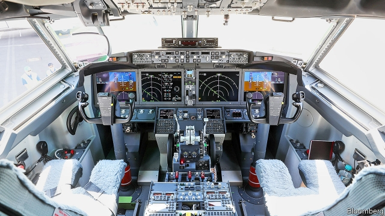

###### Flying too closely

# Regulatory capture may be responsible for Boeing's recent problems 

##### Several investigations have been launched into the certification process for the jet 

 

> Mar 23rd 2019 

AMERICA’S AIRCRAFT-SAFETY regulator has been the industry’s gold standard since it was set up in the 1950s. When the Federal Aviation Administration (FAA) called out an aeroplane as unsafe, counterparts around the world followed its lead. That changed after a Boeing 737 MAX jetliner crashed in Ethiopia on March 10th, killing all 157 on board, five months after the same model went down in Indonesia in apparently similar circumstances. The FAA grounded it only once all other big regulators around the world had done so. 

A week on, analysis of the black box recovered in Ethiopia suggests “clear similarities” with the Indonesian accident, the country’s transport ministry said on March 17th. This raises questions about the FAA’s certification of the plane. On March 17th the Wall Street Journal reported that the Department of Justice had launched a probe into the MAX’s development. Two days later the transportation secretary began an audit of the aeroplane’s certification process. 

What went wrong? Jon Ostrower, an aviation writer, points to Boeing’s decision in 2011 to put a new fuel-efficient engine on an earlier version of the popular 737. Airbus, its European arch-rival, was also planning to do the same on its competing narrow-body jet, the A320. But although there was plenty of room under the A320 to fit these wider engines, the squatter 737 had less space. Boeing decided to mount the engine further forward instead, making the plane less aerodynamically stable. 

To improve stability, Boeing installed software called MCAS. This allowed pilots who were certified for the older 737 to fly the new version without getting a new licence. Boeing did not mention MCAS in instruction manuals before the Indonesian crash, the Seattle Times reported. Investigators think that MCAS may have contributed to that accident. 

Boeing continues to have “full confidence” in the 737 MAX’s safety. While investigations continue, it says, “Boeing is finalising its development of a previously announced software update and pilot training revision that will address the MCAS flight control law’s behaviour in response to erroneous sensor inputs”. Boeing’s team is in Ethiopia helping the investigators. The company says it is “devoted to the quality and safety of the aircraft we design, produce and support”. 

Jim Hall, former chairman of America’s National Transportation Safety Board, another regulator, sees the root of the problem in the FAA’s close relationship with Boeing. Since 2001 the company has lobbied vigorously to perform more of its own safety tests. In 2005 the FAA began to allow Boeing to do more self-certification. “It’s like putting children in charge of the sweet shop,” says a former Boeing adviser. An investigation by the transportation department in 2012 found that the FAA had not done enough to “hold Boeing accountable”. It quoted FAA employees who had reported retaliation for speaking up about problems with Boeing’s previous designs. 

Scott Brenner, a former associate administrator at the FAA, points out that safety inspectors at the FAA’s office in Seattle, home to Boeing’s main production facilities, may have worked closely with Boeing’s own safety experts for decades. A once-antagonistic relationship has grown chummier in recent years. Posters warning “don’t talk to the FAA” are no longer a common sight. 

It has not helped that President Donald Trump has left the top job at the FAA vacant since January 2018. The acting administrator lacks all the powers of a permanent head, notes Mr Hall. Financial constraints encouraged the FAA to outsource certification to planemakers. Its budget increased by a sixth between 2002 and 2018, while American air traffic grew by 40%. 

On March 19th Mr Trump named Stephen Dickson, a respected former senior executive at Delta Air Lines, to head the FAA. By then, other regulators’ confidence in the FAA had been shot. The Ethiopian authorities have declined to give the black box to the FAA for data retrieval, sending it to France instead. Those in Canada and Europe are re-examining decisions to approve the 737 MAX based on mutual-recognition agreements with America. Rather than trust the FAA, they may order their own tests before certifying future Boeing aircraft as airworthy. 

-- 

 单词注释:

1.regulatory['regjulәtәri]:a. 受控制的, 统制的, 调整的 [经] 规则的 

2.certification[.sә:tifi'keiʃәn]:n. 证明 [经] 证明 

3.regulator['regjuleitә]:n. 调整者, 校准者, 校准器, 调整器, 标准钟 [化] 调节剂; 调节器 

4.FAA[]:一切海损均不赔偿 

5.counterpart['kauntәpɑ:t]:n. 副本, 复本, 配对物, 相应物 [经] 副本, 正副二份中之一 

6.boe[bəu]:abbr. back outlet eccentric 后偏心（轮）出口 

7.MAX[mæks]:[计] 最大 

8.jetliner['dʒetlainә]:n. 喷气客机 

9.Ethiopia[.i:θi'әupiә]:n. 埃塞俄比亚 

10.Indonesia[.indәu'ni:ʒә]:n. 印尼 

11.apparently[ә'pærәntli]:adv. 表面上, 清楚地, 显然地 

12.similarity[.simi'læriti]:n. 类似, 类似处 [法] 类似, 相似, 类似事例 

13.Indonesian[.indәu'ni:ʒәn]:a. 印尼的 n. 印尼人, 印尼语群 

14.probe[prәub]:n. 探索, 调查, 探针, 探测器 v. 用探针探测, 调查, 探索 

15.audit['ɒ:dit]:n. 审计, 查帐 vt. 查(帐), 旁听 vi. 查账 [计] 查帐; 审查; 检查 

16.jon[dʒɔn]:n. 乔恩（男子名） 

17.airbus['eәbʌs]:空中客车 

18.squatter['skwɒtә]:n. 蹲着的人, 擅自占用土地或房屋者 vi. 涉水而过 

19.les[lei]:abbr. 发射脱离系统（Launch Escape System） 

20.aerodynamically[,eәrәudai'næmikәli]:adv. 空气动力学地 

21.MCA[]:[计] 微通道体系结构 

22.certify['sә:tifai]:v. 证明, 保证 

23.Seattle[si'ætl]:n. 西雅图 

24.investigator[in'vestigeitә]:n. 调查者, 审查者 [法] 审查员, 侦查员, 调查员 

25.finalise[]:vt. 把(计划)最后定下来, 定稿 [经] 使...结束 

26.update[ʌp'deit]:vt. 更新, 使现代化 n. 更新 [计] 更新 

27.erroneous[i'rәuniәs]:a. 错误的, 不正确的 [法] 错误的, 不正确的 

28.sensor['sensә]:n. 传感器 [计] 检测器 

29.jim[dʒim]:n. 吉姆（人名） 

30.lobby['lɒbi]:n. 大厅, 休息室, 游说议员者 vi. 游说议员, 游说 vt. 游说 

31.vigorously[]:adv. 朝气蓬勃, 精力充沛, 壮健, 茁壮, 健壮, 强有力 

32.adviser[әd'vaizә]:n. 顾问, 劝告者, 指导教师 [法] 顾问, 劝告者 

33.accountable[ә'kauntәbl]:a. 负有责任的, 可说明的, 可解释的 [经] 负有责任的 

34.retaliation[ri.tæli'eiʃәn]:n. 报复 [法] 报仇, 报复, 回敬 

35.scott[skɔt]:n. 斯科特（男子名） 

36.brenner['brenә(r)]:Pass勃伦纳山口[中欧](位于阿尔卑斯山脉东段,奥地利和意大利两国边境上) 

37.administrator[әd'ministreitә]:n. 管理人, 行政官 [经] 遗产管理人员 

38.inspector[in'spektә]:n. 检查员, 巡视员 [化] 检查员 

39.chummier[ˈtʃʌmiə]:a. 非常友好的( chummy的比较级 ) 

40.constraint[kәn'streint]:n. 强制, 约束 [计] 约束 

41.outsource[aut'sɔ:s]:vt. 把…外包 

42.planemaker['plein,meikә(r)]:n. <美>飞机制造商 

43.stephen['sti:vn]:n. 斯蒂芬（男子名） 

44.Dickson[]:n. 迪克逊（姓氏） 

45.delta['deltә]:n. 三角洲, 希腊字母的第四个字 [医] δ(希腊文的第四个字母), 丁种, 三角, 三角形区 

46.Ethiopian[.i:θi'әupiәn]:a. 埃塞俄比亚的 n. 埃塞俄比亚人 

47.datum['deitәm]:n. 论据, 材料, 资料, 已知数 [医] 材料, 资料, 论据 

48.retrieval[ri'tri:vl]:n. 取回, 恢复, 检索 [计] 检索 

49.airworthy['єәwә:ði]:a. 飞行性能好的, 适宜航空的 

