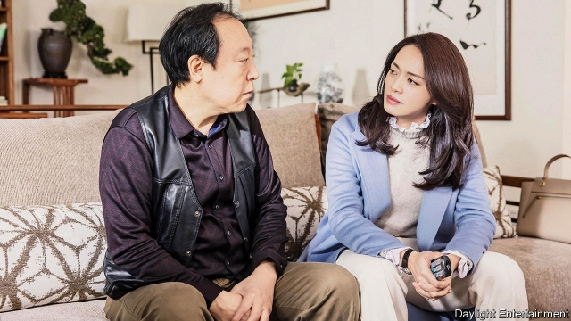

###### Conflicted Confucians

# A hit TV series in China skewers cranky old parents 

##### Defying the cult of filial piety thrills viewers 

 

> Mar 21st 2019 

IT IS NO mean feat to be one of the top-ten trending hashtags on Weibo, China’s equivalent of Twitter, for 20 consecutive days and counting. “All is Well”, a show on provincial television which premiered on March 1st, has done just that. The show tells the story of a fictional Chinese family torn by internal conflict. The female protagonist, Su Mingyu, is barely on speaking terms with her widowed father and one of her two brothers. The father is a nagging crank who expects his two adult sons to bankroll his lavish tastes. This leads to constant bickering between the brothers, neither of whom wants to be called unfilial. 

Episodes of “All is Well” have been streamed more than 390m times. That exceeds the online viewership of the next most popular television series by 278m. From “The Simpsons” to “Game of Thrones”, dramas about bickering families are common in many countries. But in China, the Communist Party prefers entertainment to be unchallenging. So the questioning of blind attachment to traditional values in “All is Well” is causing a stir. Viewers are transfixed by its rare portrayal of middle-class life, warts and all. 

Many Chinese can relate to the Su family’s troubles. The daughter holds a grudge against her father (the two are pictured), and especially against her late mother, for having mistreated her while pampering her brothers. As a child she was made to wash her brothers’ clothes. Her parents turned a blind eye when one of her brothers beat her. For many female viewers born before 1979, when China introduced a one-child-per-couple policy (changed to two in 2016), such scenes have brought back painful memories. Some have used social media to share their own tales of sexism within the family. 

But the biggest reaction has been to the drama’s critique of filial piety. Even today, the Confucian principle of unswerving loyalty to one’s parents remains hallowed. Many people say the best measure of adherence to this virtue is whether a son takes good care of his parents in old age. A recent poll by Toutiao, a Chinese news app, found that 54% of elderly people in China get more than half of their expenses covered by their adult children. Partly, no doubt, this is due to a patchy pensions system. But it also reflects a culture of “never saying no to your parents”, says an “All is Well” fan in Beijing. 

In the series, however, the widowed father does not attract much sympathy. He throws tantrums and insists that his eldest son buy him a three-bedroom apartment (the son grudgingly does so). Commentators on social media have taken to calling the father a juying (“giant baby”)—a characteristic common among parents in real life, they say. The Su children do their duty, but the audience is supposed to applaud the resentment they express. 

There have been mixed reviews in state media. One newspaper said that the “realistic plot and acting” had touched the “pain points” of many viewers. Beijing Daily, however, said the drama was “unrealistic”. It said it caricatured elderly parents by “unreasonably” ascribing “every possible bad quality” of old people to one character. Someone representing every virtue admired by the party would be just fine for television, presumably. 

-- 

 单词注释:

1.Confucian[kәn'fju:ʃ(ә)n]:a. 孔子的, 儒家学说的, 儒家的, 孔夫子的, 孔丘的 n. 孔子的门徒, 儒家 

2.sery[]:n. (Sery)人名；(俄)谢雷；(科特)塞里 

3.skewer[skju:ә]:n. 串肉棒, 烤肉叉子, 针状物 vt. 刺穿, 串住, 讽刺 

4.cranky['kræŋki]:a. 古怪的, 暴躁的, 脾气坏的 

5.defy[di'fai]:vt. 藐视, 挑衅, 使落空 n. 挑战 

6.cult[kʌlt]:n. 膜拜, 礼拜式, 祭仪, 一群信徒 [医] 迷信, 巫术 

7.filial['filiәl]:a. 子女的, 当做子女的, 孝顺的 [医] 子女的 

8.piety['paiәti]:n. 虔诚, 孝敬, 虔诚的行为 

9.feat[fi:t]:n. 壮举, 功绩, 技艺表演 a. 灵巧的, 合适的, 整洁的 

10.hashtags[]:[网络] 标签；话题标签；标签运用 

11.Weibo[]:[网络] 新浪微博；我的微博；个人微博 

12.twitter['twitә]:n. 啁啾, 唧唧喳喳声 vi. 啭, 啁啾, 颤抖 vt. 嘁嘁喳喳地讲, 抖动 

13.consecutive[kәn'sekjutiv]:a. 连续的, 联贯的 [计] 连续的; 连接的 

14.provincial[prә'vinʃәl]:n. 外地人, 粗野的人 a. 省的, 外地的, 偏狭的 

15.fictional['fikʃәnl]:a. 虚构的, 编造的, 小说式的 [法] 拟制的, 假定的, 虚构的 

16.protagonist[prәu'tægәnist]:n. 主人公, 主角, 领导者 

17.SU[]:[计] 可选部件 

18.nag[næg]:n. 老马, 驽马, 劣等竞赛马, 唠叨 v. 不断地唠叨, 恼人 

19.crank[kræŋk]:a. 不稳的, 脾气暴燥的, 易怒的 n. 曲柄, 奇想 vt. 装曲柄 vi. 转动曲柄 

20.bankroll['bæŋkrәul]:n. 一卷钞票, 资金 vt. 提供资金 

21.lavish['læviʃ]:a. 大方的, 丰富的, 浪费的 vt. 浪费, 滥用, 慷慨给予 

22.bicker['bikә]:vi. 斗嘴, 潺潺而流, 闪动 n. 口角, 流水声 

23.unfilial[.ʌn'filjәl]:a. 不孝的 

24.online[]:[计] 联机 

25.viewership['vju:әʃip]:n. [总称]电视观众 

26.simpson['simpsn]:n. 辛普森（姓氏） 

27.attachment[ә'tʃætʃmәnt]:n. 连接, 附属物, 连接物, 爱慕 [计] 附加, 附件 

28.transfix[træns'fiks]:vt. 刺穿, 使呆住, 使固定 [医] 贯穿, 刺通 

29.portrayal[pɔ:'treiәl]:n. 描绘, 描写, 画像, 肖像 [计] 描绘 

30.wart[wɒ:t]:n. 疣, 瘤 [医] 疣, 肉赘 

31.grudge[grʌdʒ]:n. 怨恨, 恶意 vt. 怀恨, 嫉妒, 吝惜 

32.mistreat[.mis'tri:t]:vt. 虐待 [法] 虐待, 苛待 

33.pamper['pæmpә]:vt. 放纵, 使吃饱, 使过量 

34.sexism['seksizm]:n. 性别歧视, 歧视女性 

35.critique[kri'ti:k]:n. 评论文章, 评论 

36.Confucian[kәn'fju:ʃ(ә)n]:a. 孔子的, 儒家学说的, 儒家的, 孔夫子的, 孔丘的 n. 孔子的门徒, 儒家 

37.unswerving[.ʌn'swә:viŋ]:a. 不歪的, 不走歪的, 不编离的, 始终不渝的 

38.hallow['hælәu]:vt. 使...神圣, 视为神圣 n. 圣徒 

39.adherence[әd'hiәrәns]:n. 依附, 固执, 坚持 [化] 粘合 

40.APP[]:[计] 应用, 应用程序; 相联并行处理器 

41.patchy['pætʃi]:a. 补缀的, 凑合的, 不调和的, 散落的, 斑驳的, 不完全的 

42.tantrum['tæntrәm]:n. 发脾气, 发怒 [医] 暴怒, 发脾气 

43.eldest['eldist]:a. 最年长的, 排行中第一的 n. 最年长者, 排行中第一者 

44.grudgingly['grʌdʒiŋli]:adv. 勉强地；不情愿地 

45.commentator['kɔmenteitә]:n. 评论员, 实况广播员, 注释者, 时事评论员 

46.resentment[ri'zentmәnt]:n. 怨恨, 愤恨 

47.realistic[riә'listik]:a. 现实的, 逼真的, 现实主义的, 实在论的 

48.unrealistic[.ʌnriә'listik]:a. 不切实际的, 幻想的 

49.caricature['kærikәtʃә]:n. 讽刺画, 漫画, 漫画手法 vt. 画成漫画讽刺 

50.unreasonably[.ʌn'ri:znәbli]:adv. 不合理地 

