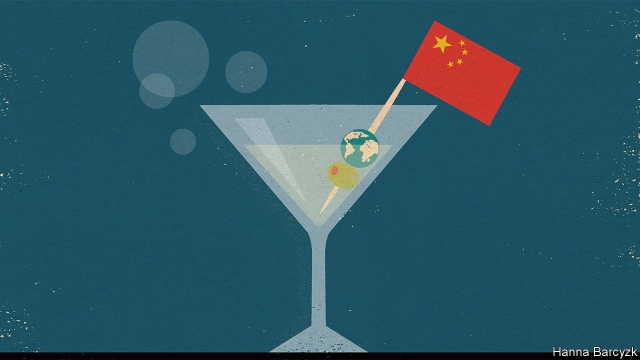

###### Chaguan

# China’s leaders should study James Bond films 

##### Revealing one’s master plan too early can be dangerous 

 

> Mar 21st 2019 

BY THE TIME Chinese censors finally allowed a James Bond film to be shown in a mainland cinema, in 2007, the franchise was more than four decades old. Only thanks to rampant piracy were Chinese familiar with the British spy, commonly referred to by his codename, Ling ling qi. Chinese leaders would do well to study a plot device beloved in the early films: the moment when a ruthless genius explains his plans for world domination to a captive Bond, believing him moments from death. With the reliability of a well-tuned Aston Martin, the bragging turns out to be ill-timed. Within moments Bond is free, the villain’s lair ablaze and his schemes thwarted. Today in the real world, China faces unusual resistance to its bid for a front seat as a global power. Surprisingly often, China’s woes stem from what film critics might term Bond-villain blunders, involving premature admissions of ambition. 

Take the ongoing campaign by American officials to scold allies into shunning Chinese high-technology for 5G mobile-telecommunications networks. The secretary of state, Mike Pompeo, says that America may refuse to share intelligence with governments that install kit from such tech giants as Huawei, a firm that Mr Pompeo accuses of having “deep connections” to Chinese spy services. Allies grumble that American officials have not shared hard evidence to back their claims. On March 15th Li Keqiang, China’s prime minister, declared that his government would never ask companies to break the law to spy on other countries, insisting: “This is not how China behaves.” Alas, Mr Li’s words cannot fully soothe foreign governments and businesses who know what Chinese law openly permits. Notably, an intelligence law of 2017 decrees that all Chinese organisations and citizens are obliged to co-operate with national intelligence-gathering operations. None may demur if spooks requisition their premises or equipment. 

China hawks in America, among them Senator Marco Rubio, a Republican from Florida, have seized on another admission: the “Made in China 2025” plan, an ambitious road map for high-tech industrial policy adopted four years ago. A Senate committee which Mr Rubio chairs issued a report in February examining targets linked to Made in China 2025 that call for Chinese firms to dominate domestic markets for such products as semiconductors and electric vehicles. The report concedes that, in one respect, Americans should thank state planners for identifying favoured industries. China’s plans provide “a blueprint for effective defensive action”, from tariffs punishing unfair technology transfers, to schemes supporting American firms, Team Rubio writes. 

Nor is Europe rolling over like a Bond villain’s cat. On March 12th the European Commission and the European Union’s foreign policy arm, the EU External Action Service, issued a strikingly bleak strategic paper on China. The document calls China a partner when battling such global menaces as climate change, as well as an economic competitor. But it also calls China a “systemic rival” whose engagement with the world of norms, rules and multilateral organisations is “selective” at best, and at worst weakens that order. Like America’s Senate, the Euro-paper also singles out the Made in China 2025 plan. It sees a scheme to shield high-tech national champions from competition, while EU firms are forced to hand prized technologies to local partners as a precondition for entering China’s markets. The EU paper urges European governments to maintain unity as they demand reciprocal trade terms. 

Europe’s unity will be tested when President Xi Jinping visits Italy between March 22nd and 24th. While there he aims to sign that country up for the Belt and Road Initiative, a global infrastructure scheme. America and some European governments have urged Italy to be cautious about endorsing a project that is—as critics tell it—a debt-fuelled master plan for a parallel, China-led global order. China’s foreign minister, Wang Yi, urged Italy to ignore such qualms and sign up, saying: “We trust you’ll stick to the decision you have independently made.” As for Made in China 2025, Chinese officials downplay its import, calling it just another plan from a nation full of planners, whose most alarming buy-Chinese targets are from non-binding guidance documents. 

In a bid to sweeten trade-war peace talks with America, China announced that it will enact a new foreign-investment law in January. Among other promises, the law says that overseas firms’ secrets will not be leaked when shared with government regulators. Foreign chambers of commerce in China responded warily, noting the law’s lack of detail. For many foreign executives in China, industrial policies announced over the past four years are a Bond-villainesque instance of candour. It is when they realised that China’s long-term vision for the future may not include them at all. 

It is often said that today’s China is more assertive. Certainly China has broken with the dictum of the early 1990s, coined by the then-supreme leader, Deng Xiaoping, that China should “hide its capacities and bide its time”. In truth China is now too big to hide. It has always mixed bursts of assertiveness with promises to open markets and protect foreign firms. What is new is that this China is impatient. Officials increasingly chafe when foreign powers cite global norms and rules as grounds for disapproval. A public steeped in propaganda about China’s greatness is indignant when the country is—as ordinary Chinese see it—denied due respect. All those forces stoke impatience. Whether that backfires depends on how other countries respond. America could ban its high-tech firms from some forms of business with China. European governments could start screening Chinese investments more strictly. Predicting the West’s response is made harder by President Donald Trump. He is as bored by norms and rules, and as obsessed with respect, as any Bond villain. Privately, smart Chinese policy types lament their country’s new fondness for boasting. Many Chinese officials will not listen; they are in too great a hurry. 

-- 

 单词注释:

1.jame[]: 灰岩井 

2.censor['sensә]:n. 检查员 vt. 检查, 审查, 删改 

3.franchise['fræntʃaiz]:n. 公民权, 特权, 特许经营权, 免赔额 vt. 给以特权, 给以...公民权 

4.rampant['ræmpәnt]:a. 猖獗的, 蔓生的, 猛烈的, 跃立作扑击状的 

5.piracy['paiәrәsi]:n. 海盗行为, 海上劫掠, 剽窃, 著作权侵害, 非法翻印 [法] 海盗行为, 海上掠夺, 海盗罪 

6.codename[]:n. 研发代码；代号 

7.ling[liŋ]:n. 鳕鱼, 帚石南 

8.ling[liŋ]:n. 鳕鱼, 帚石南 

9.qi[]:abbr. 质量指标（Quality Index） 

10.ruthless['ru:θlis]:a. 无情的, 残忍的, 毫不留情的, 彻底的 [法] 无情的, 残忍的 

11.domination[.dɒmi'neiʃәn]:n. 支配, 控制, 管辖 

12.aston['æstәn]:n. 阿斯顿（姓氏） 

13.Martin['mɑ:tin]:n. 马丁, 圣马丁鸟 

14.brag[bræg]:n. 吹牛 v. 吹牛 

15.lair[lєә]:n. 兽穴, 兽窝, 泥潭 vi. 进入兽穴, 在泥中打滚 vt. 放于穴中, 使陷入泥潭 

16.ablaze[ә'bleiz]:a. 着火的, 闪亮的, 激昂的 adv. 着火, 闪耀 

17.thwart[θwɒ:t]:a. 横放的 vt. 反对, 阻挠, 横过 prep. 横过 adv. 横过 

18.woe[wәu]:n. 悲哀, 悲痛, 苦痛 

19.blunder['blʌndә]:n. 大错, 大失策 vi. 失策, 跌跌撞撞地走, 犯错 vt. 做错 

20.premature[.premә'tjuә]:a. 早产的, 过早的, 不成熟的 n. 早产儿, 过早发生的事物 

21.ongoing['ɒngәuiŋ]:a. 前进的, 进行的, 不间断的 n. 前进, 发展 

22.ally['ælai. ә'lai]:n. 同盟者, 同盟国, 助手 vt. 使联盟, 使联合, 使有关系 vi. 结盟 

23.shun[ʃʌn]:vt. 避开, 规避, 避免 

24.mike[maik]:vi. 偷懒, 游手好闲 n. 休息, 游手好闲, 扩音器, 话筒 

25.pompeo[]:n. (Pompeo)人名；(意)蓬佩奥 

26.kit[kit]:n. 装备, 工具箱, 成套工具 [计] 成套部件; 成套零件 

27.tech[tek]:n. 技术学院或学校 

28.huawei[]: 华为 

29.grumble['grʌmbl]:n. 怨言, 满腹牢骚 vi. 抱怨, 发牢骚, 发隆隆声 vt. 抱怨 

30.ala['eilә]:n. 翼, 翅 [化] 丙氨酸 

31.cannot['kænɒt]:aux. 无法, 不能 

32.fully['fuli]:adv. 十分地, 完全地, 充分地 

33.soothe[su:ð]:vt. 缓和, 使安静, 安慰, 奉承 vi. 起安慰作用 

34.openly['әjpәnli]:adv. 公开地, 坦率地, 直率地, 公然地 

35.notably['nәjtbәli]:adv. 显著地, 著名地, 尤其, 特别 

36.decree[di'kri:]:n. 法令, 判决, 天意 vt. 颁布, 判决 vi. 发布命令 

37.organisation[,ɔ: ^әnaizeiʃən; - ni'z-]:n. 组织, 团体, 体制, 编制 

38.demur[di'mә:]:vi. 提出异议, 反对, 抗辩 n. 异议, 反对 

39.spook[spu:k]:n. 幽灵, 鬼 vt. 惊吓, 鬼怪般地出没 vi. 惊吓而逃窜, 受惊 

40.requisition[.rekwi'ziʃәn]:n. 正式请求, 申请, 需要, 征用, 通知单, 申请书, 引渡要求 vt. 征用, 要求 

41.premise['premis]:n. 前提, 房屋连地基, 上述各项 vt. 预先提出, 引出, 作为...的前提 vi. 作出前提 

42.senator['senәtә]:n. 参议员, (某些大学的)理事 [法] 参议员, 上议员 

43.marco[]:n. 马尔科（人名）；显示地图；展现地图 

44.rubio[]: [地名] [玻利维亚、古巴、美国、墨西哥、委内瑞拉、西班牙] 鲁维奥 

45.Florida['flɒridә]:n. 佛罗里达州 

46.ambitious[æm'biʃәs]:a. 有野心的, 抱负不凡的, 雄心勃勃的 

47.concede[kәn'si:d]:vt. 承认, 退让 vi. 让步 

48.planner['plænә]:n. 计划者, 设计者, 安排者 [机] 刨床机 

49.blueprint['blu:'print]:n. 蓝图, 设计图, (周详的)计划 vt. 制成蓝图, 计划 

50.defensive[di'fensiv]:a. 防卫的, 防备用的, 自卫的 n. 守势, 防卫姿势, 防卫物 

51.tariff['tærif]:n. 关税, 关税表, 价格表, 收费表 vt. 课以关税 [计] 价目表 

52.EU[]:[化] 富集铀; 浓缩铀 [医] 铕(63号元素) 

53.strikingly[]:adv. 显著地, 惊人地, 引人注目地 

54.bleak[bli:k]:a. 萧瑟的, 荒凉的, 阴冷的 

55.menace['menis]:n. 威胁, 胁迫 v. 威吓, 胁迫 

56.systemic[si'stemik]:a. 系统的, 体系的, 全身的 [医] 系统的, 全身的 

57.engagement[in'geidʒdmәnt]:n. 诺言, 约会, 婚约, 交战 [医] 衔接 

58.norm[nɒ:m]:n. 基准, 模范, 标准, 准则, 平均数 [化] 定额 

59.multilateral[.mʌlti'lætәrәl]:a. 多边的, 多国的 [经] 多边的, 涉及多方的 

60.selective[si'lektiv]:a. 选择的, 选择性的 [经] 选择的, 选择性的 

61.precondition[.pri:kәn'diʃәn]:vt. 事先准备, 事先处理 n. 先决条件, 前提 [计] 前置条件 

62.reciprocal[ri'siprәkl]:a. 互惠的, 相互的, 相等的, 倒数的, 彼此相反的 n. 倒数, 互相起作用的事物 

63.infrastructure['infrәstrʌktʃә]:n. 基础结构, 基础设施 [经] 基础设施 

64.endorse[in'dɒ:s]:vt. 支持, 赞同, 背书于, 签署 [经] 赞成, 背书 

65.wang[]:n. 王（姓氏）；王安电脑公司 

66.yi[ji:]:n. 彝人；彝语 

67.qualm[kwɒ:m]:n. 晕眩, 不安, 疑虑 [法] 疑虑, 不安, 内疚 

68.independently[.indi'pendәntli]:adv. 独立地, 自立地 

69.downplay['daunplei]:vt. 不予重视 

70.sweeten['swi:tn]:vt. 使变甜, 加糖于, 使悦耳, 使温和, 减轻 vi. 变甜 

71.enact[i'nækt]:vt. 制定法律, 扮演, 颁布 [法] 法令, 法规, 条例 

72.oversea['әuvә'si:]:adv. 海外, 向国外, 向海外, 国外 a. 外国的, 在国外的, 在海外的, 舶来的 

73.regulator['regjuleitә]:n. 调整者, 校准者, 校准器, 调整器, 标准钟 [化] 调节剂; 调节器 

74.warily['wєәrili]:adv. 谨慎地, 留心地, 小心地 

75.candour['kændә]:n. 坦率, 正直, 公正, 爽直, 白色, 光明 

76.assertive[ә'sә:tiv]:a. 武断的, 过分自信的 [法] 断言的 

77.dictum['diktәm]:n. 声明, 格言, 法官意见 [法] 宣言, 声明, 法官的意见 

78.bide[baid]:vt. 等候, 住, 忍耐, 等待 

79.alway['ɔ:lwei]:adv. 永远；总是（等于always） 

80.assertiveness[ə'sə:tivnis]:n. 魄力, 自信 

81.chafe[tʃeif]:n. 擦伤, 气恼 v. 摩擦, 擦痛, 激怒 

82.cite[sait]:vt. 引用, 引证, 表彰 [建] 引证, 指引 

83.disapproval[.disә'pru:vәl]:n. 不赞成 

84.propaganda[.prɒpә'gændә]:n. 宣传, 宣传活动 [医] 宣传 

85.greatness['greitnis]:n. 大, 巨大, 广大 

86.stoke[stәuk]:v. 司炉, (使)大吃 

87.impatience[im'peiʃәns]:n. 性急, 难耐, 焦急, 急躁 

88.backfire[.bæk'faiә]:n. 逆火, 回火, 放火 vi. 放逆火, 预先放火, 发生意外 

89.obsess[әb'ses]:vt. 迷住, 使困扰 

90.villain['vilәn]:n. 坏人, 恶棍 [法] 歹徒, 恶棍, 恶徒 

91.privately[]:adv. 秘密地；私下地 

92.lament[lә'ment]:n. 悲叹, 悔恨, 恸哭, 挽歌, 悼词 vt. 哀悼 vi. 悔恨, 悲叹 

93.fondness['fɔndnis]:n. 溺爱；爱好 

