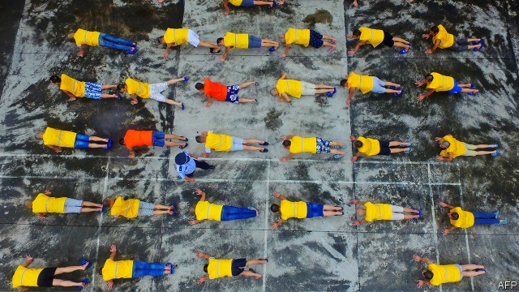

###### Old habits die hard

# China’s strong-arm approach to drug addiction does not work 

##### Rising numbers of drug users suggest a need for a more subtle policy 

 

> Mar 21st 2019 

A  LITTLE OVER 20 years ago, when he was still a teenager, Lin Guangpeng tried heroin that his friends had brought to a party near his home in the south-western province of Yunnan. Soon addicted, Mr Lin—not his real name—spent many of the subsequent years behind bars, including several long stretches in detention centres for drug users. He says wardens in these “compulsory isolation detoxification” facilities put him to work in prison factories. Such places are meant to heal your body, he says (inmates are pictured exercising). But they “damage your soul”. 

China is tough on drugs. Many traffickers are among the thousands of people executed annually. Sometimes they are paraded beforehand at public sentencing rallies. Attendees at these grim spectacles include busloads of schoolchildren. Drug users may be punished on the spot by police. Many are locked up in centres like the ones where Mr Lin was sent, often for stretches of two to three years without trial. In 2017 about 320,000 people spent time in such camps, says China’s anti-narcotics agency. That is about 36,000 fewer than in 2016 but about 120,000 more than in 2012. 

After their release from these facilities, former inmates still suffer harassment by the police. Mr Lin’s latest incarceration (for two years) ended in 2018. He is sober, thoughtful and keen not to fall back into addiction. But his name is still on the government’s list of drug users. Such people are liable to be given random urine tests by police. Often these are conducted at police stations. Sometimes they are sprung on people when they check into hotels or try to board planes. Mr Lin speculates that smart security cameras and mobile-phone tracking can make it easier for police to find and test people whenever they please. 

Last month President Donald Trump said he had asked his Chinese counterpart, Xi Jinping, whether China had a drug problem. He said Mr Xi denied it. “We give death penalty to people who sell drugs. End of problem,” Mr Trump quoted Mr Xi as saying, as if in stilted English. Yet China clearly does have a problem. The number of registered drug users (supposedly not including those who have been clean for more than three years) has been drifting steadily upwards. In 1991 there were 150,000 such people. By 2017 there were 2.5m. Experts estimate that the total number of addicts is around five times higher. 

Until a few years ago China’s main problem with hard drugs involved heroin use in poor provinces such as Yunnan that lie closest to the foreign poppy-fields of South-East Asia. These days, however, use of hard drugs is more evenly spread across China. It more commonly involves synthetic stimulants, chiefly methamphetamine. The drugs are still mostly smuggled in, usually from Myanmar. Some are cooked up in illegal Chinese laboratories. 

Worried by these trends, the authorities have been experimenting with less punitive methods of controlling the demand side. The management of China’s compulsory detoxification centres has mostly passed from the police to the judiciary. The latter is slightly more interested in providing inmates with appropriate medical help, says one Chinese expert. 

The police, meanwhile, no longer pack drug users off to such places on their first offence (though they remain vigilant: in January police in Beijing put up notices offering a reward of 500 yuan—about $75—for information leading to each arrest of a drug user, or 20,000 yuan for a group of ten or more). Wang Weijia of Glimmer of Hope, a charity that provides advice to drug users and their families, says that the provision of addiction treatment at private hospitals and clinics has grown in recent years. The number of clinics in China that are licensed to offer methadone treatment to heroin addicts (methadone does not work for those addicted to synthetic stimulants) increased from a handful in 2004 to more than 700 in 2013. Most of them are state-owned. To be eligible to receive methadone addicts must prove that they have undergone detox treatment, whether in the compulsory camps or at clinics. 

But change is slow. People who go to methadone clinics or private treatment centres risk being pounced on by police trying to meet arrest quotas. A law passed in 2008 promised more “community-based” rehabilitation programmes. But there are still few of them and they are not very effective. There is still no convincing sign that the government is trying to create an alternative to detention. Officials are reasonably good at spotting heroin users, whose lives are often entirely upturned by their addictions. But according to a paper by two criminologists at American universities, Sheldon Zhang and Ko-Lin Chen, officers find it much trickier to pick out users of methamphetamines and other powerful stimulants, which do not at first create the same all-consuming dependency as heroin. One expert’s guess is that the government’s registry of drug users identifies about one-third of the country’s heroin users but only a little over one-tenth of methamphetamine addicts. 

Since 2016 several places have tried testing for drug residue in sewage in order to help the police find addicts and traffickers. China’s anti-drug agency said this method had “transformed” anti-narcotics work. In April 2018 the southern city of Zhongshan said the technique had led to the arrests of 341 drug users in the preceding year. 

Many officials still regard substance abuse as a moral problem rather than a medical one, says Hao Wei of the Chinese Association of Drug-Abuse Prevention and Treatment. Political stigma complicates the issue. In the 19th century China lost two wars against Britain that were triggered by the smuggling of opium into China by British traders. Many Chinese blame Britain for fuelling Chinese addiction to the drug and plunging the country into a “century of humiliation” by foreign powers. Today’s drug users inherit some of that shame. China’s punitive approach to the problem will not help it go away. 

-- 

 单词注释:

1.addiction[ә'dikʃәn]:n. 入迷, 瘾 [医] 瘾, 癖嗜 

2.subtle['sʌtl]:a. 敏锐的, 精细的, 狡猾的, 稀薄的, 灵巧的, 微妙的 [医] 锐敏的; 精细的 

3.lin[]:n. 林 

4.heroin['herәuin]:n. 海洛因, 吗啡 [化] 海洛因; 二醋吗啡; 二乙酰吗啡 

5.yunnan['ju:n'næn]:n. 云南（中国西南部一省） 

6.addict[ә'dikt]:vt. 使沉溺, 使上瘾 n. 入迷的人, 上瘾者 

7.detention[di'tenʃәn]:n. 阻止, 监禁, 拘留 [医] 隔离, 拘留, 滞留, 停滞 

8.warden['wɒ:dn]:n. 典狱官, 渔猎法监督官, 看守人 [法] 看守人, 监护人, 管理员 

9.isolation[.aisә'leiʃәn]:n. 隔绝, 孤立, 隔离 [化] 分离; 生物分离 

10.detoxification[di:,tɔksifi'keiʃәn]:[机] 解毒作用 

11.inmate['inmeit]:n. 同住者, 被收容者 [法] 内部的, 接近中心的, 内在的 

12.trafficker['træfikә]:n. 商人, 贩子 [法] 贩卖者, 买卖者, 商人 

13.annually['ænjuәli]:adv. 一年一次, 每年 [经] 年度的, 每年的 

14.rally['ræli]:n. 重振旗鼓, 集合, 群众集会, 跌停回升 v. 重整旗鼓, 集合, 恢复精神, 团结, 挖苦, 嘲笑 

15.attendee[æten'di:]:[计] 出席人, 参加者, 被照顾者, 被服务者 

16.grim[grim]:a. 冷酷的, 坚强的, 残忍的, 可怕的, 讨厌的 

17.busload['bʌslәjd]:n. 公共汽车运载量 

18.schoolchild['sku:ltʃaild]:n. 学童 

19.harassment['hærәsmәnt]:n. 困扰, 烦扰, 烦恼 [法] 折磨, 骚扰, 侵扰 

20.incarceration[in.kɑ:sә'reiʃәn]:n. 下狱, 监禁, 禁闭 [医] 箝闭 

21.urine['juәrin]:n. 小便, 尿 [医] 尿 

22.speculate['spekjuleit]:vi. 深思, 推测, 投机 [经] 投机 

23.counterpart['kauntәpɑ:t]:n. 副本, 复本, 配对物, 相应物 [经] 副本, 正副二份中之一 

24.penalty['penәlti]:n. 处罚, 刑罚, 罚款, 罚球, 报应, 不利结果, 妨碍 [经] 罚金(款), 违约金 

25.stilt[stilt]:n. 高跷, 支柱, 脚柱 

26.supposedly[sә'pәuzidli]:adv. 想象上, 看上去像, 被认为是, 恐怕, 按照推测 

27.evenly['i:vәnli]:adv. 平衡地, 平坦地, 平等地 

28.stimulant['stimjulәnt]:a. 兴奋性的, 激励的, 鼓舞的 n. 兴奋剂, 酒精饮料 

29.chiefly['tʃi:fli]:adv. 主要地 

30.methamphetamine[,meθæ'fetәmin]:[化] 脱氧麻黄碱 

31.smuggle['smʌgl]:vt. 偷运, 走私, 私运 vi. 走私 

32.Myanmar['mjænmɑ:(r)]:缅甸[东南亚国家](即Burma) 

33.les[lei]:abbr. 发射脱离系统（Launch Escape System） 

34.punitive['pju:nitiv]:a. 刑罚的, 惩罚性的 [法] 刑罚的, 惩罚性的, 结予惩处的 

35.judiciary[dʒu:'diʃiәri]:a. 司法的, 法院的, 法官的 n. 司法部, 司法系统, 法官 

36.wang[]:n. 王（姓氏）；王安电脑公司 

37.glimmer['glimә]:n. 一丝光线, 微光, 少许 vi. 发微光 

38.methadone[]:[化] 美沙酮; 美散痛 [医] 美沙酮, 美散痛(镇痛药) 

39.eligible['elidʒәbl]:a. 有资格当选的, 合格的 n. 有资格者, 合格者, 适任者 

40.detox[di:'tɔks]:n. 戒瘾病房；戒瘾诊所 

41.pounce[pauns]:n. 猛扑, 爪 vi. 猛扑, 突袭 vt. 扑住 

42.quota['kwәutә]:n. 配额, 限额 [化] 定额 

43.rehabilitation['ri:(h)ә,bili'teiʃәn]:n. 复原 [医] 复原, 恢复, 康复 

44.reasonably['ri:znәbli]:adv. 适度地, 相当地 

45.entirely[in'taiәli]:adv. 完全, 全然, 一概 

46.upturn[ʌp'tә:n]:n. 情况好转, 向上趋势 v. (使)向上, 转朝上, 翻转 

47.criminologist[.krimi'nɒlәdʒist]:n. 犯罪学学者 [法] 刑事学家, 犯罪学家 

48.sheldon['ʃeldәn]:n. 谢尔登（男子名） 

49.zhang[]:n. 张, 章（中国姓氏） 

50.chen[]:n. 陈 

51.tricky['triki]:a. 狡猾的, 机敏的 

52.dependency[di'pendәnsi]:n. 属国, 保护地, 从属物 [医] 从属, 从属部 

53.registry['redʒistri]:n. 登记处, 登记名册 [计] 登录库 

54.residue['rezidju:]:n. 残渣, 剩余, 余数 [化] 残基; 残渣; 残液; 釜液 

55.sewage['sju:idʒ]:n. 脏水, 污水 [医] 污水, 污物 

56.zhongshan[dʒɒŋˈʃan]: [地名] [南极洲] 中山站 

57.precede[.pri:'si:d]:vt. 在...之前, 优于, 较...优先 vi. 在前面 

58.hao[hau]:n. 角（越南辅币, 等于1/10盾） 

59.wei[]:n. 魏（姓氏）；魏（朝代）；渭河 

60.prevention[pri'venʃәn]:n. 阻止, 妨碍, 预防 [医] 预防 

61.stigma['stigmә]:n. 耻辱, 污名, 烙印 [医] 柱头; 小孔, 眼点; 气孔; 小斑; 特征 

62.trigger['trigә]:n. 触发器, 扳机 vt. 触发, 发射, 引起 vi. 松开扳柄 [计] 切换开关 

63.opium['әupjәm]:n. 鸦片 [化] 阿片; 鸦片 

64.trader['treidә]:n. 商人, 商船 [经] 交易者, 商船 

65.humiliation[hju:.mili'eiʃәn]:n. 耻辱, 丢脸, 谦卑 

