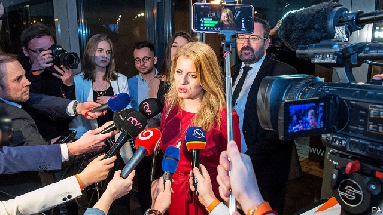

###### If the Caputova fits

# A young liberal is poised to win Slovakia’s presidency 

##### Zuzana Caputova campaigns against the corruption that populism has bred 

 

> Mar 21st 2019 

ONE YEAR ago tens of thousands of demonstrators filled the streets of Slovakia’s cities. Shocked into action by the murder of Jan Kuciak, a young journalist probing links between ministers and organised crime, and his fiancée, they demanded an end to the corruption of their country’s elite. The protests toppled Robert Fico, the prime minister, and galvanised a generation. 

They also convinced Zuzana Caputova, a 45-year-old liberal lawyer with no political experience, to run for president. “I suddenly found myself failing to justify why somebody else and not myself should assume responsibility for bringing about change,” she says. On March 16th, after a disciplined and dignified campaign, Ms Caputova took 41% of the vote in the first round of Slovakia’s presidential election. She is set to win the run-off on March 30th. Two months ago she was polling in single digits. 

Victory would see Ms Caputova take office as the only unabashed liberal head of state or government in the central European “Visegrad” group. Poland has followed Hungary’s slide into illiberalism under Viktor Orban, and the Czech Republic is run by Andrej Babis, a Trumpy tycoon prone to scandal. Slovakia’s euro membership has always left it closer to Europe’s core, as even Mr Fico, who flirted with Orbanist populism when it suited him, had to accept. 

The election also shone a light on Slovakia’s darker corners. Between them an Islamophobic populist and an outright neo-Nazi secured a quarter of the vote. Grigorij Meseznikov, a political analyst in Bratislava, says such “anti-system” forces are growing stronger. Yet although Ms Caputova’s support for the EU and NATO, climate policies and gay rights places her light-years away from the reactionary right, she hopes to seduce some of their voters with a Macronesque message of change. Top of her agenda as president, she says, will be to restore citizens’ trust in the rule of law. 

Indeed, her rise has much to do with voters’ frustration with the grubby clientelism nurtured by Mr Fico’s Smer party, which remains in government. Beset by feuding, Smer will struggle in the run-up to a parliamentary vote that must be held in the next year. Two days before the presidential election, a businessman who cultivated links with Smer was charged with ordering Kuciak’s murder. A useful reminder of why Slovaks are demanding change. 

-- 

 单词注释:

1.poise[pɒiz]:n. 平衡, 均衡, 姿势, 镇静, 安静, 砝码 vt. 使平衡, 使悬着, 保持...姿势 vi. 平衡, 悬着, 准备好 

2.presidency['prezidәnsi]:n. 总统职权, 总裁职位 

3.zuzana[]:[网络] 健身教练祖札娜；张虹；捷克的正妹祖札娜 

4.corruption[kә'rʌpʃәn]:n. 腐败, 堕落, 贪污 [计] 论误 

5.Populism['pɒpjulizm]:n. 平民主义, 民粹主义 

6.tens[]:十位 

7.demonstrator['demәnstreitә]:n. 论证者, 证明者, 指示者, 示威者 [医] 示教者 

8.probe[prәub]:n. 探索, 调查, 探针, 探测器 v. 用探针探测, 调查, 探索 

9.elite[ei'li:t]:n. 精华, 精锐, 中坚分子 

10.topple['tɒpl]:vt. 推翻, 颠覆 vi. 倒塌, 摇摇欲坠 

11.Robert['rɔbәt]:[法] 警察 

12.fico['fi:kәu]:n. 无价值的东西 

13.galvanise['^ælvәnaiz]:vt. 通电流于, 给...镀锌, 电镀, 刺激, 使兴奋, 激动, 激励, 惊起 

14.dignify['dignifai]:vt. 增威严, 使高贵, 故作显贵 

15.presidential[.prezi'denʃәl]:a. 总统制的, 总统的, 首长的, 统辖的 [法] 总统的, 议长的, 总经理的 

16.digit['didʒit]:n. 数字, 位数, 指头 [计] 数位; 位 

17.unabashed[.ʌnә'bæʃt]:a. 不脸红的, 不害羞的, 脸皮厚的 

18.visegrad[]:[网络] 维谢格拉德；维榭葛拉德；维舍格勒 

19.Poland['pәulәnd]:n. 波兰 

20.illiberalism[i'libərәlizəm]:n. 反自由主义,非自由主义 

21.Viktor[]:维克托（人名） 

22.orban[]: [人名] 奥尔班 

23.Czech[tʃek]:n. 捷克人, 捷克语 a. 捷克的, 捷克语的, 捷克人的 

24.andrej[]:n. (Andrej)人名；(捷、塞、波)安德烈 

25.Babis[ˈbɑ:bi:z]:n. 巴比教徒 [网络] 巴维斯；巴布派 

26.trumpy[]:[网络] 特伦皮 

27.tycoon[tai'ku:n]:n. 企业界大亨, 将军 [经] 企业界巨头, 企业家 

28.prone[prәun]:a. 俯伏的, 面向下的, 有...倾向的 [医] 旋前的, 伏的, 俯的 

29.euro['juәrәu]:n. 欧元（欧盟的统一货币单位） 

30.membership['membәʃip]:n. 会员的资格, 全体会员, 会员数目 [法] 会员资格, 成员资格, 会籍 

31.alway['ɔ:lwei]:adv. 永远；总是（等于always） 

32.flirt[flә:t]:n. 卖弄风骚的人, 急动, 急扔 vt. 忽然弹出, 轻快摆动, 挥动 vi. 调情, 玩弄, 摆动, 轻率地对待 

33.Islamophobic[]:[网络] 惧恨伊斯兰情结；恐伊斯兰 

34.Populist['pɔpjulist]:n. 民粹派的成员 

35.outright['autrait]:a. 率直的, 完全的, 总共的, 直率的 adv. 完全地, 率直地, 立刻地, 一直向前 

36.analyst['ænәlist]:n. 分析者, 精神分析学家 [化] 分析员; 化验员 

37.Bratislava[,bræti'slɑ:vә]:布拉迪斯拉发[捷克斯洛伐克中南部城市] 

38.EU[]:[化] 富集铀; 浓缩铀 [医] 铕(63号元素) 

39.NATO['neitәj]:北大西洋公约组织, 北约组织 [经] 北大西洋公约组织 

40.reactionary[ri'ækʃәnәri]:n. 反动分子 a. 反动的, 反动主义的, 反对改革的 

41.seduce[si'dju:s]:vt. 唆使, 怂恿, 引诱, 诱奸 [法] 勾引, 诱惑, 诱奸 

42.voter['vәutә]:n. 选民, 投票人 [法] 选民, 选举人, 投票人 

43.frustration[frʌs'treiʃәn]:n. 挫折, 顿挫 [医] 挫折 

44.grubby['grʌbi]:a. 污秽的, 肮脏的, 生蛆的 

45.clientelism[]:[网络] 庇护主义；侍从主义；保护主义 

46.nurture['nә:tʃә]:n. 养育, 营养物, 培育 vt. 养育, 供给营养物, 教养 

47.beset[bi'set]:vt. 围绕, 使苦恼, 镶嵌 

48.feud[fju:d]:n. 不和, 封地, 争执 vi. 长期不和, 擦亮 

49.parliamentary[.pɑ:lә'mentәri]:a. 国会的, 议会的, 议会制度的 

50.reminder[ri'maindә]:n. 提醒的人, 暗示 [经] 催单 

51.Slovak['slәuvæk]:n. 斯洛伐克语 

