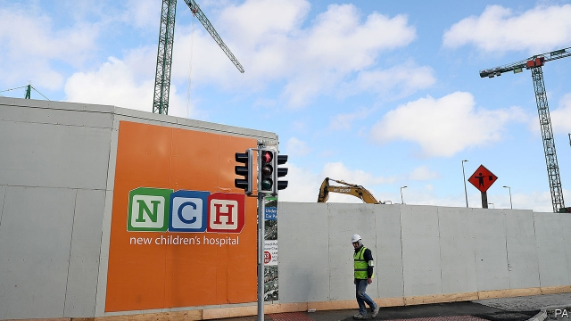

###### On second thoughts

# Health care in Ireland leaves much to be desired 

##### One more reason why Northern Ireland might not want to unite with the Republic 

 

> Mar 21st 2019 

AS THE UNITED KINGDOM prepares to slip its European moorings, the ties that bind it together are also under strain. In Northern Ireland, which (like Scotland) voted to remain, there is often talk that a “hard Brexit” could even build new momentum for a united Ireland. One reason for doubting this, however, can be summed up in a word: health. 

The 1.8m people of Northern Ireland enjoy free access to the British taxpayer-funded National Health Service (NHS). The Republic of Ireland’s 4.8m residents have to make do with something less appealing. “I know people up north whose life’s ambition is to see a united Ireland, and yet they worry when they see the health service we have down here,” says Louise O’Reilly, an MP in Dublin and health spokesperson for the all-island Sinn Fein party. 

Ireland’s relatively high spending on health care—the seventh highest in the OECD, at $5,500 per head in 2017—is not matched by the level of service. In theory, public hospital care is free, but waiting lists for diagnostic procedures and publicly funded specialists can stretch for months, even years. An over-reliance on expensive hospital treatment, rather than care in GP clinics, has contributed to a chronic shortage of beds. On any given day, hundreds of patients will be waiting on trolleys in hospital corridors, sometimes for more than 24 hours, hoping for a proper bed. Ireland’s minority government is well aware that, along with the acute housing shortage, health is the issue on which they are most vulnerable. 

Unlike their UK counterparts, some 60% of Irish people, mostly those who are not very old or very poor, have to pay up front in cash for primary health care: a single GP visit typically costs between €50 and €60 ($60-$68). The state only pays for medicines above a monthly threshold of €134. 

Junior doctors and nurses battle with long hours, stress and inadequate equipment in overcrowded and dingy old buildings. Many choose to take their training abroad. Meanwhile, a planned new National Children’s Hospital, originally billed at a hefty €650m, has seen its projected cost balloon to €1.73bn. In terms of cost per bed, an estimated €3.7m and climbing, it would be by far the most expensive hospital in the world. 

Experts blame much of the dysfunction on poor and piecemeal long-term planning, inadequate budget control and Ireland’s “two tier” public-private health system. In Ireland, unlike in most other EU countries, most specialists employed in publicly funded hospitals, already well paid by the state, are allowed to dedicate a portion of their time (typically 20%, though there is in practice little supervision) to private patients. These patients are often in the same public hospital and using publicly provided facilities. As a new EU country report noted last month, this “creates perverse incentives in publicly funded hospitals, where preferential treatment of privately insured patients adds to doctors’ private revenues”. 

Róisín Shortall, a former junior health minister and joint leader of the centre-left Social Democrat party, notes that many worried families pay for no-frills health insurance (at an average annual cost of €1,850 in 2017), just to be able to skip lengthy queues. “Between 46% and 47% of Irish people are on private health insurance, which is by far the highest rate in Europe,” she says. Yet only 13% of the total Irish spend on health comes from private insurance, leading to the charge that the private sector is piggy-backing on the public one. 

Many Irish people are familiar with and envious of the UK’s NHS and in 2017 a cross-party committee of MPs voted unanimously in favour of Sláintecare (“Sláinte” means “health” in Irish), a detailed plan to introduce free and improved care at all levels of treatment. One key recommendation was the phasing out of private practice in public hospitals. 

The government of prime minister Leo Varadkar, himself a doctor and former health minister, has said that it accepts the plan. In practice, though, it has done little to advance it. Ms Shortall says implementing the plan would require a €7bn ring-fenced investment over ten years. The government has so far voted it only €20m. 

Diarmaid Ferriter, a social historian at University College Dublin, says that resistance to reform comes partly from free-market ideology (the Republic throughout its history has always been ruled by alternating centre-right parties, never left-wing ones) and partly from the insurance industry and senior doctors. “In Ireland in the 1940s private medical practitioners were worried about a reduction in their income from what they saw as “socialised medicine”, and they brought the Catholic church on board, saying that if the state extended its reach it might start looking at contraception and things like that,” he says. “The church has declined in influence, but the power of the consultants has not.” 

-- 

 单词注释:

1.mooring['muәriŋ]:n. 系泊, 系留, 停泊处, 系船处 

2.Brexit[]:[网络] 英国退出欧盟 

3.momentum[mәu'mentәm]:n. 动力, 动量 [化] 动量 

4.nh[]:abbr. 不吸湿的（nonhygroscopic）；全日空航空公司；美国地名, 新罕布什尔（New Hampshire） 

5.les[lei]:abbr. 发射脱离系统（Launch Escape System） 

6.louise[lu(:)'i:z]:n. 路易丝（女子名） 

7.MP[]:国会议员, 下院议员 [计] 宏处理程序, 维护程序, 线性规划, 微程序, 多处理器 

8.Dublin['dʌblin]:n. 都柏林 

9.spokesperson['spәukspә:sn]:n. 发言人, 代言人 

10.sinn[]: [人名] 辛恩; [地名] [德国] 辛恩; [地名] [德国] 辛恩河 

11.fein[]:abbr. 联邦雇主识别号码（Federal Employer Identification Number） n. (Fein)人名；(英)费恩；(法、德、匈、荷)法因 

12.Oecd[]:[经] 已开发国家组织 

13.diagnostic[daiәg'nɒstik]:a. 诊断的, 有助于诊断的, 特征的 n. 诊断, 病的征候, 诊断法 [计] 诊断的 

14.GP[]:普通医师, 普通医生开业医生 [计] 通用程序设计, 图形处理器 

15.chronic['krɒnik]:a. 慢性的, 习惯性的 n. 慢性病患者 

16.trolley['trɒli]:n. 电车, 手推车, 台车 vt. 用手推车运 vi. 乘电车 

17.vulnerable['vʌlnәrәbl]:a. 易受伤害的, 有弱点的, 易受影响的, 脆弱的, 成局的 [医] 易损的 

18.UK[ju: 'kei]:n. 联合王国 

19.counterpart['kauntәpɑ:t]:n. 副本, 复本, 配对物, 相应物 [经] 副本, 正副二份中之一 

20.typically['tipikәli]:adv. 代表性地；作为特色地 

21.threshold['θreʃәuld]:n. 门槛, 入口, 开端, 阈 [计] 阈; 阈值 

22.inadequate[in'ædikwәt]:a. 不充分的, 不适当的 [法] 不充分的, 不适当的 

23.overcrowd[.әuvә'kraud]:vt. 容纳过多的人, 使过度拥挤 

24.dingy['diŋdʒi]:a. 暗淡的, 昏暗的, 邋遢的 

25.originally[ә'ridʒәnli]:adv. 本来, 原来, 最初, 就起源而论, 独创地 

26.hefty['hefti]:a. 重的, 肌肉发达的 

27.dysfunction[dis'fʌŋkʃәn]:n. 机能不良, 机能障碍 [医] 机能障碍, 机能不良 

28.piecemeal['pi:smi:l]:adv. 一件一件地, 逐个地, 零碎地 a. 一片一片的, 逐渐的, 零碎的 n. 断片 

29.tier[tiә]:n. 排, 层, 等级 

30.EU[]:[化] 富集铀; 浓缩铀 [医] 铕(63号元素) 

31.dedicate['dedikeit]:vt. 献出, 贡献 

32.supervision[.sju:pә'viʒәn]:n. 监督, 管理 [经] 监督, 管理 

33.perverse[pә'vә:s]:a. 乖张的, 故意作对的, 有悖常情的, 执迷不悟的, 歪曲的, 错误的, 不正当的 [法] 邪恶的, 罪恶的:堕落的, 不合法的 

34.incentive[in'sentiv]:n. 动机 a. 激励的 

35.preferential[.prefә'renʃәl]:a. 优先的, (关税等)优惠的 [经] 特惠的; 特惠关税率, 优先权 

36.privately[]:adv. 秘密地；私下地 

37.shortall['ʃɔ:tɔ:l]:n. <美>(儿童穿的短袖、短裤脚管的)短连衣裤 

38.democrat['demәkræt]:n. 民主人士, 民主主义者, 民主党党员 [经] 民主党 

39.lengthy['leŋθi]:a. 冗长的, 漫长的 

40.sector['sektә]:n. 扇形, 部门, 部分, 函数尺, 象限仪, 段, 区段 vt. 把...分成扇形 [计] 扇面; 扇区; 段; 区段 

41.envious['enviәs]:a. 嫉妒的, 羡慕的 

42.MP[]:国会议员, 下院议员 [计] 宏处理程序, 维护程序, 线性规划, 微程序, 多处理器 

43.unanimously[]:adv. 全体一致, 无异议, 一致同意 

44.Leo['li:ou]:n. 狮子, 狮子座 

45.diarmaid[]: [人名] 迪尔梅德 

46.ferriter[]:[网络] 模拟训练中福瑞特 

47.historian[hi'stɒ:riәn]:n. 历史学家, 记事者 

48.ideology[.aidi'ɒlәdʒi]:n. 思想体系, 意识形态, 观念学, 空论 [医] 观念学, 观念形态 

49.alway['ɔ:lwei]:adv. 永远；总是（等于always） 

50.alternate['ɒ:ltәnәt]:a. 交替的, 轮流的, 间隔的 v. 轮流, (使)交替 

51.practitioner[præk'tiʃәnә]:n. 从业者, 开业者 [医] 行医者, 医师 

52.socialise['sәjʃәlaiz]:vt. 使社会化, 使社会主义化, 使适合社会需要 vi. (美)(非正式)参加社交活动, 发生社交往来 

53.contraception[.kɒntrә'sepʃәn]:n. 避孕, 避孕法 [医] 节(制生)育, 避孕 

