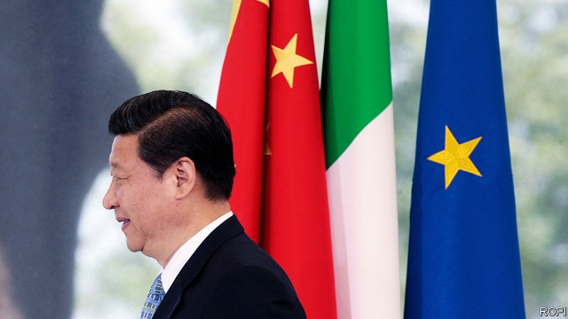

###### Not so silky

# Italy’s plan to join China’s Belt and Road Initiative ruffles feathers 

##### At home and abroad 

 

> Mar 21st 2019 

CHINA’S PRESIDENT, Xi Jinping, was due to land in Rome on March 21st, as The Economist went to press. His itinerary will include a state dinner, accompanied by a performance by Andrea Bocelli, an Italian opera star. Even more enjoyable for Mr Xi will be welcoming Italy into his Belt and Road Initiative (BRI), a programme of infrastructure projects that spans Eurasia, the Middle East and Africa. Italy’s prime minister, Giuseppe Conte, hopes the planned agreement, due to be signed on March 23rd, will boost Italian exports to China. But the accord has caused consternation both within his government and among Italy’s traditional allies. 

The BRI is China’s project to create a modern-day Silk Road, the ancient network of trade routes which once connected east and west. Billions of dollars have been invested since it was launched in 2013 across over 60 countries, in disparate infrastructure projects including railways, roads and ports. Some estimates of the total investment over the coming years run to $1trn or even more. 

Italy’s government last summer launched a “Task Force China” to develop a national strategy to strengthen Italy’s economic and trade relations with China and guarantee Italy a “position of leadership in Europe”. Stefano Manzocchi, a professor of international economics at Rome’s LUISS University, says Italy has “a clear interest” in participating. As one of Europe’s biggest manufacturing exporters, Italy will benefit from increased trade between China and Europe “by definition”, he says. But, he concedes, “the Chinese are incredible negotiators so [Italy] will have to be careful.” 

A dozen EU members have already signed memoranda with China on the BRI. But Italy would be the first G7 country to join the fray. The agreement is not a contract, but its symbolism is nevertheless important. It comes at a time when the BRI is facing a backlash, the EU is trying to forge a more co-ordinated approach to its dealings with China and there is heightened tension between China and America. The White House National Security Council has denounced the planned accord, tweeting that it “lends legitimacy to China’s predatory approach to investment and will bring no benefits to the Italian people.” 

Lucrezia Poggetti of the Mercator Institute for China Studies, a German think-tank, suggests Italy is taking a “big political risk for little economic gain”. The memorandum is unlikely to guarantee Italian firms access to BRI projects or specific investments, and Europe’s largest exporters to China—Germany and France—have not signed similar accords. Rather, says Ms Poggetti, the agreement serves Mr Xi’s purposes, conferring credibility at a time when his signature policy is facing criticism for creating debt traps in some of the countries in which it invests. 

The issue has become yet another point of contention within Italy’s coalition government. The anti-establishment Five Star Movement is keen to move ahead. The nationalist Northern League is concerned that cosying up to China puts its alliance with America at risk. 

As Mr Xi signs his memorandum, he may glimpse another division, over an existing infrastructure project. A protest is planned for the same day against a partly completed high-speed rail link between Turin in northern Italy and Lyon in France. Debate continues to rage within the government between the League, which favours it, and the Five Star Movement, which does not. 

Of all these various “ticking bombs” threatening to blow apart Italy’s coalition government, says Francesco Galietti of Policy Sonar, a political-risk consultancy, the biggest is the next budget in November. For now, both sides are focused on sticking together at least until May’s European parliamentary elections are over. 

-- 

 单词注释:

1.silky['silki]:a. 丝的, 柔滑的 

2.ruffle['rʌfl]:n. 皱褶, 波纹, 生气, 混乱 vt. 弄皱, 触怒, 洗(牌), 连续轻擂(鼓) vi. 起皱, 发脾气, 连续轻擂 

3.Rome[rәum]:n. 罗马 

4.economist[i:'kɒnәmist]:n. 经济学者, 经济家 [经] 经济学家 

5.itinerary[ai'tinәrәri]:n. 旅程, 旅行指南, 游记 a. 巡回的, 旅程的 

6.andrea['ændriә,ɑ:n'dreiә]:n. 安德里亚（男子名） 

7.bocelli[]:n. (Bocelli)人名；(意)博切利 

8.BRI[]:[计] 基本速率综合业务数字网 

9.infrastructure['infrәstrʌktʃә]:n. 基础结构, 基础设施 [经] 基础设施 

10.Eurasia[ju'reiʒә]:n. 欧亚大陆 

11.giuseppe[]:n. 朱塞佩（男子名） 

12.conte[kuŋt]:n. 短篇小说 

13.consternation[.kɒnstә'neiʃәn]:n. 惊愕, 恐怖, 惊惶失措 

14.ally['ælai. ә'lai]:n. 同盟者, 同盟国, 助手 vt. 使联盟, 使联合, 使有关系 vi. 结盟 

15.disparate['dispәrәt]:a. 根本不同的, 全异的, 不相干的 n. 无法相比的东西(或人) 

16.Stefano[]:n. 斯特凡诺（意大利名） 

17.LUISS[]:[网络] 国际社会科学自由大学；罗马国际社会科学自由大学；罗马路易斯 

18.manufacturing[.mænju'fæktʃәriŋ]:n. 制造业 a. 制造业的 

19.exporter[ik'spɒ:tә]:n. 出口商, 输出者, 出口公司 [经] 出口商, 输出者 

20.concede[kәn'si:d]:vt. 承认, 退让 vi. 让步 

21.incredible[in'kredәbl]:a. 难以置信的 

22.negotiator[ni'gәuʃieitә]:n. 磋商者, 交涉者, 议定者 [经] 谈判者, 交易者, 协商者 

23.EU[]:[化] 富集铀; 浓缩铀 [医] 铕(63号元素) 

24.memorandum[.memә'rændәm]:n. 备忘录, 外交备忘录, 交易备忘录 [经] 备忘录, 便笺, 便函 

25.fray[frei]:n. 磨损, 打架, 争论 vt. 使磨损 vi. 被磨损 

26.symbolism['simbәlizm]:n. 象征主义, 符号论 [医] 象征主义 

27.backlash['bæklæʃ]:n. 后冲, 强烈反对 [电] 反撞, 逆栅流 

28.forge[fɒ:dʒ]:n. 熔炉, 铁工厂 vt. 打制, 锻造, 伪造 vi. 锻造, 伪造 

29.dealing['di:liŋ]:n. 经营行为, 行为, 交易 [法] 待遇, 处置, 行为 

30.heighten['haitn]:vt. 增高, 提高, 加强 vi. 升高, 变大 

31.denounce[di'nauns]:vt. 告发, 抨击, 谴责 [法] 谴责, 斥责, 告发 

32.tweet[twi:t]:vi. 啁啾 n. 小鸟叫声 

33.legitimacy[li'dʒitimәsi]:n. 合法, 正统, 正当 [法] 合法性, 正统性, 婚生 

34.predatory['predәtәri]:a. 掠夺成性的, 捕食生物的, 掠夺的 [医] 捕食的 

35.lucrezia[]:n. (Lucrezia)人名；(意)卢克雷齐娅(女名), 卢克雷齐亚 

36.mercator[mә:'keitɔ:]:n. 墨卡托（地理学家, 地图制作家） 

37.confer[kәn'fә:]:vt. 授予, 带来 vi. 协商 

38.credibility[.kredi'biliti]:n. 可信用, 确实性, 可靠 [法] 证据能力, 可信程度, 确实性 

39.contention[kәn'teinʃәn]:n. 争论, 争辩, 所持的论点 [计] 争用 

40.coalition[.kәuә'liʃәn]:n. 结合体, 结合, 联合 [经] 联合, 联盟 

41.nationalist['næʃәnәlist]:n. 国家主义者, 民族主义者 

42.alliance[ә'laiәns]:n. 联盟, 联合 [法] 同盟, 联盟, 联姻 

43.turin[tju'rin]:n. 都灵（意大利城市） 

44.Lyon['laiәn]:n. 里昂 

45.Francesco[]:n. 弗朗西斯科（意大利文艺复兴时期著名作家）；弗朗西斯科（意大利著名导演） 

46.sonar['sәunɑ:]:n. 声纳 [计] 声纳 

47.consultancy[]:n. 商量, 协商, 磋商, 会诊, 与...商量, 咨询, 请教, 找(医生)看病, 查阅, 考虑 [经] 咨询业务, 咨询服务 

48.parliamentary[.pɑ:lә'mentәri]:a. 国会的, 议会的, 议会制度的 

