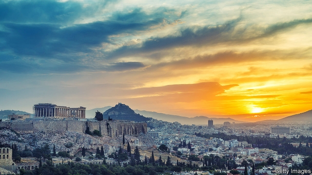
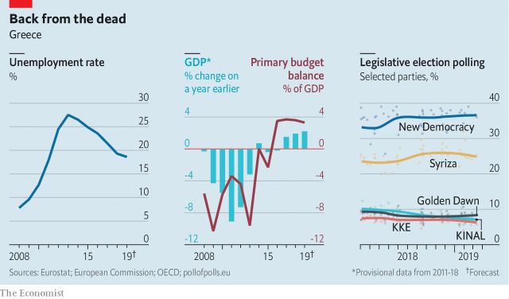

###### Twilight of Tsipras

# Syriza, Greece’s ruling party, is headed for electoral defeat 

##### But it has governed better than many feared 

 

> Mar 21st 2019 

FOR A MAN facing imminent electoral extinction Alexis Tsipras, the 44-year-old prime minister of Greece, seems as untroubled as Socrates preparing to drink his hemlock. For a start, he affects not to believe the polls. Even though all 12 of those published since the start of the year show his party, Syriza, losing to its rival, New Democracy (ND), nine of them by double-digit margins, he thinks they are systematically wrong. “They have a bad record,” he says. “At the time of the referendum [on a third bail-out, which he opposed], they predicted a close result. In fact, we won 61.3%.” 

That is true, but if Mr Tsipras really thinks he is in with a shot, he is alone among observers. Greece’s next general election must take place by October (though many expect him to call a snap vote at the same time as the European Parliament election, on May 26th), and in an interview with The Economist he seemed more like a man focused on his legacy than on the future. It is, to be fair, not a bad one. 

Though the world did not end on January 25th 2015, you might have been forgiven for thinking that it was about to. The election that day of a new Greek government under Syriza, the Coalition of the Radical Left, sent shock waves around Europe. Marine Le Pen, the French nationalist leader, hailed it as a “massive blow” to the EU; ratings agencies spoke of downgrades; Angela Merkel warned darkly that Greece needed to stick to its commitments on austerity and reform. She was right to worry. Over the next six months, the Syriza government broke off talks on a new bail-out, called its referendum on the terms demanded by the EU (which its finance minister had described as “fiscal waterboarding”), campaigned for a “No” vote, and won handsomely. 

Since the referendum, though, Mr Tsipras has performed the most remarkable volte-face in recent European history. His Germany-defying finance minister, Yanis Varoufakis, was pushed out; the bail-out terms he had contemptuously rejected were accepted; and the last phase of the austerity programme was fully implemented. Growth has returned, if a little anaemically, to 1.9% last year, and the government has more than met its Brussels-imposed obligation to run a primary (ie, excluding debt payment) surplus of 3.5%. Unemployment has fallen from 28% to (a still-too-high) 18%. “We have now had two years of 2% growth. This is very important given that we are also running a [primary] surplus above 3.5%....We had to fight to prove we could do it, and in less than two years we did it,” the prime minister says. 

Credibility matters to Mr Tsipras, for his party and for Greece itself. He insists he intends to see his term through, as a way of proving that Greece has recovered from the chaos it was cast into by the 2008 financial crisis. As the country’s GDP crashed by 25%, Greece saw five general elections between 2009 and 2015. “I will not hold an early election, because I want to show that this is a country of normality. For me, the most significant achievement is that we are back in a normal condition,” he says. In place of unstable coalitions, he continues, Greece now has “a clear division between progressives and conservatives…we have showed that Syriza is a party of compromise, and that Syriza is the leader of the centre-left. We are a party that belongs to the European family of the governing left. And if you govern, you have to make compromises.” 

The apparent evolution of Syriza from radical- to centre-left does not convince everyone. Critics include some very highly placed people, who are disquietingly nervous of criticising the government publicly. “Fundamentally, this is a party that remains uninterested in encouraging investment,” says one senior banker. Most of the fiscal adjustment under Syriza has been in the form of higher taxes on middle-class Greeks, rather than cutting spending or new privatisation. 

Although tax collection has been improved, little has been done by Syriza to boost Greek productivity. This betokens problems to come. “For the moment, there is still surplus capacity in the economy, but soon we will require a lot more investment if we are to grow,” says the banker. But with Greek banks sitting on non-performing loans of around 45% of their books, Greece’s dismal investment rate will not shift much. Foreign direct investment could plug the gap; but the Syriza government has a bad record on that score. Parts of a huge Chinese investment at Piraeus, Athens’s port, are being stymied by bureaucratic objections. The fact that a development on the site of Athens’s old airport seems paralysed is also a big eroder of confidence. Lawyers criticise a newly-politicised judiciary. 

The party’s attitude to education comes in for particular stick from the Syriza-doubters. Small things, like the ending of a tradition where the best-performing student at schools gets to carry the Greek flag in parades on national days are a sign, they complain, that Syriza is opposed to meritocracy and still wedded to its far-left past. Worse offences include the reversing of a law designed to loosen the often-disastrous grip of politicised student representatives on the governing councils of universities. Syriza’s hostility to the market is evidenced, says one leading industrialist, by the fact that Greece is the only country in the world apart from Cuba not to allow privately owned universities. Foreign universities interested in offering courses in Greece find it virtually impossible thanks to renewed bureaucratic interference. 

 

If Mr Tsipras’s days look to be numbered, what of the man likely to replace him later this year? Kyriakos Mitsotakis, the leader of New Democracy, is the polar opposite of the charismatic prime minister. Geeky and soft-spoken where Mr Tsipras is confident and forceful, Mr Mitsotakis could be a hard sell to ordinary Greeks. A graduate of Harvard Business School and the son of a former prime minister, he might have been sketched by a caricaturist to typify the Athens elite. 

Voters seem unfazed by that. Mr Mitsotakis’s real problems may come after victory: from his own party which, as Mr Tsipras did with Syriza, he will need to change. Many Greeks blame ND for the crony capitalism and reluctance to pay tax that got the country into its mess in the first place. Still deeply conservative, ND tried to prevent Mr Tsipras from allowing gay couples to foster children. It also tried and failed to stop him recognising Greece’s northern neighbour under the compromise name of North Macedonia, a deal that has ended a nasty dispute that has been going on for the past 27 years. Mr Mitsotakis caved in to his party’s right wing on both issues. 

But it would be a mistake to underestimate him. He has transformed the party’s finances, moving to headquarters costing a tenth as much. In an earlier government he did well as minister for administrative reform. “Tsipras has performed very poorly, for instance compared with Portugal, which has recovered much further and faster than Greece,” he says. His first priority will be tax reform, especially to ease the burden on business. He will push on with privatisation, and seek a less austere agreement with Greece’s creditors. “I inherited a party in deep crisis, and I’ve turned it around,” says the challenger. Now, he reckons, he can do the same for Greece. 

-- 

 单词注释:

1.twilight['twailait]:n. 暮光, 曙光, 黎明, 黄昏, 微光, 朦胧状态 a. 微明的 

2.Tsipras[]:[网络] 领袖齐普拉斯；领导齐普拉斯 

3.Syriza[]:[网络] 激进左翼联盟；激进左派联盟；左翼激进联盟 

4.electoral[i'lektәrәl]:a. 选举人的, 选举的, (有关)选举的 [法] 选举的, 选举人的, 由选举人组成的 

5.imminent['iminәnt]:a. 即将来临的, 逼近的 

6.extinction[ik'stiŋkʃәn]:n. 消失, 消灭, 废止 [化] 消光; 熄灭 

7.alexi[]:亚历克西（男子名） 

8.untroubled['ʌn'trʌbld]:a. 不烦恼的, 无忧虑的, 未被扰乱的, 未受骚扰的, 平静的 

9.Socrates['sɒkrәti:z]:n. 苏格拉底 

10.hemlock['hemlɒk]:n. 毒芹属植物, 铁杉 [医] 毒茴类毒草(如毒茴、毒芹), 铁杉属植物, 铁杉 

11.ND[]:北达科地 [医] 钕(60号元素) 

12.systematically[.sisti'mætikli]:adv. 有系统地, 有组织地, 有条理地 

13.referendum[.refә'rendәm]:n. （就重大政治或社会问题进行的）全民公决，全民投票 

14.economist[i:'kɒnәmist]:n. 经济学者, 经济家 [经] 经济学家 

15.legacy['legәsi]:n. 祖先传下来之物, 遗赠物 [经] 遗产, 遗赠物 

16.coalition[.kәuә'liʃәn]:n. 结合体, 结合, 联合 [经] 联合, 联盟 

17.LE[]:[计] 小于或等于 

18.nationalist['næʃәnәlist]:n. 国家主义者, 民族主义者 

19.hail[heil]:n. 冰雹, 致敬, 欢呼, 招呼 vt. 向...欢呼, 致敬, 招呼, 使象下雹样落下 vi. 招呼, 下雹 interj. 万岁, 欢迎 

20.EU[]:[化] 富集铀; 浓缩铀 [医] 铕(63号元素) 

21.rating['reitiŋ]:n. 等级, 额定功率, 责骂 [经] 等级评定 

22.downgrade['dajn^reid]:vt. 降低, 贬低 n. 下坡 a. 下坡 adv. 下坡 

23.angela['ændʒilә]:n. 安吉拉（女子名） 

24.merkel[]: [人名] 默克尔; [地名] [美国] 默克尔 

25.darkly['dɑ:kli]:adv. 暗, 黑, 呈黑 

26.austerity[ɒ'sterәti]:n. 朴素, 苦行, 严格, 严峻 

27.fiscal['fiskәl]:a. 财政的, 国库的 [经] 财政上的, 会计的, 国库的 

28.waterboarding['wɔ:təbɔ:dɪŋ]:n. 水刑 

29.handsomely['hænsәmli]:adv. 漂亮地, 整齐地, 当心地, 慢慢地, 优厚地, 慷慨地, 美观地 

30.yanis[]:[网络] 亚尼斯；上帝的礼物；黑道无间 

31.Varoufakis[]:[网络] 瓦鲁法克斯 

32.contemptuously[]:adv. 轻蔑地 

33.fully['fuli]:adv. 十分地, 完全地, 充分地 

34.anaemically[ə'ni:mik]:anaemically adv. anaemic的变形 anaemic [ə'ni:mik] adj. 无生气的，苍白无力的；委顿衰弱的 【病理学】贫血的，患贫血症的 

35.les[lei]:abbr. 发射脱离系统（Launch Escape System） 

36.credibility[.kredi'biliti]:n. 可信用, 确实性, 可靠 [法] 证据能力, 可信程度, 确实性 

37.chao[]:n. 钞（货币） 

38.normality[nɒ:'mæliti]:n. 常态 [化] 规定浓度; 当量浓度 

39.coalition[.kәuә'liʃәn]:n. 结合体, 结合, 联合 [经] 联合, 联盟 

40.disquietingly[dɪsk'waɪətɪŋlɪ]:adv. 令人心烦地 

41.criticise['kritisaiz]:v. 批评, 吹毛求疵, 非难 

42.fundamentally[fʌndә'mentәli]:adv. 基础, 首要, 主要, 十分重要, 基本, 根本, 原始, 基频, 基音, 基谐波 

43.uninterested[.ʌn'intәristid]:a. 不感兴趣的, 无利害关系的 

44.banker['bæŋkә]:n. 银行家, 庄家 [经] 银行业者, 银行家 

45.privatisation[ˌpraɪvətaɪ'zeɪʃən]:n. 私有化, 非国营化（将国营企业转为民营） 

46.productivity[.prәudʌk'tiviti]:n. 生产力 [经] 生产率, 生产能力 

47.betoken[bi'tәukn]:vt. 预示 

48.dismal['dizmәl]:a. 阴沉的, 凄凉的, 令人忧郁的 n. 低落的情绪, 沼泽 

49.piraeus[pai'ri:әs,pi'rei-]:n. 比雷埃夫斯（希腊东南部港市） 

50.stymy[]:n. (喻)困难的境地 vt. 使(球)处于困难的位置, 使为难, 使处困境, 妨碍, 阻挠, 阻碍 

51.paralyse['pærәlais]:vt. 使麻痹, 使瘫痪, 使无力, 使气馁, 终止 [医] 使麻痹, 使瘫痪 

52.eroder[ɪ'rəʊd]:vt. 腐蚀，侵蚀；磨去；磨损；蜕变： Battery acid had eroded the engine. 电池酸腐蚀了发动机。 腐蚀成，侵蚀成 (水道)；磨损成： The running water eroded a gully. 流水冲蚀出一条沟渠。 (逐渐)毁坏，损害，削弱；使变坏；使腐烂；使消失： Inflation erodes the value of our money. 通货膨胀使我们的货币贬值了。 【病理学】使溃烂；使成溃疡 vi. 受腐蚀；遭侵蚀，逐渐销蚀掉；受到破坏 衰落 变形： vt. eroded . eroding 

53.judiciary[dʒu:'diʃiәri]:a. 司法的, 法院的, 法官的 n. 司法部, 司法系统, 法官 

54.meritocracy[.meri'tɒkrәsi]:n. 精英领导阶级 

55.wed[wed]:vt. 与...结婚, 使结合 vi. 结婚 

56.politicise[pɒ'lɪtɪsaɪs]:vt. 使政治化, 使具有政治性; 使对政治有兴趣 

57.hostility[hɒs'tiliti]:n. 敌意, 敌对, 反对 

58.industrialist[in'dʌstriәlist]:n. 企业家, 实业家 [经] 实业家, 工业主义者 

59.Cuba['kju:bә]:n. 古巴 

60.privately[]:adv. 秘密地；私下地 

61.kyriakos[]:[网络] 希腊；基里亚科斯 

62.mitsotakis[]:米佐塔基斯 

63.polar['pәulә]:a. 两极的, 极地的, 正好相反的, 极性的 n. 极线, 极面 

64.charismatic[,kæriz'mætik]:a. 魅力, 能吸引大众的非凡能力, 神授的能力, 领袖人物感人的超凡魅力 

65.geeky['ɡiːkɪ]:a. <俚>令人讨厌的 

66.forceful['fɒ:sful]:a. 有力的, 强烈的, 有说服力的 

67.Harvard['hɑ:vәd]:n. 哈佛大学 

68.caricaturist['kærikәtjuәrist]:n. 讽刺画家, 漫画家 

69.typify['tipifai]:vt. 代表, 象征, 为...之典型 

70.Athens['æθәns]:n. 雅典(希腊首都) 

71.elite[ei'li:t]:n. 精华, 精锐, 中坚分子 

72.voter['vәutә]:n. 选民, 投票人 [法] 选民, 选举人, 投票人 

73.unfazed[ʌnˈfeɪzd]:a. 不担忧的, 不苦恼的 

74.crony['krәuni]:n. 密友, 亲密伙伴, 好朋友 

75.capitalism['kæpitәlizәm]:n. 资本主义 [经] 资本主义 

76.reluctance[ri'lʌktәns]:n. 不情愿, 勉强 [电] 磁阻 

77.foster['fɒstә]:a. 收养的, 养育的 vt. 养育, 抚育, 培养, 鼓励, 抱(希望) 

78.Macedonia[,mæsi'dәunjә]:n. 马其顿 

79.underestimate[.ʌndәr'estimeit]:n. 低估 vt. 低估, 看轻 

80.headquarter[,hed'kwɔ:tә]:vt. 将...的总部设在 

81.administrative[әd'ministrәtiv]:a. 管理的, 行政的 [法] 行政的, 管理的, 遗产管理的 

82.poorly['puәli]:adv. 贫穷地, 不充分地, 贫乏地 a. 身体不舒服的 

83.Portugal['pɒ:tʃugl]:n. 葡萄牙 

84.austere[ɒ'stiә]:a. 严峻的, 禁欲的, 简朴的 

85.creditor['kreditә]:n. 债权人 [法] 债权人, 债主, 贷方 

86.challenger['tʃælindʒә]:n. 挑战者 [经] 申请回避的人 

87.reckon['rekәn]:vt. 计算, 总计, 估计, 认为, 猜想 vi. 数, 计算, 估计, 依赖, 料想 

