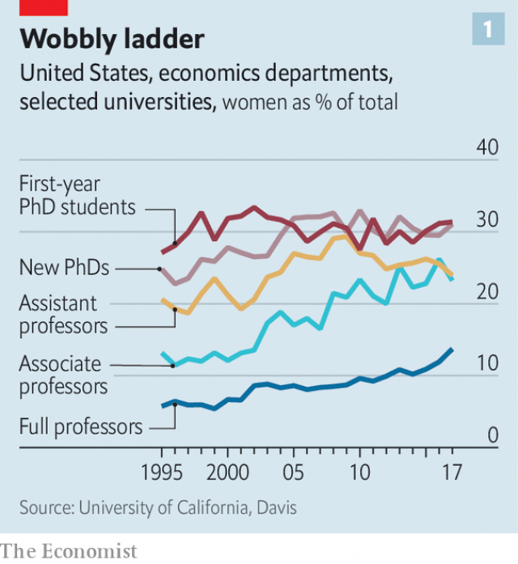
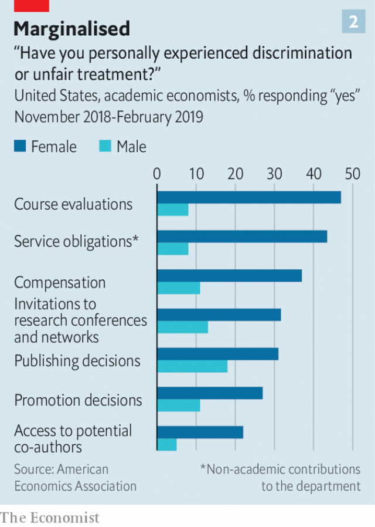

###### Academic sexism

# A dispiriting survey of women’s lot in university economics 

##### #EconomistsToo 

 

> Mar 21st 2019 

“WHY IS THIS an interesting question?” Éva Nagypál, then a junior economist presenting research at her first academic conference, had barely finished her opening sentence. She still remembers the interruption many years on. Later she came to learn that such rudeness was quite normal, and that economists were capable of worse. As a young woman, she also experienced some “inappropriate” behaviour, but brushed it off. “I could handle it,” she says. Being told she was “technically good, but not very creative” was harder to stomach. She left academic economics in 2009. 

Economists have tended to be wary of reading too much into anecdotes like Ms Nagypál’s. A single data point does not prove that women are picked on or pushed away. Even Ms Nagypál’s departure from academia was complicated. She liked her colleagues at Northwestern University, but felt drawn to more collaborative, policy-relevant research. The pull of her family was also a factor. 

But harder evidence of something amiss is building. Granted, more women are attaining senior positions in university economics. But women make up only around 30% of PhD students, and are likelier than men to drop away as they climb the career ladder. Among a group of 43 leading American universities, the female share of PhD students has been essentially flat for two decades (see chart 1). That of assistant professors has fallen since 2009. Progress seems to have been a little slower than in some natural sciences, and economics remains far behind other social sciences. 

 

Quantifying the effects of such fuzzy notions as behaviour and culture is hard. But the American Economics Association (AEA), the leading professional body for academic economists, has attempted to do just that. On March 18th the AEA published the findings of a survey of its members, examining the “professional climate”. The survey reveals many more data points than one, and finds plenty of evidence of harassment and discrimination. 

More than 9,000 economists, or 20% of those eligible, completed the survey. Only two-fifths of respondents reported that they felt “valued within...economics”. But women and non-whites tended to feel worst. They were more likely to report unfair treatment when seeking an academic job and in pay and promotion. Almost half of women reported experiencing discrimination based on their sex. Among non-whites of both sexes, 29% complained of discrimination on the basis of ethnicity. 

It is possible that the sample is biased, pushing up the apparent frequency of discrimination. The disgruntled may have been especially keen to have their say. Against that, the survey may have struggled to reach those who had been so discouraged by their experience that they had left the profession altogether. 

In any case, the survey yielded more than enough reports of sexual harassment. Nearly 2,000 respondents said they had been embarrassed or offended by inappropriate gestures, remarks or materials from other economists. Hundreds reported experiences of attempted or actual sexual assault by a colleague or student in the past ten years. And 267 reported that they would have been rewarded had they co-operated with unwanted sexual attention, or threatened with retaliation had they not. 

These figures are still fairly raw. Later this year the AEA will release further analysis, for example comparing the results with surveys from other academic disciplines. However economics measures up, abuses of power are probably widespread. A meta-analysis of studies of the prevalence of sexual harassment in 2003 ranked academia second only to the armed forces. 

The Economist has supplemented the AEA’s survey by interviewing 30 members of the profession, some speaking on condition of anonymity, to understand where and why problems exist. Most were women and at highly regarded universities. Most had tenure. Most reported that their colleagues were kind and that they enjoyed academic life. But their experiences varied widely. And all of them said that the profession had its problems. 

One reported receiving too many comments on her appearance. Another said a fellow graduate student had been stalked. Some spoke of a set of senior men who were notorious sources of unwanted attention after a few drinks. Others mentioned an academic who had been edged out of a university department after several complaints against him, including some by graduate students, of unwanted sexual advances. He was then promoted at a different university. 

Our interviewees found it much easier to name prominent bullies than notorious harassers. A senior professor said that she had seen a special nastiness reserved for people regarded as vulnerable, including women. Others claimed only to have seen “assholes” who were indiscriminate in their aggression. 

Uncovering and fixing such faults is difficult. Like any profession, economics is hierarchical. As in other academic disciplines, success depends on peer review. A formal complaint against someone higher up the ladder invites retaliation. Your research may be trashed. Your chances of promotion may be blighted. If the perpetrator is at a different university, you may not even know who to complain to. 

The potential for abuse of power starts early. There is a growing trend for young economists to work as research assistants to leading academics, as a pathway into prestigious PhD programmes. If the academic refuses to write them a good reference, their career may be over before it even starts. PhD students are just as reliant on their seniors. Success requires letters of recommendation, invitations to conferences, help with research ideas and perhaps joint research. In all these areas women were far likelier to report unfair treatment than men in the AEA’s survey (see chart 2). Non-whites were also more likely to report it than whites. 

 

Unfair treatment can be unwitting. Senior professors may be unconsciously drawn to favour students who look like their younger selves. They may like chatting about work over a drink, which young women may find uncomfortable. One PhD student said she felt that female students found it harder to connect with male professors. She suspected that was partly due to unspoken worries about harassment. 

On the job market, too, interviewees detected implicit bias. One senior woman recalled hearing statements such as “Her paper is really good—she works really hard” alongside those like “His paper is OK but he’s super-smart.” Writers of recommendation letters may not take into account time off for child-rearing. Women may be held to higher standards in evaluations of their research. Two recent studies by Erin Hengel of the University of Liverpool found that their papers are more readable than those written by men and cited more often, suggesting a higher hurdle for publication. Heather Sarsons of the University of Toronto has found that women get a smaller boost than men in their chances of tenure from each paper they co-write. 

Then there is the style of seminars, for which economics is notorious. Interruptions and intense questioning are supposed to weed out errors and uncover sloppy thinking. And several interviewees told of supportive sub-fields and departments, where the primary purpose was not to tear down the speaker. But one said she felt like quitting after seeing how a female presenter was treated. Another economist reported being asked during a presentation whether she knew any economics, and being interrupted incessantly. 

Even if everyone gets the same treatment, minority groups (which in economics includes women) may find such an environment unpleasant. The PhD students we spoke to said they were put off by the seminar style. Among macroeconomists, whose field is both particularly short of women and infamous for bare-knuckled seminars, 40% of those responding to the AEA’s survey felt “disrespected”; among female macroeconomists, 70% did. 

Change will be slow. Assessments of young economists’ potential will always be subjective to a degree. Some senior economists shudder, with justification, at the thought of sitting through a sloppy seminar in silence, and worry that a cuddlier environment will soften intellectual rigour. 

But experimentation is happening. Some departments have begun to try different seminar styles, for example insisting that presenters should be allowed a minimum time to speak before being interrupted. Some have circulated reminders that people should raise a hand before asking a question, or be mindful of the time they are taking as they make their point. 

Ideas are circulating about ways to attract and support junior and female researchers. The most recent issue of the Journal of Economic Perspectives contained a collection of papers on the determinants of women’s success in PhD programmes and ways to “make economics work for women at every stage”. One, by Leah Boustan and Andrew Langan of Princeton University, found that departments with better outcomes for junior women also hired more female faculty members, provided “collegial” research seminars and were more aware of gender issues. 

Another paper by Mr Langan, covering accounting, sociology and political science as well as economics, found that when women become department chairs, the female share of graduate students goes up with no deterioration in candidates’ quality. Women in those departments also publish more papers and are likelier to get tenure. The difference may lie in female heads of department sharing out non-academic duties more fairly. Over 40% of the women in the AEA’s survey reported being given a disproportionate load. 

Young economists are also speaking out. Last year the New York Times reported that Roland Fryer, a prominent economist at Harvard, had been found by the university to have created a hostile work environment for research assistants in his laboratory, which he denies. After Mr Fryer resigned from the AEA’s executive committee last December, several hundred research assistants and graduate students from dozens of universities signed an open letter in Medium, an online magazine, pointing out that bad behaviour was “too often an open secret among graduate students and junior faculty”. 

Some have accused economists of being slow to tackle discrimination in their profession because of their conviction that market forces would drive it out. “It was more like benign neglect,” says Ben Bernanke, a former head of the Federal Reserve and the AEA’s president. “Nobody said we should prevent women from becoming economists. But there weren’t a lot of people saying we should take affirmative steps to make it more accessible to a broader range of people.” 

Now the AEA is taking action. Mr Bernanke, Olivier Blanchard (his predecessor as president) and Janet Yellen (his successor and another ex-head of the Fed) announced several measures with the survey’s findings. The AEA will pay for an ombudsman to hear and record complaints about harassment and discrimination, and to provide advice. Members will vote on proposals to add teeth to an expanded code of conduct. Penalties for misbehaviour include ejection from the AEA’s activities, termination of membership and a notification to an offender’s employer. Retaliation against anyone filing a complaint can also invite disciplinary action. 

This amounts to recognising that although economists may like to believe that their profession is a meritocracy, in which the best rise to the top, the reality is much murkier. As things stand, good work may be crushed along with the bad. And change would, if nothing else, make many economists happier. Ms Nagypál cannot say whether she would have stayed in a more supportive environment. But she knows that “it would have been nice to try.” 

-- 

 单词注释:

1.sexism['seksizm]:n. 性别歧视, 歧视女性 

2.dispirit[dis'pirit]:vt. 使沮丧, 使气馁 

3.economist[i:'kɒnәmist]:n. 经济学者, 经济家 [经] 经济学家 

4.rudeness[]:n. 无礼；粗蛮 

5.inappropriate[.inә'prәupriәt]:a. 不适当的, 不相称的 

6.technically['teknikli]:adv. 技术上, 学术上, 专门地 

7.wary['wєәri]:a. 谨慎的, 小心的, 机警的, 周到的, 唯恐的 

8.datum['deitәm]:n. 论据, 材料, 资料, 已知数 [医] 材料, 资料, 论据 

9.academia[.ækә'di:miә]:n. 学术界, 学术生涯 

10.northwestern[.nɒ:θ'westәn]:a. 在西北部的, 西北方的, 来自西北的 

11.collaborative[kә'læbәreitiv]:a. 合作的, 协作的 

12.amiss[ә'mis]:a. 有毛病的, 出差错的 adv. 错误地, 不顺当, 有缺陷地 

13.phd[]:abbr. 哲学博士学位（Doctor of Philosophy） 

14.essentially[i'senʃәli]:adv. 本质上, 本来 

15.quantify['kwɒntifai]:vt. 定量, 用数量表示, 测量 

16.fuzzy['fʌzi]:a. 有微毛的, 模糊的 [电] 微毛 

17.AEA[]:abbr. 原子能法（Atomic Energy Authority）；演员协会（Actors ' Equity Association）；美国经济协会（American Economic Association）；成人教育协会（Adult Education Association）；美国教育协会（American Education Association） 

18.harassment['hærәsmәnt]:n. 困扰, 烦扰, 烦恼 [法] 折磨, 骚扰, 侵扰 

19.eligible['elidʒәbl]:a. 有资格当选的, 合格的 n. 有资格者, 合格者, 适任者 

20.respondent[ri'spɒndәnt]:a. 回答的, 应答的, 反射的 n. 应答者, 被告 

21.promotion[prәu'mәuʃәn]:n. 晋级, 创建, 增进 [经] 推广, 推销, 促进 

22.ethnicity[eθ'nisәti]:n. 种族划分 

23.bias['baiәs]:n. 偏见, 斜纹 a. 偏斜的 adv. 偏斜 vt. 使有偏见 [计] 偏流; 偏压; 偏磁; 偏离 

24.disgruntle[dis'grʌntl]:vt. 使不高兴 

25.assault[ә'sɒ:t]:n. 攻击, 袭击 vt. 袭击, 攻击 vi. 发动攻击 

26.unwanted[.ʌn'wɒntid]:a. 没人要的, 不需要的, 多余的 

27.retaliation[ri.tæli'eiʃәn]:n. 报复 [法] 报仇, 报复, 回敬 

28.prevalence['prevәlәns]:n. 普遍, 流行, 广泛 [医] 流行, 盛行 

29.economist[i:'kɒnәmist]:n. 经济学者, 经济家 [经] 经济学家 

30.anonymity[.ænә'nimiti]:n. 匿名, 姓氏不明 [计] 匿名信件 

31.tenure['tenjuә]:n. 享有, 保有期 [经] (财产,职位等的)占有, 占有权 

32.stalk[stɒ:k]:n. 茎, 追踪, 高视阔步 vi. 悄悄靠近, 蹑手蹑脚地走近, 蔓延, 高视阔步 vt. 追踪, 搜索 

33.notorious[nәu'tɒ:riәs]:a. 声名狼藉的, 臭名昭著的, 众人皆知的 

34.interviewee[.intәvju:'i:]:n. 被接见者, 被采访者, 被面试者 

35.bully['buli]:n. 欺凌弱小者, 土霸 vt. 威胁, 恐吓, 欺负 vi. 欺负 a. 特好的, 第一流的 adv. 十分 

36.harasser[]:n. 骚扰者；袭扰者导弹车 

37.nastiness['nɑ:stinis]:n. 污秽, 不洁, 烦人 

38.vulnerable['vʌlnәrәbl]:a. 易受伤害的, 有弱点的, 易受影响的, 脆弱的, 成局的 [医] 易损的 

39.asshole['æshәul]:n. 屁眼儿, 肛门；令人讨厌的人 

40.indiscriminate[.indis'kriminit]:a. 无差别的, 任意的, 杂乱的 [医] 无差别的, 普遍的 

41.hierarchical[,haiә'rɑ:kikәl]:[计] 分级的, 分层的, 层次的 

42.peer[piә]:n. 同等的人, 匹敌, 贵族 vi. 凝视, 窥视, 费力地看, 隐现 vt. 与...同等, 封为贵族 

43.trash[træʃ]:n. 垃圾, 废物 vt. 丢弃 

44.blight[blait]:n. 枯萎病 vt. 使染上枯萎病, 破坏 vi. 枯萎 

45.perpetrator[]:n. 作恶者, 犯罪者, 行凶者 [法] 作恶者, 行凶者, 犯罪者 

46.pathway['pɑ:θwei]:n. 路径, 途径 [医] 路径, 道 

47.prestigious[pre'stidʒiәs]:a. 享有声望的 

48.reliant[ri'laiәnt]:a. 依赖的, 信赖的 

49.unwitting[.ʌn'witiŋ]:a. 不知情的, 没有意识到的, 不知不觉的 

50.unconsciously[.ʌn'kɒnʃәsli]:adv. 无意识地, 无意中, 不知不觉地 

51.unspoken['ʌn'spәukәn]:unspeak的过去分词 

52.implicit[im'plisit]:a. 暗示的, 含蓄的, 固有的, 绝对的 [经] 不讲明的, 含蓄的 

53.evaluation[i.vælju'eiʃәn]:n. 评估, 估价, 求值 [计] 鉴定; 评价; 求值 

54.Erin['iәrin]:n. 爱尔兰 

55.hengel[]:[网络] 亨格尔；韩盖尔；韩高 

56.Liverpool['livәpu:l]:n. 利物浦 

57.readable['ri:dәbl]:a. 值得一读的, 易读的, 读起来津津有味的 [电] 可读的 

58.cite[sait]:vt. 引用, 引证, 表彰 [建] 引证, 指引 

59.hurdle['hә:dl]:n. 障碍, 跳栏, 临时活动篱笆 vt. 用篱笆围, 越过, 克服 

60.heather['heðә]:n. 石南花 a. 似石南的, 杂色的 

61.sarson['sɑ:sɔn]:[印]野油菜 

62.toronto[tә'rɔntәu]:n. 多伦多（加拿大城市） 

63.wee[wi:]:a. 很小的, 微小的 n. 一点点 

64.sloppy['slɒpi]:a. 泥泞的, 潮湿的, 粗心的 

65.supportive[sә'pɔ:tiv]:a. 支撑, 支承, 资助, 赞助, 支援, 经受, 忍受, 扶养, 证实, 鼓励, 维持, 伴奏 

66.presenter[pri'zentә]:n. 节目主持人, 奉献者, 提出者 [法] 告发者, 提出者, 推荐者 

67.incessantly[ɪn'sesntlɪ]:adv. 不断地, 不停地; 接连不断; 连绵不断; 不已 

68.macroeconomist[,mækrəʊɪ'kɒnəmɪst]:n. 宏观经济学家 

69.disrespect[.disri'spekt]:n. 不敬, 失礼, 无礼 

70.alway['ɔ:lwei]:adv. 永远；总是（等于always） 

71.shudder['ʃʌdә]:n. 战栗, 发抖 vi. 战栗, 发抖 

72.justification[.dʒʌstifi'keiʃәn]:n. 辩护, 证明正当, 释罪 [计] 调整 

73.cuddly['kʌdli]:a. 可爱的, 适于搂抱的, 喜欢拥抱的, 可拥抱的 

74.soften['sɒftn]:v. (使)变柔软, (使)变柔和 

75.rigour['rigә]:n. 严格, 严厉, 苛刻, 严酷, 严密, 精确 

76.experimentation[eks,perimen'teiʃәn]:n. 实验, 试验, 实验法 [化] 实验; 实验过程 

77.reminder[ri'maindә]:n. 提醒的人, 暗示 [经] 催单 

78.mindful['maidful]:a. 深切注意的, 留神的, 留心的 

79.determinant[di'tә:minәnt]:n. 决定物, 决定因素 a. 决定性的 [计] 判定 

80.Leah[liә]:n. 利亚(<<圣经>>故事人物) 

81.andrew['ændru:]:n. 安德鲁（男子名） 

82.Langan[]:兰根(人名姓氏) 

83.Princeton['prinstәn]:n. 普林斯顿 

84.collegial[kә'li:dʒiәl]:a. 学校的, 大学的, 大学生的, 社团的 

85.gender['dʒendә]:n. 性 vt. 产生 

86.sociology[.sәusi'ɒlәdʒi]:n. 社会学 [医] 社会学 

87.deterioration[di.tiәriә'reiʃәn]:n. 恶化, 衰退, 退化 [医] 变坏, 变质, 颓废, 衰退 

88.disproportionate[.disprә'pɒ:ʃәnit]:a. 不成比例的 

89.york[jɔ:k]:n. 约克郡；约克王朝 

90.roland['rәulәnd]:n. 罗兰（男子名） 

91.fryer[fraiә]:n. 做油煎食物的人, 可供油炸的食品, 油炸锅 

92.Harvard['hɑ:vәd]:n. 哈佛大学 

93.online[]:[计] 联机 

94.tackle['tækl]:n. 工具, 复滑车, 滑车, 装备, 扭倒 vt. 固定, 处理, 抓住 vi. 扭倒 

95.conviction[kәn'vikʃәn]:n. 定罪, 信服, 坚信 [法] 定罪, 证明有罪, 判罪 

96.benign[bi'nain]:a. 善良的, 良性的 [医] 良性的 

97.ben[ben]:n. 内室 [医] 贝昂(俗名,一般指辣木Moringa oleifera,有时也指一些不同属的植物) 

98.bernanke[]:n. 伯南克（姓氏） 

99.affirmative[ә'fә:mәtiv]:a. 肯定的, 赞成的, 积极的 n. 肯定语 

100.Olivier[əu'liviə]:n. 奥利维尔（男子名） 

101.Blanchard['blæntʃəd]:n. 布兰卡德（男子名） 

102.predecessor[.predi'sesә]:n. 前任, 先辈, 前身 [医] 初牙, 前辈, 祖先 

103.JANET['dʒænit]:[计] 英国大学联合科学网 

104.yellen[]: [人名] 耶伦 

105.successor[sәk'sesә]:n. 继承者, 接任者 [计] 后继 

106.ombudsman['ɒmbudzmæn]:n. (专查官员舞弊的)调查官 [法] 调查专员, 监察专员, 司法专员 

107.penalty['penәlti]:n. 处罚, 刑罚, 罚款, 罚球, 报应, 不利结果, 妨碍 [经] 罚金(款), 违约金 

108.misbehaviour[.misbi'heivjә]:n. 行为无礼貌, 行为不端 

109.ejection[i'dʒekʃәn]:n. 驱逐, 喷出, 排出物 [化] 排出 

110.termination[.tә:mi'neiʃәn]:n. 终止, 结束, 结果, 词尾 [化] 终止 

111.membership['membәʃip]:n. 会员的资格, 全体会员, 会员数目 [法] 会员资格, 成员资格, 会籍 

112.notification[.nәutifi'keiʃәn]:n. 通知, 通告, 告示 [经] 通知, 通知书 

113.retaliation[ri.tæli'eiʃәn]:n. 报复 [法] 报仇, 报复, 回敬 

114.disciplinary['disiplinәri]:a. 训练的, 纪律的, 训诫的 [法] 纪律的, 惩戒性的 

115.meritocracy[.meri'tɒkrәsi]:n. 精英领导阶级 

116.murky['mә:ki]:a. 黝暗的, 阴沉的, 朦胧的 

117.cannot['kænɒt]:aux. 无法, 不能 

