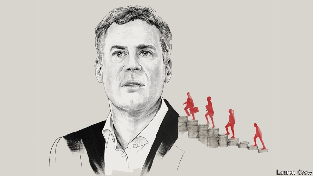

###### Free exchange

# Alan Krueger, natural talent 

##### A quiet revolutionary of economics died on March 16th 

 

> Mar 21st 2019 

FEW ECONOMISTS can claim either to have successfully challenged the bedrock beliefs of their field or to have altered how governments pursue policies that affect millions. Alan Krueger, who died on March 16th, managed both. In research with David Card in the early 1990s, Mr Krueger showed, through careful data analysis, that increases in the minimum wage did not lead to reductions in employment, as standard models suggested they should. The research, which the authors summarised in a seminal book, “Myth and Measurement”, published in 1995, drew a scathing initial response. Critics assaulted their motivations, data and analysis until allowing, finally, that the pair had a point. Their work changed economics and politics. It also exemplified Mr Krueger’s career as both scholar and public servant. 

Mr Krueger did not come across as the combative type. He was gracious and generous in person, and a skilled communicator. That came in handy during his time in Washington, as chief economist of the Department of Labour when Bill Clinton was president, and in the Treasury and the White House under Barack Obama during the most tumultuous economic times since the 1930s. He often wrote for the New York Times and appeared on television. Helping people understand what economists had learned was, he believed, part of an economist’s job. 

His passion, however, was the craft of economics. In 1987, as a newly minted PhD, Mr Krueger accepted a position at Princeton University, not far from the New Jersey town where he grew up. From the outset he was interested in understanding why workers earned what they did. But he recognised that the question could not be answered satisfactorily without rigorous and careful study of data. Mr Krueger subscribed to the New England Journal of Medicine, and admired the way each article began by discussing the paper’s research design. Economics badly lagged behind medicine and the physical sciences in the use of careful empirical work, not least because of the difficulty of running experiments on messy real-world interactions. In the late 1980s, however, some economists were honing methods to study “natural experiments”, in which a more or less random, localised event allowed researchers to compare the experiences of affected and unaffected groups, in something of the way that a laboratory scientist might compare treatment and control groups. 

Messrs Card and Krueger applied the approach to studying the effects of changes in the minimum wage. At the time most economists assumed that labour markets were more or less competitive. Workers could easily leave firms that offered them too little; firms had to accept prevailing market wages and would only hire as many workers as made financial sense. An increase in the minimum wage, by making labour more expensive, should thus translate directly into lower employment. But did it? Beginning in the early 1980s, increases in America’s national minimum wage were infrequent and too small to overcome the effects of inflation. Some states responded by raising their own minimum rates, creating just the natural experiment Messrs Card and Krueger needed. They studied the effect of a rise in New Jersey’s minimum wage in 1992 on employment in fast-food restaurants, using neighbouring Pennsylvania, which had not enacted an increase, as a comparator. They did not detect any negative effect on employment. 

Though arguments about this research rumbled on for years, its impact has been undeniable. It opened the floodgates to a wave of work with natural experiments. It also stirred debate about competition in labour markets, to which Mr Krueger would contribute for the rest of his life. Markets might not be very competitive at all, some economists reckoned, because it is costly for workers to find and switch jobs, or because large firms dominate markets or collude to suppress pay. In a talk last August, Mr Krueger cited a stream of recent research in arguing that stubbornly weak wage growth is strong evidence that workers have too little bargaining power, and that the economy is suffering as a result. It is wrong to label such dynamics “market imperfections”, he mused. As Mr Krueger pointed out, Adam Smith himself thought labour markets worked that way. 

Mr Krueger’s papers explored how factors from education to race to technology influenced workers’ prospects, often rustling up new data sources in the process. He drew a link between America’s opioid-addiction crisis and declining participation in the labour market, especially among men. He made a habit of attending a festival for twins with Orley Ashenfelter, a mentor and Princeton colleague, to seek subjects for studies of the influence of education on earnings, using genetic similarities to isolate the effect. Mr Krueger’s curiosity was insatiable. He published on a remarkable variety of topics. After the attacks of September 11th 2001, he explored the factors contributing to the decision to become a terrorist. In a book in 2007 he argued that political repression, rather than a dearth of economic opportunity, did most to foment terrorism. He studied the entertainment industry, to understand how technology and globalisation are affecting the economics of popular music (another passion): a book is due out in June. 

And, often in partnership with Daniel Kahneman, a Nobel laureate who pioneered the application of psychology to economics, Mr Krueger dug into the measurement of subjective well-being, hoping to find better ways of capturing shifts in what matters most in life (see article). The goal of economic progress is after all to help people lead more satisfying lives, and to foster its pursuit, governments and scholars need reliable data. It was a message he preached throughout his career. His professional example inspired scores of young scholars, whose work is a monument to his memory. Both economics and American public life are much poorer for his death. 

-- 

 单词注释:

1.alan['ælәn]:n. 艾伦（男子名） 

2.krueger[]:克鲁格 

3.economist[i:'kɒnәmist]:n. 经济学者, 经济家 [经] 经济学家 

4.bedrock[bed'rɒk]:n. 基岩, 基本原理, 基础 

5.david['deivid]:n. 大卫；戴维（男子名） 

6.datum['deitәm]:n. 论据, 材料, 资料, 已知数 [医] 材料, 资料, 论据 

7.summarise['sʌmәraiz]:vt. 概括, 总结, 摘要, 概述 

8.seminal['seminl]:a. 精液的, 种子的, 生殖的 [医] 种子的; 精液的 

9.myth[miθ]:n. 神话, 虚构的事, 虚构的人 

10.scathing['skeiðiŋ]:a. 伤害的, 损伤的, 严厉的 

11.assault[ә'sɒ:t]:n. 攻击, 袭击 vt. 袭击, 攻击 vi. 发动攻击 

12.politic['pɒlitik]:a. 精明的, 明智的, 策略的 

13.exemplify[ig'zemplifai]:vt. 例证, 例示 [法] 制作经公章证明的誊本, 例证 

14.combative[kәm'bætiv]:a. 好斗的, 好事的 

15.communicator[kә'mju:nikeitә]:n. 传播者, 通信装置, 列车内通话装置 

16.Washington['wɒʃiŋtn]:n. 华盛顿 

17.clinton['klintәn]:n. 克林顿（男子名） 

18.treasury['treʒәri]:n. 国库, 宝库, 财政部, 国库券 [经] 库存, 国库, 金库 

19.barack[bɑ:'ræk]:n. 巴拉克（男子名） 

20.obama[]:n. 奥巴马(姓) 

21.tumultuous[tju:'mʌltʃuәs]:a. 吵闹的, 纷乱的, 骚乱的 [法] 喧嚣的, 骚乱的, 凶猛的 

22.york[jɔ:k]:n. 约克郡；约克王朝 

23.mint[mint]:n. 薄荷, 造币厂, 巨额 vt. 铸造, 铸币, 制造 

24.phd[]:abbr. 哲学博士学位（Doctor of Philosophy） 

25.Princeton['prinstәn]:n. 普林斯顿 

26.jersey['dʒә:zi]:n. 运动衫 

27.satisfactorily[.sætis'fæktәrili]:adv. 令人满意地 

28.rigorous['rigәrәs]:a. 严厉的, 严酷的, 严格的, 苛刻的, 严密的, 精确的 

29.empirical[em'pirikәl]:a. 完全跟据经验的, 经验主义的 [医] 经验主义的 

30.HON[hʌn]:[化] δ-羟基-γ-氧代正缬氨酸 [医] 羟氧基正缬氨酸 

31.les[lei]:abbr. 发射脱离系统（Launch Escape System） 

32.localise['lәjkәlaiz]:vt.vi. 使地方化, 使具有地方性, 使限制于局部, 确定起源, 集中, 局限 

33.unaffected[.ʌnә'fektid]:a. 不矫揉造作的, 自然的, 未受影响的, 未被感动的 [经] 不受影响的 

34.Messrs['mesәz]:[法][pl. ](=Messieurs)各位(先生) 

35.infrequent[in'fri:kwәnt]:a. 稀少的, 珍贵的, 罕见的 

36.inflation[in'fleiʃәn]:n. 胀大, 夸张, 通货膨胀 [化] 充气吹胀; 膨胀 

37.Pennsylvania[.pensil'veinjә]:n. 宾夕法尼亚 

38.enact[i'nækt]:vt. 制定法律, 扮演, 颁布 [法] 法令, 法规, 条例 

39.comparator['kɒmpәreitә]:n. 比较仪 [计] 比较分类器; 比较器 

40.rumble['rʌmbl]:n. 隆隆声, 辘辘声 vi. 发隆隆声, 辘辘响 vt. 使隆隆响, 低沉地说 

41.undeniable[.ʌndi'naiәbl]:a. 不可否认的 

42.floodgate['flʌdgeit]:n. 水门, 水闸, 防潮水闸 

43.reckon['rekәn]:vt. 计算, 总计, 估计, 认为, 猜想 vi. 数, 计算, 估计, 依赖, 料想 

44.collude[kә'lu:d]:vi. 共谋, 串通, 勾结 

45.suppress[sә'pres]:vt. 镇压, 使止住, 禁止, 抑制, 查禁 [法] 镇压, 平定, 禁止出版 

46.cite[sait]:vt. 引用, 引证, 表彰 [建] 引证, 指引 

47.stubbornly[]:adv. 倔强地；顽固地 

48.imperfection[.impә'fekʃәn]:n. 不完美, 缺点 [化] 缺陷; 疵点; 毛病 

49.muse[mju:z]:n. 沉思, 冥想 v. 沉思, 冥想, 若有所思地凝望或说 

50.Adam['ædәm]:n. 亚当 [计] 自动直接存取管理 

51.smith[smiθ]:n. 铁匠, 金属品工匠 [机] 锻造工, 上手 

52.rustle['rʌsl]:n. 沙沙声, 瑟瑟声, 飒飒声, 急忙 vi. 发出沙沙声 vt. 使飒飒作响 

53.participation[.pɑ:tisi'peiʃәn]:n. 参与, 分享 [经] 参与, 参股 

54.orley[]: [人名] 奥利 

55.ashenfelter[]: [人名] 阿申费尔特 

56.mentor['mentɔ:]:n. 指导者, 良师益友 

57.earning['ә:niŋ]:n. 收入（earn的现在分词） 

58.similarity[.simi'læriti]:n. 类似, 类似处 [法] 类似, 相似, 类似事例 

59.insatiable[in'seiʃjәbl]:a. 不知足的, 贪求无厌的 [医] 不能满足的, 不饱的 

60.terrorist['terәrist]:n. 恐怖分子 [法] 恐怖份子, 恐怖主义 

61.repression[ri'preʃәn]:n. 抑制, 压抑, 制止 [医] 压抑, 抑制 

62.dearth[dә:θ]:n. 缺乏, 粮食不足, 饥馑 

63.foment[fәu'ment]:vt. 热敷, 煽动 

64.terrorism['terәrizm]:n. 恐怖主义, 恐怖统治, 恐怖状态 [法] 胁迫, 暴政, 恐怖政治 

65.globalisation[,gləubəlai'zeiʃən]:n. 全球化, =globalization 

66.partnership['pɑ:tnәʃip]:n. 合伙, 合股, 合作关系 [经] 合伙(合作)关系, 全体合伙人 

67.daniel['dænjәl]:n. 丹尼尔（男子名） 

68.Kahneman[]:n. (Kahneman)人名；(英)卡内曼 

69.Nobel['nәubel]:n. 诺贝尔 

70.laureate['lɒ:riәt]:a. 戴桂冠的, 用月桂树枝编织成的, 荣誉的 n. 桂冠诗人 vt. 使戴桂冠 

71.foster['fɒstә]:a. 收养的, 养育的 vt. 养育, 抚育, 培养, 鼓励, 抱(希望) 

72.preach[pri:tʃ]:v. 传道, 讲道, 说教, 宣讲, 鼓吹 n. 说教, 布道 

