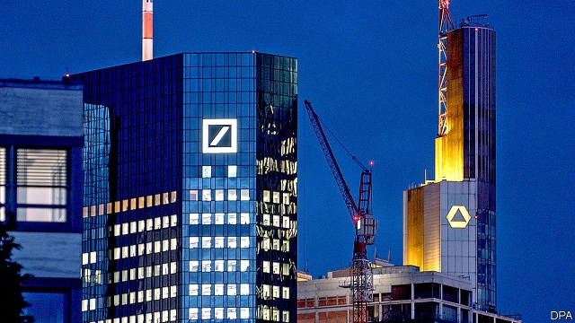
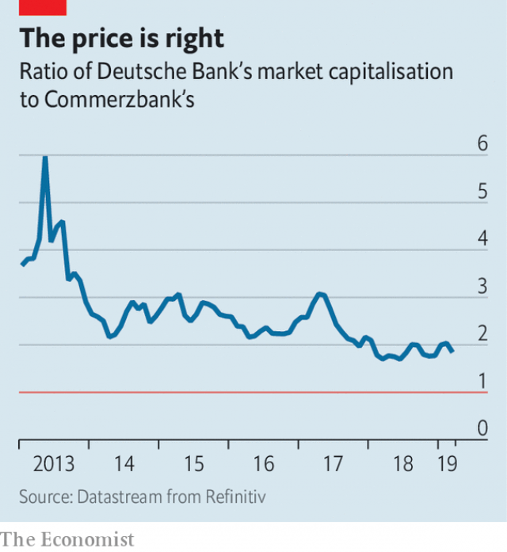

###### Urged to merge

# Commerzbank and Deutsche Bank start discussing a merger 

##### The smaller bank’s bargaining power has risen 

 

> Mar 21st 2019 

SO MUCH FOR the sepulchral calm of a German Sunday. On March 17th, after months of prodding from the German government and chatter in the financial press, Commerzbank and Deutsche Bank, Germany’s two largest listed lenders, said that they would begin exploring a merger. 

A deal, both banks are at pains to add, is far from certain. If it happens, it would create Europe’s third-biggest bank by assets, behind Britain’s HSBC (which does most of its business in Asia) and France’s BNP Paribas. It would also join together two chronic underperformers. Last year Deutsche’s return on equity, a puny 0.4%, was its first positive figure for four years. Commerzbank’s has bettered last year’s anaemic 3% only once since 2011. 

Combining two struggling banks looks like an improbable method of creating the robust “national champion” of which German ministers have been dreaming. Years of ultra-low interest rates and an overcrowded banking market—most of which is served by public-sector and co-operative lenders—have sapped profitability, even though both Commerzbank and Deutsche Bank are well capitalised and amply liquid. A merger is unlikely to change that. 

Encouragement from Berlin alone is not—or should not be—reason to merge, although the government is Commerzbank’s biggest shareholder, with 15%. The right gauge is what all the shareholders of both banks would stand to lose or gain. You might suppose that Deutsche’s should be keen on a fresh start. Its fall from grace since the financial crisis is a cautionary tale often told: its share price has fallen by 90% since 2007; not until 2015 did it accept that its global moneymaking machine, aka its investment bank, was kaputt; it is on its fourth chief executive in as many years; and so on. But its smaller neighbour may have the better (or rather, less bad) end of the bargain. 

To both banks, a merger brings the promise of scale, especially in retail banking. Deutsche’s share of the German market—adding its upmarket “blue” Deutsche Bank brand to the more basic Postbank—is around 11%, according to Autonomous Research; Commerzbank’s is 8%. With one-fifth of the market, a combined entity would be by far the biggest in Germany, maybe enough to exert some pricing power. Cutting costs—for instance by closing branches—might take out 30% of Commerzbank’s cost base, according to Magdalena Stoklosa of Morgan Stanley. 

Should the pair come to talking about takeover terms, Commerzbank’s bargaining position looks far stronger than it could have dreamed of a few years ago. Neither bank can be called highly valued: the stockmarket prices Deutsche at a paltry 24% of net book value and Commerzbank at 31%. But so far has Deutsche fallen that its market capitalisation is now just twice Commerzbank’s, against six times as much in 2013 (see chart). Even taking into account Deutsche’s talent for attracting trouble, for Commerzbank the ratio may not get better than this. 

 

Besides extra bulk and the chance to serve more of the Mittelstand—Germany’s myriad, mainly family-owned, companies—Commerzbank offers Deutsche improved funding. Commerzbank relies more than Deutsche on deposits, which are cheaper and stickier than funds from financial markets. Its €311bn ($363bn) of deposits at the end of September were worth 63% of its adjusted assets; Deutsche’s €553bn, 52%. So deep have been Deutsche’s woes that for most of the past three years its five-year credit-default-swap spreads—the cost of insurance against its failure to honour a bond—have been wider, often by half a percentage point or more, than those of the smaller bank. Last month it sold bonds at steepish yields. 

Although a merged bank would have more heft at home, it is hard to see what a takeover could do to restore Deutsche’s fortunes as a global investment bank. Having wisely given up its own international investment-banking ambitions, Commerzbank has little to offer. Admittedly, Deutsche is not alone: since 2012, notes a new report by Morgan Stanley, European investment banks have lost nine percentage points of market share in America, while Wall Street firms have gained the same amount in Europe. Though Deutsche is still Europe’s biggest, as well as its homeland’s flag-bearer, it will need more than a merger to patch its tattered standard. 

-- 

 单词注释:

1.merge[mә:dʒ]:vt. 使合并, 使消失, 吞没 vi. 合并, 渐渐消失 [计] 合并 

2.commerzbank[]: 德国商业银行公司总部所在地：德国主要业务：银行 

3.deutsche[]:n. 德意志联邦共和国马克 

4.merger['mә:dʒә]:n. 合并, 归并 [经] 购并 

5.sepulchral[si'pʌkrәl]:a. 坟墓的, 埋葬的 

6.prod[prɒd]:n. 刺针, 刺棒, 激励话, 提醒物 vt. 戳, 刺, 刺激 vi. 戳, 刺 

7.chatter['tʃætә]:n. 饶舌, 啁啾, 喋喋不休 vi. 喋喋不休地谈, (鸟)啭鸣 

8.lender['lendә]:n. 出借人, 贷方 [经] 出借者, 贷方, 贷款人 

9.asset['æset]:n. 资产, 有益的东西 

10.hsbc[]:abbr. 汇丰银行（Hong Kong and Shang Hai Banking Corporation） 

11.BNP[]:abbr. 英国国家党（British National Party）；巴黎国民银行（Banque Nationale de Paris）；脑利钠肽 

12.paribas[]:n. 巴黎银行 

13.chronic['krɒnik]:a. 慢性的, 习惯性的 n. 慢性病患者 

14.underperformer[]:n. 表现不佳者 [网络] 表现不如预期者；善者；跌至放牛班 

15.equity['ekwiti]:n. 公平, 公正 [经] 权益, 产权 

16.puny['pju:ni]:a. 微小的, 弱小的, 微不足道的 

17.anaemic[ә'ni:mik]:a. 贫血的, 患贫血症的, 无活力的 

18.improbable[im'prɒbәbl]:a. 不大可能的, 不象发生的, 荒谬可笑的 [法] 未必会的, 不大可能发生的, 未必确实的 

19.robust[rәu'bʌst]:a. 健康的, 强健的, 要用力气的, 坚定的, 粗野的 [计] 健壮性 

20.overcrowd[.әuvә'kraud]:vt. 容纳过多的人, 使过度拥挤 

21.sap[sæp]:n. 树液, 体液, 活力, 坑道, 消弱, 警棍 vt. 使排出体液, 使伤元气, 使衰竭, 挖坑道逼近, 逐渐侵蚀 vi. 挖坑道, 消弱 [计] 共享汇编程序, 结构分析程序, 符号汇编程序, 服务器广告协议 

22.profitability[.prɒfitә'biliti]:n. 收益性, 利益率 [经] 可获利润率 

23.capitalise['kæpitәlaiz]:vt. 用大写字母写, 用大写字母印, 投资于, 使变为资本, 提供资本给 vi. 利用 

24.amply['æmpli]:adv. 充足地, 充裕地 

25.Berlin[bә:'lin]:n. 柏林, (软质)柏林毛线 

26.shareholder['ʃєә.hәuldә]:n. 股东 [法] 股东, 股票持有人 

27.cautionary['kɒ:ʃәnәri]:a. 警告的 

28.moneymaking['mʌni.meikiŋ]:a. 热心赚钱的；会赚钱的；赚钱的 

29.AKA[]:[计] AS KNOW AS的缩写 

30.kaputt[]:a. 故障的;坏了的 

31.les[lei]:abbr. 发射脱离系统（Launch Escape System） 

32.upmarket[ˌʌpˈmɑ:kɪt]:a. 高级的, 高档的, 高端的 

33.entity['entiti]:n. 实体, 实存物, 存在 [计] 实体 

34.Magdalena[,mæɡdə'leinə; -'li:-]:n. 马格达莱纳（哥伦比亚省份）；马格达莱纳河 

35.stoklosa[]:斯托克洛萨 

36.Morgan['mɒ:gәn]:n. 摩根马 

37.stanley['stænli]:n. 斯坦利（男子名） 

38.takeover[]:n. 接管, 接收 [经] 接收 

39.stockmarket[s'tɒkmɑ:kɪt]: 证券市场; 证券交易所; 证券行情 

40.paltry['pɒ:ltri]:a. 不足取的, 琐碎的, 可鄙的 

41.capitalisation[,kæpitәlai'zeiʃən;-li'z-]:n. <主英>=capitalization 

42.myriad['miriәd]:n. 无数, 无数的人(或物) a. 无数的, 种种的 

43.woe[wәu]:n. 悲哀, 悲痛, 苦痛 

44.steepish[s'ti:pɪʃ]:a. 较陡的, 有点陡峭的 

45.heft[heft]:n. 重量, 影响, 重要性 vt. 举起试重量, 举起 vi. 称重量 

46.wisely['waizli]:adv. 聪明地, 精明地 

47.admittedly[әd'mitidli]:adv. 公认地, 诚然 

48.tattered['tætәd]:a. 破烂的, 褴褛的 

