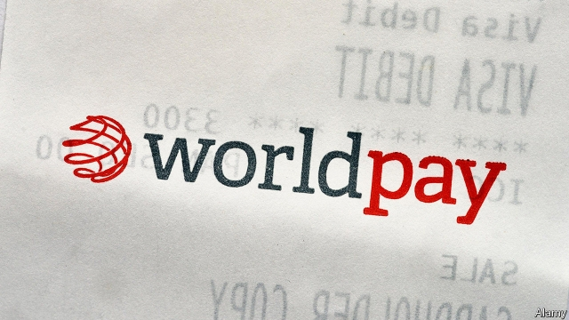
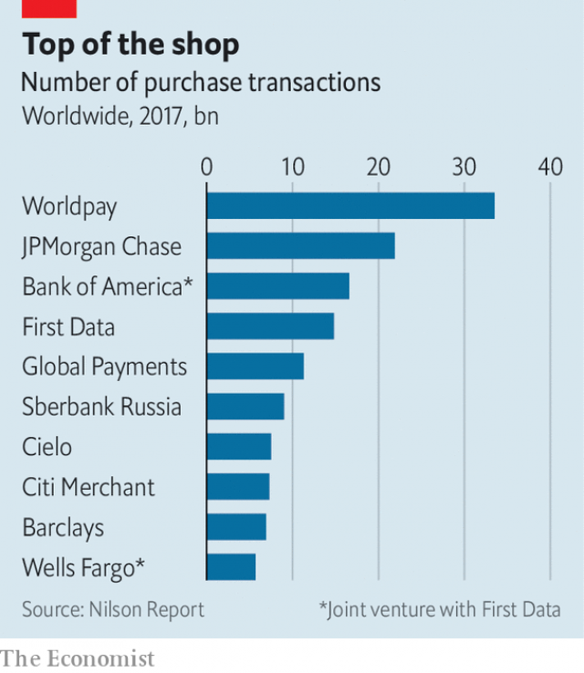

###### Terminal velocity

# FIS’s $43bn takeover of Worldpay 

##### The scramble to build global payment systems 

 

> Mar 23rd 2019 

YOUR HOME is about to become a department store. Of the 27% of American consumers who own voice-activated speakers, more than a quarter already use them to shop. You may soon start ordering groceries via a panel on your fridge or buying accessories through an interactive mirror in the bedroom. Social-media outlets are also after your money: before long, that red coat you liked on a friend’s Instagram page will be just a click away. 

The continuing boom in e-commerce—which is still growing at a breakneck 18% a year—is forcing speedy change on a once-staid sector: the invisible pipework that powers payments. On March 18th FIS, an American company which provides information technology to around 14,000 banks, agreed to buy Worldpay, a payments plumber, for $43bn including debt—the largest deal ever in the payments industry. It marks a sharp escalation in the battle for a market that BCG, a consulting firm, expects almost to double in size, to $2.4trn, between 2017 and 2027. 

Payment technology is already pretty nifty. When a shopper swipes her credit card at a till, the company providing terminals to the shop (the “merchant acquirer”) asks the lender that issued the card (the “issuer”) to confirm that she has enough funds. That electronic query reaches the lender—whether around the corner or across the world—in milliseconds. If the answer is “yes”, the shop has a guarantee it will eventually receive the money, and the shopper can take the goods. 

The acquirer usually requests funds from card issuers only at the end of the day, after the shop submits its full list of transactions. Payment networks, such as Visa or Mastercard, then move the money, which may take days to reach retailers’ accounts. They also set the complex rules by which the issuers and acquirers they licence must abide. For example, acquirers provide insurance: they repay customers who, say, have bought tickets from an airline that goes bust before they fly. They also store the granular data needed to withhold deposits or execute partial refunds. 

This system was designed for a brick-and-mortar world. But e-commerce has spawned new payment methods, such as digital wallets, and is changing constantly. Websites and apps can upgrade their software daily; acquirers might do so every quarter or two, says Chris Jones of PSE, a consultancy. Companies dubbed “gateways” now act as multi-socket adapters, connecting acquirers to morphing e-commerce firms. “Digital storefronts” like Shopify, a software company, add another layer: they cater to small vendors, enabling them to create a sleek website connected to a gateway in minutes. 

Banks have been in retreat from this fast-evolving world. “They are like turkeys waiting for Christmas,” says Mark O’Keefe of Optima, a consultancy. Card issuers outsource most of their processing to technology providers like FIS. Merchant acquiring used to be part of banks’ domain, but it was never part of their core business. In the past decade or so many have spun them off. The financial crisis accelerated this. In 2010 Royal Bank of Scotland (RBS) sold Worldpay to Bain Capital and Advent International, two buy-out firms, for £2bn ($2.7bn) as a condition of the lender’s bail-out by the British taxpayer. 

RBS may now feel a tinge of regret. After a £9.3bn merger with Vantiv, an American peer, last year, Worldpay is the world’s largest acquirer. It says it processed over 40bn transactions in 2018. Other non-banks, such as Global Payments, have also become giants (see chart). This is partly due to organic growth. Acquiring is more profitable than other processing jobs, which have become commoditised. It is also cheaper and faster to scale on the web: installing card terminals in-store requires labour and local presence. It helps that the volume of transactions, on which acquirers levy a fee, is rocketing, propelled by voracious spending in emerging economies. 

 

Mergers, often orchestrated by private-equity firms, have consolidated parts of the industry. Acquirers have bought gateways; big technology providers have snapped up smaller software firms. But vertical takeovers by broad technology providers of payments specialists, like FIS’s of Worldpay, are new. The merger comes just two months after Fiserv, FIS’s main competitor, agreed to buy First Data, a rival of Worldpay, in a $22bn deal. Both mark the start of new phase of an M&A chess game. Pawns have been captured, but most big pieces still roam free. Since these play very diverse roles, dozens of possible combinations make strategic sense, says Lisa Ellis of MoffettNathanson, a research firm. 

Vertical mergers will allow companies to cut costs, gain pricing power and cross-sell products—often to banks, their former owners. This will give them the firepower to go for the real target: establishing a truly global acquiring network. Multinationals such as Hilton or IKEA would love the simplicity of signing one single contract covering their payment needs worldwide. The Worldpay deal is a step in that direction. The firm, which focuses on Europe and America, should benefit from FIS’s existing relationships in emerging markets. 

Seemingly innocuous deals could precipitate the scramble. On March 11th PayPal, a digital-wallet pioneer now worth $119bn, announced a $750m investment in MercadoLibre, a Latin American e-commerce platform. Worldpay, which has ambitions in the region, was surely watching: PayPal uses First Data as its acquirer. FIS is already thinking about the next round. “It won’t surprise us that other companies come together,” says John Crawford of FIS. “We don’t expect it to be our last deal either.” 

-- 

 单词注释:

1.takeover[]:n. 接管, 接收 [经] 接收 

2.scramble['skræmbl]:n. 攀缘, 爬行, 抢夺, 混乱, 紧急起飞 vi. 攀缘, 杂乱蔓延, 争夺, 拼凑, 匆忙 vt. 攀登, 扰乱, 使混杂 

3.interactive[,intәr'æktiv]:a. 相互作用的, 相互影响的 [计] 交互, 人机对话的 

4.Instagram[]:一款图片分享应用 

5.breakneck['breiknek]:a. 要使颈骨折断似的, 非常危险的 

6.speedy['spi:di]:a. 快的, 迅速的 [经] 快的, 迅速的 

7.pipework[ˈpaɪpwɜ:k]: 管道工程管（组） 

8.fis[]:abbr. 家庭收入补贴（Family Income Supplement） 

9.plumber['plʌmә]:n. 水管工人 [法] 堵漏防漏人员 

10.escalation[.eskә'leiʃәn]:n. 扩大, 增加 [经] 调查, 价格调整 

11.BCG[]:卡介苗 [化] 卡介苗 

12.nifty['nifti]:a. 俏皮的, 时髦的 n. 俏皮话, 漂亮话 

13.shopper['ʃɒpә]:n. 购物者 [经] 顾客, 购物的人 

14.swipe[swaip]:n. 强打, 用力挥击, 尖刻的话, 碰擦, 起重杆 vt. 强打, 用力挥击, 偷 

15.acquirer[]:[法] 转得人, 取得人, 受让人 

16.lender['lendә]:n. 出借人, 贷方 [经] 出借者, 贷方, 贷款人 

17.issuer['iʃjuә]:n. 发行者 [法] 发行人, 发布人 

18.query['kwiәri]:n. 疑问, 疑问号, 质问, 查询 v. 询问, 质问 [计] 查询 

19.millisecond['mili,sekәnd]:n. 毫秒 [计] 毫秒 

20.transaction[træn'sækʃәn]:n. 交易, 办理, 学报, 和解协议 [计] 事务处理 

21.mastercard['mɑ:stə,kɑ:d]:n. 万事达信用卡 

22.abide[ә'baid]:vi. 停留, 遵守, 居留, 继续下去 vt. 忍受, 经受, 屈从于 

23.repay[ri'pei]:v. 偿还, 报答, 报复 

24.bust[bʌst]:n. 半身像, 胸部, 失败, 殴打 vt. 使爆裂, 使破产 vi. 爆裂, 破产 [计] 操作错 

25.granular['grænjulә]:a. 颗粒的, 粒状的 [医] 粒状的, 颗粒状的 

26.datum['deitәm]:n. 论据, 材料, 资料, 已知数 [医] 材料, 资料, 论据 

27.withhold[wið'hәuld]:vt. 使停止, 扣留, 保留, 拒给 vi. 克制, 忍住 

28.refund['ri:fʌnd]:n. 偿还 vt. 付还, 偿还借款 vi. 归还, 偿还 

29.spawn[spɒ:n]:n. (鱼)卵, 产物 vt. 产卵, 酿成, 大量生产 vi. 产卵, 大量生产 

30.constantly['kɒnstәntli]:adv. 不变地, 不断地, 时常地 

31.APP[]:[计] 应用, 应用程序; 相联并行处理器 

32.upgrade['ʌpgreid]:n. 上坡, 升级, 上升 adv. 往上 vt. 使升级, 提升, 改良品种 vi. 升级 [计] 升级 

33.chris[kris]:n. 克里斯（男子名）；克莉丝（女子名） 

34.jones[dʒәunz]:n. 琼斯（姓氏） 

35.PSE[]:[计] 信息包交换设备, 分组交换设备 

36.consultancy[]:n. 商量, 协商, 磋商, 会诊, 与...商量, 咨询, 请教, 找(医生)看病, 查阅, 考虑 [经] 咨询业务, 咨询服务 

37.dub[dʌb]:vt. 配音, 轻点, 授予称号, 击 n. 一下击鼓声, 笨蛋 

38.gateway['geitwei]:n. 门, 通路 [计] 网关 

39.adapter[ә'dæptә]:n. 适应者, 改编者, 接合器 [计] 衔接器; 适配器, 适配卡 

40.morphing['mɔ:fiŋ]:n. 变形 

41.storefront['stɒ:frʌnt]:n. 店面 

42.vendor['vendә]:n. 小贩, 卖主, 自动售货机 [计] 计算机销售商 

43.sleek[sli:k]:a. 光滑的, 油嘴滑舌的, 线条明快的, 圆滑的, 时髦的 vt. 使光滑, 掩盖 vi. 打扮漂亮, 滑动 

44.optima['ɔptimә]:最佳, 最适当的食物量, 最适条件, 最适度 

45.outsource[aut'sɔ:s]:vt. 把…外包 

46.provider[prә'vaidә]:n. 供应者, 供养人, 伙食承办人 [计] 提供器 

47.domain[dәu'mein]:n. 领域, 领土, 产业, 范围 [计] 域, 区域, 支配命令 

48.RB[]:[计] 归偏制 [医] 铷(37号元素) 

49.bain[]:n. 贝恩（公司名称） 

50.advent['ædvәnt]:n. 来到, 来临 

51.taxpayer['tækspeiә]:n. 纳税人 [法] 纳税人, 纳税义务人 

52.tinge[tindʒ]:n. 色调, 色彩, 气味, 气息 vt. 染, 使带气息 

53.merger['mә:dʒә]:n. 合并, 归并 [经] 购并 

54.peer[piә]:n. 同等的人, 匹敌, 贵族 vi. 凝视, 窥视, 费力地看, 隐现 vt. 与...同等, 封为贵族 

55.commoditised[]:[网络] 商品化 

56.levy['levi]:n. 税款, 所征的人数, 征收 vi. 征税, 课税 vt. 征收, 强求, 召集 

57.propel[prәu'pel]:vt. 推进, 驱使 [机] 推进 

58.voracious[vә'reiʃәs]:a. 贪吃的, 狼吞虎咽的, 贪婪的 

59.orchestrate['ɒ:kistreit]:v. 编管弦乐曲 

60.consolidate[kәn'sɒlideit]:vt. 巩固, 使联合, 统一 vi. 巩固 [计] 合并计算 

61.fiserv[]:[网络] 费哲金融服务；费哲金融服务公司；费斯富 

62.pawn[pɒ:n]:n. 典当, 抵押物, 人质, (象棋)兵, 马前卒, 工具 vt. 当掉, 以...担保 

63.roam[rәum]:v. 漫游, 闲逛, 徜徉 n. 漫步, 漫游 

64.lisa['li:zә, 'laizә]:n. 丽莎（女子名） 

65.elli[]:n. (Elli)人名；(荷、意、芬、罗、土)埃莉(女名), 埃利；(俄)叶利 

66.firepower['faiәpauә]:n. 火力 

67.multinational[.mʌlti'næʃәnl]:a. 多国的, 跨国公司的 n. 跨国公司 

68.hilton['hiltәn]:n. 希尔顿（姓氏）；希尔顿集团（主营酒店和香烟等） 

69.ikea[]:n. 宜家家居（瑞典公司） 

70.seemingly['si:miŋli]:adv. 看来似乎, 表面上看来 

71.innocuous[i'nɒkjuәs]:a. 无害的, 无伤大雅的 [医] 无害的, 良性的 

72.precipitate[pri'sipiteit]:n. 沉淀物, 凝结物, 结果 vt. 猛抛, 使陷入, 促成, 使沉淀 vi. 猛地落下 a. 突然的, 猛地落下的, 轻率的 

73.paypal[]:n. 贝宝（全球最大的在线支付平台） 

74.MercadoLibre[]:[网络] 自由市场 

75.john[dʒɔn]:n. 盥洗室, 厕所, 嫖客 

76.crawford[]:n. 克劳福德（美国西部小镇） 

