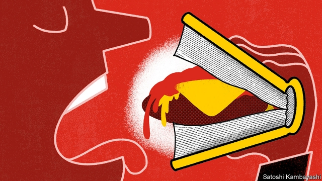
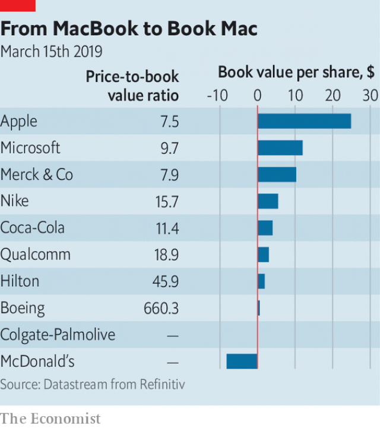

###### Buttonwood

# Why book value has lost its meaning 

##### The trouble with intangibles 

 

> Mar 23rd 2019 

 

BABY-BOOMERS may recall, perhaps wistfully, how the golden-arched sign outside every McDonald’s restaurant would proclaim how many customers had been served by the chain. As they became adults, the number kept on climbing: 5bn in 1969; 30bn in 1979; 80bn in 1990. Jerry Seinfeld, a wry chronicler of the trivial, was moved to ask: “Why is McDonald’s still counting?” Do we really need to know about every last burger? Just put up a sign that says, “We’re doing very well.” 

The counting stopped. The signs said simply: “Billions and billions served”. If this seems unhelpfully vague, that is how the counting business sometimes is. Many of America’s biggest companies, including McDonald’s, report a negative book value, a gauge of a firm’s net assets. Many more have a book value that is small relative to their market value: their shares look dear on a price-to-book basis. Much of this is down to the complexity of valuing a firm’s assets in the digital age. But the result is that price-to-book is a bad guide to a stock’s true value. 

Stockpickers make a distinction between the price of a share and what it is truly worth. Price is a creature of fickle sentiment, of greed and fear. Value, in contrast, depends on a firm’s capabilities. There are various shorthand measures for this, but true “value” investors put the greatest store by the price-to-book ratio. It is the basis for inclusion in benchmarks such as the Russell value index. Countless studies have shown that buying stocks with a low price-to-book is a winning strategy. 

But not recently. For much of the past decade, value stocks have lagged behind the general market and a long way behind “growth” stocks, their antithesis. Perhaps this is because, as the industrial age gives way to the digital age, the intangible assets that increasingly matter are not easy to put a value on. The tangible world is easier. Factories, machines, land and office buildings count as capital assets on a firm’s books, because they will generate profits for many years. It is a fairly straightforward business to come up with a value for them: it is what the firm paid. This value is gradually written off (depreciated) over time to reflect wear and tear and obsolescence. 

Such fixed capital assets, along with current assets (cash, stocks of unsold goods, and so on) typically make up the bulk of book value. The problem is what it leaves out. These days, the value of a firm lies as much in its reputation, its processes, the know-how of staff and relationships with customers and suppliers as in tangible assets. Putting an accounting value on these intangibles is notoriously tricky. By their nature, they have unclear boundaries. Not every dollar of R&D or advertising spending can be ascribed to a well-defined asset, such as a brand or patent. That is in large part why, with a few exceptions, such spending is treated as a running cost, like rent or electricity. 

Increasingly price is detached from book value. The median price-to-book of S&P 500 stocks is 3.0. But plenty of well-known companies, whose competitive edge rests on brands or patents, have much higher ratios or even negative book values (see chart). McDonald’s has considerable brand value, which is not on its balance-sheet. It also has property assets that have been fully depreciated. 

 

The effect of mergers is to make things murkier. If, say, one firm pays $100m for another that has $30m of tangible assets, the residual $70m is counted as an intangible asset—either as brand value, if that can be gauged, or as “goodwill”. That distorts comparisons. A firm that has acquired brands by merger will have those reflected in its book value, says Simon Harris, of GMO, a fund-management firm; a firm that has developed its own brands will not. Share buy-backs make things murkier still. For any firm with a price-to-book greater than one, a buy-back will diminish book by proportionately more than it lowers the value of outstanding stock. So price-to-book rises further. 

Some have called for accounting rules to change. But the more leeway a company has to turn day-to-day costs into capital assets, the more scope there is to fiddle with reported earnings. Better to spur the disclosure of spending that adds to intangible value. Analysts can then make their own judgments. Mr Harris finds that adjusting book value to reflect past R&D and advertising spending makes for more useful comparisons across stocks. It is not a perfect gauge. But no single measure—whether price-to-book or billions of customers served—can ever tell the whole story. 

-- 

 单词注释:

1.buttonwood['bʌtnwʊd]: 美洲悬铃木 

2.intangible[in'tændʒәbl]:a. 难以明了的, 无形的 [经] 无形的 

3.wistfully['wɪstfəlɪ]:adv. 惆怅地, 渴望地 

4.jerry['dʒeri]:a. 草率的, 偷工减料的 [经] 偷工减料的, 工程粗略的 

5.seinfeld[]:n. 宋飞正传（美国系列喜剧名） 

6.wry[rai]:a. 扭歪的, 歪曲的, 歪斜的 v. 扭曲, 扭歪 

7.chronicler['krɔniklә(r)]:n. 年代史编者, 记录者 

8.trivial['tiviәl]:a. 琐碎的, 不重要的, 轻微的, 平常的 

9.unhelpfully[]:adv. 不起帮助作用地, 无用地, 不予帮组地 

10.asset['æset]:n. 资产, 有益的东西 

11.complexity[kәm'pleksiti]:n. 复杂, 复杂性, 复杂的事物 

12.stockpickers[]:[网络] 选股王 

13.fickle['fikl]:a. 变幻无常的, 浮燥的, 薄情的 

14.sentiment['sentimәnt]:n. 感情, 感伤, 情操, 情绪, 感想, 意见 [医] 情感, 情操 

15.greed[gri:d]:n. 贪欲, 贪婪 

16.capability[.keipә'biliti]:n. 能力, 性能, 约束力 [化] 能力 

17.shorthand['ʃɒ:thænd]:n. 速记 [法] 速记法, 速记, 记录文字 

18.investor[in'vestә]:n. 投资者 [经] 投资者 

19.inclusion[in'kluʒәn]:n. 包含, 内含物 [计] 蕴含 

20.benchmark[]:[计] 基准程序; 基准 

21.russell['rʌsәl]:n. 拉塞尔（英国工程师, 整流器发明人） 

22.countless['kauntlis]:a. 数不尽的, 无数的 

23.antithesis[æn'tiθisis]:n. 对偶, 对照, 对立面 

24.tangible['tændʒәbl]:n. 可触知的东西, 有形资产 a. 可触摸的, 有实体的, 非相像的, 有形的, 明确的 

25.depreciate[di'pri:ʃieit]:vi. 贬值 vt. 降价, 贬低 

26.obsolescence[.ɒbsә'lesәns]:n. 荒废, 淘汰, 过时, 退化 [医] 废弃 

27.unsold[.ʌn'sәuld]:a. 未售出的 [经] 未售出的 

28.typically['tipikәli]:adv. 代表性地；作为特色地 

29.supplier[sә'plaiә]:n. 供应者, 供给国, 供应商 [化] 承制厂; 供应厂商 

30.notoriously[]:adv. 臭名昭著的, 声名狼藉的 

31.tricky['triki]:a. 狡猾的, 机敏的 

32.unclear[.ʌn'kliә]:a. 不易了解的, 不清楚的, 含混的 

33.advertising['ædvәtaiziŋ]:n. 广告业, 广告 a. 广告的 [计] 发广告 

34.detach[di'tætʃ]:vt. 使分离, 分遣 [机] 摘下, 分离, 卸下 

35.median['mi:diәn]:a. 中央的, 中间的, 正中的 n. 正中动脉, 中位数, 中线 

36.fully['fuli]:adv. 十分地, 完全地, 充分地 

37.merger['mә:dʒә]:n. 合并, 归并 [经] 购并 

38.murky['mә:ki]:a. 黝暗的, 阴沉的, 朦胧的 

39.residual['rezidju:l]:a. 残渣的, 剩余的 n. 残渣, 剩余, 余数 

40.goodwill[^jd'wil]:n. 友好, 好意, 善意, 亲善, (企业享有的)信誉, 声誉 [经] (企业的)商誉, 信誉 

41.distort[dis'tɒ:t]:vt. 扭曲, 歪曲 [法] 歪区, 曲解, 纂改 

42.simon['saimәn]:n. 西蒙（男子名） 

43.harris['hæris]:n. 哈里斯（英国苏格兰一地区）；哈里斯（姓氏） 

44.gmo[ˌdʒi:em'əʊ]:n. [医][=garamycin ointment]庆大霉素油膏 

45.diminish[di'miniʃ]:v. (使)减少, (使)变小 

46.proportionately[prə'pɔ:ʃənətlɪ]:adv. 成比例地, 相称地 

47.leeway['li:wei]:n. 风压差, 风压角, 可容许的误差, 余地 

48.fiddle['fidl]:n. 小提琴, 提琴类乐器 vt. 虚度时光, 拉小提琴 vi. 拉小提琴, (无目的地)拨弄, 瞎搞 

49.earning['ә:niŋ]:n. 收入（earn的现在分词） 

50.disclosure[dis'klәuʒә]:n. 揭发, 泄露, 揭发(或暴露)的事实 [经] 揭示, 披露 

51.analyst['ænәlist]:n. 分析者, 精神分析学家 [化] 分析员; 化验员 

52.judgment['dʒʌdʒmәnt]:n. 裁判, 宣告, 判决书 [医] 判断 

