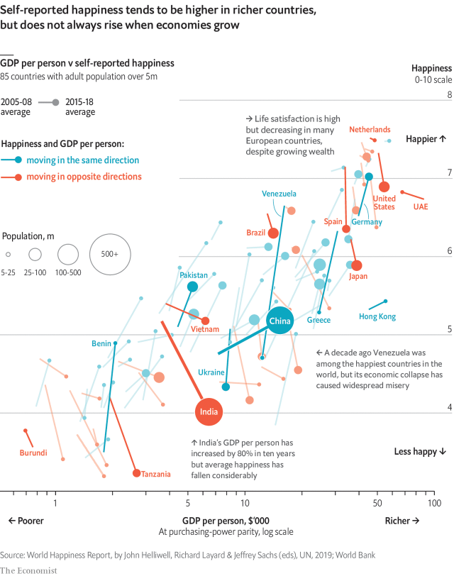

###### Happiness and growth

# Economic growth does not guarantee rising happiness 

##### An old paradox lives on 

 

> Mar 21st 2019 

PHILOSOPHERS FROM Aristotle to the Beatles have argued that money does not buy happiness. But it seems to help. Since 2005 Gallup, a pollster, has asked a representative sample of adults from countries across the world to rate their life satisfaction on a scale from zero to ten. The headline result is clear: the richer the country, on average, the higher the level of self-reported happiness. The simple correlation suggests that doubling GDP per person lifts life satisfaction by about 0.7 points. 

Yet the prediction that as a country gets richer its mood will improve has a dubious record. In 1974 Richard Easterlin, an economist, discovered that average life satisfaction in America had stagnated between 1946 and 1970 even as GDP per person had grown by 65% over the same period. He went on to find a similar disconnect in other places, too. Although income is correlated with happiness when looking across countries—and although economic downturns are reliable sources of temporary misery—long-term GDP growth does not seem to be enough to turn the average frown upside-down. 

The “Easterlin paradox” has been hotly disputed since, with some economists claiming to find a link between growth and rising happiness by using better quality data. On March 20th the latest Gallup data were presented in the World Happiness Report, an annual UN-backed study. The new data provide some ammunition for both sides of the debate but, on the whole, suggest that the paradox is alive and well. 

There are important examples of national income and happiness rising and falling together. The most significant—in terms of population—is China, where GDP per person has doubled over a decade, while average happiness has risen by 0.43 points. Among rich countries Germany enjoys higher incomes and greater cheer than ten years ago. Venezuela, once the fifth-happiest country in the world, has become miserable as its economy has collapsed. Looking across countries, growth is correlated with rising happiness. 

Yet that correlation is very weak. Of the 125 countries for which good data exist, 43 have seen GDP per person and happiness move in opposite directions. Like China, India is a populous developing economy that is growing quickly. But happiness is down by about 1.2 points in the past decade. America, the subject of Easterlin’s initial study, has again seen happiness fall as the economy has grown. In total the world’s population looks roughly equally divided between places where happiness and incomes have moved in the same direction over the past ten years, and places where they have diverged. 

-- 

 单词注释:

1.paradox['pærәdɒks]:n. 似非而是的论点, 自相矛盾的话, 悖论, 怪人怪事 [化] 佯谬 

2.Aristotle['æristɒtl]:n. 亚里士多德 

3.beatles['bi:tlz]:n. 披头士合唱（摇滚乐队） 

4.Gallup['^ælәp]:n. 盖洛普（姓氏）；盖洛普（George Horace, 1901-美国统计学家, 盖洛普民意测验的创始人） 

5.pollster['pәulstә]:n. 民意调查人, 民意测验经办人 

6.correlation[.kɒrә'leiʃәn]:n. 相互关系, 相关, 关联 [医] 相关, 联系 

7.prediction[pri'dikʃәn]:n. 预言, 预报 [化] 预测 

8.dubious['dju:biәs]:a. 可疑的, 不确定的 

9.richard['ritʃәd]:n. 理查德（男子名） 

10.easterlin[]:[网络] 伊斯特林；伊斯德林 

11.economist[i:'kɒnәmist]:n. 经济学者, 经济家 [经] 经济学家 

12.stagnate['stægneit]:v. (使)淤塞, (使)停滞, (使)变萧条 

13.disconnect[.diskә'nekt]:vt. 使分离, 使不相连, 拆开 vi. 断开 [计] 断开 

14.correlate['kɒrәleit]:n. 有相互关系的东西, 相关物 vt. 使有相互关系 vi. 相关 

15.downturn['dauntә:n]:n. (尤指经济方面的)衰退, 下降趋势 [电] 低迷时期 

16.hotly['hɒtli]:adv. 暑热地, 激烈地, 热心地 

17.datum['deitәm]:n. 论据, 材料, 资料, 已知数 [医] 材料, 资料, 论据 

18.ammunition[.æmju'niʃәn]:n. 军火, 弹药 [机] 弹药 

19.Venezuela[,vene'zweilә]:n. 委内瑞拉 

20.populous['pɒpjulәs]:a. 人口多的, 人口稠密的 

21.quickly['kwikli]:adv. 很快地 

22.equally['i:kwәli]:adv. 相等地, 同样地, 平等地 

23.diverge[dai'vә:dʒ]:vi. 分歧, 岔开 vt. 使岔开 

