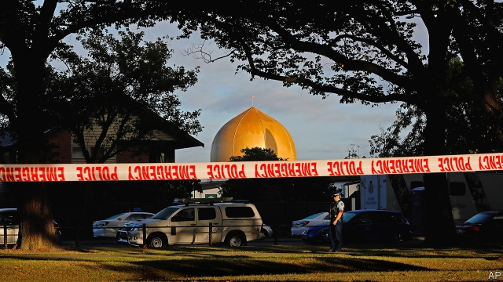
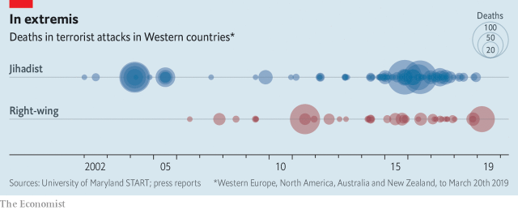
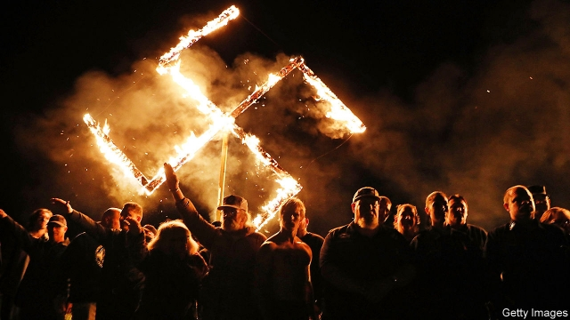

###### Far right and very wrong

# Why white nationalist terrorism is a global threat 

##### The Christchurch killer acted alone but followed a terrifying trend 

 

> Mar 21st 2019 

HE SEEMS to have been a classic “lone wolf”. As far as police can tell, the man who murdered 50 worshippers, and critically wounded nine more, at two mosques in Christchurch, New Zealand on March 15th was not part of any organisation. The 28-year-old Australian, Brenton Tarrant, claimed to have developed his violent beliefs on his own, surfing the internet and visiting Europe. He bought his weapons himself. He honed his skills at a suburban shooting-range. No one there suspected that he was preparing a massacre. 

Yet he was part of something much bigger. The names and slogans scrawled on his weapons were familiar to extreme white nationalists all around the world—but hardly anyone else. His ranting internet manifesto, “The Great Replacement”, repeated a staple far-right conspiracy theory: that non-white and Muslim immigrants in Western countries are invaders, ushered in by scheming elites to replace ethnic-European populations. Variants of that once-fringe idea are now common, not just in social-media posts by anonymous wackos but in the speeches of elected politicians from Hungary to Iowa. 

In another sense, too, the lone wolf had a pack. Attacks by neo-Nazis, white supremacists and other extreme-right types are growing more common. In America they outnumber those committed by Islamists. Of 263 domestic terrorism incidents in 2010-17, fully 92 were carried out by far-right attackers, compared with 38 by jihadists, according to an analysis of the Global Terrorism Database by the Washington Post. In Europe jihadist killings still predominate, but deaths from extreme-right terrorism have surged since 2010 (see chart). 

 

The past six months have seen a rash of far-right terrorist incidents. Last autumn a white nationalist killed 11 people at a synagogue in Pittsburgh. France broke up a plot to kill Emmanuel Macron, the president, and Spain arrested a fascist hoping to assassinate Pedro Sánchez, the prime minister. Germany uncovered an extremist cell in the army, allegedly planning to kill the foreign minister and others. In February America’s FBI arrested a Coast Guard officer who had an arsenal and a target-list of Democratic politicians. 

Globally, white-nationalist terrorism is far less deadly than the jihadist variety. But it is more prevalent than authorities acknowledge, says Jacob Aasland Ravndal of Norway’s Centre for Research on Extremism. Legal definitions of terrorism often require that an attack be planned in advance. Much extreme-right violence is spontaneous. Even burning down a refugee centre may count as a hate crime, not terrorism. Europol, the EU’s law-enforcement agency, ascribed just 3% of terrorist attacks in 2017 to the far right. But Mr Ravndal’s database of ideologically motivated violent incidents shows that in western Europe, though jihadists kill more people, the far right carry out more attacks. 

If the threat from white nationalists is underestimated, that is partly because they are more publicity-shy. Mr Tarrant and his hero, Anders Breivik, who murdered 77 people in Norway in 2011, were exceptions. They left manifestos and tried to maximise media exposure. Indeed, the Christchurch killer also resembled sophisticated jihadist outfits, both in the ostentatious cruelty of his crime and in his hope that it would polarise society, fuelling yet more extremism. 

 

Islamic State tries to provoke the West into persecuting Muslims and thus driving sympathisers from the “grey zone” towards radical participation. Right-wing extremists may also hope to provoke an Islamist backlash. Police are investigating a possible terrorist motive behind the murder of three people on a tram in Utrecht in the Netherlands, three days after the massacre in Christchurch. A Turkish-born suspect has been arrested. 

In Turkey President Recep Tayyip Erdogan has seized on the attack in Christchurch as evidence of a broad conspiracy against Turkey and Islam. He has quoted from the killer’s manifesto, which includes calls to expel Turks from Europe and to kill Mr Erdogan. The president’s not-so-subtle message is that only he can protect Turks from rampant white nationalism. 

The Christchurch killer also hoped to provoke stricter gun laws, so that gun-owners would rise up in revolt. There is not much chance of more gun control in America, Mr Tarrant’s primary target. However, Jacinda Ardern, New Zealand’s prime minister, is moving to tighten her country’s lax gun laws. This will not start a civil war. New Zealand prides itself on multiculturalism (see article). Its politics are more moderate than Australia’s. 

That, along with its easy gun laws, may have been why Mr Tarrant picked New Zealand. He wrote that he wanted to prove that nowhere was safe. Muslims in Christchurch have lost all sense of security. Tofazzal Alam, who survived the attack, says he is now afraid “to go to mosque, afraid of any crowd, afraid even to open the door”. 

Yet the killer’s manifesto was inspired by events far away in Europe. He claimed he was converted to radical-right ideology on a trip to France in 2017, when he saw how much of the population was Muslim. He decorated his flak jacket with a “black sun”, a symbol traced to a floor motif used in his castle by Heinrich Himmler, a Nazi leader. He decorated his weapons with the names of victims of jihadist attacks in Stockholm and Paris. Before the shootings, he listened in his car to “God is a Serb”, a song written in 1993 in support of Radovan Karadzic—a Bosnian Serb leader convicted of genocide for his role in the massacre of 8,000 Muslims at Srebrenica in 1995. 

The idea that Muslims and non-whites are “invaders” imported by a cosmopolitan elite to replace ethnic Europeans has its roots in thinkers of the French “new right” of the 1970s, such as Alain de Benoist and Renaud Camus. It is often linked to the belief that multicultural societies, far from promoting diversity, extinguish it by mixing distinct cultures and races together. The nuttiest apostles of such notions equate immigration with genocide. 

These ideas attracted the anti-Muslim populist politicians who sprung up across Europe around the turn of the millennium, especially after the September 11th attacks in America. They inspired the far-right youth network Generation Identity. But the big impetus came in 2015-16, when some 2m asylum-seekers, mostly from the Middle East, poured into Europe. 

For right-wing populists, this crisis was a godsend. Viktor Orban, Hungary’s prime minister, built a fence against the migrants and began calling himself a defender of Christian Europe. A frenzied opposition to Muslim immigration (real or imaginary) is the lodestar of populist-right parties in Germany, Poland, Sweden and Italy. At the European Parliament this month, Javier Ortega Smith of Vox, a new far-right Spanish party, thundered that had Spanish and Venetian fleets not won the battle of Lepanto against the Turks in 1571, every female MEP “would be wearing a burqa”. 

Daniel Koehler of the German Institute on Radicalisation and De-radicalisation Studies says that it is no coincidence that extreme-right violence jumped during the migrant crisis, along with the fortunes of far-right parties: “If you think you have …to protect against ‘invaders’—how do you do that without using force?” 

In America, too, the rise in extreme-right violence is linked to mainstream politics. Between 2009 and 2018, white supremacists killed more than three-quarters of the 313 people murdered by extremists. In 2016, the year Donald Trump won the presidency, more anti-Muslim assaults were reported to the FBI (127) than in any year since 2001 (93). 

Such attacks rose steeply after Barack Obama’s election in 2008. Daryl Johnson, who spent 15 years studying right-wing terrorist groups, including at the Department of Homeland Security (DHS), wrote a paper in 2009 warning that the arrival that year of a black person in the White House could spark far-right violence. Demonised by conservatives for this, he left the DHS in 2010. Today, he says, it has no experts in right-wing terrorism. A spokesman did not deny this, but, in an email, said that the DHS is “committed to combating all forms of violent extremism, especially those that espouse racial supremacy or bigotry”. 

Mr Trump has played down the threat of right-wing extremists, calling them “a small group of people that have very, very serious problems”. In 2017 his administration cancelled grants to groups combating white-supremacism. Peter Singer, a cyber-security expert at the New America Foundation who was invited to speak to Mr Trump’s national-security staff that year, said that they dismissed white-supremacist terrorism as “a law-enforcement issue”, and denied that it is transnational. 

In fact, the ties between American and European extreme-right groups are ever closer. Europe’s Generation Identity groups are linked to Identity Evropa, one of the the American far-right organisations that planned a “Unite the Right” rally in Charlottesville, Virginia in 2017, where a white nationalist drove his car into a crowd and killed a counter-protester. Marchers at that rally chanted “Jews will not replace us”, referring to the same “great replacement” thesis shared by European extremists and the Christchurch killer. 

Mr Trump has played the role for American white nationalists that such leaders as Mr Orban played for Europe’s, says Brian Levin, who heads the Centre for the Study of Hate and Extremism at California State University, San Bernardino. These groups, he says, saw their ideas, such as building a wall like Mr Orban’s, and banning or deporting Muslims, “getting into the mainstream tent”. They took this as a “green light” for violence. And he notes that, like the young on Europe’s extremist right, they have softened their image in the past decade. Shaved heads and combat boots have given way to army haircuts, polo shirts and corduroy jackets. 

Far-right groups lack the state sponsors and safe havens enjoyed by some jihadists. Many on the extreme right admire Russia but it does not fit the bill. It has cultivated ties with far-right parties in Europe, but has snuffed out extremists at home. In the 2000s hate-motivated attacks, often directed at immigrants and internal migrants from the north Caucasus, reached nearly 700 a year, as the state flirted with nationalist movements. Clashes in Moscow in 2011 between police and far-right groups mixed with football hooligans showed the dangers of tolerating the ultranationalists. After they joined anti-government protests in 2011-12, the state began shutting them down, detaining the most violent. In 2014 war with Ukraine split the movement into pro-government and pro-Ukrainian factions. The SOVA Centre, an independent monitor, recorded just 57 hate-motivated attacks in 2018. 

Other Western white nationalists look to Ukraine itself, a hotbed of far-right activity since the Maidan uprising in 2014. Quasi-fascist militias, such as the Azov Battalion, have fought Russia in the east and taken a role in policing. So Kiev is “a place of attraction for the global far-right”, says Anton Shekhovtsov, of the University of Vienna. Some European radicals have joined Ukrainians on the front lines. American white supremacists have been spotted in Kiev. But as Mr Shekhovtsov puts it, “migration is a first-world problem”, and, whereas earlier far-right groups would beat up foreigners from Africa and Asia, Azov is keener on disrupting gay-pride marches. In any case, Ukrainian men seeking romantic violence have plenty to do in the east. 

A more pressing concern for Western governments is far-right radicalism within their armed forces. Soldiers, obviously, are trained and have access to weapons. In America the DHS warned a decade ago that right-wing extremists will attempt to “recruit and radicalise” veterans, recalling the terrorist attacks of the 1990s by bitter ex-soldiers, such as the Oklahoma City bombing. A study of 119 lone-actor terrorists across America and Europe since 1990 found that 26% had done military service. 

 

Racial tension is rising in the armed services. A recent poll by Military Times, a newspaper, found that over half of non-white American service members had suffered racism in 2018, up from 42% in the previous year. In 2017 two marines were arrested for hanging a white-supremacist banner on a building in North Carolina. On March 18th the Huffington Post, a news website, identified seven serving American soldiers as active in Identity Evropa. 

The German authorities are investigating some 450 cases of suspected right-wing extremism in the Bundeswehr. Last year the security services identified dozens of police and soldiers as members of Reichsbürger, a far-right movement. In Britain in September 2017 four soldiers were arrested for membership of National Action, a banned neo-Nazi group. “If we get enough of us into the Army,” suggested one, “we’ll be in the right place when things start to collapse.” 

Armies are tightening their vetting procedures and becoming more vigilant. They insist that adherence to law is drilled into recruits. But, for good reason, most armed forces are prohibited from conducting political education. 

Tracking sources of danger is hard because, as Mr Koehler, the German scholar, points out, far-right violence typically involves loose groups of individuals radicalised on social media. He calls this “hive terrorism”. It is practically impossible to predict when someone will go from wishing others dead to actually killing them. 

The Christchurch killer is a perfect example. He spent time on 8chan, a messageboard that prides itself on allowing users to post anything not illegal under American law. (After the attack, its administrators said they would co-operate with police.) It concerns itself with everything from Japanese cartoons to role-playing games. Anonymous posting is the norm. 

The board’s “Politically Incorrect” subsections are far-right haunts. Their culture is a self-consciously puerile mishmash of memes, absurdism and irony, making it hard to know how seriously to take anything posted there. When Mr Tarrant declared on 8chan that he was about to commit murder, and proceeded to live-stream it on Facebook, many replies expressed surprise (often pleased) that the promised shooting spree was actually happening. 

The killer’s manifesto, too, is steeped in 8chan-like irony, a style sometimes termed “shitposting”. Serious rants about low European birth-rates alternate with claims to have been radicalised by “Spyro the Dragon 3”, a children’s video game. If the media took such claims seriously, they would prove their own cluelessness. 

Since the attacks, there have been calls for internet platforms to do a better job of restricting violent right-wing content. Facebook has been blamed for letting the live-stream of the attack go on for 17 minutes. The platform says it began vigorously blocking the video as soon as it discovered it, removing 1.5m attempts to repost it. But internet users could still find copies hours after the attack. (It did not help that some “mainstream” media sites—and even Mr Erdogan—used some of it.) 

Big internet platforms could do more, but they face a gargantuan task. The underlying problem, says Ben Nimmo of the Oxford Internet Institute, is that “radicalising content is not constant”—one viewer’s trigger to violence is another’s harmless satire. Hopes that artificial intelligence might do much of the filtering have not worked out; armies of human reviewers are still needed, and even they often err. 

However hard it is to stop terrorists exploiting the internet, other citizens can, at least, refuse to help them. The Christchurch killer’s fixation on the former Yugoslavia is apt: as in that war, white nationalists seek to use spectacular violence and propaganda to turn citizens against each other. In New Zealand Ms Ardern has turned this on its head. She has tried to use horrific slaughter to unite a country in opposition to a creed whose most famous new exponent she refuses to name. 

-- 

 单词注释:

1.nationalist['næʃәnәlist]:n. 国家主义者, 民族主义者 

2.terrorism['terәrizm]:n. 恐怖主义, 恐怖统治, 恐怖状态 [法] 胁迫, 暴政, 恐怖政治 

3.Christchurch['kraist-tʃә:tʃ]:n. 克赖斯特彻奇 

4.killer['kilә]:n. (非正式)杀人者, 屠杀者, 猛兽, 致死(疾病), 杀手, 止痛药, 限制器, 瞄准器 [计] 删除程序; 断路器 

5.lone[lәun]:a. 孤单的, 孤立的, 单身的, 寂寞的 

6.worshipper[]:n. 礼拜者, 崇拜者, 爱慕者 

7.critically['kritikәli]:adv. 批评性地, 审慎地, 精密地 

8.mosque[mɒsk]:n. 清真寺 

9.zealand['zi:lәnd]:n. 西兰岛（丹麦最大的岛） 

10.organisation[,ɔ: ^әnaizeiʃən; - ni'z-]:n. 组织, 团体, 体制, 编制 

11.Brenton[]:布伦顿（人名） 

12.Tarrant[]:n. (Tarrant)人名；(英)塔兰特 

13.surf[sә:f]:n. 海浪, 拍岸浪 vi. 作冲浪运动 

14.hone[hәun]:n. 磨刀石, 抱怨, 想念 vt. 用磨刀石磨, 磨练 

15.suburban[sә'bә:bәn]:a. 郊外的, 郊区的, (贬)偏狭的, 土气的, 见识不广的 n. 郊区居民 

16.massacre['mæsәkә]:n. 大屠杀 vt. 大屠杀, 残杀 

17.scrawl[skrɒ:l]:vt. 潦草地写 vi. 乱写 n. 潦草的笔迹 

18.rant[rænt]:v. 咆哮, 痛骂 n. 咆哮, 大话 

19.manifesto[.mæni'festәu]:n. 宣言, 声明 

20.replacement[ri'pleismәnt]:n. 归还, 更换, 代替者 [医] 复位, 置换 

21.staple['steipl]:n. 主要产物, 常用品, 主要要素, 原料, 订书钉, 钩环 a. 主要的, 重要的 vt. 分级, 钉住 

22.conspiracy[kәn'spirәsi]:n. 同谋, 阴谋, 阴谋集团 [法] 阴谋, 通谋, 共谋 

23.Muslim['mjzlim; (?@) 'mʌzlem]:n. 伊斯兰教, 伊斯兰教教徒 

24.invader[in'veidә]:n. 侵略者 [化] 侵入物 

25.usher['ʌʃә]:n. 引座员, 招待员 vt. 引导, 招待 vi. 作招待员 

26.elite[ei'li:t]:n. 精华, 精锐, 中坚分子 

27.variant['vєәriәnt]:n. 变体, 异体 a. 不同的, 有差别的 [计] 变体型 

28.anonymous[ә'nɒnimәs]:a. 姓氏不详的, 无名的, 无特色的 [计] 无记录 

29.wackos['wækəʊ]:adj. 古怪的；发疯的；不理智的 n. 疯子 [网络] 怪人；排外疯子；怪物 

30.Hungary['hʌŋgәri]:n. 匈牙利 

31.Iowa['aiәwә]:n. 衣阿华州 

32.supremacist[sә'premәsist, sju-]:n. 至上主义者 

33.outnumber[.aut'nʌmbә]:vt. 数目超过, 比...多 

34.Islamist[iz'lɑ:mist]:n. 伊斯兰教主义者；回教教徒 

35.fully['fuli]:adv. 十分地, 完全地, 充分地 

36.attacker[ә'tækә]:n. 攻击者 

37.jihadist[]:n. 伊斯兰圣战士 

38.terrorism['terәrizm]:n. 恐怖主义, 恐怖统治, 恐怖状态 [法] 胁迫, 暴政, 恐怖政治 

39.Washington['wɒʃiŋtn]:n. 华盛顿 

40.killing['kiliŋ]:n. 谋杀, 杀戮 a. 杀害的, 疲惫的, 迷人的 

41.predominate[pri'dɒmineit]:vt. 掌握, 控制, 支配 vi. 占主导地位, 占优势 

42.surge[sә:dʒ]:n. 巨涌, 汹涌, 澎湃 vi. 汹涌, 澎湃, 颠簸, 猛冲, 突然放松 vt. 使汹涌奔腾, 急放 [计] 电压尖峰 

43.rash[ræʃ]:a. 轻率的, 匆忙的, 鲁莽的 n. 皮疹 

44.terrorist['terәrist]:n. 恐怖分子 [法] 恐怖份子, 恐怖主义 

45.synagogue['sinәgɒg]:n. 犹太人集会, 犹太教会堂, 犹太教 

46.Pittsburgh['pitsbә:g]:n. 匹兹堡 

47.emmanuel[i'mænjuәl]:n. 以马内利（耶稣基督的别称）；伊曼纽尔（男子名, 等于Immanuel） 

48.macron['mækrәn]:n. 长音符号 

49.Spain[spein]:n. 西班牙 

50.fascist['fæʃist]:n. 法西斯主义者, 法西斯党员 

51.assassinate[ә'sæsineit]:vt. 暗杀, 行刺 [法] 暗杀, 行刺, 中伤 

52.pedro['pi:drәu]:n. 彼得牌戏（一种纸牌戏） 

53.extremist[iks'tri:mist]:[经] 偏激份子 

54.allegedly[ә'ledʒidli]:adv. 依其申述 

55.FBI[]:美国联邦调查局 [经] 美国联邦调查局 

56.arsenal['ɑ:snәl]:n. 兵工厂, 军械库 [机] 兵工厂 

57.globally[]:[计] 全局地 

58.les[lei]:abbr. 发射脱离系统（Launch Escape System） 

59.prevalent['prevәlәnt]:a. 普遍的, 流行的 

60.jacob['dʒeikәb]:n. [圣经]雅各（以色列人的祖先）；雅各布（男子名） 

61.aasland[]:奥斯兰 

62.extremism[ik'stri:mizm]:n. 极端倾向, 极端论, 过激主义 

63.refugee[.refju'dʒi:]:n. 难民, 流亡者 [法] 避难者, 流亡者, 难民 

64.europol[]:n. 欧洲刑警组织; 1993年成立; 总部设在荷兰海牙; 2010年1月1日成为欧盟正式机构。 

65.ideologically[]:adv. 思想上, 思想体系, 意识形态, 观念形态 

66.underestimate[.ʌndәr'estimeit]:n. 低估 vt. 低估, 看轻 

67.ander[]:n. (Ander)人名；(匈)翁代尔；(瑞典、英)安德 

68.Breivik[]:[网络] 者布列维克 

69.Norway['nɒ:wei]:n. 挪威 

70.maximise['mæksimaiz]:vt. 把...增加到最大限度, 把...扩大到最大限度, 充分重视, 找出...的最高值 

71.sophisticate[sә'fistikeit]:n. 久经世故的人, 精于...之道的人 vt. 篡改, 曲解, 使变得世故, 掺合, 弄复杂 vi. 诡辩 

72.outfit['autfit]:n. 用具, 配备, 机构 vt. 配备, 供应 vi. 得到装备 

73.ostentatious[.ɒsten'teiʃәs]:a. 装饰表面的, 铺张的, 夸示的, 华美的, 显眼的 

74.cruelty['kru:әlti]:n. 残酷, 野蛮, 残酷行为 [法] 残酷, 残忍, 虐待 

75.polarise['pәjlәraiz]:vi.vt. (使)极化, (使)偏振, (使)两极分化 

76.extremism[ik'stri:mizm]:n. 极端倾向, 极端论, 过激主义 

77.Islamic[iz'læmik]:a. 伊斯兰教的, 穆斯林的 

78.provoke[prә'vәuk]:vt. 激怒, 惹起, 诱导 [法] 刺激, 煽动, 激怒 

79.persecute['pә:sikju:t]:vt. 迫害, 虐待, 困扰, 同...捣乱 [法] 迫害, 虐待, 烦扰 

80.Muslim['mjzlim; (?@) 'mʌzlem]:n. 伊斯兰教, 伊斯兰教教徒 

81.sympathiser['sɪmpəθaɪzə]:n. 同情者; 同意者; 支持者 

82.participation[.pɑ:tisi'peiʃәn]:n. 参与, 分享 [经] 参与, 参股 

83.Islamist[iz'lɑ:mist]:n. 伊斯兰教主义者；回教教徒 

84.backlash['bæklæʃ]:n. 后冲, 强烈反对 [电] 反撞, 逆栅流 

85.utrecht['ju:trekt]:n. 乌特勒支（荷兰一城市名） 

86.Netherlands['neðәlәndz]:n. 荷兰 

87.recep[]:n. (Recep)人名；(土)雷杰普 

88.tayyip[]:[网络] 塔伊普 

89.erdogan[]:[网络] 埃尔多安；土耳其总理埃尔多安；艾尔多安 

90.Islam['izlɑ:m]:n. 伊斯兰教 

91.Turk[tә:k]:n. 土耳其人, 土耳其马 

92.rampant['ræmpәnt]:a. 猖獗的, 蔓生的, 猛烈的, 跃立作扑击状的 

93.nationalism['næʃәnәlizm]:n. 民族主义, 民族特性 

94.jacinda[]:n. 【女名】女子名 [网络] 杰辛达；美丽的；嘉辛达 

95.tighten['taitn]:vt. 勒紧, 使变紧 vi. 变紧, 绷紧 

96.lax[læks]:a. 松的, 不严格的, 腹泻的, 松弛的 n. 腹泻, 松元音 

97.multiculturalism[ˌmʌltiˈkʌltʃərəlɪzəm]:n. 多元文化 

98.politic['pɒlitik]:a. 精明的, 明智的, 策略的 

99.alam[]:n. 阿拉姆（姓氏） 

100.ideology[.aidi'ɒlәdʒi]:n. 思想体系, 意识形态, 观念学, 空论 [医] 观念学, 观念形态 

101.flak[flæk]:n. 高射炮, 对空炮火, 广告, 宣传 

102.motif[mәu'ti:f]:n. 主题, 基调, 动机, 基本图案 [法] 主旨, 主题, 动机 

103.Heinrich[]:n. 海因里希（男子名） 

104.himmler['himlә]:n. 希姆莱（姓氏名） 

105.Nazi['nɑ:tsi]:n. 纳粹党人 a. 纳粹党的 

106.Stockholm['stɒkhәulm]:n. 斯德哥尔摩 

107.Serb[sә:b]:n. 塞尔维亚人[语] a. 塞尔维亚的, 塞尔维亚人[语]的 

108.radovan[]:n. (Radovan)人名；(罗、塞、捷)拉多万 

109.Bosnian[bɔzni:ən]:n. 波斯尼亚人 a. 波斯尼亚的 

110.convict[kәn'vikt]:n. 囚犯, 罪犯 vt. 宣告有罪, 使知罪 

111.genocide['dʒenәu,said]:n. 种族灭绝, 灭绝整个种族的大屠杀 [医] 种族灭绝(侵略军队加害居民的罪行) 

112.srebrenica[]: [地名] [波斯尼亚和黑塞哥维那] 斯雷布雷尼察 

113.cosmopolitan[,kɔzmә'pɔlitәn]:a. 世界主义的, 世界性的, 全世界的, 遍生的, 不偏狭的, 卓有见识的 n. 世界主义者, 世界性 

114.ethnic['eθnik]:a. 人种的, 种族的 [医] 人种的 

115.thinker['θiŋkә]:n. 思想者, 思想家 

116.Alain[]:n. 阿兰（人名） n. (Alain)人名；(西)阿拉因；(英、法、布基、黎)阿兰 

117.de[di:]:[化] 非对映体过量 [医] 铥(69号元素铥的别名,1916年Eder离得的假想元素) 

118.benoist[]:n. (Benoist)人名；(匈)拜诺伊什特；(法)伯努瓦 

119.renaud[]:雷诺（人名） 

120.Camus[kɑ:'mju, kә'mjɔ]:加缪(Albert, 1913-1960, 法国小说家、剧作家, 曾获1957年诺贝尔文学奖) 

121.multicultural[.mʌlti'kʌltʃәrәl]:a. 融合或具有多种文化的；多种文化的 

122.diversity[dai'vә:siti]:n. 差异, 多样性 [化] 多样性 

123.extinguish[ik'stiŋgwiʃ]:vt. 熄灭, 使消亡, 压制, 使减色 [医] 消灭 

124.nuttiest[]: nutty（多坚果的, 产坚果的）的最高级形式 

125.apostle[ә'pɒsl]:n. 基督十二使徒之一, 早期基督教传士 

126.equate[i'kweit]:vt. 使相等, 视为平等 vi. 等同 

127.Populist['pɔpjulist]:n. 民粹派的成员 

128.millennium[mi'leniәm]:n. 千禧年, 一千年 

129.impetus['impitәs]:n. 动力, 推动力, 动量 [医] 冲动, 动能, 起始(病) 

130.godsend['^ɔdsend]:n. 意外的幸运机会, 意外地来得正好的事物, 天赐 

131.Viktor[]:维克托（人名） 

132.orban[]: [人名] 奥尔班 

133.migrant['maigrәnt]:n. 候鸟, 移居者 [法] 移居者 

134.defender[di'fendә]:n. 防卫者, 防护者, 辩护者 [法] 辩护人, 保护人 

135.frenzy['frenzi]:n. 疯狂, 狂暴, 狂怒 [医] 暴怒, 狂乱 

136.opposition[.ɒpә'ziʃәn]:n. 反对, 敌对, 相反, 在野党 [医] 对生, 对向, 反抗, 反对症 

137.lodestar['lәudstɑ:]:n. 指示方向之星, 北极星, 指导原理 

138.Poland['pәulәnd]:n. 波兰 

139.Sweden['swi:dn]:n. 瑞典 

140.Javier[]:n. 哈维尔（第80届奥斯卡最佳男配角）；海威尔（美国联合商业协会中国区副会长） 

141.Ortega[]:奥尔特加（人名） 奥尔特加（地名, 阿根廷、哥伦比亚） 

142.smith[smiθ]:n. 铁匠, 金属品工匠 [机] 锻造工, 上手 

143.vox[vɔks]:[医] 语音, 语声 

144.Venetian[vә'ni:ʃәn]:a. 威尼斯的 n. 威尼斯人 

145.lepanto[li'pæntəu]: [地名] [希腊] 勒班陀（纳夫帕克托斯的旧称）; [地名] [哥斯达黎加、美国] 勒班陀 

146.MEP[]:[化] 最低能量途径 

147.burqa['bɜ:kə]:n. 布卡（伊斯兰国家妇女穿的蒙面长袍） 

148.daniel['dænjәl]:n. 丹尼尔（男子名） 

149.koehler['keliә]:石脑油火焰安全(矿)灯 

150.radicalisation[]:[网络] 激进化 

151.mainstream['meinstri:m]:n. 主流 

152.presidency['prezidәnsi]:n. 总统职权, 总裁职位 

153.assault[ә'sɒ:t]:n. 攻击, 袭击 vt. 袭击, 攻击 vi. 发动攻击 

154.steeply['sti:pli]:adv. 险峻地 

155.barack[bɑ:'ræk]:n. 巴拉克（男子名） 

156.Daryl['dæril]:n. 达里尔(Darrell 的异体)(m.) 

157.johnson['dʒɔnsn]:n. 约翰逊（姓氏） 

158.dhs[]:数据处理系数（Data Handing System）；癸二酸二己酯 

159.demonise['di:mәnaiz]:vt.<主英>=demonize 

160.spokesman['spәuksmәn]:n. 发言人, 代言者 

161.combat['kɒmbæt]:n. 争斗, 战斗 vi. 战斗, 争斗 vt. 与...战斗, 与...斗争 

162.espouse[i'spauz]:vt. 支持, 赞成, 嫁, 娶 [法] 娶, 出嫁, 信奉 

163.supremacy[sju'premәsi]:n. 至高无上, 霸权地位, 优势, 至上 [法] 至高权力, 无上权力, 霸权 

164.bigotry['bigәtri]:n. 盲从, 偏见, 偏执的行为(或态度) 

165.peter['pi:tә]:vi. 逐渐消失, 逐渐减少 

166.transnational[træns'næʃәnl]:a. 超越国界的, 跨国的 [法] 超越国界的, 超国家的, 跨国的 

167.evropa[]:[网络] 欧罗巴洲；欧洲 

168.rally['ræli]:n. 重振旗鼓, 集合, 群众集会, 跌停回升 v. 重整旗鼓, 集合, 恢复精神, 团结, 挖苦, 嘲笑 

169.Charlottesville['ʃɑ:lətsvil]:n. 夏洛茨维尔（美国弗吉尼亚州中部城市） 

170.Virginia[vә'dʒinjә]:n. 弗吉尼亚 

171.marcher[]:n. 边界地区居民, 行进者, 游行者, 行军者 

172.Jew[dʒu:]:n. 犹太人, 守财奴, 犹太教信徒 vt. 欺骗, 杀价 

173.replacement[ri'pleismәnt]:n. 归还, 更换, 代替者 [医] 复位, 置换 

174.thesis['θi:sis]:n. 论题, 论文 

175.brian['braiәn]:n. 布莱恩（男子名） 

176.levin['levin]:n. 闪电 

177.California[.kæli'fɒ:njә]:n. 加利福尼亚 

178.san[sɑ:n]:abbr. 存储区域网（Storage Area Networking） 

179.Bernardino[]:n. (Bernardino)人名；(英)伯纳迪诺；(西、意、葡)贝尔纳迪诺 

180.deport[di'pɒ:t]:vt. 举止, 驱逐出境 [法] 放逐, 驱逐, 递解 

181.soften['sɒftn]:v. (使)变柔软, (使)变柔和 

182.polo['pәulәu]:n. 马球, 水球 

183.corduroy['kɒ:dәrɒi]:n. 灯芯绒, 用灯芯绒布制的衣服, 灯芯绒裤子 a. 灯芯绒做的, (路、桥)用木头铺排成的 

184.haven['heivn]:n. 港, 避难所, 安息所 vt. 安置...于港中, 庇护, 入港 

185.snuff[snʌf]:n. 烛花, 用鼻吸气, 嗅, 闻, 鼻烟, 气味 vt. 剪烛花, 掐灭, 扼杀, 消灭, 用鼻吸, 嗅出, 闻出 vi. 嗅, 闻 

186.Caucasus['kɔ:kәsәs]:n. 高加索山脉 

187.flirt[flә:t]:n. 卖弄风骚的人, 急动, 急扔 vt. 忽然弹出, 轻快摆动, 挥动 vi. 调情, 玩弄, 摆动, 轻率地对待 

188.clash[klæʃ]:n. 冲突, 撞击声, 抵触 vi. 冲突, 抵触 vt. 使发出撞击声 [计] 对撞 

189.hooligan['hu:ligәn]:n. 小流氓 [法] 阿飞, 流氓, 街头恶棍 

190.ultranationalist[,ʌltrә'næʃәnәlist]:n. 极端民族主义者, 狭隘民族主义者 [法] 极端民族主义份子 

191.detain[di'tein]:vt. 扣留, 扣押, 耽搁 [法] 拘留, 扣押, 留住 

192.ukraine[ju(:)'krein]:n. 乌克兰（原苏联一加盟共和国, 现已独立） 

193.faction['fækʃәn]:n. 小派系, 内讧 [法] 宗派, 派别, 小集团 

194.sova[]:abbr. Savant of Virginia 弗吉尼亚的专家; soft-output Viterbi algorithm 软输出维特比算法 

195.hotbed['hɒtbed]:n. 温床 

196.maidan[mai'dɑ:n]:n. <印> 练兵场, 操场 

197.uprise[ʌp'raiz]:n. 升起, 起立, 上山坡, 出现 vi. 上升, 起义, 出现 

198.militia[mi'liʃә]:n. 义勇军, 民兵组织, 国民军 

199.Azov['æzɒv]:n. 亚速海 

200.battalion[bә'tæljәn]:n. 营, 军队, 集团 

201.kiev['ki:ev]:n. 基辅（乌克兰共和国首都） 

202.anton['æntәn]:n. 安东（男子名） 

203.Vienna[vi'enә]:n. 维也纳 

204.ukrainian[ju(:)'kreinjәn]:a. 乌克兰的；乌克兰人的 

205.migration[mai'greiʃәn]:n. 移民, 移往, 移动 [计] 迁移 

206.disrupt[dis'rʌpt]:a. 分裂的, 中断的 vt. 使分裂, 使瓦解 

207.ukrainian[ju(:)'kreinjәn]:a. 乌克兰的；乌克兰人的 

208.radicalism['rædikәlizm]:n. 激进主义 

209.radicalise['rædikəlaiz]:vt. 使激进（等于radicalize） vi. 变得激进（等于radicalize） 

210.Oklahoma[.әuklә'hәumә]:n. 俄克拉何马 

211.racism['reisizm]:n. 种族主义, 种族偏见 [法] 种族主义, 种族歧视, 种族歧视主张 

212.Carolina[.kærә'lainә]:n. 北(或南)卡罗来纳州 

213.huffington[]: [人名] 赫芬顿 

214.Bundeswehr['bundәs,veiә]:联邦德国国防军 

215.membership['membәʃip]:n. 会员的资格, 全体会员, 会员数目 [法] 会员资格, 成员资格, 会籍 

216.vet[vet]:n. 兽医 vi. 当兽医 vt. 诊断, 检审 

217.vigilant['vidʒilәnt]:a. 警觉的, 警戒的, 警惕的 [法] 警醒的, 警戒的, 注意的 

218.adherence[әd'hiәrәns]:n. 依附, 固执, 坚持 [化] 粘合 

219.typically['tipikәli]:adv. 代表性地；作为特色地 

220.messageboard[ˈmesidʒ bɔ:d]:n. （网站）留言板 [网络] 请您留言；在线留言；看病经历 

221.administrator[әd'ministreitә]:n. 管理人, 行政官 [经] 遗产管理人员 

222.anonymous[ә'nɒnimәs]:a. 姓氏不详的, 无名的, 无特色的 [计] 无记录 

223.norm[nɒ:m]:n. 基准, 模范, 标准, 准则, 平均数 [化] 定额 

224.politically[]:adv. 政治上 

225.subsection['sʌb.sekʃәn]:n. 分部, 分区, 分支 [经] 分部, 分段, 小小组 

226.haunt[hɒ:nt]:n. 常到的地方, 生息地 vt. 常到, 出没于, 萦绕于 vi. 出没, 作祟 

227.puerile['pjuәrail]:a. 孩子气的, 天真的, 未成熟的 [医] 儿童的, 幼稚的 

228.mishmash['miʃmæʃ]:n. 混杂物 

229.meme[mi:m]:n. 大脑模仿病毒；文化基因；弥母 

230.absurdism[әb'sә:dizәm]:n. 荒诞主义 

231.irony['aiәrәni]:n. 反语, 讽刺, 具有讽刺意味的事 

232.facebook[]:n. 脸谱网 

233.spree[spri:]:n. 戏耍, 喧闹, 宴会, 狂饮 vi. 狂欢, 狂饮 

234.shitposting[]: 

235.alternate['ɒ:ltәnәt]:a. 交替的, 轮流的, 间隔的 v. 轮流, (使)交替 

236.spyro[]:[网络] 斯派罗；宝贝龙；小龙斯派罗 

237.cluelessness[]:[网络] 无知的；无绪；摸着石头过河 

238.vigorously[]:adv. 朝气蓬勃, 精力充沛, 壮健, 茁壮, 健壮, 强有力 

239.repost[ri:'pәust]:vt .<主英>重新投寄 

240.gargantuan[gɑ:'gæntʃuәn]:a. 巨大的, 庞大的 

241.underlie[.ʌndә'lai]:vt. 位于...之下, 成为...的基础 

242.ben[ben]:n. 内室 [医] 贝昂(俗名,一般指辣木Moringa oleifera,有时也指一些不同属的植物) 

243.Nimmo[]:n. (Nimmo)人名；(英、意)尼莫 

244.Oxford['ɒksfәd]:n. 牛津, 牛津大学 

245.radicalising[]:[网络] 激进化 

246.trigger['trigә]:n. 触发器, 扳机 vt. 触发, 发射, 引起 vi. 松开扳柄 [计] 切换开关 

247.satire['sætaiә]:n. 讽刺文学, 讽刺 

248.err[ә:]:vi. 犯错, 做错, 犯罪 [法] 弄错, 犯错误, 陈述 

249.fixation[fik'seiʃәn]:n. 定置, 固定, 定色 [医] 固定; 固定法, 固定术; 定影 

250.Yugoslavia['ju:^әu'slɑ:vjә]:n. 南斯拉夫 [经] 南斯拉夫 

251.spectacular[spek'tækjulә]:a. 公开展示的, 惊人的, 壮观的 n. 奇观, 惊人之举, 展览物 

252.propaganda[.prɒpә'gændә]:n. 宣传, 宣传活动 [医] 宣传 

253.horrific[hɒ'rifik]:a. 令人毛骨悚然的, 感到恐惧的 

254.slaughter['slɒ:tә]:n. 残杀, 屠杀, 杀戮 vt. 残杀, 屠杀, 亏本出售 

255.creed[kri:d]:n. 宗教信条, 教义, 纲领 

256.exponent[ik'spәunәnt]:n. 说明者, 倡导者, 说明物, 指数 a. 说明的 [计] 指数 

