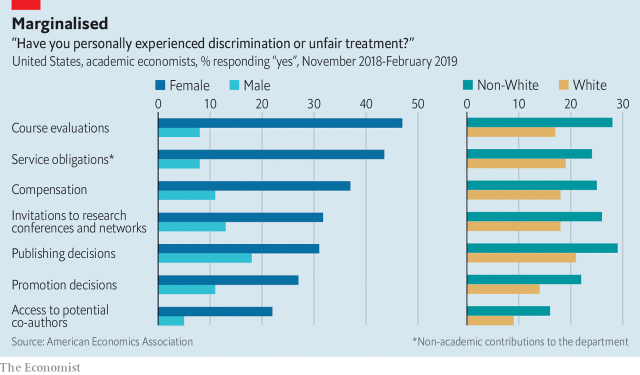

###### Women and economics

# Economics is uncovering its gender problem 

##### The dismal science has a dismal record 

 

> Mar 21st 2019 

AT THE HEART of economics is a belief in the virtues of open competition as a way of using the resources you have in the most efficient way you can. Thanks to the power of that insight, economists routinely tell politicians how to run public policy and business people how to run their firms. Yet when it comes to its own house, academic economics could do more to observe the standards it applies to the rest of the world. In particular, it recruits too few women. Also, many of those who do work in the profession say they are treated unfairly and that their talents are not fully realised. As a result, economics has fewer good ideas than it should and suffers from a skewed viewpoint. It is time for the dismal science to improve its dismal record on gender. 

For decades relatively few women have participated in STEM subjects: science, technology, engineering and maths. Economics belongs in this list (see article). In the United States women make up only one in seven full professors and one in three doctoral candidates. There has been too little improvement in the past 20 years. And a survey by the American Economics Association (AEA) this week shows that many women who do become academic economists are treated badly. 

Only 20% of women who answered the AEA poll said that they are satisfied with the professional climate, compared with 40% of men. Some 48% of females said they have faced discrimination at work because of their sex, compared with 3% of male respondents. Writing about the survey results, Janet Yellen and Ben Bernanke, both former chairs of the Federal Reserve, and Olivier Blanchard, a former chief economist of the IMF, said that “many members of the profession have suffered harassment and discrimination during their careers, including both overt acts of abuse and more subtle forms of marginalisation.” 

To deal with its gender shortfall, economics needs two tools that it often uses to analyse and solve problems elsewhere: its ability to crunch data and its capacity to experiment. Take data first. The AEA study is commendable, but only a fifth of its 45,000 present and past members replied to its poll. More work is needed to establish why women are discouraged from becoming economists, or drop out, or are denied promotion. More benchmarking is needed against other professions where women thrive. Better data are needed to capture how work by female economists is discriminated against. There is some evidence, for example, that they are held to higher standards than men in peer reviews and that they are given less credit for their co-writing than men. And economics needs to study how a lack of women skews its scholarly priorities, creating an intellectual opportunity cost. For instance, do economists obsess more about labour-market conditions for men than for women? The more comprehensive the picture that emerges, the sooner and more easily action can be taken to change recruitment and to reform professional life. 

The other priority is for economists to experiment with new ideas, as the AEA is recommending. For a discipline that values dynamism, academic economics is often conservative, sticking with teaching methods, hiring procedures and social conventions that have been around for decades. The AEA survey reveals myriad subtle ways in which those who responded feel uncomfortable. For example 46% of women have not asked a question or presented an idea at conferences for fear of being treated unfairly, compared with 18% of men. Innovation is overdue. Seminars could be organised to ensure that all speakers get a fair chance. Job interviews need not typically happen in hotel rooms, a practice that men regard as harmless but which makes some women uncomfortable. The way that authors’ names are presented on papers could ensure that it is clear who has done the intellectual heavy lifting. 

Instead of moving cautiously, the economics profession should do what it is best at: recognise there is a problem, measure it objectively and find solutions. If the result is more women in economics who are treated better, there will be more competition for ideas and a more efficient use of a scarce resource. What economist could possibly object to that? 

-- 

 单词注释:

1.gender['dʒendә]:n. 性 vt. 产生 

2.dismal['dizmәl]:a. 阴沉的, 凄凉的, 令人忧郁的 n. 低落的情绪, 沼泽 

3.economist[i:'kɒnәmist]:n. 经济学者, 经济家 [经] 经济学家 

4.routinely[]:adv. 日常, 乏味, 常规, 例行 

5.unfairly[]:adv. 不正当地；不公平地 

6.fully['fuli]:adv. 十分地, 完全地, 充分地 

7.skew[skju:]:a. 斜的, 歪的 n. 歪斜, 偏态家庭关系 vi. 歪斜, 侧转 vt. 使歪斜, 曲解 [计] 扭斜; 歪斜; 偏斜 

8.doctoral['dɒktәrәl]:a. 博士的 

9.AEA[]:abbr. 原子能法（Atomic Energy Authority）；演员协会（Actors ' Equity Association）；美国经济协会（American Economic Association）；成人教育协会（Adult Education Association）；美国教育协会（American Education Association） 

10.respondent[ri'spɒndәnt]:a. 回答的, 应答的, 反射的 n. 应答者, 被告 

11.JANET['dʒænit]:[计] 英国大学联合科学网 

12.yellen[]: [人名] 耶伦 

13.ben[ben]:n. 内室 [医] 贝昂(俗名,一般指辣木Moringa oleifera,有时也指一些不同属的植物) 

14.bernanke[]:n. 伯南克（姓氏） 

15.Olivier[əu'liviə]:n. 奥利维尔（男子名） 

16.Blanchard['blæntʃəd]:n. 布兰卡德（男子名） 

17.IMF[]:国际货币基金组织 [经] 国际货币基金 

18.harassment['hærәsmәnt]:n. 困扰, 烦扰, 烦恼 [法] 折磨, 骚扰, 侵扰 

19.overt['әuvә:t]:a. 明显的, 公然的, 蓄意的 [法] 明显的, 公开的 

20.subtle['sʌtl]:a. 敏锐的, 精细的, 狡猾的, 稀薄的, 灵巧的, 微妙的 [医] 锐敏的; 精细的 

21.marginalisation[ˌma:dʒɪnəlaɪ'zeɪʃən]:n. 边缘化 

22.shortfall['ʃɒ:tfɒ:l]:n. 不足, 不足量 [经] 缺少, 不足, 亏舱运费 

23.crunch[krʌntʃ]:v. 嘎吱嘎吱的咬嚼, 压碎, 嘎吱嘎吱地踏过 n. 咬碎, 咬碎声 

24.datum['deitәm]:n. 论据, 材料, 资料, 已知数 [医] 材料, 资料, 论据 

25.commendable[kә'mendәbl]:a. 值得赞美的, 很好的 

26.promotion[prәu'mәuʃәn]:n. 晋级, 创建, 增进 [经] 推广, 推销, 促进 

27.benchmark[]:[计] 基准程序; 基准 

28.discriminate[dis'krimineit]:v. 区别, 差别待遇 

29.peer[piә]:n. 同等的人, 匹敌, 贵族 vi. 凝视, 窥视, 费力地看, 隐现 vt. 与...同等, 封为贵族 

30.les[lei]:abbr. 发射脱离系统（Launch Escape System） 

31.scholarly['skɔlәli]:a. 学者派头的, 学者风度的, 有学问的, 博学的, 好学的 

32.obsess[әb'ses]:vt. 迷住, 使困扰 

33.recruitment[ri'kru:tmәnt]:n. 新兵征召 [医] 募集[反应], 募集[现象](生理), 复聪(耳科) 

34.dynamism['dainәmizm]:n. 物力论, 力本说 [医] 动力说, 动力病原论 

35.myriad['miriәd]:n. 无数, 无数的人(或物) a. 无数的, 种种的 

36.innovation[.inәu'veiʃәn]:n. 改革, 创新 [法] 创新, 改革, 刷新 

37.typically['tipikәli]:adv. 代表性地；作为特色地 

38.cautiously['kɒ:ʃәsli]:adv. 慎重地 

39.objectively[әb'dʒektivli,ɔb-]:adv. 客观地 

