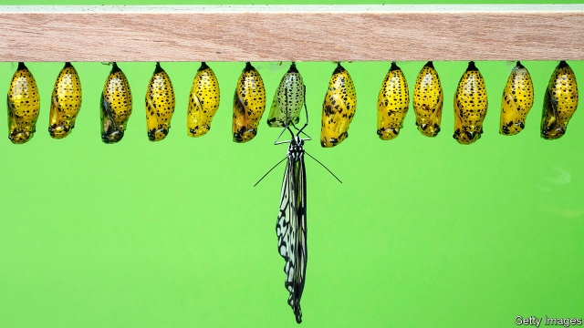

###### Plague without locusts

# Is insectageddon imminent? 

##### Not yet. But precautions are needed 

 

> Mar 21st 2019 

“BE AFRAID. BE very afraid,” says a character in “The Fly”, a horror film about a man who turns into an enormous insect. It captures the unease and disgust people often feel for the kingdom of cockroaches, Zika-carrying mosquitoes and creepy-crawlies of all kinds. However, ecologists increasingly see the insect world as something to be frightened for, not frightened of. In the past two years scores of scientific studies have suggested that trillions of murmuring, droning, susurrating honeybees, butterflies, caddisflies, damselflies and beetles are dying off. “If all mankind were to disappear”, wrote E.O. Wilson, the doyen of entomologists, “the world would regenerate…If insects were to vanish the environment would collapse into chaos.” 

We report on these studies in this week’s Science section. Most describe declines of 50% and more over decades in different measures of insect health. The immediate reaction is consternation. Because insects enable plants to reproduce, through pollination, and are food for other animals, a collapse in their numbers would be catastrophic. “The insect apocalypse is here,” trumpeted the New York Times last year. 

But a second look leads to a different assessment. Rather than causing a panic, the studies should act as a timely warning and a reason to take precautions. 

That is because the worst fears are unproven. Only a handful of databases record the abundance of insects over a long time—and not enough to judge long-term population trends accurately. There are no studies at all of wild insect numbers in most of the world, including China, India, the Middle East, Australia and most of South America, South-East Asia and Africa. Reliable data are too scarce to declare a global emergency. 

Moreover, where the evidence does show a collapse—in Europe and America—agricultural and rural ecosystems are holding up. Although insect-eating birds are disappearing from European farmlands, plants still grow, attract pollinators and reproduce. Farm yields remain high. As some insect species die out, others seem to be moving into the niches they have left, keeping ecosystems going, albeit with less biodiversity than before. It is hard to argue that insect decline is yet wreaking significant economic damage. 

But there are complications. Agricultural productivity is not the only measure of environmental health. Animals have value, independent of any direct economic contribution they may make. People rely on healthy ecosystems for everything from nutrient cycling to the local weather, and the more species make up an ecosystem the more stable it is likely to be. The extinction of a few insect species among so many might not make a big difference. The loss of hundreds of thousands would. 

And the scale of the observed decline raises doubts about how long ecosystems can remain resilient. An experiment in which researchers gradually plucked out insect pollinators from fields found that plant diversity held up well until about 90% of insects had been removed. Then it collapsed. In Krefeld, in western Germany, the mass of aerial insects declined by more than 75% between 1989 and 2016. As one character in a novel by Ernest Hemingway says, bankruptcy came in two ways: “gradually, then suddenly”. Given the paucity of data, it is impossible to know how close Europe and America are to an ecosystem collapse. But it would be reckless to find out by actually triggering one. 

Insects can be protected in two broad ways, dubbed sharing and sparing. Sharing means nudging farmers and consumers to adopt more organic habits, which do less damage to wildlife. That might have local benefits, but organic yields are often lower than intensive ones. With the world’s population rising, more land would go under the plough, reducing insect diversity further. So sparing is needed, too. This means going hell for leather with every high-yield technique you can think of, including insecticide-reducing genetically modified organisms, and then setting some land aside for wildlife. 

Insects are indicators of ecosystem health. Their decline is a warning to pay attention to it—before it really is too late. 

-- 

 单词注释:

1.plague[pleig]:n. 瘟疫, 天罚, 麻烦, 灾祸 vt. 折磨, 使苦恼, 使得灾祸 

2.unease[.ʌn'i:z]:n. 不安 

3.cockroach['kɒkrәutʃ]:n. 蟑螂 [医] 蟑螂 

4.ecologist[i:'kɒlәdʒist]:n. 生态学者 

5.trillion['triljәn]:n. 大量 [经] 兆 

6.murmur['mә:mә]:n. 低语, 低声的怨言 vi. 低语, 低声而言 vt. 低声说 

7.dron[]:abbr. data reduction 数据缩减量 

8.susurrate[sju'sә:reit]:vi. 低语, 喃喃低语, 沙沙响 

9.honeybee['hʌnibi:]:n. 蜜蜂 

10.caddisfly['kædis,flai]: 石蛾 

11.damselfly['dæmzәflai]:n. 蜻蜓 

12.beetle['bi:tl]:n. 甲虫, 大槌 vi. 快速移动 vt. 捶 

13.EO[]:[计] 基本操作, 允许输出, 操作结束, 执行命令 

14.wilson['wilsn]:n. 威尔逊（姓氏） 

15.doyen['dɒiәn]:n. 老资格, 首席, 老前辈 [法] 领袖, 首席 

16.entomologist[.entәmә'lɒdʒist]:n. 昆虫学者 [医] 昆虫学家 

17.chao[]:n. 钞（货币） 

18.consternation[.kɒnstә'neiʃәn]:n. 惊愕, 恐怖, 惊惶失措 

19.pollination[.pɒli'neiʃәn]:n. 授粉 [医] 授粉[作用], 传粉[作用] 

20.catastrophic[.kætә'strɒfik]:a. 悲惨的, 灾难的 

21.apocalypse[ә'pɒkәlips]:n. 启示, 天启 

22.york[jɔ:k]:n. 约克郡；约克王朝 

23.timely['taili]:a. 及时的, 适时的 adv. 及时地 

24.unproven[ʌnˈpru:vn]:a. 未被证实的 

25.abundance[ә'bʌndәns]:n. 丰富, 充足, 大量 [经] 丰富, 充裕 

26.accurately['ækjurәtli]:adv. 正确地, 精确地 

27.datum['deitәm]:n. 论据, 材料, 资料, 已知数 [医] 材料, 资料, 论据 

28.ecosystem['i:kәu.sistәm]:n. 生态系统 [医] 生态系 

29.farmland['fɑ:mlænd]:n. 农田 

30.pollinator['pɒlɪneɪtə]:n. 传粉者, 传粉媒介, 传粉昆虫; 授花粉器 

31.specie['spi:ʃi]:n. 硬币 [经] 硬币 

32.nich[]:abbr. 新生儿颅内出血（neonatal intracranial hemorrhage） 

33.albeit[ɔ:l'bi:it]:conj. 尽管, 虽然 

34.les[lei]:abbr. 发射脱离系统（Launch Escape System） 

35.biodiversity[]:n. 生物多样性 

36.wreak[ri:k]:vt. 发泄(怒火), 报仇 [法] 报仇, 报复, 施 

37.complication[.kɒmpli'keiʃәn]:n. 复杂化, 复杂情况 [医] 并发症, 并发病 

38.productivity[.prәudʌk'tiviti]:n. 生产力 [经] 生产率, 生产能力 

39.environmental[in.vaiәrәn'mentәl]:a. 周围的, 环境的 [经] 环境的, 环保的 

40.nutrient['nju:triәnt]:a. 营养的, 滋养的 n. 营养物, 滋养物 

41.extinction[ik'stiŋkʃәn]:n. 消失, 消灭, 废止 [化] 消光; 熄灭 

42.resilient[ri'ziliәnt]:a. 弹回的, 有弹力的 [医] 回弹的, 回能的 

43.diversity[dai'vә:siti]:n. 差异, 多样性 [化] 多样性 

44.Krefeld[]:n. (Krefeld)人名；(英)克雷菲尔德；(德)克雷费尔德 克雷菲尔德 

45.aerial['єәriәl]:a. 空中的, 航空的, 空气的, 空想的 n. 天线 

46.erne[ә:n]:n. 白尾海雕 

47.Hemingway['hemiŋwei]:海明威(①姓氏 ②Ernest, 1899-1961, 美国小说家, 曾获1954年诺贝尔文学奖) 

48.bankruptcy['bæŋkrәptsi]:n. 破产者 [经] 破产, 倒闭 

49.paucity['pɒ:sәti]:n. 少数, 少量, 缺乏 

50.reckless['reklis]:a. 不介意的, 大意的, 鲁莽的, 不顾后果的 [法] 不注意的, 粗心大意的, 鲁莽的 

51.trigger['trigә]:n. 触发器, 扳机 vt. 触发, 发射, 引起 vi. 松开扳柄 [计] 切换开关 

52.dub[dʌb]:vt. 配音, 轻点, 授予称号, 击 n. 一下击鼓声, 笨蛋 

53.nudge[nʌdʒ]:n. 用肘轻推, 推动, 讨厌家伙 

54.genetically[]:adv. 创始, 遗传学, 生殖, 基因, 遗传, 发生 

55.indicator['indikeitә]:n. 指示器, 指示剂, 指标 [计] 指示器 

