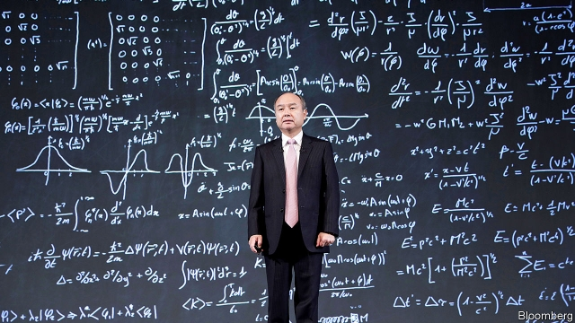

###### Too close to the Son

# The Vision Fund needs more governance 

##### A $100bn bet has become a giant problem in transparency and accountability 

 

> Mar 21st 2019 

ALMOST TWO years ago Masayoshi Son, a Japanese tycoon, broke all the rules of investing by setting up a new vehicle to back tech firms. The Vision Fund was unusual in several ways. Worth $100bn, it was enormous. Some $45bn of that came from Muhammad bin Salman, Saudi Arabia’s crown prince, who got the kingdom’s sovereign wealth fund to contribute. It took huge bets on trendy “unicorns”—unlisted firms worth over a billion dollars, such as Uber. And it gave almost total control to Mr Son. 

Many sceptics dismissed the Vision Fund as a vast pot of tainted money squandered on hyped-up assets. And by October last year it looked as if they were right. The murder of Jamal Khashoggi, a journalist, cast Saudi Arabia and the fund into disrepute, while the shares of tech firms started to tank. 

Now, however, the Masa show is back on the road. The Khashoggi affair has receded and technology stocks have recovered. Several of the Vision Fund’s biggest investments are due to float on the stockmarket at racy prices. And Mr Son plans to raise as much as $100bn, for the Vision Fund 2 (see article). He will soon do the rounds of the world’s sovereign-wealth funds and pension giants, touting robots and artificial intelligence—and, once again, his own magic touch. 

These custodians of other people’s money should be on their guard. Mr Son’s relations with Saudi Arabia’s Public Investment Fund (PIF), which provided the $45bn, are reportedly strained. The reason is not the Khashoggi murder but the PIF’s (privately expressed) dismay about the Vision Fund’s governance. 

Looking in from the outside, the first problem is “key-man risk”. As with Prince Muhammad’s reign, Mr Son’s rule at the fund is absolute. If he views a startup as sufficiently world-changing, next to nothing will stop him betting big. His is by far the strongest voice on the Vision Fund’s three-member investment committee, which has the final say on what is bought. That is because the other two members are his employees. The PIF can veto investments only if they are for over $3bn. 

The second worry is the potential for conflicts of interest between the Vision Fund and SoftBank, a giant conglomerate listed in Japan that Mr Son founded and still runs. In deals where the Vision Fund’s investment process takes too long, Mr Son has in the past used SoftBank’s balance-sheet to buy stakes in young companies which are in turn transferred to the Vision Fund. Often SoftBank makes a profit, as with Didi, a Chinese ride-sharing company, which it bought for $5.9bn in 2017 and will soon transfer to the Vision Fund for $6.8bn. Very occasionally SoftBank makes a loss. 

SoftBank and the Vision Fund obey rules on investing and their fiduciary duties. The fund uses independent valuers, including big audit firms. And SoftBank has a big direct stake in the Vision Fund and thus an incentive to see it prosper. Nonetheless SoftBank has too much scope to manoeuvre unlisted investments in high-growth but loss-making firms. Worse is the scant disclosure on how investments are valued, or how much cash the Vision Fund’s firms are burning up. 

You do not need artificial intelligence to conclude that Vision Funds 1 and 2 need better governance. Both need independent boards. Bringing in a heavyweight technology executive to test Mr Son’s convictions would lessen the risk of dud deals. Transfers between SoftBank and the Vision Funds should stop. Investors must be told how positions are valued. 

Mr Son’s empire has become too big to get by with patchy, amateur governance. It has about $300bn of equity and debt, and stakes in 70 or so prominent startups which could be damaged if one of their leading sponsors blows up. When Mr Son comes asking for more money, investors should make it clear that the time has come for his style to change. 

-- 

 单词注释:

1.governance['gʌvәnәns]:n. 统治, 统辖, 管理 [法] 统治, 管理, 支配 

2.transparency[træns'pærәnsi]:n. 透明, 透明度, 透过性, 透明物, 清晰 [计] 透明性; 透明 

3.accountability[ә.kauntә'biliti]:n. 负有责任, 可说明性 [化] 衡算计量 

4.masayoshi[]:[网络] 正义；正义大师；正义作 

5.tycoon[tai'ku:n]:n. 企业界大亨, 将军 [经] 企业界巨头, 企业家 

6.tech[tek]:n. 技术学院或学校 

7.muhammad[]:n. 穆罕默德 

8.bin[bin]:n. (贮存谷物等的)容器, 箱子 [计] 二进制, 商业信息网 

9.Salman[]:n. 萨尔曼（男子名） 

10.saudi['sajdi]:a. 沙乌地阿拉伯（人或语）的 

11.sovereign['sɒvrin]:n. 元首, 独立国 a. 具有主权的, 至高无上的, 国王的, 完全的 

12.trendy['trendi]:a. 随潮流的, 时髦的, 赶潮流的 

13.uber['ju:bә]:[医] 乳房 

14.sceptic['skeptik]:n. 怀疑论者 

15.taint[teint]:n. 污点, 耻辱, 感染 vt. 污染, 使腐败, 沾染, 腐蚀 

16.squander['skwɒndә]:vt. 浪费, 使分散 vi. 浪费, 漂泊, 四散 

17.asset['æset]:n. 资产, 有益的东西 

18.Jamal[]:n. 贾马尔（男子名） 

19.khashoggi[]:卡舒吉 

20.Arabia[ә'reibiә]:n. 阿拉伯半岛 

21.disrepute[.disri'pju:t]:n. 丧失名誉, 坏名声, 不名誉 

22.masa['mɑ:sә]:n. 湿润粉糊 

23.recede[ri'si:d]:vi. 向后退, 退却, 收回, 降低, 减弱 [医] 退缩 

24.stockmarket[s'tɒkmɑ:kɪt]: 证券市场; 证券交易所; 证券行情 

25.racy['reisi]:a. 保持原味的, 活泼的, 生动的, 为竞赛设计的 

26.tout[taut]:vi. 招徕顾客, 兜售物品 vt. 招徕, 刺探...情报 n. 兜售者, 侦查者 

27.custodian[kʌ'stәudjәn]:n. 管理人, 保管人, 监护人 [经] 保管人, 管理人 

28.PIF[]:程序信息文件 [计] 程序信息文件 

29.reportedly[ri'pɒ:tidli]:adv. 根据传说, 根据传闻, 据报道 

30.privately[]:adv. 秘密地；私下地 

31.dismay[dis'mei]:n. 沮丧 vt. 使惊愕, 使气馁 

32.startup[]:[计] 启动 

33.veto['vi:tәu]:n. 否决权 vt. 否决, 禁止 

34.softbank['sɒftbæŋk]: 日本最大的软件销售商 

35.conglomerate[kәn'glɒmәrit]:a. 聚成球形的, 砾岩性的 n. 集成物, 混合体, 砾岩 v. (使)凝聚成团 

36.Didi[]:n. 迪迪（足球运动员名） 

37.fiduciary[fi'dju:ʃjәri]:a. 基于信用的, 信托的, 受信托的 n. 被信托者, 受托人 

38.valuer['vælju:ә]:n. 评价者, 定价员 [经] 估价者 

39.audit['ɒ:dit]:n. 审计, 查帐 vt. 查(帐), 旁听 vi. 查账 [计] 查帐; 审查; 检查 

40.incentive[in'sentiv]:n. 动机 a. 激励的 

41.prosper['prɒspә]:vi. 繁荣, 兴隆, 成功 vt. 使成功, 使昌盛 

42.nonetheless[,nʌnðә'les]:conj. 然而, 尽管, 不过 adv. 不过, 仍然, 尽管如此, 然而 

43.manoeuvre[mә'nu:vә]:n. 调遣, 演习, 策略 vi. 调动, 演习, 用策略 vt. 调动, 操纵 

44.unlisted[.ʌn'listid]:a. 未编入册的, (证券等)未上市的 

45.scant[skænt]:a. 不充分的, 不足的 vt. 减少, 吝啬, 限制, 藐视, 忽略 

46.disclosure[dis'klәuʒә]:n. 揭发, 泄露, 揭发(或暴露)的事实 [经] 揭示, 披露 

47.heavyweight['heviweit]:n. 重量级拳击运动员, (非正式)有影响的要人 a. 最重量级的 

48.conviction[kәn'vikʃәn]:n. 定罪, 信服, 坚信 [法] 定罪, 证明有罪, 判罪 

49.dud[dʌd]:n. 衣服, 哑弹, 无用物 a. 无用的 

50.investor[in'vestә]:n. 投资者 [经] 投资者 

51.patchy['pætʃi]:a. 补缀的, 凑合的, 不调和的, 散落的, 斑驳的, 不完全的 

52.equity['ekwiti]:n. 公平, 公正 [经] 权益, 产权 

