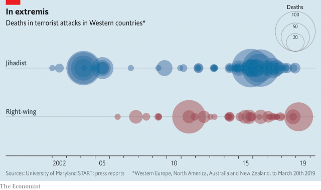

###### White nationalism after Christchurch

# The new face of terror, much like the old 

##### Violent white nationalists increasingly resemble the jihadists they hate 

 

> Mar 21st 2019 

A  FANATIC WALKED into a house of worship and opened fire. Men, women, children; he made no distinction. Brenton Tarrant showed no mercy because he did not see his victims as fully human. When he murdered 50 people, he did not see mothers, husbands, engineers or goalkeepers. He saw only the enemy. 

The massacre in New Zealand on March 15th was a reminder of how similar white-nationalist and jihadist killers really are. Though the two groups detest each other, they share methods, morals and mindsets. They see their own group as under threat, and think this justifies extreme violence in “self-defence”. They are often radicalised on social media, where they tap into a multinational subculture of resentment. Islamists share footage of atrocities against Muslims in Myanmar, Syria, Xinjiang and Abu Ghraib. White nationalists share tales of crimes against white people in New York, Rotherham and Bali. The alleged shooter in New Zealand, who is Australian, scrawled on a gun the name of an 11-year-old Swedish girl killed by a jihadist in 2017. 

It takes a vast leap of illogic to conclude that the murder of a young girl in Stockholm justifies the murder of Muslim children 17,500km away. But when extremists meet in the dark corners of the web, they inspire each other to greater heights of paranoia and self-righteousness. Their enemies want to destroy their people and their faith. It is a fight for survival. Apparently unconnected outrages are part of a global plot which, after great contortion, both jihadists and neo-Nazis often blame on the Jews. 

Worldwide, jihadists kill many more people than white supremacists do. However, in the West, white-nationalist violence is catching up with the jihadist variety and has in some places overtaken it (see article). The numbers are hard to pin down, but there is cause for alarm. By one estimate, between 2009 and 2018 white supremacists killed more than three-quarters of the 313 people murdered by extremists in America. Far-right networks with violent ambitions have been uncovered in the German army. The West has no white-nationalist equivalent of Islamic State, but plenty of angry racists there have access to guns. And recent events have fired them up. The Syrian refugee crisis, for example, created vivid images of Muslims surging into Europe, fuelling the fears of those who fret that non-whites are outbreeding whites and will one day “replace” them in their ancestral homelands. 

Yet there is hope. Another reason the white racist threat looms relatively larger is that the West has grown better at thwarting the jihadist one. Since the attacks of September 11th 2001, security services have put huge efforts into infiltrating jihadist groups both in person and online, eavesdropping on their conversations and taking down their propaganda. Since jihadism crosses borders, intelligence services have also shared information and worked hand in hand to disrupt plots. Governments have strengthened the defences of obvious targets, starting with airline cockpits. They have foiled dozens of plots and jailed hundreds of jihadists. They have also worked to deradicalise extremists, or to prevent them from taking up arms. 

All these methods should be used against violent white nationalists, too. More cash will be needed. It is absurd, for example, that America’s Department of Homeland Security has no experts in far-right terrorism. But even with ample funds, the task will not be easy. People who post racist diatribes online often pretend that they are joking. Spotting potential killers among the much larger number of poison-pontificators is hard. So is finding the right people to deradicalise the far right. Would-be jihadists can sometimes be talked out of it by moderate imams, who ground their arguments in texts that both parties revere. This is trickier with neo-Nazis, but a mix of public ostracism and patient counselling can work. 

Sensitivity is essential. Lots of non-violent people share at least some of the extremists’ concerns, albeit in milder form. And just as the struggle against jihadism must be calibrated so as not to pick on peaceful Muslims—or create that sense—so the struggle against white extremism should avoid alienating peaceful whites who happen to oppose immigration or who occasionally say obnoxious things online. 

It is an explosive problem, and one that would be easier to deal with if prominent politicians stopped throwing lighted matches at it. When President Donald Trump calls the flow of immigrants an “invasion”, he lends cover to those who would repel them violently. Likewise Viktor Orban, Hungary’s prime minister, when he claims that a Jewish billionaire is plotting to flood Europe with Muslim migrants in order to swamp its Christian culture. And so too Turkey’s strongman, President Recep Tayyip Erdogan, when he says that the shooter in New Zealand is part of a grand plot against Turks. By contrast, New Zealand’s prime minister, Jacinda Ardern, has struck the right note. She donned a headscarf, to show that an attack on Muslims is an attack on all New Zealanders. She is tightening the country’s gun controls. She has shown how an assault on New Zealand’s values of tolerance and openness is in fact a reason to strengthen them. 

-- 

 单词注释:

1.nationalism['næʃәnәlizm]:n. 民族主义, 民族特性 

2.Christchurch['kraist-tʃә:tʃ]:n. 克赖斯特彻奇 

3.nationalist['næʃәnәlist]:n. 国家主义者, 民族主义者 

4.jihadist[]:n. 伊斯兰圣战士 

5.fanatic[fә'nætik]:n. 狂热者, 盲信 a. 狂热的, 盲信的 

6.Brenton[]:布伦顿（人名） 

7.Tarrant[]:n. (Tarrant)人名；(英)塔兰特 

8.fully['fuli]:adv. 十分地, 完全地, 充分地 

9.goalkeeper['gәulki:pә]:n. 守门员 

10.massacre['mæsәkә]:n. 大屠杀 vt. 大屠杀, 残杀 

11.zealand['zi:lәnd]:n. 西兰岛（丹麦最大的岛） 

12.reminder[ri'maindә]:n. 提醒的人, 暗示 [经] 催单 

13.killer['kilә]:n. (非正式)杀人者, 屠杀者, 猛兽, 致死(疾病), 杀手, 止痛药, 限制器, 瞄准器 [计] 删除程序; 断路器 

14.detest[di'test]:vt. 厌恶, 憎恨 

15.mindset[]:n. 心态；倾向；习惯；精神状态 

16.radicalise['rædikəlaiz]:vt. 使激进（等于radicalize） vi. 变得激进（等于radicalize） 

17.multinational[.mʌlti'næʃәnl]:a. 多国的, 跨国公司的 n. 跨国公司 

18.subculture['sʌb,kʌltʃә]:n. 再次培养, 亚文化群 [医] 次代培养物, 次培养物 

19.resentment[ri'zentmәnt]:n. 怨恨, 愤恨 

20.Islamist[iz'lɑ:mist]:n. 伊斯兰教主义者；回教教徒 

21.footage['futidʒ]:n. 英尺长度, 英板尺, (影片的)连续镜头 

22.atrocity[ә'trɒsiti]:n. 残暴, 凶恶, 暴行 [法] 暴行, 残酷, 残忍 

23.Muslim['mjzlim; (?@) 'mʌzlem]:n. 伊斯兰教, 伊斯兰教教徒 

24.Myanmar['mjænmɑ:(r)]:缅甸[东南亚国家](即Burma) 

25.Syria['siriә]:n. 叙利亚 [经] 叙利亚 

26.abu[]:abbr. 亚洲广播联盟（Asian Broadcast Union） 

27.york[jɔ:k]:n. 约克郡；约克王朝 

28.Rotherham['rɔðərəm]:n. 罗瑟勒姆（地名） 

29.Bali['bɑ:li]:n. 巴厘岛 

30.allege[ә'ledʒ]:vt. 宣称, 主张, 提出, 断言 [法] 断言, 指称, 指证 

31.shooter['ʃu:tә]:n. 射手, 狩猎者, 手枪 

32.scrawl[skrɒ:l]:vt. 潦草地写 vi. 乱写 n. 潦草的笔迹 

33.Swedish['swi:diʃ]:n. 瑞典人, 瑞典语 a. 瑞典的, 瑞典人的, 瑞典语的 

34.illogic[i'lɔdʒik]:n. 不合逻辑, 缺乏逻辑 

35.Stockholm['stɒkhәulm]:n. 斯德哥尔摩 

36.Muslim['mjzlim; (?@) 'mʌzlem]:n. 伊斯兰教, 伊斯兰教教徒 

37.extremist[iks'tri:mist]:[经] 偏激份子 

38.paranoia[.pærә'nɒiә]:n. 偏执狂, 多疑症 [法] 妄想狂, 偏执狂 

39.apparently[ә'pærәntli]:adv. 表面上, 清楚地, 显然地 

40.unconnected['ʌnkә'nektid]:a. 不连接的, 分离的, 不连贯的, 无亲属关系的 [计] 非连通的 

41.outrage['autreidʒ]:n. 暴行, 侮辱, 愤怒 vt. 凌辱, 虐待, 触犯 

42.contortion[kәn'tɒ:ʃәn]:n. 扭弯, 扭歪, 曲解 [医] 扭歪, 扭转 

43.Jew[dʒu:]:n. 犹太人, 守财奴, 犹太教信徒 vt. 欺骗, 杀价 

44.supremacist[sә'premәsist, sju-]:n. 至上主义者 

45.Islamic[iz'læmik]:a. 伊斯兰教的, 穆斯林的 

46.racist['reisist]:n. 种族主义者 [法] 种族主义的, 种族歧视 

47.Syrian['siriәn]:n. 叙利亚人, 叙利亚语 a. 叙利亚语的, 叙利亚人的 

48.refugee[.refju'dʒi:]:n. 难民, 流亡者 [法] 避难者, 流亡者, 难民 

49.surge[sә:dʒ]:n. 巨涌, 汹涌, 澎湃 vi. 汹涌, 澎湃, 颠簸, 猛冲, 突然放松 vt. 使汹涌奔腾, 急放 [计] 电压尖峰 

50.fret[fret]:n. 烦躁, 磨损, 焦急, 网状饰物 vi. 烦恼, 不满, 磨损 vt. 使烦恼, 腐蚀, 使磨损, 使起波纹 

51.outbreed[.aut'bri:d]:vt. 使远系繁殖, 使实行族外婚, 繁殖得比...快 

52.ancestral[æn'sestrәl]:a. 祖先的, 祖传的 [法] 祖先的, 祖传的 

53.loom[lu:m]:n. 织布机, 若隐若现的景象 vi. 朦胧地出现, 隐约可见, 可怕地出现 

54.thwart[θwɒ:t]:a. 横放的 vt. 反对, 阻挠, 横过 prep. 横过 adv. 横过 

55.infiltrate[in'filtreit]:vt. 使浸润, 使潜入, 使渗入 vi. 渗入 n. 渗透物 

56.online[]:[计] 联机 

57.eavesdrop['i:vzdrɒp]:v. 偷听 n. 屋檐水, 偷听 

58.propaganda[.prɒpә'gændә]:n. 宣传, 宣传活动 [医] 宣传 

59.jihadism[]:[网络] 圣战主义；吉哈德主义；杰哈德主义 

60.disrupt[dis'rʌpt]:a. 分裂的, 中断的 vt. 使分裂, 使瓦解 

61.cockpit['kɒkpit]:n. 驾驶员座舱, 战场 

62.foil[fɒil]:n. 箔, 烘托, 衬托 vt. 贴箔于, 衬托, 阻止, 挡开, 挫败 

63.deradicalise[di:'rædikəlaiz]:vt. [主英国英语]=deradicalize 

64.terrorism['terәrizm]:n. 恐怖主义, 恐怖统治, 恐怖状态 [法] 胁迫, 暴政, 恐怖政治 

65.diatribe['daiәtraib]:n. 抨击, 谴责 

66.imam[i'mɑ:m]:n. 阿訇, 伊玛目 

67.revere[ri'viә]:vt. 崇敬, 敬畏, 尊敬 

68.tricky['triki]:a. 狡猾的, 机敏的 

69.ostracism['ɒstrәsizm]:n. 流放, 放逐, 排斥 [法] 流放, 放逐, 排斥 

70.counsel['kaunsәl]:n. 商议, 忠告, 法律顾问 v. 商议, 劝告 

71.sensitivity[.sensә'tiviti]:n. 敏感, 灵敏度 [计] 灵敏度 

72.albeit[ɔ:l'bi:it]:conj. 尽管, 虽然 

73.calibrate['kælibreit]:vt. 测定口径, 校准, 使标准化, 调整 [化] 校准 

74.extremism[ik'stri:mizm]:n. 极端倾向, 极端论, 过激主义 

75.alienate['eiljәneit]:vt. 使疏远, 离间, 转让 [法] 转让, 让与, 疏远 

76.obnoxious[әb'nɒkʃәs]:a. 可憎的, 使人不愉快的, 令人讨厌的 

77.lighted[]:light的过去式和过去分词 

78.repel[ri'pel]:vt. 逐退, 抵制, 使厌恶, 抗御 vi. 使厌恶, 相互排斥 

79.violently['vaiәlәntli]:adv. 猛烈地, 激烈地, 极端地 

80.Viktor[]:维克托（人名） 

81.orban[]: [人名] 奥尔班 

82.billionaire[.biljә'nєә]:n. 亿万富翁 

83.migrant['maigrәnt]:n. 候鸟, 移居者 [法] 移居者 

84.strongman[ˈstrɒŋmæn]:n. 大力士 

85.recep[]:n. (Recep)人名；(土)雷杰普 

86.tayyip[]:[网络] 塔伊普 

87.erdogan[]:[网络] 埃尔多安；土耳其总理埃尔多安；艾尔多安 

88.Turk[tә:k]:n. 土耳其人, 土耳其马 

89.jacinda[]:n. 【女名】女子名 [网络] 杰辛达；美丽的；嘉辛达 

90.don[dɒn]:n. 西班牙贵族(或绅士), 先生, 阁下 vt. 穿上 

91.headscarf[ˈhedskɑ:f]:n. 女人的头巾 

92.zealander[]:n. 西兰岛（丹麦最大的岛） (Zealand的变形) 

93.tighten['taitn]:vt. 勒紧, 使变紧 vi. 变紧, 绷紧 

94.assault[ә'sɒ:t]:n. 攻击, 袭击 vt. 袭击, 攻击 vi. 发动攻击 

95.openness['әupәnnis]:n. 公开；宽阔；率真 

