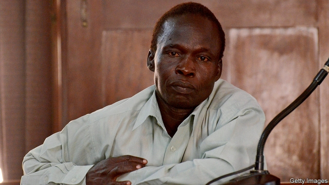

###### Trial and terror

# An ex-colonel in the Lord’s Resistance Army goes on trial in Uganda 

##### It is the country’s first war-crimes case 

 

> Mar 21st 2019 

PEOPLE STILL fear Thomas Kwoyelo in the villages around Pabbo, a town in northern Uganda where the Kilak hills smudge the horizon. Prosecutors in Uganda’s first war-crimes case allege that when he was a colonel in the Lord’s Resistance Army (LRA), a rebel group that terrorised northern Uganda from 1987 until 2006, he and his men abducted children, stole animals and massacred civilians. He pleads not guilty on all 93 counts, which include charges for murder, rape and enslavement. “He should be locked away for ever and never come back,” says one widow. 

The prosecution made its opening statement on March 12th in the high court in Gulu, a short drive away. The trial is seen as a test case for the court’s International Crimes Division, one of the first domestic war-crimes courts in Africa. Established in 2008, after failed peace talks with the LRA, it has convicted human traffickers and terrorists. But Mr Kwoyelo, captured a decade ago in Congo, is the first LRA rebel to appear before it. Many in northern Uganda don’t think he should face trial at all. 

Most of the group’s leaders have escaped justice. In 2005 the International Criminal Court (ICC) in The Hague issued arrest warrants for five senior commanders. One of them is now on trial there; three others are thought to be dead. Joseph Kony, the self-declared spirit medium who led the rebellion, is still at large. Thousands of LRA fighters have received amnesty under a law passed in 2000. Mr Kwoyelo—too junior to appear on the ICC’s list—is aggrieved that he was not given amnesty. Higher-ranking rebels walk free. 

In the villages where Mr Kwoyelo once roamed people catch news of his trial on radios. It is better that the case is heard in Gulu, says one man, than in a foreign court. The Ugandan court has appointed victims’ counsels, distinct from those for the prosecution and defence, who liaise with communities and represent victims in court. One of the counsels says their purpose is to “establish the bigger picture, beyond the guilt or innocence of the accused”. 

But the defence argues that Mr Kwoyelo is a victim, claiming he was abducted as a child while walking to school and forced to follow orders for fear of being shot. That story elicits some sympathy in northern Uganda. This was a disturbingly intimate war, where almost everybody knows someone who was abducted and returned. A local MP is standing surety for Mr Kwoyelo to seek bail. He argues that Mr Kwoyelo should instead go through a “traditional” ceremony, which puts reconciliation above punishment. It is a popular view, though not one shared by many victims. 

Distrust of the court is rooted in memories of the war. In it the government ordered almost the entire local population into squalid camps where thousands died of disease. “Between the government and the rebels, who is to blame?” sings Bosmic Otim, a pop star. Many people accuse the army of committing atrocities and wonder why its soldiers are not on trial, too. 

Perhaps that is the point. The ICC, which Ugandan leaders have previously supported but now rail against, will investigate crimes only when domestic courts are unable or unwilling to do so. Uganda has used its own war-crimes court to “give the perception that the Ugandan government was able to try international crimes and therefore shield its leadership from ICC investigations,” argues Nicholas Opiyo, who was Mr Kwoyelo’s lawyer for nearly ten years before dropping out of a case he deems irretrievably unfair. Harriet Ssali, the registrar of the domestic court, says that it had “practically begged” people to file reports on alleged army atrocities, but that they are too scared to do so. Any such case would be passed on to a military tribunal. 

The judges think Mr Kwoyelo’s trial will take three years, which is optimistic. The court is so short of money that one of the victims’ counsels could not afford to travel to a recent session. Nor is it clear who will fund the reparations that the victims expect. The trial is meant to set Uganda on a road towards justice. The risk is that it becomes a dead end. 

-- 

 单词注释:

1.Uganda[ju(:)'^ændә, u:'^ændә]:n. 乌干达 

2.thoma[]:n. (Thoma)人名；(阿尔巴、阿拉伯)索玛；(英、德、罗、匈、捷、塞、瑞典)托马 

3.Kilak[]:[地名] 基拉克 ( 乌干 ) 

4.smudge[smʌdʒ]:n. 污点, 脏污, 熏烟 vt. 弄脏, 使模糊, 用浓烟熏 vi. 被弄脏 

5.prosecutor['prɒsikju:tә]:n. 实行者, 告发者, 公诉人 [法] 原告, 起诉人, 检举人 

6.allege[ә'ledʒ]:vt. 宣称, 主张, 提出, 断言 [法] 断言, 指称, 指证 

7.lra[]:abbr. 逻辑记录存取法（Logical Record Access）；劳工研究协会（Labour Reseach Association）；远程飞行（Long-Range Aviation） 

8.terrorise['terәraiz]:vt. 使恐怖, 恐吓, 威胁, 胁迫 vi. 引起恐怖, 实行恐怖统治 

9.abduct[æb'dʌkt]:vt. 诱拐, 绑架, 使外展 [医] 外展, 展 

10.plead[pli:d]:vi. 辩护, 恳求 vt. 为...辩护, 提出...借口, 托称, 恳求 

11.rape[reip]:n. 抢夺, 掠夺, 强奸, 葡萄渣, 芸苔 vt. 掠夺, 抢夺, 强奸 

12.enslavement[in'sleivmәnt]:n. 使做奴隶, 使受制, 制服, 束缚, 征服, 奴役 [法] 奴役, 征服, 盲从 

13.prosecution[.prɒsi'kju:ʃәn]:n. 执行, 经营, 起诉 

14.gulu[]: [地名] [尼日利亚、乌干达] 古卢 

15.convict[kәn'vikt]:n. 囚犯, 罪犯 vt. 宣告有罪, 使知罪 

16.trafficker['træfikә]:n. 商人, 贩子 [法] 贩卖者, 买卖者, 商人 

17.terrorist['terәrist]:n. 恐怖分子 [法] 恐怖份子, 恐怖主义 

18.Congo['kɔŋ^әu]:n. 刚果, 刚果河, 工夫茶 [建] 刚果, 直接刚果红 

19.icc[]:abbr. 国际商会（International Chamber of Commerce）；国际计算中心（International Computation Centre）；印第安人申诉委员会（Indian Claims Commission）；国际版权公约（International Copyright Convention） 

20.Hague[hei^]:[法] 海牙 

21.warrant['wɒ:rәnt]:n. 授权, 正当理由, 根据, 证明, 批准, 凭证, 令状, 委任状 vt. 授权给, 保证, 担保, 批准, 使有正当理由 

22.Joseph['dʒәuzif]:n. 约瑟夫（男子名）；约瑟（圣经中雅各的第十一子） 

23.kony[]:[网络] 科尼；柯尼；乌干达主谋 

24.amnesty['æmnisti]:n. 大赦, 赦免 

25.aggrieve[ә'gri:v]:vt. 使委屈, 使悲痛, 侵害 [法] 侵害, 使悲痛, 使委屈 

26.roam[rәum]:v. 漫游, 闲逛, 徜徉 n. 漫步, 漫游 

27.Ugandan[ju:'^ændәn]:n. 乌干达人 a. 乌干达(人)的 

28.counsel['kaunsәl]:n. 商议, 忠告, 法律顾问 v. 商议, 劝告 

29.liaise[li'eiz]:vi. 保持联络, 担任联络官 

30.guilt[gilt]:n. 罪行, 内疚 [法] 罪, 犯罪, 罪行 

31.innocence['inәsәns]:n. 无罪, 无知, 天真无邪 [法] 无罪, 无罪的人, 清白无辜者 

32.elicit[i'lisit]:vt. 引出, 推导出, 引起 

33.disturbingly[dis'tә:biŋli]:adv. 动摇地；令人不安地 

34.MP[]:国会议员, 下院议员 [计] 宏处理程序, 维护程序, 线性规划, 微程序, 多处理器 

35.surety['ʃuәti]:n. 保证人, 保证, 担保 [法] 保证人, 担保人, 保证 

36.bail[beil]:n. 保释, 拎环, 杓, 栅栏 vt. 保释, 舀水 

37.reconciliation[,rekәnsili'eiʃәn]:n. 和解, 和好, 复交, 调解, 调停, 和谐, 一致, 甘愿, 顺从 [经] (银行往来)调节, 调和, 一致 

38.distrust[dis'trʌst]:n. 不信任 vt. 不信任 

39.squalid['skwɒlid]:a. 污秽的, 肮脏的, 悲惨的, 可怜的, 卑劣的 

40.atrocity[ә'trɒsiti]:n. 残暴, 凶恶, 暴行 [法] 暴行, 残酷, 残忍 

41.perception[pә'sepʃәn]:n. 知觉, 感觉, 领悟力, 获取 [医] 知觉 

42.nicholas['nikәlәs]:n. 尼古拉斯（男子名） 

43.deem[di:m]:v. 认为, 相信 

44.irretrievably[ˌɪrɪ'tri:vəblɪ]:adv. 不能挽回地, 不能补救地 

45.harriet[]:n. 哈里特（女子名） 

46.ssali[]:[网络] 索罗马州立语言学院(Sonoma State American Language Institute)；美国语言中心 

47.registrar['redʒistrɑ:]:n. 记录者, 登记者, 登记官员 [医] 登记员, 挂号员, 专科住院医师 

48.tribunal[trai'bju:nl]:n. 法庭, 法官席, 裁决 [法] 法庭, 裁判所, 裁判 

49.reparation[.repә'reiʃәn]:n. 补偿, 赔偿, 弥补, 修复, 修理 [经] 赔偿, 补偿, 修理 

