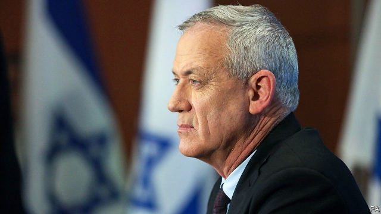

###### The man who would be prime minister

# Benny Gantz must convince Israelis that he can protect them 

##### Binyamin Netanyahu is working hard to convince them otherwise 

 

> Mar 21st 2019 

THE NEWS could not have come at a worse time for Benny Gantz, the main challenger to Binyamin Netanyahu, the prime minister. Less than four weeks before Israelis go to the polls it was reported that Mr Gantz’s telephone had been hacked by Iran and that stolen information may have included embarrassing images. While the candidate dismissed it as “political gossip”, some in his party blamed Mr Netanyahu for spreading the dirt. The prime minister shot back, “If Gantz can’t protect his phone, how will he protect the country?” 

Security is the overriding concern for voters in this election, which gives Mr Netanyahu an advantage. He has kept the country safe for a decade. But many Israelis dislike his divisiveness and alleged misdeeds. He faces a preliminary indictment for corruption, fraud and breach of trust. That leaves an opening for Mr Gantz, the towering, blue-eyed former chief of staff of the Israel Defence Forces. Though a political novice, his party, Blue and White, is running neck-and-neck in the polls with Mr Netanyahu’s Likud party. “The key to winning is taking the Mr Security title away from Netanyahu,” says a Gantz adviser. 

To do that Mr Gantz has enlisted two other former army chiefs, Gabi Ashkenazi and Moshe Yaalon, as running mates. As he launched his campaign, his party put out four videos, three of which highlight his toughness. As a general Mr Gantz led two wars in Gaza, in 2012 and 2014. The videos show neighbourhoods reduced to rubble and tally the number of “terrorists killed” and “targets destroyed”. “Parts of Gaza were returned to the stone age,” says a narrator. One clip shows footage of a leader of Hamas, the militant Islamists who run Gaza, being assassinated by a drone. 

But those videos belie a less hawkish, more easy-going figure. When Mr Gantz commanded the elite paratroopers brigade he was nicknamed “Bennyhuta”, a play on his name and the Aramaic word meaning laid-back. Others called him “the prince” for his swift, seemingly effortless rise through the ranks. In some ways he was lucky. He was made deputy chief of staff as a compromise after the chief of staff and the defence minister failed to agree on a candidate. He became chief of staff after two other contenders were tainted by scandal. More than anything, he was seen as a safe pair of hands. 

“There’s no shame in striving for peace,” says Mr Gantz in the fourth ad, which seems more in keeping with his character. While bashing Gaza, he spoke of how his mother, a Holocaust survivor, told him to make sure the Palestinians got food. In meetings with Mr Netanyahu’s cabinet, while head of the armed forces, he opposed plans to attack Iran’s nuclear installations, though he did put the army on a war footing. His rivals grumbled that he achieved little yet somehow managed not to get blamed for operational failures, such as Israel’s chaotic withdrawal from Lebanon in 2000, which Mr Gantz oversaw. 

Like many retired generals, Mr Gantz, whose father was prominent on the left of the Labour party, is a shade left of centre on Israel’s spectrum. “Hawkish on security, moderate on diplomacy,” as a party colleague describes him. He has privately endorsed a peace plan by the Institute for National Security Studies, a think-tank in Tel Aviv, that would increase Palestinian control of the West Bank and “build an infrastructure for a two-state solution in the long term.” His party’s manifesto is vaguer, calling for deeper separation from the Palestinians. But if he wins, he may seek to restart peace talks, cut off in 2014. 

That is one difference with Mr Netanyahu, who shuns the Palestinians. Another is the so-called nation-state law, which states that the right of national self-determination is “unique to the Jewish people”. Mr Netanyahu championed it. Mr Gantz wants to amend it to guarantee equal rights for all. But issues have been given short shrift in a campaign largely about image. Mr Netanyahu brands his opponents as the “weak left”, in league with “Arab parties that oppose the Jewish state”. Mr Gantz’s slogan, “Israel before everything”, is meant to contrast his squeaky-clean persona with the incumbent’s supposedly dodgy one. 

The tone of the contest is getting nastier. Mr Gantz has accused Mr Netanyahu of receiving 16m shekels ($4.4m) in a deal tied to the Israeli navy’s purchase of German submarines. Mr Netanyahu pushes back with the phone-hacking story. “Benny Gantz, what do the Iranians know about you that you’re hiding from us? What are the Iranians holding over you?” he asks. 

The race will ultimately come down to whether centrist parties, such as Blue and White, and left-wing parties, such as Labour, win more seats in total than Mr Netanyahu’s right-wing coalition. On this the polls suggest a tight race. But Mr Netanyahu has not seemed as vulnerable for years. “It would just be Benny’s luck to be there at the right moment, with Netanyahu ripe to fall,” says one of Mr Gantz’s former comrades-in-arms. 

-- 

 单词注释:

1.benny['beni]:n. 安非他明(药片) 

2.gantz[]: [人名] 甘茨; [电影]杀戮都市/杀戮都市 

3.Israeli[iz'reili]:a. 以色列的, 以色列人(语)的 n. 以色列人 

4.binyamin[]:本雅明 

5.Netanyahu[]:n. 内塔尼亚胡（人名） 

6.challenger['tʃælindʒә]:n. 挑战者 [经] 申请回避的人 

7.les[lei]:abbr. 发射脱离系统（Launch Escape System） 

8.hack[hæk]:n. 劈, 砍, 砍痕, 出租车, 干咳, 晒架, 鹤嘴锄 vt. 劈, 砍, 出租, 用旧 vi. 劈, 砍, 干咳, 驾驶出租车 a. 出租的 

9.Iran[i'rɑ:n]:n. 伊朗 

10.gossip['gɒsip]:n. 闲聊, 随笔, 流言, 爱讲闲话的人 vi. 说闲话, 闲聊 

11.override[.әuvә'raid]:vt. 推翻, 无视, 对...有最后发言权, 制服, 践踏, 奔越过 [经] 代理佣金, 代销佣金 

12.voter['vәutә]:n. 选民, 投票人 [法] 选民, 选举人, 投票人 

13.divisiveness[di'vaisivnis]:n. 引起分歧, 导致分裂 

14.allege[ә'ledʒ]:vt. 宣称, 主张, 提出, 断言 [法] 断言, 指称, 指证 

15.misdeed['mis'di:d]:n. 罪行, 犯罪 [法] 不端行为, 犯罪, 恶性 

16.indictment[in'daitmәnt]:n. 起诉, 控告, 起诉状 [经] 起诉书 

17.corruption[kә'rʌpʃәn]:n. 腐败, 堕落, 贪污 [计] 论误 

18.fraud[frɒ:d]:n. 欺骗, 欺诈, 诡计, 骗子 [经] 欺诈, 舞弊, 骗子 

19.breach[bri:tʃ]:n. 裂口, 违背, 破坏, 违反, 突破, 破裂 vt. 攻破, 突破 vi. 跳出水面 

20.Israel['izreil]:n. 以色列, 以色列后裔, 犹太人 

21.novice['nɒvis]:n. 新手, 初学者 

22.Likud[li:'ku:d]:n. 利库德集团(以色列右翼党派的政治联盟,长期为以色列执政党) 

23.adviser[әd'vaizә]:n. 顾问, 劝告者, 指导教师 [法] 顾问, 劝告者 

24.enlist[in'list]:vt. 征募, 参与, 谋取 vi. 从军, 应募, 赞助 

25.gabi[]:n. 加比 

26.Ashkenazi['æʃkə'næzi]:n. 德系犹太人 

27.Moshe[]:n. (Moshe)人名；(以)摩西 

28.yaalon[]:[网络] 亚阿隆 

29.toughness['tʌfnis]:n. 有粘性, 强硬, 强健 [化] 韧性 

30.gaza['^ɑ:zә]:n. 加沙（地中海岸港市） 

31.rubble['rʌbl]:n. 粗石, 碎砖, 粗石堆 

32.tally['tæli]:n. 符木, 记账, 得分, 比分, 计数器, 标签, 符合, 对应物 vt. 记录, 点数, 计算, 加标签于, 使符合 vi. 记帐, 符合, 吻合, 记分 [计] 计数 

33.terrorist['terәrist]:n. 恐怖分子 [法] 恐怖份子, 恐怖主义 

34.narrator[]:n. 讲述者, 叙述者 [法] 陈述者, 叙述者 

35.clip[klip]:n. 修剪, 夹子, 回形针, 剪下来的东西 vt. 修剪, 痛打, 夹牢, 剪报 vi. 剪报 

36.footage['futidʒ]:n. 英尺长度, 英板尺, (影片的)连续镜头 

37.Hama['hæmә]:哈马[叙利亚西部城市] 

38.militant['militәnt]:a. 好战的 

39.Islamist[iz'lɑ:mist]:n. 伊斯兰教主义者；回教教徒 

40.assassinate[ә'sæsineit]:vt. 暗杀, 行刺 [法] 暗杀, 行刺, 中伤 

41.drone[drәun]:n. 雄蜂, 懒惰者, 嗡嗡的声音, 无人驾驶飞机(或船) vi. 嗡嗡作声, 混日子 vt. 低沉地说 

42.belie[bi'lai]:vt. 掩饰, 与...不符, 使失望 

43.hawkish['hɒ:kiʃ]:a. 像鹰的, 鹰派的, 强硬派的 

44.elite[ei'li:t]:n. 精华, 精锐, 中坚分子 

45.paratrooper['pærәtru:pә]:n. 伞兵 

46.brigade[bri'geid]:n. 旅, 队 [法] 团体, 队, 组 

47.nickname['nikneim]:n. 绰号, 昵称 vt. 给...取绰号, 叫错名字 [计] 绰号 

48.Aramaic[.ærә'meiik]:n. 阿拉姆语 

49.seemingly['si:miŋli]:adv. 看来似乎, 表面上看来 

50.effortless['efәtlis]:a. 容易的, 不费力气的 

51.contender[kәn'tendә(r)]:n. 参赛者, 争论者, 斗争者, 竞争者 

52.taint[teint]:n. 污点, 耻辱, 感染 vt. 污染, 使腐败, 沾染, 腐蚀 

53.strive[straiv]:vi. 努力, 奋斗, 斗争 

54.bash[bæʃ]:v. 猛击, 打坏 n. 猛撞, 猛击 

55.holocaust['hɔlәkɔ:st]:n. 大屠杀, 大火灾, 毁灭, 大规模烧杀 

56.survivor[sә'vaivә]:n. 生还者, 幸存者 [法] 生还者, 生存者, 辛存者 

57.Palestinian[,pælis'tiniәn]:[经] 巴勒斯坦的 

58.grumble['grʌmbl]:n. 怨言, 满腹牢骚 vi. 抱怨, 发牢骚, 发隆隆声 vt. 抱怨 

59.chaotic[kei'ɒtik]:a. 混乱的, 无秩序的 [法] 混乱的, 混沌的 

60.withdrawal[wið'drɒ:l]:n. 提款, 撤退, 退回, 撤消, 退隐, 戒毒过程 [医] 戒除, 脱瘾 

61.Lebanon['lebәnәn]:n. 黎巴嫩 

62.oversee[.әuvә'si:]:vt. 向下看, 了望, 监督, 偷看到 [法] 监察, 监督, 俯瞰 

63.spectrum['spektrәm]:n. 光谱, 范围, 系列 [化] 光谱 

64.hawkish['hɒ:kiʃ]:a. 像鹰的, 鹰派的, 强硬派的 

65.diplomacy[di'plәumәsi]:n. 外交, 外交手腕, 交际手段 [法] 外交, 外交手腕, 权谋 

66.privately[]:adv. 秘密地；私下地 

67.endorse[in'dɒ:s]:vt. 支持, 赞同, 背书于, 签署 [经] 赞成, 背书 

68.tel[tel]:abbr. 试验仪器清单（Test Equipment List） 

69.Aviv[ɑ:'viv]:n. 大自然的重生 n. (Aviv)人名；(俄)阿维夫 

70.Palestinian[,pælis'tiniәn]:[经] 巴勒斯坦的 

71.infrastructure['infrәstrʌktʃә]:n. 基础结构, 基础设施 [经] 基础设施 

72.manifesto[.mæni'festәu]:n. 宣言, 声明 

73.vaguer[veiɡə]:a. 模糊的( vague的比较级 ); （思想上）不清楚的; （表达或感知）含糊的; 不具体的 

74.restart[.ri:'stɑ:t]:v. 重新开始, 重新启动 [计] 重新启动 

75.shun[ʃʌn]:vt. 避开, 规避, 避免 

76.amend[ә'mend]:vt. 修改, 改善, 改良 vi. 改过自新 

77.shrift[ʃrift]:n. 忏悔, 临终忏悔, 招认, 承认 [法] 忏悔, 赦免, 临终忏悔 

78.persona[pә:'sәunә]:n. 人, 人物, 角色, 外表印象, 人格面具 [医] 伪装人格 

79.supposedly[sә'pәuzidli]:adv. 想象上, 看上去像, 被认为是, 恐怕, 按照推测 

80.dodgy['dɒdʒi]:a. 狡猾的, 逃避的, 难弄的 

81.shekel['ʃekl]:n. 钱, 财富, 硬币 [经] 以色列币 

82.Israeli[iz'reili]:a. 以色列的, 以色列人(语)的 n. 以色列人 

83.Iranian[i'reiniәn]:a. 伊朗的, 伊朗语系的 n. 伊朗人, 伊朗语 

84.centrist['sentrist]:n. 中间党派的成员, 温和主义者 [法] 中间派议员, 中立派议员 

85.coalition[.kәuә'liʃәn]:n. 结合体, 结合, 联合 [经] 联合, 联盟 

86.vulnerable['vʌlnәrәbl]:a. 易受伤害的, 有弱点的, 易受影响的, 脆弱的, 成局的 [医] 易损的 

