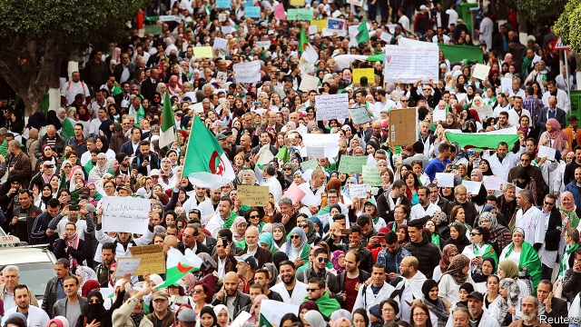

###### Talk of spring

# Protests are making a comeback in the Arab world 

##### But there are reasons they haven’t gone viral 

 

> Mar 21st 2019 

THE MANTRA of the Arab spring is back. “The people want the regime to go,” chant hundreds of thousands of protesters in Algeria, hoping to end the 20-year rule of Abdelaziz Bouteflika. Their cries are echoed in Sudan, where three months of demonstrations have rattled the regime of Omar al-Bashir, the leader for three decades. Protesters in Iraq, Jordan, Lebanon, Morocco, Tunisia and the Palestinian territories have also demanded better governance of late. Five years after the region’s authoritarians silenced it, the Arab street is regaining its voice. 

This has prompted talk of an Arab-spring sequel. As in 2011, the protests have been spontaneous, inclusive and bereft of leadership. The same grievances fuel today’s unrest. But the context could not be more different. The wars and chaos that followed the Arab spring have cooled the ardour of activists and their regional patrons. Meanwhile, autocrats have sharpened their tools of repression in order to quash protests at home and stop those elsewhere from spreading. “They have rewired the entire region trying to prevent another Arab spring,” says Marc Lynch of George Washington University. 

Turkey, Iran and Qatar helped spread the contagion in 2011, but their regional ambitions have taken a back seat to their own security concerns. President Recep Tayyip Erdogan tightened his grip in Turkey after protests in 2013 and an attempted coup three years later. The Islamist-leaning democratic model he once touted increasingly resembles the authoritarianism he lampooned. Iran’s leaders were eager to fan the flames of the Arab spring—until it threatened to burn their ally in Syria, Bashar al-Assad. They, too, are now rocked by protests at home. Qatar, though, has performed the biggest turnabout. Under siege by its neighbours, it needs all the friends it can buy. It hosted Mr Bashir in February and has kept mum on Algeria’s troubles. 

Eight years ago Al Jazeera, the Qatari satellite television network, was the Arab spring’s soapbox. With rolling coverage and rousing promos, it egged on national protests and created a region-wide narrative. But its coverage of the upheaval in Algeria and Sudan, the Arab world’s second and third most populous countries, has been paltry. Anchors depict the protests as isolated events on the periphery of the Arab world. Some highlight Algeria’s linguistic peculiarities. (Its dialect is incomprehensible to many Arabs.) “They’re deliberately disconnecting the dots,” says Ahmed Mustafa, a monitor of Arab media in Abu Dhabi. 

Despots who fought change all along have cracked down on independent media. Information ministries dictate headlines, ban foreign journalists and harass local ones who don’t co-operate. Investigative reporters and those who are critical of regimes are often denounced in state media as terrorists and traitors. Some are tortured. Saudi Arabia has established a “rapid intervention group” to pursue those who flee, such as Jamal Khashoggi, a former Saudi newspaper editor, who was murdered and dismembered in the Saudi consulate in Istanbul. 

Social media, the dynamo of the Arab spring, still bring crowds onto the streets. Algeria has one of the region’s highest rates of Facebook usage coupled with perhaps its least technologically savvy regime. “Its lack of knowledge left an empty space,” says Ashraf Zeitoon, who ran Facebook’s policy unit in the region. Still, there are no catchy hashtags linking the protests in different countries, and sharper autocrats have turned social media to their advantage. Saudi Arabia and other Gulf states have built troll farms (office blocks full of nerds feeding hundreds of fake social-media accounts) and bots (automated regurgitators) to spread official talking points. Intimidation, through spyware, hacking, abusive comments or simply arrest, reduces opposing messages. 

Governments have also stepped up their old-fashioned repression. On the eve of Algeria’s largest protest, Egypt’s president, Abdel-Fattah al-Sisi, warned against copycat “riots”. A politician in Bahrain was recently sentenced to six months in prison for calling on Mr Bashir to step down. Many countries have outright bans on large gatherings, while vaguely worded security laws enacted after the Arab spring allow governments to round up potential rabble-rousers. “The use of live ammunition even against small, symbolic protests has effectively reduced dissent to zero,” says Sarah Leah Whitson of Human Rights Watch, a pressure group. 

Being less connected is not necessarily a bad thing for today’s protesters. Those in Algeria and Sudan pride themselves on their independence and nationalism. For now, at least, they are displaying discipline and rejecting violence. “We’re not Syria or Libya,” they chant in Algeria, while self-interested leaders warn of chaos and bloodshed. The protesters show no sign of going home. Emile Hokayem of the International Institute for Strategic Studies, a think-tank in London, doubts that they can be made to: “The ebb and flow of street protest is the region’s new normal.” 

-- 

 单词注释:

1.comeback['kʌmbæk]:n. 复原, 复辟, 复位, 尖刻的对答, 抱怨的原因 [计] 复原的 

2.viral['vairәl]:a. 病毒的, 病毒引起的 [医] 病毒的 

3.mantra['mʌntrә, 'mæn-]:颂歌, 咒语(尤指四吠陀经典内作为咒文或祷告唱念的) 

4.regime[rei'ʒi:m]:n. 政权, 当权期间, 政体, 社会制度, 体制, 情态 [医] 制度, 生活制度 

5.protester[]:n. 抗议者, 持异议者, 拒付者 [经] 反对者 

6.Algeria[æl'dʒiәriә]:n. 阿尔及利亚 

7.abdelaziz[]:n. (Abdelaziz)人名；(阿拉伯)阿卜杜勒-阿齐兹 

8.bouteflika[]:[网络] 布特弗利卡；阿尔及利亚总统布特弗利卡；布特佛里卡 

9.Sudan[su:'dæn]:n. 苏丹 [化] 苯偶氮间苯二酚; 苏丹 

10.demonstration[.demәn'streiʃәn]:n. 示范, 实证 [医] 示教, 实物教授 

11.rattle['rætl]:vt. 使嘎嘎响, 喋喋不休地说 vi. 格格响, 喋喋不休 n. 格格声, 拨浪鼓, 喋喋不休的话 

12.omar['әjmɑ:(r)]:n. 奥马尔（男子名） 

13.Iraq[i'rɑ:k]:n. 伊拉克 

14.jordan['dʒɒ:dәn]:n. 约旦, 约旦河, 尿壶 

15.Lebanon['lebәnәn]:n. 黎巴嫩 

16.Morocco[mә'rɒkәu]:n. 摩洛哥, 摩洛哥皮革 [机] 摩洛哥革 

17.Tunisia[tju:'nisiә]:n. 突尼斯 

18.Palestinian[,pælis'tiniәn]:[经] 巴勒斯坦的 

19.governance['gʌvәnәns]:n. 统治, 统辖, 管理 [法] 统治, 管理, 支配 

20.authoritarian[ɒ:.θɒri'tєәriәn]:a. 独裁的, 独裁主义的 

21.regain[ri'gein]:vt. 取回, 恢复, 重回, 复得 [化] 回潮 

22.sequel['si:kwәl]:n. 继续, 续集, 后果 [计] 结构的英语查询语言 

23.inclusive[in'klu:siv]:a. 包含的, 包括的 

24.bereave[bi'ri:v]:vt. 使孤寂, 使丧失, 使失去 

25.grievance['gri:vәns]:n. 委屈, 冤情, 苦况 [经] 不满(对雇用条件的) 

26.context['kɒntekst]:n. 上下文, 背景, 来龙去脉 n. 上下文 [计] 上下文 

27.chao[]:n. 钞（货币） 

28.ardour['ɑ:dә]:n. 热忱, 热情, 情欲, 激情, 灼热 

29.activist['æktivist]:n. 激进主义分子 

30.regional['ri:dʒәnәl]:a. 地方的, 地域性的 [医] 区的, 部位的 

31.patron['peitrәn]:n. 赞助人, 顾客, 保护人 [法] 保护人, 庇护人, 赞助人 

32.autocrat['ɒ:tәkræt]:n. 独裁者 

33.repression[ri'preʃәn]:n. 抑制, 压抑, 制止 [医] 压抑, 抑制 

34.quash[kwɒʃ]:vt. 撤销, 平息, 镇压 [法] 撤销, 废止, 宣布无效 

35.rewire[ri:'waiә]:vt. 换电线, 再打电报 

36.marc[mɑ:k]:n. 榨渣 [计] 机器可读目录; 机读目录 

37.lynch[lintʃ]:n. 私刑, 私罚 vt. 处以私刑处死, 加私刑 

38.george[dʒɔ:dʒ]:n. 乔治（男子名）；自动操纵装置；英国最高勋爵勋章上的圣乔治诛龙图 

39.Washington['wɒʃiŋtn]:n. 华盛顿 

40.Iran[i'rɑ:n]:n. 伊朗 

41.Qatar['kɑ:tәr]:n. 卡塔尔 

42.contagion[kәn'teidʒәn]:n. 触染, 触染病, 蔓延, 歪风 [医] 接触传染; 接触染物 

43.recep[]:n. (Recep)人名；(土)雷杰普 

44.tayyip[]:[网络] 塔伊普 

45.erdogan[]:[网络] 埃尔多安；土耳其总理埃尔多安；艾尔多安 

46.tighten['taitn]:vt. 勒紧, 使变紧 vi. 变紧, 绷紧 

47.coup['ku:]:n. 砰然的一击, 妙计, 出乎意料的行动, 政变 [医] 发作, 中, 击 

48.tout[taut]:vi. 招徕顾客, 兜售物品 vt. 招徕, 刺探...情报 n. 兜售者, 侦查者 

49.authoritarianism[ə,θɔrə'tɛrɪənɪzəm]:n. 独裁主义；权力主义 

50.lampoon[læm'pu:n]:n. 讽刺文 vt. 讽刺 

51.ally['ælai. ә'lai]:n. 同盟者, 同盟国, 助手 vt. 使联盟, 使联合, 使有关系 vi. 结盟 

52.Syria['siriә]:n. 叙利亚 [经] 叙利亚 

53.bashar[]:巴沙尔 巴沙尔 

54.turnabout['tә:nә.baut]:n. 转向, 报复, 转变 

55.siege[si:dʒ]:n. 包围, 围攻, 再三的努力 vt. 包围, 围攻 

56.Bashir[]:n. (Bashir)人名；(英、俄、阿富、巴基)巴希尔；(阿拉伯)贝希尔 

57.mum[mʌm]:n. 菊花, 沉默 a. 沉默的 vi. 演哑剧 interj. 别说话 

58.AL[]:[计] 算法语言, 字母, 汇编语言 [医] 铝(13号元素) 

59.jazeera[]:[网络] 半岛 

60.Qatari['kɑ:təri]:n. 卡塔尔人 a. 卡塔尔的 

61.soapbox['sәupbɒks]:n. 肥皂盒, 临时演说台 a. 街头演说的 

62.coverage['kʌvәridʒ]:n. 覆盖的范围, 保险总额, 新闻报导 [化] 可达范围; 覆盖度 

63.promo['prәumәu]:n. 商品广告；商品推销 

64.narrative['nærәtiv]:n. 叙述, 故事 a. 叙述的, 叙事的, 故事体的 

65.upheaval[ʌp'hi:vl]:n. 举起, 隆起, 大变动, 剧变 

66.populous['pɒpjulәs]:a. 人口多的, 人口稠密的 

67.paltry['pɒ:ltri]:a. 不足取的, 琐碎的, 可鄙的 

68.depict[di'pikt]:vt. 描述, 描写 

69.periphery[pә'rifәri]:n. 外围, 边缘地区, 圆周 [医] 外周, 周围 

70.linguistic[liŋ'^wistik]:a. 语言的, 语言学的 [计] 语言的, 语言学的 

71.peculiarity[pi.kju:li'æriti]:n. 特质, 特性, 怪癖 

72.incomprehensible[in.kɒmpri'hensәbl]:a. 不能理解的, 费解的, 无限的 

73.disconnect[.diskә'nekt]:vt. 使分离, 使不相连, 拆开 vi. 断开 [计] 断开 

74.ahmed[]:n. 艾哈迈德（男子名） 

75.Mustafa['mjstɑ:fɑ:]:Kemal 穆斯塔法·基马尔(即 Kemal Atatürk) 

76.abu[]:abbr. 亚洲广播联盟（Asian Broadcast Union） 

77.despot['despɒt]:n. 专制君主, 暴君 [法] 暴君, 专制君主 

78.harass['hærәs]:vt. 使困扰, 使烦恼, 折磨 

79.investigative[in'vestigeitiv]:a. 审查的, 调查的, 好研究的 [法] 调查的, 审查的, 受调查研究的 

80.denounce[di'nauns]:vt. 告发, 抨击, 谴责 [法] 谴责, 斥责, 告发 

81.terrorist['terәrist]:n. 恐怖分子 [法] 恐怖份子, 恐怖主义 

82.saudi['sajdi]:a. 沙乌地阿拉伯（人或语）的 

83.Arabia[ә'reibiә]:n. 阿拉伯半岛 

84.intervention[.intә'venʃәn]:n. 插入, 介入, 调停 [经] 干预 

85.Jamal[]:n. 贾马尔（男子名） 

86.khashoggi[]:卡舒吉 

87.dismember[dis'membә]:vt. 割断手足, 支解, 分割 

88.consulate['kɒnsjulit]:n. 领事, 领事任期, 领事馆 [经] 领事馆 

89.Istanbul[.istæn'bu:l]:n. 伊斯坦布尔 

90.dynamo['dainәmәu]:n. 发电机 [医] 电机, 发电机 

91.facebook[]:n. 脸谱网 

92.technologically[teknә'lɔdʒikәli]:adv. 技术上地；科技地 

93.savvy['sævi]:v. 理解, 领悟 n. 理解能力, 机智, 悟性 

94.ashraf[]:n. (Ashraf)人名；(伊朗、阿拉伯、印、孟、巴基)阿什拉芙(女)，阿什拉夫 

95.catchy['kætʃi]:a. 易记住的, 欺骗性的, 不规则发生的 

96.hashtags[]:[网络] 标签；话题标签；标签运用 

97.Sharpe['ʃa:p]:n. 夏普指数；夏普指标；夏普（人名） 

98.troll[trɒl]:vi. 滚动, 参加轮唱, 曳绳钓鱼 vt. 使转动, 轮唱, 高唱, 用曳绳钓(鱼) n. 转动, 轮唱, 钓绳 

99.nerd[nә:d]:n. 讨厌的人；呆子 

100.fake[feik]:n. 假货, 欺骗, 诡计 a. 假的 vt. 假造, 仿造 vi. 伪装 

101.BOT[bɔt]:[计] 磁带开始标志, 计算机角色 [医] 肤蝇[类]幼虫 

102.automate['ɔ:tәmeit]:vt.vi. (使)自动化 [计] 自动化 

103.regurgitators[]:[网络] 反流者 

104.intimidation[in,timi'deiʃәn]:n. 恐吓, 威胁 [法] 恐吓, 威胁 

105.spyware[]:间谍软件；后门程式 

106.hack[hæk]:n. 劈, 砍, 砍痕, 出租车, 干咳, 晒架, 鹤嘴锄 vt. 劈, 砍, 出租, 用旧 vi. 劈, 砍, 干咳, 驾驶出租车 a. 出租的 

107.abusive[ә'bju:siv]:a. 恶言谩骂的, 被滥用的, 腐败的, 虐待的 

108.copycat['kɒpikæt]:n. 模仿者 

109.riot['raiәt]:n. 暴动, 喧闹, 放纵 vi. 发动, 暴动, 纵情, 放荡 vt. 浪费, 挥霍 

110.Bahrain[]:n. 巴林岛 

111.outright['autrait]:a. 率直的, 完全的, 总共的, 直率的 adv. 完全地, 率直地, 立刻地, 一直向前 

112.gathering['gæðәriŋ]:n. 聚集, 集中, 采集 [化] 富集 

113.vaguely['veigli]:adv. 含糊地, 暧昧地 

114.enact[i'nækt]:vt. 制定法律, 扮演, 颁布 [法] 法令, 法规, 条例 

115.ammunition[.æmju'niʃәn]:n. 军火, 弹药 [机] 弹药 

116.symbolic[sim'bɒlik]:a. 象征的, 符号的 [电] 符号化 

117.effectively[i'fektivli]:adv. 有效地, 有力地, 实际上 

118.dissent[di'sent]:n. 异议 vi. 持异议, 不同意 

119.Sarah['sєәrә]:n. 萨拉(<<圣经>>故事人物) 

120.Leah[liә]:n. 利亚(<<圣经>>故事人物) 

121.whitson[]: [人名] [英格兰人姓氏] 惠特森取自父名, 来源于White,含义是“怀特之子”(son of White) 

122.les[lei]:abbr. 发射脱离系统（Launch Escape System） 

123.nationalism['næʃәnәlizm]:n. 民族主义, 民族特性 

124.Libya['libiә]:n. 利比亚 

125.bloodshed['blʌdʃed]:n. 流血 

126.emile[ei'mi:l]:n. 埃米尔（男子名, 等于Emil） 

127.ebb[eb]:n. 退潮, 衰退 vi. 潮退, 衰退 

