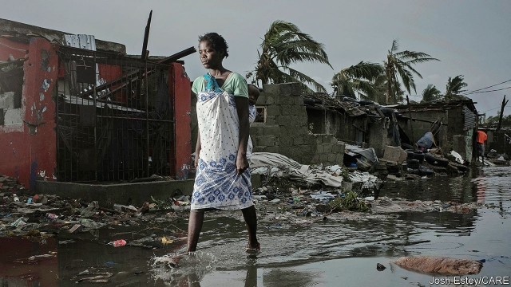

###### Beira’s battering

# Tropical Cyclone Idai may have killed more than 1,000 in Mozambique 

##### More than 1.5m people have been affected 

 

> Mar 21st 2019 

AID WORKERS have described it as Mozambique’s worst humanitarian crisis since its 15-year civil war. Nearly a week after Tropical Cyclone Idai walloped the coast before churning inland, the full extent of the damage is still unclear. Beira, a port city of half a million people, was cut off after a storm hit between March 14th and 15th, bringing fierce winds and flooding that destroyed bridges, roads and electricity lines. 

Filipe Nyusi, the president, described seeing bodies floating in rivers as he flew over the region by helicopter. He said the death toll could rise to more than 1,000. 

Red Cross workers reckon 90% of buildings in Beira were damaged or destroyed and fear the situation may be worse still outside the city, where floodwaters have yet to recede. In some neighbourhoods, the tops of concrete-block houses were simply blown off. Elsewhere, video footage showed people huddled on rooftops, evoking memories of catastrophic floods in 2000, when the world was captivated by the story of a woman giving birth in a tree she had climbed to escape rising water. 

As the storm moved inland, it also swamped southern Malawi and eastern Zimbabwe. Chimanimani, in Zimbabwe, was especially badly hit; it was cut off because of damage to roads. Zimbabwe’s government said 98 people had died and more than 200 were missing. Torrential rains continue to deluge the region, adding to the misery. In all, more than 1.5m people have been affected. The UN has urgently appealed for donations. 

A long-term recovery plan will also be needed. The floods appear to have ruined maize crops, raising the risk of hunger. In Zimbabwe, where the government declared a disaster, a drought has already left 5.3m people in need of food aid. With the waters slow to recede, diseases may fester. Schools and hospitals along with bridges and roads need repair. 

Policymakers also need to prepare for the future. One challenge is improving warning systems. The Red Cross Red Crescent Climate Centre says that although there were good forecasts of the cyclone, the flooding and landslides it caused were less well anticipated. Low-lying coastal cities such as Beira are especially vulnerable to storms, which could worsen as climate change disrupts weather patterns. The destruction underlines the need to invest in protected infrastructure before the next assault. 

-- 

 单词注释:

1.batter['bætә]:v. 连续猛打（尤其指妇女），猛击 n. 面糊（食物），击球员，打击手 

2.cyclone['saiklәun]:n. 龙卷风, 暴风 [化] 旋流(分离,除尘)器 

3.Mozambique[.mәuzәm'bi:k]:n. 莫桑比克 

4.humanitarian[hju:.mæni'tєәriәn]:n. 人道主义者, 博爱者, 基督凡人论者 a. 人道主义的, 博爱的, 凡人论的 

5.churn[tʃә:n]:n. 搅乳器 v. 搅拌, 搅动 

6.unclear[.ʌn'kliә]:a. 不易了解的, 不清楚的, 含混的 

7.Beira['beirә]:贝拉[莫桑比克东南部港市] 

8.filipe[]:n. (Filipe)人名；(斐、葡)菲利佩 

9.toll[tәul]:n. 通行费, 代价, 钟声 vt. 征收, 敲钟, 鸣钟, 勾引, 引诱 vi. 征税, 鸣钟 

10.reckon['rekәn]:vt. 计算, 总计, 估计, 认为, 猜想 vi. 数, 计算, 估计, 依赖, 料想 

11.floodwater['flʌdwɒ:tә]:n. 洪水 

12.recede[ri'si:d]:vi. 向后退, 退却, 收回, 降低, 减弱 [医] 退缩 

13.footage['futidʒ]:n. 英尺长度, 英板尺, (影片的)连续镜头 

14.huddle['hʌdl]:n. 杂乱一团, 混乱, 拥挤 vt. 把...挤在一起, 乱堆, 草率了事, 蜷曲 vi. 挤作一团, 蜷缩 

15.rooftop['ru:ftɒp]:n. 屋顶 

16.evoke[i'vәuk]:vt. 唤起, 引起, 召(魂) [法] 提审, 移送 

17.catastrophic[.kætә'strɒfik]:a. 悲惨的, 灾难的 

18.captivate['kæptiveit]:vt. 迷住, 迷惑 

19.Malawi[mә'lɑ:wi]:n. 马拉维 

20.Zimbabwe[zim'bɑ:bwei]:n. 津巴布韦 

21.Chimanimani[]:[地名] 奇马尼马尼 ( 津 ) 

22.torrential[tɒ'renʃәl]:a. 奔流的, 急流的, 猛烈的 

23.deluge['delju:dʒ]:n. 大洪水, 泛滥 vt. 使泛滥 

24.misery['mizәri]:n. 痛苦, 悲惨, 不幸, 穷困 

25.UN[ʌn]:pron. 家伙, 东西 [经] 联合国 

26.urgently[]:adv. 急切地；迫切地；紧急地 

27.donation[dәu'neiʃәn]:n. 捐赠物, 捐款, 捐赠 [经] 赠品, 捐款, 捐赠 

28.ruine['ru:ɪn]: [医]路因碱 

29.maize[meiz]:n. 玉蜀黍, 黄色 a. 玉蜀黍色的, 黄色的 

30.fester['festә]:vi. 溃烂, 生脓 vt. 使溃烂 n. 脓疮, 溃烂 

31.policymaker['pɔlisi.meikә]:n. 政策制定者；决策人 

32.Crescent['kresәnt]:n. 新月, 新月形(物) a. 新月形的, 逐渐增加的 

33.cyclone['saiklәun]:n. 龙卷风, 暴风 [化] 旋流(分离,除尘)器 

34.landslide['lændslaid]:n. 山崩 [化] 滑坡 

35.les[lei]:abbr. 发射脱离系统（Launch Escape System） 

36.coastal['kәustәl]:a. 海岸的, 沿海的, 沿岸的 [法] 海岸的, 沿海的 

37.vulnerable['vʌlnәrәbl]:a. 易受伤害的, 有弱点的, 易受影响的, 脆弱的, 成局的 [医] 易损的 

38.worsen['wә:sn]:vt. 使更坏, 使恶化 vi. 变得更坏, 恶化 

39.disrupt[dis'rʌpt]:a. 分裂的, 中断的 vt. 使分裂, 使瓦解 

40.infrastructure['infrәstrʌktʃә]:n. 基础结构, 基础设施 [经] 基础设施 

41.assault[ә'sɒ:t]:n. 攻击, 袭击 vt. 袭击, 攻击 vi. 发动攻击 

