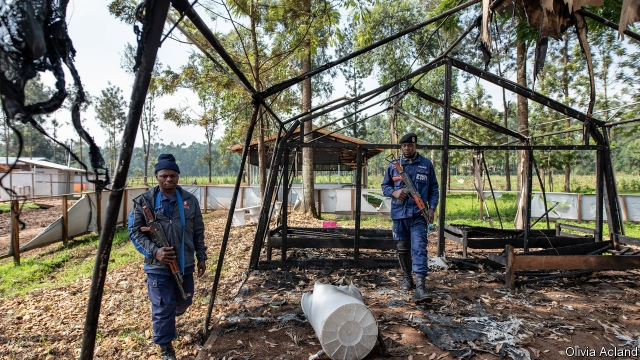
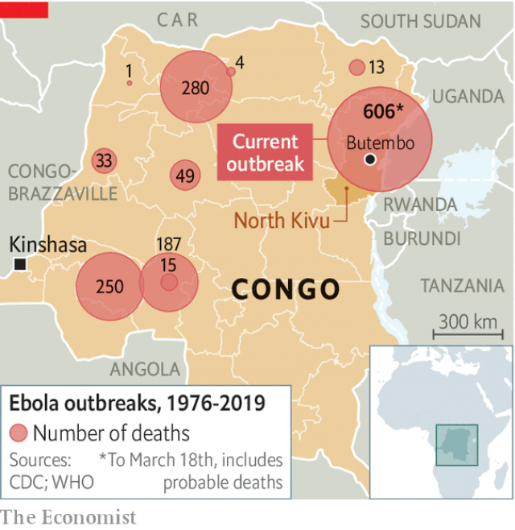

###### An epidemic of violence

# Why are Ebola clinics in Congo being attacked? 

##### Many locals distrust the state and misunderstand medicine 

 

> Mar 21st 2019 

AT DUSK ON February 27th a group of young men dressed as football players were kicking a ball around a pitch besides an Ebola treatment centre in Butembo, a city in the east of the Democratic Republic of Congo. Suddenly men with guns and machetes sprang out of the bush and handed weapons to those masquerading as footballers. Together, they charged into the centre. As the sick fled, along with health workers, the men splashed petrol around before tossing in lit matches. When nurses crept back later they found the smouldering remains of the pharmacy, archive room, hand-washing station and vehicles. 

The province of North Kivu is no stranger to misery—it has long been home to some 120 militia groups that regularly rape and terrorise. Now it is also the site of the world’s second-largest outbreak of Ebola, a virus that makes people gush blood from every orifice. Since being detected seven months ago, the virus has spread to nearly 1,000 people and probably killed 600. Its emergence in what is in effect a war zone makes it hard to contain. Health workers are often unable to isolate the infected, or to vaccinate everyone who has touched them. Some villages are deemed too dangerous for vaccinators to visit. 

To cap it all, Ebola clinics are being attacked. In the past month alone four have been assailed. A male nurse was strangled in front of his wife. Experts from the World Health Organisation (WHO) were ambushed in their car, which was smashed up by men with sticks. A member of the team charged with burying corpses safely, so that they do not infect new victims, was slashed in the head with a machete. 

The attacks have prompted Médecins Sans Frontières (MSF) to close a treatment centre and leave Butembo. They may also deter patients from getting treatment. Almost half of the deaths in this outbreak are occurring in villages, not clinics, suggesting many of the sick are not seeking help. “Security is still our number one concern and could reverse the gains we have made,” says the WHO. 

 

Some premeditated attacks have been blamed on Mai Mai rebels. This is such a vague term, referring to many local armed groups, that it sheds little light. Some attacks are spontaneous, and by unknown perpetrators. What motivates them? 

Some, perhaps, are in search of loot. Aid workers are conspicuously richer than most locals, and present a tempting target. Another problem is that many locals see health workers as an arm of the government, which they detest. It does not help that the government keeps trying to force people into treatment centres where, since they are already sick, many die. “The response has often treated patients as a biosecurity risk, rather than as a patient with a choice about how they should manage their own illness,” says Alex Wade of MSF. The WHO says it regularly urges the government not to use force. It asks soldiers, police and UN peacekeepers to escort its staff to villages, but then stay on the periphery. This probably helps. 

Another problem is ignorance. Some locals think Ebola was introduced by white people who want to harvest organs. Justin Munyandele, a 24-year-old mechanic, lingering outside his garage in grubby overalls, says Ebola was brought in by the government to exterminate the Nandes, the biggest ethnic group in the region. Others say it is a fiction that was invented to prevent people from voting in elections last year. The poll was suspended because of the outbreak in strongholds of an opposition candidate, Martin Fayulu. 

With hindsight health workers recognise that they should have done more to involve local people. “The response started badly,” complains a young motorbike-taxi driver in Katwa, on the edge of Butembo. “They came here with police escorts to be protected. That wouldn’t have been necessary if they had employed people from Katwa to work with them.” 

Progress has been made. The rate at which the infection is spreading is much slower than in the outbreak in west Africa that killed more than 11,000 people in 2013-16, possibly because of a new vaccine administered to more than 85,000 people. And efforts to fight myths about the virus are showing results. The WHO says it sees “pockets of mistrust, not a wall” and that 90% of people accept vaccination. William Perea, the incident manager for the WHO in Butembo, says that some once-hostile villages are now letting his teams in. “People are not stupid. They do not like to die like flies,” he says. To soothe tensions and keep the virus from spreading, the key is “to get as close as possible to the communities”. 

-- 

 单词注释:

1.epidemic[.epi'demik]:n. 传染病, 流行病 a. 流行的, 传染性的 

2.ebola[i'bəulə]:n. 埃博拉病毒 

3.Congo['kɔŋ^әu]:n. 刚果, 刚果河, 工夫茶 [建] 刚果, 直接刚果红 

4.distrust[dis'trʌst]:n. 不信任 vt. 不信任 

5.Butembo[]:[地名] 布滕博 ( 刚(金) ) 

6.machete[mә'tʃeiti]:n. 大砍刀 [化] 马歇特; 丁草胺 

7.masquerade[.mɑ:skә'reid]:n. 化装舞会, 伪装 vi. 参加化装舞会, 伪装, 假装 

8.footballer['futbɒ:lә]:n. 足球员, 足球选手 

9.smoulder['smәuldә]:vi. 闷烧, 郁积 n. 闷烧 

10.pharmacy['fɑ:mәsi]:n. 药房, 配药学, 制药业 [医] 药学, 药剂学, 调剂学, 药房 

11.archive['ɑ:kaiv]:vt. 把...存档 n. 档案馆, 档案文件 [计] 挡案库, 存档 

12.kivu[]:n. 基伏（位于刚果民主共和国与卢旺达的边界的湖） 

13.militia[mi'liʃә]:n. 义勇军, 民兵组织, 国民军 

14.rape[reip]:n. 抢夺, 掠夺, 强奸, 葡萄渣, 芸苔 vt. 掠夺, 抢夺, 强奸 

15.terrorise['terәraiz]:vt. 使恐怖, 恐吓, 威胁, 胁迫 vi. 引起恐怖, 实行恐怖统治 

16.outbreak['autbreik]:n. 爆发, 暴动 [医] 暴发 

17.gush[gʌʃ]:n. 涌出, 滔滔不绝地讲话 v. 涌出, 迸出, 滔滔不绝的讲话 

18.orifice['ɒrifis]:n. 孔口 [医] 口, 管口 

19.emergence[i'mә:dʒәns]:n. 出现, 浮现, 发生 

20.vaccinate['væksineit]:v. 预防接种 

21.deem[di:m]:v. 认为, 相信 

22.vaccinator['væksineitә(r)]:n. 接种员 [医] 接种员; 种痘器 

23.assail[ә'seil]:vt. 攻击, 质问 [法] 攻击, 袭击, 著手解决 

24.strangle['stræŋgl]:vt. 勒死, 扼死, 压制, 使窒息, 抑制 vi. 被扼死, 被绞死, 窒息而死 

25.organisation[,ɔ: ^әnaizeiʃən; - ni'z-]:n. 组织, 团体, 体制, 编制 

26.ambush['æmbuʃ]:n. 埋伏, 伏兵, 伏击 vt. 埋伏, 伏击 vi. 埋伏 

27.corpse[kɒ:ps]:n. 尸体 [医] 尸体 

28.slash[slæʃ]:v. 猛砍, 乱砍 n. 猛砍, 乱砍, 删减 [计] 斜线 

29.san[sɑ:n]:abbr. 存储区域网（Storage Area Networking） 

30.MSF[]:[计] 大容量存储装置; 海量存储装置 

31.deter[di'tә:]:vt. 制止, 吓住, 威慑 

32.premeditate[pri'mediteit]:v. 预谋, 预先考虑 

33.mai[]: [医][=microscopic aggregation index]显微镜下聚集指数 

34.perpetrator[]:n. 作恶者, 犯罪者, 行凶者 [法] 作恶者, 行凶者, 犯罪者 

35.loot[lu:t]:n. 赃物, 洗劫, 抢夺 v. 洗劫, 抢夺 

36.conspicuously[kən'spɪkjʊəslɪ]:adv. 显著地, 超群地 

37.detest[di'test]:vt. 厌恶, 憎恨 

38.biosecurity[ˌbaɪəʊsɪ'kjʊərətɪ]: 生物安全 

39.Alex[]:[计] 开放网络文件系统 

40.wade[weid]:vi. 跋涉 vt. 涉水 n. 跋涉, 浅滩 

41.UN[ʌn]:pron. 家伙, 东西 [经] 联合国 

42.peacekeeper['pi:s,ki:pә(r)]:n. (交战国间的)停火执行者(或小组) 

43.escort['eskɒ:t]:n. 护送者, 护卫者, 护航舰 vt. 护卫, 护送 

44.periphery[pә'rifәri]:n. 外围, 边缘地区, 圆周 [医] 外周, 周围 

45.ignorance['ignәrәns]:n. 无知, 愚味 [法] 无知, 不知情, 愚昧 

46.justin['dʒʌstin]:n. 贾斯廷（男子名） 

47.linger['liŋgә]:vi. 逗留, 消磨, 徘徊 vt. 消磨 

48.grubby['grʌbi]:a. 污秽的, 肮脏的, 生蛆的 

49.exterminate[ik'stә:mineit]:vt. 扑灭, 消灭, 根绝 

50.ethnic['eθnik]:a. 人种的, 种族的 [医] 人种的 

51.stronghold['strɒŋhәuld]:n. 要塞, 堡垒, 大本营 

52.opposition[.ɒpә'ziʃәn]:n. 反对, 敌对, 相反, 在野党 [医] 对生, 对向, 反抗, 反对症 

53.Martin['mɑ:tin]:n. 马丁, 圣马丁鸟 

54.hindsight['haindsait]:n. 枪的表尺, 事后聪明 

55.infection[in'fekʃәn]:n. 传染, 影响, 传染病 [医] 传染, 感染 

56.vaccine['væksi:n]:n. 牛痘苗, 疫苗 a. 疫苗的, 牛痘的 

57.administer[әd'ministә]:vt. 管理, 料理, 执行 vi. 执行遗产管理人的职责, 给予帮助 

58.myth[miθ]:n. 神话, 虚构的事, 虚构的人 

59.mistrust[.mis'trʌst]:n. 不信任, 疑惑 v. 不信任, 疑惑 

60.vaccination[.væksi'neiʃәn]:n. 接种疫苗, 种痘 [医] 接种; 种痘 

61.william['wiljәm]:n. 威廉（男子名）；[常作W-][美俚]钞票, 纸币 

62.Perea[]:佩雷亚（人名） 

63.soothe[su:ð]:vt. 缓和, 使安静, 安慰, 奉承 vi. 起安慰作用 

